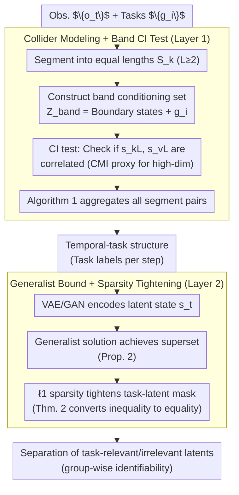

# From Generalist to Specialist Representation

**Conference**: ICML 2026  
**arXiv**: [2605.12733](https://arxiv.org/abs/2605.12733)  
**Code**: None  
**Area**: Representation Learning Theory / Causal Identifiability  
**Keywords**: identifiability, task-relevant representation, nonparametric, sparsity, world model

## TL;DR
This work provides the first fully nonparametric (no intervention, no functional constraints) two-layer hierarchical identifiability proof: the temporal-task structure is identifiable via CI tests from a collider perspective, and task-relevant latents are separated from generalist representations through sparsity regularization.

## Background & Motivation

**Background**: Learning latents from high-dimensional observations is central to world models. However, without identifiability guarantees, latent representations may be "observationally equivalent but misaligned" with the ground truth (e.g., arbitrary permutations $\hat s = \phi(s)$). Classic linear ICA relies on non-Gaussianity, nonlinear ICA on auxiliary variables or functional constraints, and causal representation learning on intervention/counterfactuals—each path requires specific "extra ingredients."

**Limitations of Prior Work**: (1) Most identifiability results aim for complete recovery of all latents, while downstream tasks often require only a subset; (2) existing task-relevant works (content-style separation, subspace factorization) only support fixed structures, lacking flexibility in the number of tasks or combination methods; (3) under i.i.d. settings, temporal signals cannot be utilized, making theory particularly difficult.

**Key Challenge**: Achieving both "complete universality" (nonparametric + arbitrary task structure + allowing disconnected sequences) and "provable identifiability" is nearly impossible. The fundamental issue is that assumptions are too strong when pursuing component-wise recovery of all latents, but identifying task-relevant subgroups is sufficient and allows for significantly relaxed conditions.

**Goal**: To prove in the most general nonparametric setting that (1) the association structure between time steps and tasks is identifiable; (2) the task-relevant latents within each time step are identifiable.

**Key Insight**: Model "tasks" as colliders across different time steps ($s_t \to a_t \to g_i$). Confounder or mediator perspectives yield incorrect conditional independence, while only the collider can encode the reality of "multi-step mutual dependence within the same task." On a collider DAG, conditional independence (CI) tests combined with sparsity regularization are sufficient to close the loop.

**Core Idea**: With tasks as colliders, use a band conditioning set for CI tests to recover the temporal-task graph; then use $\ell_1$ regularization to tighten the oversized generalist representation into the minimal task subset. The entire theory requires no interventions or functional constraints.

## Method

### Overall Architecture
A two-layer hierarchical pipeline: The first layer (Section 3) starts from observation sequences $\{o_t\}$ and a task set $\{g_i\}$, using Algorithm 1 to recover the global temporal-task association structure via CI tests on segment pairs. The second layer (Section 4) uses a VAE with sparsity regularization at each time step to disentangle the subset of the latent state $s_t$ that is truly relevant to each task. The interface between the two layers is "task labels per step." A third key design is the "theory-to-practice bridge" spanning both layers: CI tests are proxied by CMI in the observation space, and latent estimation uses VAE/GAN, transforming asymptotic nonparametric proofs into runnable standard estimators. Thus, implementation choices are labeled directly on the nodes in the diagram below.

### Key Designs

**1. Collider Modeling + Band CI Test: Treating "tasks" as colliders to recognize task structures in arbitrarily interleaved sequences.**

Layer 1 addresses a major pain point: in real-world sequences, tasks are interleaved, repeated, or disconnected, making it impossible to assume clean splits like "first 10 steps are Task A, next 10 are Task B." This work segments sequences into equal lengths $L \ge 2$ ($S_k$) and constructs a band conditioning set $Z_{\text{band}}(k,v,i) = \{s_{kL-1}, s_{kL+1}, s_{vL-1}, s_{vL+1}\} \cup \{g_i\}$ around the representative states of each segment. Theorem 1 proves that under Markov and Faithfulness assumptions, task $g_i$ is associated with both $S_k$ and $S_v$ if and only if $s_{kL}$ and $s_{vL}$ are dependent given $Z_{\text{band}}$. Thus, a set of CI tests can extract "which time steps belong to the same task." Corollary 1 further shows that representative states can be substituted freely. The proof holds precisely because tasks are modeled as colliders ($s_t \to a_t \to g_i$): conditioning on boundary states blocks the temporal path, and other tasks acting as closed colliders are automatically blocked, leaving only the $g_i$ dependency path exposed. This is why confounder or mediator perspectives fail—they would imply counter-intuitive conclusions like "two steps of the same task are conditionally independent," whereas only the collider preserves the true semantics of "mutual dependence across steps within a coordinated plan."

**2. Generalist Bound + Sparsity Tightening: Proving that "large models alone are insufficient" followed by "adding $\ell_1$ is just enough."**

Layer 2 addresses whether task-relevant latents can be separated from generalist representations. The paper sandwiches the answer in two steps. Proposition 2 proves under sufficient nonlinearity that $\|\mathcal{I}((J_{\hat u})_{i,\cdot})\| \ge \|\mathcal{I}((J_u)_{i,\cdot})\|$, meaning a generalist model pursuing only reconstruction can at most guarantee that the estimated task-relevant latents are a **superset** of the ground truth—it mixes in irrelevant dimensions. Theorem 2 then applies the sparsity constraint $\|\mathcal{I}(J_{\hat u})\| \le \|\mathcal{I}(J_u)\|$, tightening the inequality into an equality from both sides. Through a column permutation $\pi$, it arrives at $\hat s_{t, \pi(I_k)} = h_k(s_{t, I_K})$ (each task subgroup corresponds to an invertible function), thus disentangling task-relevant and irrelevant latents. This two-stage logic is rigorous: it elevates sparsity from an empirical trick to a theoretical necessity, yielding group-wise identifiability in an i.i.d. setting without any functional constraints.

**3. Bridge from Theory to Practice: Mapping asymptotic nonparametric proofs to estimators runnable on real video and images.**

Identifiability is an asymptotic property. This work provides realizable proxies for each theoretical step: CI tests are performed directly in the observation space using conditional mutual information (CMI) as a proxy to avoid high-dimensional statistical issues. When tasks are unknown, task representations are learned as additional latents. Latent estimation uses standard VAEs with $\ell_1$ regularization. For image generation, GANs are used with task-specific masks to manipulate latents. This combination of "CMI proxy + standard VAE/GAN" allows researchers to reproduce results without specialized tools.

### Loss & Training
No new losses are introduced. For task structure discovery, Fisher's z-test (linear Gaussian) or CMI (deep models) is used for CI tests with a threshold $p=0.05$. For representation learning, standard VAE reconstruction loss is used with $\ell_1$ regularization $\lambda \|M\|_1$ applied to the task-latent mask. CMI is estimated using MINE.

## Key Experimental Results

### Main Results (Synthetic + Real)
Synthetic data generated via collider DAG with 10k samples and 10 random runs.

| Setting | Metric | CCA | Group Lasso | SelTask | **Ours** |
|------|------|-----|-------------|---------|---------|
| $T \in [8,20], M=T/5$ | Accuracy | Low | Med | Good | **Highest** |
| $T=20, M \in [2,10]$ | MCC | Low | Med | Good | **Highest** |

SportsHHI Video (Multi-person, multi-task interleaving, mAP):

| Method | mAP |
|------|-----|
| Alg.1 on observed $o$ | Low |
| LEAP | Med |
| **Ours (CI on latent $s$)** | **Highest** |

### Ablation Study
Task-relevant identifiability (Synthetic nonlinear MLP data, $R^2$):

| Configuration | $R^2$ relevant ↑ | $R^2$ irrelevant ↓ | Description |
|------|------------------|---------------------|------|
| VAE without $\ell_1$ | High | High | Info preserved but entangled |
| VAE + $\ell_1$ on task-latent mask | **High** | **Low** | Preserved and separated |

Flux Cat Images + GAN (Tasks: "Wear glasses / hat / tie"):

| Configuration | Visual Result |
|------|---------|
| with sparsity | Editing only affects target attribute |
| without sparsity | Irrelevant factors like color are entangled |

### Key Findings
- $\ell_1$ regularization is the "minimal sufficient gain" to convert a generalist into a specialist: removing it leads immediately to entanglement; adding it achieves disentanglement.
- When the number of tasks $M$ increases, the performance degradation slope is significantly flatter than baselines, demonstrating the advantage of the collider + band CI approach in complex structures.
- On real videos, the gap between "CI on latent vs. observed" is largest, validating the intuition that identifiability requires a correct latent space first.

## Highlights & Insights
- "Task as collider" is a non-trivial modeling choice—using it to derive CI conditions encodes the precise semantics of "same-task dependence" into the graph, serving as the foundation of the theory.
- Presenting the two-stage logic (proving generalist insufficiency, then tightening with sparsity) elevates the necessity of sparsity from an empirical trick to a theoretical requirement.
- Discarding three major constraints simultaneously—interventions, functional classes, and temporal requirements (allowing i.i.d.)—while still achieving identifiability is a rare "major relaxation" in this field.

## Limitations & Future Work
- Identifiability is an asymptotic property; the paper does not analyze finite-sample errors, offering no guarantees for data-scarce scenarios.
- Sparsity is implemented via $\ell_1$ convex proxy, leaving a gap with true $\ell_0$; the theoretical assumption of reaching minimal support requires careful tuning in practice.
- Latent spaces rely on VAE reconstruction being sufficiently information-preserving; the theoretical assumption of "sufficient nonlinearity" is difficult to verify directly on real data.
- The authors mention "Identifiability-inspired architecture" as future work; currently, it is a standard estimator plus regularization, one step away from architectural innovation.

## Related Work & Insights
- **vs. Nonlinear ICA (Hyvärinen et al.)**: They rely on temporal contrastive or auxiliary variables; this work allows disconnected sequences and i.i.d.
- **vs. Causal Representation Learning (von Kügelgen et al.)**: They require interventions; this work is entirely observational.
- **vs. Subspace Factorization (Content-style)**: They assume fixed structures; this work allows unknown task counts, structures, and assignments.
- **vs. SelTask / LEAP**: Strong empirical baselines, but they only ensure latent identifiability, not structure identifiability; this work provides both.

## Rating
- Novelty: ⭐⭐⭐⭐⭐ First fully nonparametric task-relevant identifiability with a highly original collider perspective.
- Experimental Thoroughness: ⭐⭐⭐ Theory-oriented paper; experiments serve more as validation than comprehensive benchmark; real data scale is limited.
- Writing Quality: ⭐⭐⭐⭐ The two-layer framework is clear; the layout of theorems, corollaries, and lemmas is rigorous.
- Value: ⭐⭐⭐⭐ Provides a formal foundation for "generalist → specialist fine-tuning," serving as a theoretical pillar for future work.

<!-- RELATED:START -->

## Related Papers

- [\[CVPR 2026\] Δynamics: Language-Based Representation for Inferring Rigid-Body Dynamics From Videos](../../CVPR2026/physics/δynamics_language-based_representation_for_inferring_rigid-body_dynamics_from_vi.md)
- [\[CVPR 2025\] Improve Representation for Imbalanced Regression through Geometric Constraints](../../CVPR2025/physics/improve_representation_for_imbalanced_regression_through_geometric_constraints.md)
- [\[NeurIPS 2025\] Latent Representation Learning in Heavy-Ion Collisions with MaskPoint Transformer](../../NeurIPS2025/physics/latent_representation_learning_in_heavy-ion_collisions_with_maskpoint_transforme.md)
- [\[NeurIPS 2025\] POLARIS: A High-contrast Polarimetric Imaging Benchmark Dataset for Exoplanetary Disk Representation Learning](../../NeurIPS2025/physics/polaris_a_high-contrast_polarimetric_imaging_benchmark_dataset_for_exoplanetary_.md)
- [\[ICML 2026\] EqGINO: Equivariant Geometry-Informed Fourier Neural Operators for 3D PDEs](eqgino_equivariant_geometry-informed_fourier_neural_operators_for_3d_pdes.md)

<!-- RELATED:END -->
