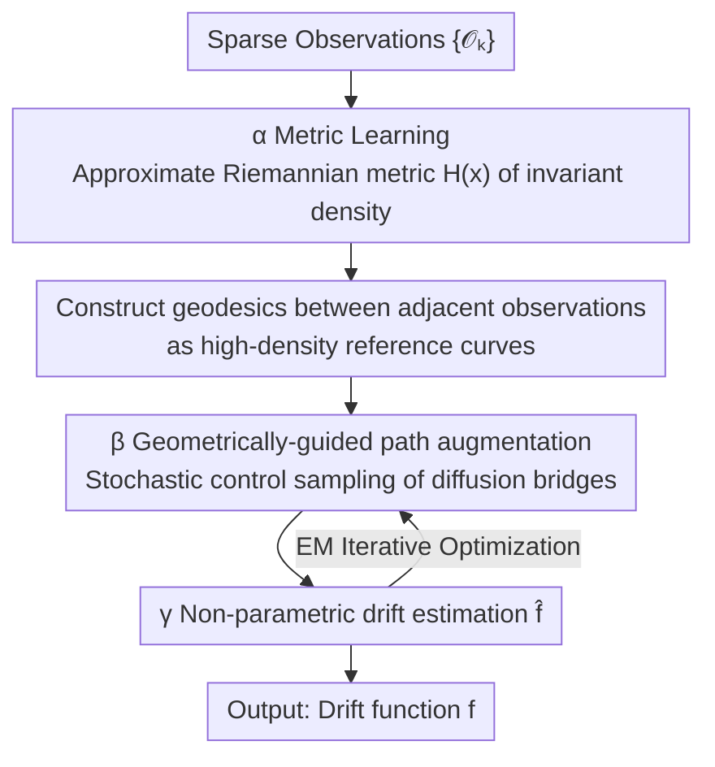

# From Geometry to Dynamics: Learning Overdamped Langevin Dynamics from Sparse Observations with Geometric Constraints

**Conference**: ICML2026  
**arXiv**: [2512.23566](https://arxiv.org/abs/2512.23566)  
**Code**: To be confirmed  
**Area**: Physics / Stochastic Dynamics / System Identification  
**Keywords**: Langevin Dynamics, Sparse Observations, Stochastic Control, Riemannian Geometry, Path Augmentation

## TL;DR
To address the difficulty of accurately inferring stochastic dynamics when trajectories are sparsely sampled, this paper reformulates inference as a stochastic control problem. It utilizes the geometry of the system's invariant density (Riemannian metric + geodesics) to guide the reconstruction of unobserved paths, achieving significantly more accurate estimation of the drift function $\mathbf{f}$ in extremely under-sampled overdamped Langevin systems compared to existing methods.

## Background & Motivation

**Background**: Many natural processes (Brownian motion of pollen, chemical reactions, population dynamics, cell growth) follow the Langevin equation or Stochastic Differential Equation (SDE) $\mathrm{d}\mathbf{X}_t=\mathbf{f}(\mathbf{X}_t)\,\mathrm{d}t+\boldsymbol{\sigma}\,\mathrm{d}\mathbf{W}_t$, where the drift $\mathbf{f}$ characterizes deterministic long-term evolution and the diffusion $\boldsymbol{\sigma}$ represents stochastic contributions from unresolved degrees of freedom. Inferring $\mathbf{f}$ from discrete observations is a core problem in stochastic system identification.

**Limitations of Prior Work**: Existing data-driven methods fall into two main categories, each with critical flaws. **Temporal methods** rely on the temporal order of observations and use state-increment regression to estimate drift ($\hat{\mathbf{f}}(\mathbf{x})=\langle \mathrm{d}\mathbf{X}_t/\tau \mid \mathbf{X}_t=\mathbf{x}\rangle$), which only holds when the observation interval $\tau$ is small. As $\tau$ increases, Euclidean distance ignores the curvature of hidden continuous paths between adjacent observations; short-term approximations (such as the Gaussian increment assumption of Euler–Maruyama $\mathbf{X}_{t+\tau}\mid\mathbf{X}_t\approx\mathcal{N}(\mathbf{X}_t+\mathbf{f}\tau,\boldsymbol{\sigma}\boldsymbol{\sigma}^\top\tau)$) fail because the true transition density is inherently non-Gaussian. **Geometric methods** approximate the invariant density or the eigenstructure of the diffusion generator but are only applicable to **conservative systems** ($\mathbf{f}=-\nabla V$) or decoupled variables.

**Key Challenge**: Under sparse sampling, the inverse problem is severely under-constrained—multiple different drifts can induce similar transition statistics between sparse observations. To accurately recover $\mathbf{f}$, additional inductive biases consistent with the data must be introduced. However, the advantages of temporal methods (versatile but requiring dense sampling) and geometric methods (tolerant of sparsity but limited to conservative systems) have never been unified.

**Goal**: In the difficult setting of **large observation intervals $\tau$**, merge the strengths of both schools—achieving the universality of temporal methods (not limited to conservative systems) and the tolerance of geometric methods for sparse sampling.

**Key Insight**: Observations are constrained on or near a low-dimensional structure (the "empirical manifold" induced by the invariant density); unobserved paths are highly likely to fall near the **geodesics** connecting adjacent observations. By treating this geometric prior as an inductive bias, the inference can prefer drift hypotheses where "likely paths follow high-density regions of the invariant density" when under-constrained.

**Core Idea**: Reformulate the "completion of unobserved paths" as a **stochastic control problem**. A control term guides the approximate path distribution to pass through observations while sticking to geodesics. This geometrically guided path augmentation is then embedded into an EM framework, alternating with non-parametric drift estimation.

## Method

### Overall Architecture

The input is a set of time-ordered sparse observations $\{\bm{\mathcal{O}}_k\dot=\mathbf{X}_{t_k}\}_{k=1}^K$ with large intervals $\tau$; the output is a non-parametric estimation of the drift function $\mathbf{f}$. The core difficulty is that large $\tau$ masks continuous trajectories between observations, where direct increment regression is biased by path curvature.

Ours solves this via a three-step process, with the latter two steps **interleaving** within an EM framework: (α) Use metric learning to approximate the Riemannian geometry induced by the system's invariant density; (β) Estimate (latent) system states between adjacent observations under this geometric guidance, known as "path augmentation"; (γ) Perform data-driven drift estimation using the augmented dense paths. Intuitively, geometry tells you "where paths should go through high-density regions," path augmentation samples reasonable intermediate states accordingly, and drift estimation uses these densified trajectories to provide a better augmentation prior for the next round.

### Key Designs

**1. Metric Learning for Empirical Manifolds: Replacing "Dimension Estimation" with Invariant Density Geometry**

Geometric methods previously required estimating the dimension of a low-dimensional manifold, which is difficult due to system fluctuations. Ours adopts an equivalent but more practical perspective (drawing from Fröhlich et al.): instead of explicitly finding low-dimensional submanifolds, the entire observation space $\mathbb{R}^d$ is treated as a smooth manifold $\mathcal{M}\dot=\mathbb{R}^d$ warped by a Riemannian metric $\bm{\mathfrak{h}}$. The non-linear geometry of the invariant density is fully reflected in this metric. The metric is taken non-parametrically at position $\mathbf{x}$ as the inverse of the weighted local diagonal covariance:

$$H_{dd}(\mathbf{x})=\Big(\sum_{k=1}^K w_k(\mathbf{x})\big(\mathcal{O}^{(d)}_k-x^{(d)}\big)^2+\epsilon\Big)^{-1},\quad w_k(\mathbf{x})=\exp\!\Big(-\frac{\|\bm{\mathcal{O}}_k-\mathbf{x}\|_2^2}{2\sigma_\mathcal{M}^2}\Big).$$

Where observations are dense (high density), the covariance is small and the metric value is small ("short distance"); where they are sparse, the metric value is large. This avoids dimension estimation and allows "observation density" to naturally shape the distance in space—a key carrier for injecting invariant density geometry into inference. $\sigma_\mathcal{M}$ controls the curvature of the approximate manifold, and $\epsilon$ ensures non-zero diagonals.

**2. Geodesics Between Adjacent Observations: High-Density Reference Curves for Path Augmentation**

Given the metric $\mathbf{H}(\mathbf{x})$, the **geodesic** $\bm{\gamma}^{k}_{t'}$ between adjacent observations $\bm{\mathcal{O}}_k$ and $\bm{\mathcal{O}}_{k+1}$ is determined on the empirical manifold—this is the minimum energy curve under the metric, $\bm{\gamma}^{k*}=\arg\min\int_0^1 L_\mathcal{M}(\bm{\gamma},\dot{\bm{\gamma}})\,\mathrm{d}t'$, where $\int_0^1 L_\mathcal{M}\,\mathrm{d}t'=\tfrac12\int_0^1\|\dot{\bm{\gamma}}^{k}_{t'}\|_{\mathfrak{h}}^2\,\mathrm{d}t'$. This is equivalent to the minimizer of the curve length functional, i.e., the true geodesic, solved as a second-order ODE (with boundary conditions $\bm{\gamma}_0^k=\bm{\mathcal{O}}_k,\bm{\gamma}_1^k=\bm{\mathcal{O}}_{k+1}$) using a probabilistic ODE solver. Geodesics provide geometric reference curves passing through high-density regions of the empirical geometry, used subsequently as **soft proximity constraints** for state estimation—a concrete realization of the geometric "follow high-density paths" approach without requiring the system to be conservative.

**3. Geometrically-guided Path Augmentation = Stochastic Control Problem: Aligning Diffusion Bridges with Observations and Geodesics**

This is the core of rewriting "path completion" as stochastic control. Given a prior diffusion process (drift $\hat{\mathbf{f}}$, diffusion $\sigma$), an approximate process is constructed that (i) passes through the endpoint observations and (ii) respects the local geometry of the invariant density (represented by geodesics). The conditional process remains a diffusion process with the same diffusion constant but with an effective drift $\mathbf{g}(\mathbf{x},t)$:

$$\mathrm{d}\mathbf{X}_t=\big(\widehat{\mathbf{f}}(\mathbf{X}_t)+\mathbf{u}(\mathbf{X}_t,t)\big)\,\mathrm{d}t+\sigma\,\mathrm{d}\bar{\mathbf{W}}_t,$$

where the time-varying control term $\mathbf{u}(\mathbf{x},t)$ guides the approximate path distribution through observations while keeping it near the corresponding geodesic. $\mathbf{g}$ is solved via a variational problem (minimizing the corresponding functional). Compared to standard Brownian/OU bridges that use linearized or simplified bridge dynamics and deviate significantly from true unobserved paths as $\tau$ increases, these bridges are **non-linear and geometrically constrained**, directly aligning with the geometric structure of the true transition density—this is fundamental to success at large $\tau$.

**4. EM Framework Interleaving: Path Augmentation ↔ Non-parametric Drift Estimation**

Path augmentation (β) and drift estimation (γ) alternate within an Expectation–Maximization framework: the E-step uses the current drift prior to sample geometrically constrained diffusion bridges, filling in dense latent state paths; the M-step uses these dense paths for model-agnostic non-parametric drift estimation to update $\hat{\mathbf{f}}$; then it returns to the E-step. Each round of augmentation uses a more accurate drift from the previous round, filling paths that increasingly resemble true paths and improving drift estimation. The paper provides theoretical support: the bias of short-term approximations at large $\tau$ is controlled by higher-order terms involving the vector field's curvature, explaining why pure temporal methods degrade as $\tau$ increases and justifying the inclusion of geometric curvature information.

### Loss & Training

Drift estimation utilizes non-parametric function approximation (model-agnostic) and is optimized iteratively via the EM framework. Metric learning is non-parametric (inverse of weighted local covariance), geodesics are solved via a second-order ODE using a probabilistic solver, and path augmentation is derived by solving for the optimal control drift via variational inference. Key hyperparameters include $\sigma_\mathcal{M}$ for manifold curvature and $\sigma$ for diffusion magnitude.

## Key Experimental Results

### Main Results

Evaluated on the Van der Pol system (non-conservative with a limit cycle, a traditional failure case for geometric methods) using weighted Root Mean Square Error (wRMSE) across varying observation intervals $\tau$ and noise levels $\sigma$. Comparisons include GP, SVISE, KM-basis, LatentSDE, GSBM, [SF]²M, MFM$_\text{LAND}$, etc. Results ($T=500$, $\mathrm{d}t=0.01$, wRMSE↓):

| Method | $\sigma$ | $\tau{=}80$ | $\tau{=}160$ | $\tau{=}240$ | $\tau{=}280$ |
|------|------|------|------|------|------|
| GP | 0.25 | 0.642 | 1.083 | 1.399 | 1.528 |
| SVISE | 0.25 | 1.465 | 0.740 | 0.587 | 0.824 |
| KM-basis | 0.25 | **0.368** | 0.671 | 1.744 | 1.732 |
| **Geometric (Ours)** | 0.25 | 0.474 | **0.514** | 0.687 | 0.993 |
| GP | 0.50 | 0.691 | 1.114 | 1.409 | 1.542 |
| KM-basis | 0.50 | 0.495 | 0.890 | 1.744 | 1.732 |
| **Geometric (Ours)** | 0.50 | **0.462** | **0.621** | **0.750** | **0.865** |

As $\tau$ increases, temporal methods (GP, KM-basis) show monotonically exploding errors (GP > 1.5 at $\tau{=}280$). Ours is almost universally optimal across various noises at large $\tau$, particularly at $\sigma{=}0.50$ where it leads consistently from $\tau{=}80\to280$. Ours outperforms [SF]²M and MFM$_\text{LAND}$ using only $T=500$ duration compared to their $T=1500$.

### Ablation Study

Figure 2 illustrates the drift recovery quality (force field angle estimation) after two iterations of geometric path augmentation, serving as an ablation for "augmentation iterations":

| Configuration | Drift Recovery | Description/Notes |
|------|------------|------|
| Gaussian Likelihood (No Augmentation) | Worst | Equivalent to short-term Gaussian approximation; obvious force field direction bias at large $\tau$ |
| + 1st Geometric Augmentation | Significant Improvement | Paths begin to follow true curvature; wRMSE drops |
| + 2nd Geometric Augmentation | Best | Force field highly consistent with ground truth; converges in just two iterations |

### Key Findings
- **Geometric augmentation proves its power at large $\tau$**: At small $\tau$, Ours is close to KM-basis (KM-basis is slightly better at $\tau{=}80, \sigma{=}0.25$), but as $\tau$ grows, temporal methods collapse while Ours barely degrades—validating that curvature information is the missing inductive bias in sparse sampling.
- **Fast convergence**: Just two geometric augmentation iterations allow the force field estimation to converge from significant bias to ground truth alignment.
- **Breaking conservative system limits**: Achieving this on the non-conservative Van der Pol system directly addresses the long-standing issue that "geometric methods are limited to conservative systems."
- **High data efficiency**: Outperforming competitors at $T=500$ vs $T=1500$ indicates that geometric priors significantly reduce the volume of observations required.

## Highlights & Insights
- **Reformulating path completion as stochastic control**: Using a time-varying control term to constrain diffusion bridges to both "pass through observations" and "follow geodesics" fits true non-Gaussian transition densities better than linearized Brownian/OU bridges—the core of winning at large $\tau$.
- **Warping space vs. estimating manifold dimension**: Instead of explicitly seeking low-dimensional manifolds, the invariant density geometry is embedded into a Riemannian metric, bypassing the difficulty of dimension estimation under system fluctuations, making it more robust for engineering.
- **Unifying temporal and geometric schools**: This is the first work to truly integrate the strengths of both (universality + sparsity resistance) into a single framework, providing theoretical explanations through higher-order curvature terms for why temporal methods degrade with $\tau$.
- **Geometric inductive bias for data volume**: In common experimental settings of sparse/under-sampling, geometric priors serve as a substitute for data volume, a practical advantage for real-world scenarios with limited observations.

## Limitations & Future Work
- **Focus on Overdamped Langevin + Additive Diffusion**: The method is validated on overdamped Langevin systems with known (or constant $\sigma$) diffusion; state-dependent diffusion and underdamped/inertial systems are not addressed.
- **Dependence on Invariant Density Structure**: The core premise is that observations are constrained near the low-dimensional geometry induced by the invariant density; the effectiveness of geometric priors in unstable transients or multi-stable transitions remains questionable.
- **Diagonal Metric Form**: Metric learning uses the inverse of weighted local diagonal covariance; whether diagonal approximations can sufficiently capture geometry in strongly anisotropic or coupled dimensions was not explored in depth.
- **Scalability to High Dimensions**: The computational cost and stability of solving geodesic ODEs and sampling diffusion bridges in high dimensions $d$ remain to be verified, as experiments primarily showed low-dimensional benchmarks (e.g., Van der Pol).

## Related Work & Insights
- **vs. Temporal Methods (GP-drift / Kramers–Moyal / Increment Regression)**: These rely on short-term Gaussian approximations for regression, accurate only at small $\tau$; Ours does not assume short-term behavior and uses geometric bridges, leading significantly at large $\tau$.
- **vs. Geometric Methods (Invariant Density/Generator Eigenstructure)**: These tolerate sparsity but are limited to conservative forces; Ours treats geometry only as a "guidance prior for augmentation," making it valid for non-conservative cases like Van der Pol.
- **vs. Brownian/OU Bridge Augmentation (e.g., Batz et al.)**: These use linearized bridge dynamics; as $\tau$ increases, the bridges deviate from true paths. Ours uses non-linear, geodesic-constrained diffusion bridges that align with true transition density geometry.
- **vs. LatentSDE / GSBM / [SF]²M (Deep SDE/Bridge Methods)**: These methods show high and unstable wRMSE in sparse, large $\tau$ settings; Ours achieves lower error with less data ($T=500$ vs 1500), highlighting the value of geometric inductive bias.

## Rating
- Novelty: ⭐⭐⭐⭐⭐ Reformulating sparse SDE inference as geometrically guided stochastic control and unifying temporal/geometric schools is a novel and self-consistent perspective.
- Experimental Thoroughness: ⭐⭐⭐⭐ Systematic sweeps across $\tau/\sigma$, comparison with seven types of baselines, and effective ablation; however, primarily validated on low-dimensional non-conservative benchmarks.
- Writing Quality: ⭐⭐⭐⭐⭐ Clear logical chain of comparison-conflict-unification between schools; geometric intuition is well-balanced with mathematical formulation.
- Value: ⭐⭐⭐⭐ Highly practical for stochastic system identification in experimental sciences (biology, chemistry) with sparse observations; high-dimensional implementation is pending.

<!-- RELATED:START -->

## Related Papers

- [\[ICLR 2026\] LD-EnSF: Synergizing Latent Dynamics with Ensemble Score Filters for Fast Data Assimilation with Sparse Observations](../../ICLR2026/physics/ld-ensf_synergizing_latent_dynamics_with_ensemble_score_filters_for_fast_data_as.md)
- [\[ICML 2026\] Speculative Sampling for Faster Molecular Dynamics](speculative_sampling_for_faster_molecular_dynamics.md)
- [\[ICLR 2026\] VisionLaw: Inferring Interpretable Intrinsic Dynamics from Visual Observations via Bilevel Optimization](../../ICLR2026/physics/visionlaw_inferring_interpretable_intrinsic_dynamics_from_visual_observations_vi.md)
- [\[ICML 2026\] Understanding Catastrophic Forgetting In LoRA via Mean-Field Attention Dynamics](understanding_catastrophic_forgetting_in_lora_via_mean-field_attention_dynamics.md)
- [\[ICML 2026\] Teaching Molecular Dynamics to a Non-Autoregressive Ionic Transport Predictor](teaching_molecular_dynamics_to_a_non-autoregressive_ionic_transport_predictor.md)

<!-- RELATED:END -->
