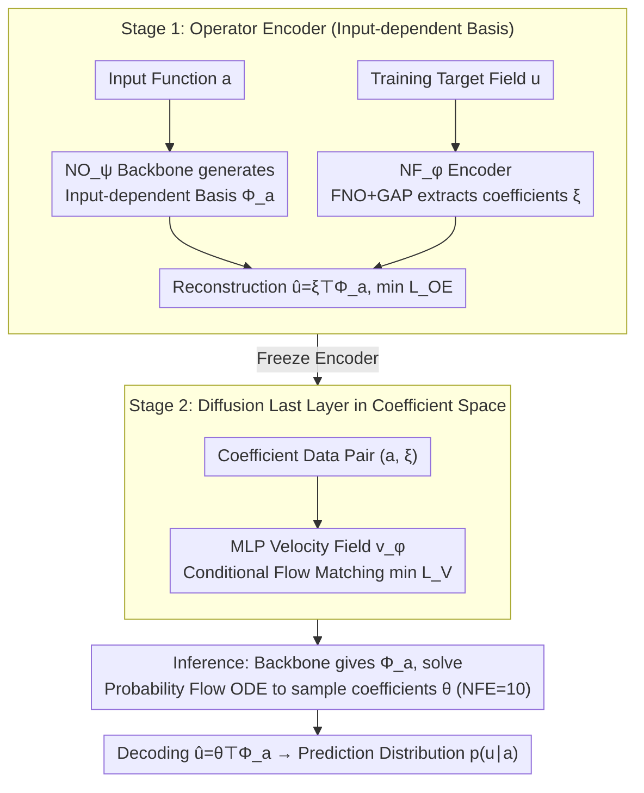

# Generative Neural Operators Through Diffusion Last Layer

**Conference**: ICML 2026  
**arXiv**: [2602.04139](https://arxiv.org/abs/2602.04139)  
**Code**: https://github.com/sungwpark/dll-no  
**Area**: Scientific Computing / Neural Operator / Diffusion Models / Uncertainty Quantification  
**Keywords**: Neural Operator, Diffusion Model, Karhunen–Loève, Flow Matching, Probabilistic Surrogate  

## TL;DR
A "Diffusion Last Layer" (DLL) is appended to any neural operator backbone (FNO/DeepONet). An input-dependent basis $\Phi_a$ is used to compress the target field into an $r$-dimensional coefficient vector, followed by a small MLP velocity field that performs conditional flow matching in the coefficient space. This upgrades deterministic operators into generative ones capable of sampling stochastic solutions and providing roll-out uncertainty.

## Background & Motivation
**Background**: Neural operators (FNO, DeepONet, etc.) have become mainstream for solving parametric PDEs, enabling mapping between function spaces with discretization invariance. However, most operators are deterministic, outputting a single solution $u$ for a given input function $a$.

**Limitations of Prior Work**: Real-world scientific problems involve stochasticity: random forcing, unresolved sub-grid physics, and sensitivity to initial conditions in chaotic systems mean "the same input" corresponds to a distribution of solutions. Deterministic operators cannot represent this aleatoric uncertainty, nor can they provide uncertainty estimates for error accumulation during long-range autoregressive roll-outs. Existing probabilistic solutions have flaws: Bayesian Neural Operators only capture weight posterior (epistemic) and are limited by prior/likelihood forms; pixel-space Diffusion Models (DM) are computationally expensive; Latent Diffusion (LDM) uses general autoencoders for compression, losing the geometric structural advantages of operators.

**Key Challenge**: Achieving both distribution modeling capability and the discretization invariance and geometric awareness of operator learning. Direct diffusion in function or pixel space is too heavy, while general LDM discards the structural inductive bias of operator backbones.

**Goal**: Design a lightweight, modular probabilistic output head that can be appended to any operator backbone while (i) retaining discretization invariance, (ii) modeling the conditional distribution $p(u\mid a)$ at a controlled cost, and (iii) providing roll-out uncertainty in deterministic problems.

**Key Insight**: The authors observe that target solution fields $u$ typically possess low-dimensional structures given $a$, reflecting the intuition of the classical Karhunen–Loève expansion. By projecting $u$ into low-dimensional coefficients $\xi\in\mathbb{R}^r$ using an **input-dependent** basis $\Phi_a$, diffusion modeling can be conducted entirely in $r$-dimensional Euclidean space, with the backbone's geometric/spectral structure handled by the basis functions.

**Core Idea**: Use a neural operator to learn a set of low-rank basis functions adapted to the input $a$, reducing the distribution modeling problem to the coefficient space. Then, use a conditional flow matching diffusion model to learn the coefficient distribution—effectively treating diffusion as the "last layer" of the neural operator.

## Method
The training of DLL consists of two stages: first, training an operator encoder to learn the input-dependent low-rank basis and corresponding coefficients; second, training a conditional diffusion model in the coefficient space after freezing the encoder. During inference, coefficients $\theta\sim p(\theta\mid \mathcal{D},a)$ are sampled for each input $a$, and the function is reconstructed as $\hat u=\theta^\top \Phi_a$.

### Overall Architecture
- **Input**: Parameter function $a\in\mathcal{A}$ (e.g., PDE coefficients, initial conditions, geometric fields).
- **Operator Encoder** $\mathtt{NO}_\psi+\mathtt{NF}_\varphi$: The neural operator backbone $\mathtt{NO}_\psi$ maps $a$ to $r$ basis functions $\Phi_a=(\phi_1(a),\dots,\phi_r(a))$; the neural functional encoder $\mathtt{NF}_\varphi$ (a similar FNO + global average pooling) maps the training target $u$ to coefficients $\xi=\mathtt{NF}_\varphi(u)\in\mathbb{R}^r$. Reconstruction is $\hat u=\xi^\top\Phi_a$.
- **Diffusion Last Layer**: On top of the frozen encoder, an MLP velocity field $v_\phi$ learns the conditional flow $p(\xi\mid a)$ in $\mathbb{R}^r$.
- **Inference**: For a new input $a$, the backbone generates $\Phi_a$; coefficients $\theta$ are sampled by solving the probability flow ODE starting from noise; finally, $\hat u=\theta^\top\Phi_a$ is decoded.
- **Output**: The entire predicted distribution over functions $\hat u$; means, variances, or roll-out ensembles can be obtained via repeated sampling.

### Key Designs

**1. Input-dependent Basis Operator Encoder: Compressing solution fields into $r$-dimensional coefficients while retaining geometric/spectral structure**

Direct diffusion in function or pixel space is costly, and general autoencoders lose the geometric inductive bias of operator backbones. Borrowing from Karhunen–Loève expansion intuition, the authors use a full FNO as a basis generator $\Phi_a=\mathtt{NO}_\psi(a)$ to allow basis functions to vary with input, and another FNO+GAP as a coefficient encoder $\xi=\mathtt{NF}_\varphi(u)$. Reconstruction follows a rank-$r$ expansion $\hat u=\xi^\top\Phi_a$. The training objective is the reconstruction mean squared error:

$$\mathcal{L}_{\mathrm{OE}}=\mathbb{E}\big\|u-\mathtt{NF}_\varphi(u)^\top\mathtt{NO}_\psi(a)\big\|_2^2.$$

Proposition 4.1 proves that under ideal conditions, minimizing this objective is equivalent to finding the leading $r$-dimensional subspace of the conditional second-moment operator, effectively learning an input-dependent (uncentered) KL expansion. Unlike general autoencoders that cram all structure into fixed latents, "reconstruction subspaces that vary with conditions" allow the same latent dimension to carry more output structure, with $\xi$ only capturing instance-level deviations. This is the fundamental reason why reducing diffusion to $r$ dimensions remains effective.

**2. Conditional Diffusion Last Layer in Coefficient Space: Moving diffusion from pixels to $r$-dimensional vectors**

With the encoder frozen, diffusion only needs to learn the conditional distribution $p(\xi\mid a)$ in the $r$-dimensional coefficient space. Using a linear schedule forward process $x_t=(1-t)x+t\epsilon$, an MLP velocity field $v_\phi(x_t,t,c)$ is trained to minimize conditional velocity matching:

$$\mathcal{L}_V(c)=\mathbb{E}\big[\|v_\phi(x_t,t,c)-(\dot a_t x+\dot b_t\epsilon)\|_2^2\big],$$

Inference involves backward integration of the probability flow ODE with an NFE of approximately 10. Proposition 2.3 provides an end-to-end Wasserstein bound $\mathcal{W}_2(p,\rho_0)\le C\sqrt{\mathcal{L}_V(c)}$, indicating that reducing the velocity matching loss directly controls the output distribution distance. This efficiency stems from using an MLP for $r=64$ dimensional vectors instead of heavy U-Nets for $128\times128$ fields, resulting in millisecond sampling times. Since basis functions originate from neural operators, the decoding $\hat u=\theta^\top\Phi_a$ naturally inherits discretization invariance.

**3. Unified Probabilistic Perspective for Deterministic/Stochastic Problems: One loss covering both types of uncertainty**

Previously, specialized probabilistic operators were designed for SPDEs, while ensembles were separately added for roll-out stability. DLL treats the target operator as $\mathcal{G}^\ddagger:\mathcal{A}\to\mathcal{P}(\mathcal{U})$ (deterministic operators being a Dirac measure special case) and notes that $\mathcal{W}_2$ is a reasonable metric in both cases. Thus, the same $\mathcal{L}_V$ loss applies to both intrinsically stochastic SPDEs and deterministic chaotic systems. In deterministic cases, the residual $\mathcal{L}_V(c)$ is interpreted as a "qualitative indicator of epistemic uncertainty from finite data/model error"—the degree of diffusion underfitting serves as roll-out uncertainty. This links the training objective to uncertainty sources, facilitating deployment on existing FNO/DeepONet backbones.

### Loss & Training
Two-stage training: Stage 1 minimizes $\mathcal L_{\mathrm{OE}}$ to learn $(\mathtt{NO}_\psi,\mathtt{NF}_\varphi)$; Stage 2 freezes the encoder and minimizes conditional velocity matching $\mathcal L_V$ on $(a,\xi)$ pairs. Default configuration: FNO backbone, $r=64$, NFE=10, linear noise schedule.

## Key Experimental Results

### Main Results (Stochastic PDE Distribution Fitting)
Evaluation metrics include Energy Distance (ED), Sliced Wasserstein Distance (SWD), and mean/std NRMSE. 64 ground-truth realizations are sampled per input to compare the learned distribution with the truth.

| Dataset | Metric | FNO | PNO | DM | LDM | **DLL** |
| :--- | :--- | :--- | :--- | :--- | :--- | :--- |
| Stochastic Burgers (1D, $u\in\mathbb R^{256}$) | ED ↓ | 6.491 | 1.766 | 1.355 | 1.373 | **1.285** |
| Stochastic Burgers | SWD ↓ | 0.426 | 0.253 | 0.239 | 0.249 | **0.213** |
| Stochastic Burgers | $\mathrm{NRMSE}_s$ ↓ | 1.000 | 0.457 | 0.323 | 0.297 | **0.289** |
| Stochastic Darcy (2D, $128^2$) | ED ↓ | 1.463 | 0.305 | 0.269 | 0.368 | **0.227** |
| Stochastic Darcy | $\mathrm{NRMSE}_s$ ↓ | 1.000 | 0.285 | 0.360 | 0.268 | 0.357 |

DLL achieves the lowest ED across both SPDEs and the lowest SWD on Burgers, outperforming pixel and general latent diffusion. The deterministic FNO baseline shows an $\mathrm{NRMSE}_s$ of 1.0, failing to model variance entirely.

### Ablation Study (Long-range Autoregressive Roll-out)
Trained on step length 50, evaluated on roll-out 100. Lower CRPS and Spread-Skill Ratio (SSR) closer to 1 are better.

| Dataset | Metric | FNO | FNO-d | PNO | DM | LDM | **DLL** |
| :--- | :--- | :--- | :--- | :--- | :--- | :--- | :--- |
| Kuramoto–Sivashinsky (1D) | NRMSE ↓ | 0.404 | 0.384 | 0.354 | 0.395 | 0.576 | **0.343** |
| KS | CRPS ↓ | – | 0.523 | 0.514 | 0.545 | 0.878 | **0.470** |
| KS | SSR | – | 0.975 | 0.550 | 0.961 | 0.802 | 0.949 |
| Kolmogorov Flow (2D, $128^2$) | NRMSE ↓ | 0.528 | 0.463 | 0.492 | **0.369** | 0.615 | 0.426 |
| Kolmogorov | SSR | – | 0.546 | 0.167 | 0.601 | 0.548 | **0.620** |

DLL achieves state-of-the-art NRMSE and CRPS on KS with an SSR near 1, improving accuracy and providing calibrated uncertainty. On Kolmogorov flow, pixel diffusion obtains the best NRMSE due to stronger U-Net spatial priors, but DLL still outperforms the FNO backbone and maintains the best SSR.

### Key Findings
- The Operator Encoder (OE) outperforms autoencoders (AE) in deterministic PDEs (KS, Kolmogorov) despite high compression ratios (up to 256×), supporting the claim that "input-dependent bases" capture the low-dimensional structure of the solution manifold.
- On stochastic PDEs (Burgers, Darcy), OE reconstruction error is slightly higher than AE, but DLL's overall distribution metrics are superior, suggesting that structured latent information is more critical than per-sample reconstruction accuracy in distribution modeling tasks.
- DLL's performance ceiling is constrained by backbone quality: on Kolmogorov flow, pixel DM is stronger due to U-Net, suggesting that stronger FNO/Transformer backbones could further enhance DLL.

## Highlights & Insights
- **Decoupling diffusion into "coefficient space" is highly efficient**: Allowing the backbone to handle geometric/spectral inductive biases while a small MLP manages distribution modeling results in a clear division of responsibility and low overhead.
- **Using "diffusion underfit" as epistemic uncertainty**: For deterministic problems where aleatoric distributions are undefined, the authors interpret residual $\mathcal L_V(c)$ as an "implicit ensemble width under finite data," providing a nearly free source of roll-out uncertainty.
- **Proposition 4.1 links "input-dependent basis" to classical KL expansion**: This offers a clear theoretical explanation for the design—it essentially learns a condition-dependent KL subspace, explaining why OE performs better than general AE on deterministic fields.

## Limitations & Future Work
- For 2D chaotic systems with strong spatial structures (Kolmogorov flow), NRMSE is lower than pixel DM, indicating that backbone expressivity can limit DLL performance.
- $r$, NFE, and backbone architecture are critical hyperparameters; validation was primarily on FNO/DeepONet, with irregular geometries (e.g., GNO/GINO) not yet fully covered.
- Uncertainty currently relies on distribution fitting + heuristic SSR without coverage guarantees like conformal prediction; rigorous UQ requires post-processing calibration.
- The coefficient dimension $r$ is fixed, lacking an adaptive or hierarchical basis mechanism, which may lead to over-compression for highly complex fields.

## Related Work & Insights
- **vs. Pixel-space Diffusion (DM)**: DM learns directly on $128^2$ grids using strong U-Net spatial biases, yielding high accuracy but at high cost and slow sampling. DLL operates in $r=64$ coefficient space, being much cheaper but limited by the backbone.
- **vs. Latent Diffusion (LDM)**: LDM uses operator-agnostic compression, losing geometric/spectral structure. DLL uses the operator itself to generate input-dependent bases, keeping geometric information in the latent space.
- **vs. Bayesian Neural Operator / FNO-d**: BNO and MC-dropout only capture weight posterior (epistemic) with restrictive prior/likelihood forms. DLL learns the output conditional distribution, capturing both aleatoric and epistemic uncertainties.
- **vs. Probabilistic Neural Operator (PNO)**: PNO provides pointwise Gaussian predictions. DLL provides non-Gaussian joint distributions over the whole field, capturing spatial correlations and achieving significantly better distance metrics.
- **vs. Function-space Diffusion**: This branch defines diffusion directly in infinite-dimensional function space. DLL bypasses this complexity using finite-dimensional coefficients, making it more engineering-friendly but dependent on learning suitable bases.

<!-- RELATED:START -->

## Related Papers

- [\[NeurIPS 2025\] Towards Universal Neural Operators through Multiphysics Pretraining](../../NeurIPS2025/physics/towards_universal_neural_operators_through_multiphysics_pretraining.md)
- [\[ICML 2026\] PINNfluence: Interpreting PINNs Through Influence Functions](pinnfluence_interpreting_pinns_through_influence_functions.md)
- [\[ICML 2026\] EqGINO: Equivariant Geometry-Informed Fourier Neural Operators for 3D PDEs](eqgino_equivariant_geometry-informed_fourier_neural_operators_for_3d_pdes.md)
- [\[ICML 2026\] Quantum latent distributions in deep generative models](quantum_latent_distributions_in_deep_generative_models.md)
- [\[ICLR 2026\] Proximal Diffusion Neural Sampler](../../ICLR2026/physics/proximal_diffusion_neural_sampler.md)

<!-- RELATED:END -->
