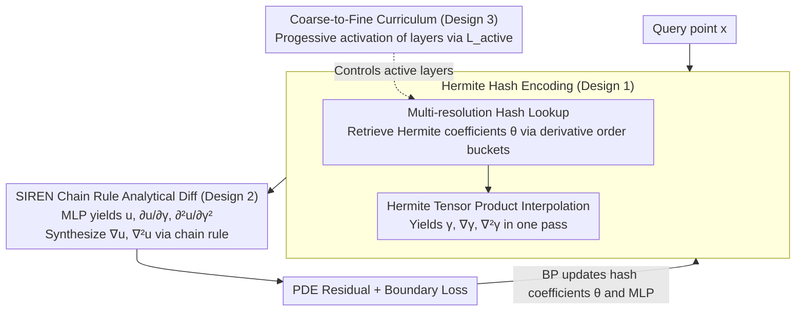

# Hermite-NGP: Gradient-Augmented Hash Encoding for Learning PDEs

**Conference**: ICML 2026  
**arXiv**: [2605.24774](https://arxiv.org/abs/2605.24774)  
**Code**: To be confirmed  
**Area**: Scientific Computing / Physics-Informed Neural Networks / Neural Field Representation  
**Keywords**: PINN, Hash Encoding, Hermite Interpolation, Analytical Differentiation, Multi-scale Curriculum

## TL;DR
The paper upgrades Instant-NGP's multi-resolution hash table to a "gradient-augmented" version—storing function values and all mixed partial derivatives at each hash grid point. It utilizes Hermite interpolation to reconstruct a $C^1$ continuous, analytically twice-differentiable field, effectively enabling NGP for PINN-based PDE solving for the first time. It achieves up to a $20\times$ error reduction over SOTA neural PDE solvers on 2D/3D benchmarks, with training times of only $2$–$3.5\,\mathrm{ms}$ per epoch.

## Background & Motivation

**Background**: Multi-resolution hash encoding (I-NGP) is a premier representation in NeRF, SDF, and image reconstruction due to its $O(1)$ lookup, spatial adaptivity, and near-instant training. It relies on $d$-linear interpolation to blend $F$-dimensional features from a hash table into a continuous field, which is then processed by a lightweight MLP.

**Limitations of Prior Work**: Directly applying I-NGP to PINNs generally fails. The fundamental reason is that $d$-linear interpolation is only $C^0$ continuous; its first-order derivatives are piecewise constant within cells and jump at boundaries, while its second-order derivatives are nearly zero everywhere. Consequently, the Laplacian $\nabla^2 u$ in PDE residuals lacks credible analytical values. Existing workarounds like INGP-FD use finite difference (FD) to approximate derivatives, requiring $2d+1$ forwards per Laplacian (5 for 2D, 7 for 3D), but $O(\epsilon^2)$ truncation errors cap accuracy at the $10^{-5}$ level, and the FD step size $\epsilon$ requires manual tuning. Another approach using autodiff for second-order derivatives suffers from amplified noise due to hash collisions.

**Key Challenge**: There is a fundamental conflict between the "locality + speed" of hash encoding and the "high-order analytical differentiability" required by PINNs. One must either sacrifice sparse hashing for SIREN/Fourier features (accurate but slow) or retain hashing with FD (fast but limited accuracy).

**Goal**: Break this trade-off at the representation level by redesigning hash encoding to natively support analytical second-order derivatives while preserving NGP's locality and instant training.

**Key Insight**: A classical method in computational physics, the "gradient-augmented level set" (Nave et al. 2010), stores both field values and gradients, reconstructing them via Hermite interpolation within grid cells. This provides a template for treating derivatives as "first-class citizens" of the representation. Porting this idea to neural hash tables allows derivatives to be queried directly rather than computed post-hoc.

**Core Idea**: Store not only function values but also all $2^d$ mixed partial derivative coefficients in the hash table. Use the tensor product of Hermite basis functions to reconstruct a $C^1$ continuous field. Second-order derivatives are obtained directly from the analytical second-order derivatives of the Hermite basis—allowing $\gamma, \nabla\gamma, \nabla^2\gamma$ to be obtained in a single forward pass.

## Method

### Overall Architecture

The training pipeline for Hermite-NGP is as follows:

- **Multi-resolution Hash Lookup**: At each resolution $l\in\{0,\dots,L-1\}$, use the I-NGP hash function to map $2^d$ cell vertices to bucketed storage and retrieve Hermite coefficients $\{\theta_{l,h(g)}^{(\alpha)}\}_{\alpha\in\{0,1\}^d}$.
- **Hermite Interpolation Reconstruction**: Use tensor product Hermite bases $H^{( \alpha)}$ to blend coefficients into a local $C^1$ field, simultaneously calculating $\nabla\gamma$ and $\nabla^2\gamma$.
- **SIREN MLP + Analytical Chain Rule**: Feed the encoding $\gamma$ into an MLP with $\sin(\omega\cdot)$ activations. Leverage the SIREN second-order derivative identity $\sigma''=-\omega^2\sigma$ and the chain rule to derive $\nabla u, \nabla^2 u$. The entire PDE residual is computed in a single forward pass.
- **Multi-resolution Coarse-to-Fine Curriculum**: Activate resolution layers in three stages from coarse to fine, mimicking a multigrid V-cycle.

The pipeline is summarized in Algorithm 1, with the key chain rule: $\nabla u = \frac{\partial u}{\partial\gamma}\nabla\gamma$, $\nabla^2 u = \frac{\partial^2 u}{\partial\gamma^2}(\nabla\gamma)^2 + \frac{\partial u}{\partial\gamma}\nabla^2\gamma$. The "Lookup + Hermite Reconstruction" forms Key Design 1, while the Curriculum (Design 3) acts as the external scheduler.

### Key Designs

**1. Hermite Hash Encoding: Upgrading from "Value Only" to "Value + Mixed Partials"**

The root cause of I-NGP's failure in PINNs is that $d$-linear interpolation is only $C^0$ continuous. The authors solve this by having each hash grid point store not just a function value, but $2^d$ mixed partial derivative coefficients $\{f^{(\alpha)}\}_{\alpha\in\{0,1\}^d}$—$(f, f_x, f_y, f_{xy})$ for 2D and $(f, f_x, \dots, f_{xyz})$ for 3D. These are bucketed into $2^d$ independent hash tables. Reconstruction uses tensor product Hermite bases:

$$\gamma^l(\mathbf{x}) = \sum_{g}\sum_{\alpha}\theta_{l,h(g)}^{(\alpha)}\,H^{(\alpha)}\!\Big(\tfrac{\mathbf{x}-\mathbf{x}_g}{\Delta x_l}\Big)\,\Delta x_l^{|\alpha|},$$

where the 1D basis consists of a value basis $h^{(0)}(t)=-2t^3+3t^2$ and a derivative basis $h^{(1)}(t)=t^3-t^2$. Storing derivatives as independent channels has an added benefit: high-frequency noise from hash collisions is absorbed across multiple channels, which reduces error by 56% when providing more capacity to the first-order derivative table.

**2. Analytical Differentiation via SIREN Chain Rule: $\nabla u$ and $\nabla^2 u$ in One Pass**

Obtaining $\nabla\gamma,\nabla^2\gamma$ is only the first step. For SIREN ($\sigma(x)=\sin(\omega x)$), the identity $\sigma''=-\omega^2\sigma$ simplifies the chain rule significantly. A single-layer Laplacian is computed as $\nabla^2 u=W_2[-\omega^2a\odot\sum_i(W_1\gamma_{x_i})^2+\omega\cos(\omega z)\odot W_1\nabla^2\gamma]$, reusing intermediate forward values. Compared to INGP-FD, which requires $2d+1$ forwards (7 for 3D), Hermite-NGP uses a single forward pass and a single computation graph, allowing a 17M parameter model to train at $3.5\,\mathrm{ms}$ per epoch with lower memory usage.

**3. Multi-resolution Coarse-to-Fine (C2F) Curriculum: Aligning Frequencies with Hash Hierarchies**

PINNs suffer from spectral bias. The authors leverage the hierarchical structure of multi-resolution hashing to mimic a multigrid V-cycle across three stages: first training only coarse layers $l=0,\dots,L_0$ to learn global structure, then progressively activating finer layers via $L_{\text{active}}(t)=\min(L,\,L_0+\lfloor t/\tau\rfloor)$, and finally joint fine-tuning. This prevents high-frequency details from being corrupted by randomly initialized coarse layers.

## Key Experimental Results

### Main Results

| Benchmark | Setting | Hermite-NGP (Ours) | Strongest Baseline | Gain |
|------|------|--------------------|----------|---------|
| Helmholtz 2D | $a=10$ | **1.81e-5** | PIG 7.04e-4 | $20\times$ |
| Helmholtz 2D | $a=20$ | **7.93e-5** | PirateNet 1.36e-3 | $17\times$ |
| Helmholtz 2D | $a=100$ | **4.59e-2** | All fail | Only one to converge |
| Helmholtz 3D | $a=3$ | **6.09e-5** | PirateNet 8.40e-4 | $14\times$ |
| Helmholtz 3D | $a=10$ | **6.01e-3** | INGP-FD 7.21e-2 | $12\times$ |
| Convection 1+1D | $c=30$ | **8.49e-5** | PirateNet 8.54e-4 | $10\times$ |
| Taylor–Green | $\nu=0.01$ | **7.71e-5** | PIG 7.27e-4 | $9\times$ |

### Ablation Study

| Configuration | Helmholtz 2D ($a=10$) L2 | Description |
|------|--------------------------|------|
| Hermite-NGP (Full) | **1.81e-5** | C2F + Hermite Tables |
| No C2F Curriculum | $\sim 8.7$e-5 | Error increases by 79.2% |
| Cubic-NGP (No stored grads) | $>0.1$ (fail) | High-order but relies on autodiff; noise amplified |
| INGP-FD Baseline | 1.67e-3 | Finite difference limit |
| Hash Tables 14-10-14 | 9.98e-5 | First-order table is most collision-sensitive |
| Full Autodiff 2nd Order | $9.5\times$ slower | Analytical encoding provides main speedup |

### Key Findings
- **Hermite storage is mandatory**: High-order variants without stored derivatives (e.g., Cubic) fail because hash collisions inject high-frequency noise that is amplified by autodiff or FD; assigning derivatives to independent channels allows noise absorption.
- **First-order tables are noise-sensitive**: Reducing the first-order table capacity significantly degrades performance compared to reducing the value table.
- **Extreme Efficiency**: 16.8M parameter models train at $3.6\,\mathrm{ms}$ per epoch. Compared to PIG (33.5 GB VRAM, 5 s/epoch), the gap is several orders of magnitude.

## Highlights & Insights
- **"Derivatives as First-Class Citizens"**: This philosophy is transferable to differentiable rendering, SDF normal estimation, and curvature estimation.
- **Decoupling Collision from Analytical Differentiation**: Defining the hash function as a discrete lookup outside the continuous computation graph avoids the paradox of high-order interpolation amplifying collision noise.
- **Memory/Efficiency Win-Win**: Although storing $2^d$ coefficients seems expensive, removing the need for $2d+1$ forward passes and multiple activation maps makes 3D Hermite-NGP more memory-efficient than INGP-FD.

## Limitations & Future Work
- The $2^d$ storage scaling becomes expensive for 4D+ space-time PDEs (16 coefficients/point), requiring quantization or low-rank decomposition.
- The implementation is currently tightly coupled with SIREN; while other activations are possible, the analytical chain rule must be rewritten.
- It only addresses the strong form of PDEs; weak forms and boundary-conforming meshes remain unexplored.

## Related Work & Insights
- **vs. INGP-FD**: Hermite-NGP provides analytical second-order derivatives in a single pass, achieving accuracy below $10^{-5}$ where FD is capped and slower.
- **vs. NeuralAngelo**: For SDF + curvature tasks, Hermite-NGP produces significantly smoother curvature fields with $2.4\times$ lower gradient MAE compared to FD-based curvature in NeuralAngelo.

## Rating
- Novelty: ⭐⭐⭐⭐⭐ 
- Experimental Thoroughness: ⭐⭐⭐⭐⭐ 
- Writing Quality: ⭐⭐⭐⭐⭐ 
- Value: ⭐⭐⭐⭐⭐ 

<!-- RELATED:START -->
### Related Papers
- *Müller et al.*, "Instant Neural Graphics Primitives with a Multiresolution Hash Encoding", ACM TOG 2022.
- *Huang & Alkhalifah*, "PINN with Multi-resolution Hash Encoding and Finite Difference", arXiv 2024.
- *Wang et al.*, "PirateNet: Physics-Informed Deep Learning with Adaptive Residual Learning", arXiv 2024.
<!-- RELATED:END -->

## Related Papers

- [\[ICLR 2026\] DRIFT-Net: A Spectral--Coupled Neural Operator for PDEs Learning](../../ICLR2026/physics/drift-net_a_spectral--coupled_neural_operator_for_pdes_learning.md)
- [\[NeurIPS 2025\] Integration Matters for Learning PDEs with Backward SDEs](../../NeurIPS2025/physics/integration_matters_for_learning_pdes_with_backward_sdes.md)
- [\[ICML 2026\] Unbiased and Second-Order-Free Training for High-Dimensional PDEs](unbiased_and_second-order-free_training_for_high-dimensional_pdes.md)
- [\[ICLR 2026\] DGNet: Discrete Green Networks for Data-Efficient Learning of Spatiotemporal PDEs](../../ICLR2026/physics/dgnet_discrete_green_networks_for_data-efficient_learning_of_spatiotemporal_pdes.md)
- [\[ICML 2026\] EqGINO: Equivariant Geometry-Informed Fourier Neural Operators for 3D PDEs](eqgino_equivariant_geometry-informed_fourier_neural_operators_for_3d_pdes.md)

<!-- RELATED:END -->
