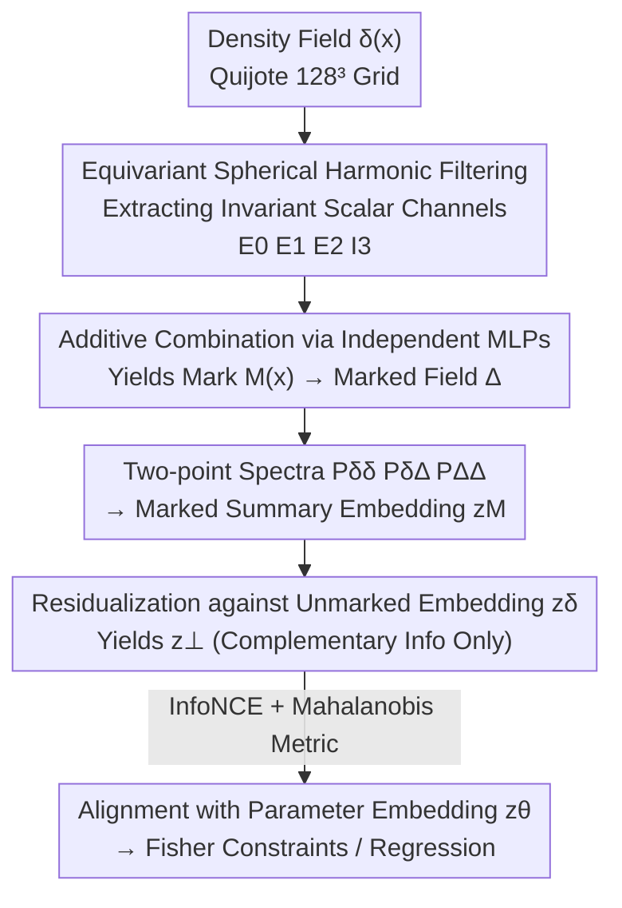

# Interpretable Equivariant Marks for Contrastive Cosmological Inference

**Conference**: ICML 2026  
**arXiv**: [2606.11295](https://arxiv.org/abs/2606.11295)  
**Code**: Provided in the paper ("The code developed for this analysis can be found here", subject to the original link)  
**Area**: Physics / Cosmological Inference / Equivariant Representation Learning / Contrastive Learning  
**Keywords**: Marked statistics, Spherical harmonic equivariant filtering, Contrastive learning, Fisher information, Interpretable summary

## TL;DR
This paper replaces manually designed marking functions in cosmological "marked statistics" with an **interpretable, equivariance-constrained neural mark**. By using three local SO(3)-equivariant spherical harmonic filters to extract rotationally invariant morphological descriptors and aligning the marked two-point spectra with cosmological parameters via contrastive learning (InfoNCE + residualization), it tightens the marginal constraints of $\sigma_8$ by $2.9\times$ and $\Omega_m$ by $1.8\times$ on Quijote N-body simulations, successfully breaking the classical $\Omega_m$–$\sigma_8$ degeneracy.

## Background & Motivation

**Background**: Next-generation Large-Scale Structure (LSS) surveys (DESI, Euclid, SPHEREx) will provide three-dimensional distributions of millions of galaxies. The "gold standard" for extracting cosmological information from these is the power spectrum, which is the optimal summary for Gaussian fields and possesses mature perturbation theory modeling on quasi-linear scales.

**Limitations of Prior Work**: Late-time matter density fields are significantly non-Gaussian on non-linear scales, with a wealth of information hidden in higher-order correlations that two-point statistics like the power spectrum **cannot see** in principle. Directly calculating $n$-point correlation functions (bispectrum, trispectrum) is computationally expensive in configuration space, perturbation theory fails in non-linear regimes, and the underlying Gaussian likelihood assumptions become increasingly invalid.

**Key Challenge**: One must either use field-level neural summaries or Simulation-Based Inference (SBI), which provide strong constraints but turn the driving features into black boxes and require massive amounts of high-fidelity simulations; or use marked statistics—multiplying the density field by a spatial weight $M(\mathbf{x})$ so that the two-point spectrum of the marked field "folds in" the higher-order correlations of the original field. The latter is cheap and easy to model, but classical **marking functions are manually designed and strictly limited by narrow parameterizations** (e.g., power laws based on smoothed density) and are usually tied to a fixed cosmological reference point.

**Goal**: While maintaining the advantage of the output still being a two-point spectrum, upgrade the marking function from manual design to a **learnable, cosmology-independent, yet still readable** form that can directly explain which morphological structures drive the information gain.

**Key Insight**: Rather than pre-supposing which environmental features are most important, the authors allow the network to learn them. However, interpretability is hard-coded into the structure through **physically-motivated architectural constraints** (local SO(3) equivariance, rotationally invariant scalar channels, additive decomposition). The trained marks can be "opened" in configuration space and read channel-by-channel.

**Core Idea**: A suite consisting of "morphological invariant extraction via equivariant spherical harmonic filtering + parameter alignment via contrastive learning + residualization against the unmarked spectrum" replaces manual marking functions to learn a mark that increases both constraining power and interpretability.

## Method

### Overall Architecture
The method consists of two main components. The first is the **learnable marking module**: the density field $\delta(\mathbf{x})$ is decomposed into several rotationally invariant local descriptors via spherical harmonic equivariant filtering, which are then combined into a mark $M(\mathbf{x})$ using independent MLPs. The two-point spectra $\{P_{\delta\delta},P_{\delta\Delta},P_{\Delta\Delta}\}$ of the marked field $\Delta(\mathbf{x})=M(\mathbf{x})[1+\delta(\mathbf{x})]-\langle M(1+\delta)\rangle$ carry higher-order information from the original field. The second is **contrastive training**: the marked summary embedding $\mathbf{z}_M$ and cosmological parameter embedding $\mathbf{z}_\theta$ are projected into the same latent space and aligned using InfoNCE. A critical step is the **residualization** of $\mathbf{z}_M$ against the unmarked embedding $\mathbf{z}_\delta$, rewarding only the "incremental information" provided by the mark. Once trained, the mark serves as a fixed, channel-readable density field transformation.

### Key Designs

**1. Equivariant Spherical Harmonic Marking Module: Replacing Manual Marks with Morphological Invariants**

Classical marks $M(\mathbf{x})=\big(\tfrac{1+\delta_s}{1+\delta_s+\delta_R(\mathbf{x})}\big)^p$ depend only on a smoothed density $\delta_R$, with a form restricted by power laws and saturation parameters $\delta_s$, capable only of expressing one-dimensional preferences such as up-weighting under-dense or down-weighting over-dense regions. Ours replaces the mark with scalar responses derived from spherical harmonic filtering of the density field. Specifically, for $\ell\in\{0,1,2\}$, filtering is performed in Fourier space as $F_{\ell m}(\mathbf{x})=\mathcal{F}^{-1}[\tilde\delta(\mathbf{k})\,W_{\mathrm{MAS}}^{-1}\,T_{\mathrm{tap}}\,G_\ell(k)\,i^\ell Y_{\ell m}(\hat{\mathbf{k}})]$, where $G_\ell(k)$ is a learnable Gaussian band-pass radial profile, $Y_{\ell m}$ are real spherical harmonics, $W_{\mathrm{MAS}}^{-1}$ removes the mass-assignment window, and $T_{\mathrm{tap}}$ is a Nyquist taper to suppress aliasing. These orientation-dependent components are contracted into **rotationally invariant scalars**: $E_0=F_{00}$ (signed monopole/density-type response), $E_1=(\sum_m F_{1m}^2+\epsilon)^{1/2}$ (gradient/vector magnitude), and two invariants $E_2=[\mathrm{Tr}(Q^2)+\epsilon]^{1/2}$ (anisotropy strength) and $I_3=\mathrm{Tr}(Q^3)/(E_2^3+\epsilon)$ (distinguishing prolate/oblate quadrupole shapes) derived from the traceless symmetric tensor $Q$ mapped from $\ell=2$ components.

The effectiveness lies in the **independent additivity** of each $\ell$ channel in the mark: $\eta(\mathbf{x})=\sum_a h_a(f_a(\mathbf{x}))+h_\times(E_0,E_2,I_3)$, with $M=\mathrm{softplus}[\eta]$. This allows the trained mark to be **accurately decomposed** into contributions from each channel, enabling one to read which local morphologies the network prefers. This architecture makes the mark far more expressive than power-law marks while preserving configuration-space readability.

**2. Residualized Contrastive Alignment: Rewarding Only Complementary Information**

If the marked summary were used directly to fit parameters, the network might learn a degenerate solution that simply replicates existing information in $P_{\delta\delta}$. The authors perform an orthogonal projection of the marked embedding against the unmarked embedding in the latent space:

$$\mathbf{z}_\perp=\mathbf{z}_M-\frac{\mathbf{z}_M\cdot\mathbf{z}_\delta}{\mathbf{z}_\delta\cdot\mathbf{z}_\delta+\epsilon}\,\mathbf{z}_0$$

By subtracting the component parallel to $\mathbf{z}_\delta$, only the part **complementary** to the unmarked spectrum, $\mathbf{z}_\perp$, remains for alignment with parameters. Alignment uses InfoNCE: $\mathcal{L}_i=-\log\frac{\exp s(\mathbf{z}_{\perp,i},\mathbf{z}_{\theta,i})}{\sum_{j\in\mathcal{N}_i^+}\exp s(\mathbf{z}_{\perp,i},\mathbf{z}_{\theta,j})}$. Negative samples are sampled across three types: true negatives in the batch, global synthetic negatives covering the entire prior volume, and local synthetic negatives sampled in shells around the anchor cosmology, forcing the summary to **distinguish between neighboring cosmologies**.

**3. Learned Mahalanobis Metric + Bootstrapped Training: Aligning Latent and Parameter Geometries**

The similarity $s$ in InfoNCE is defined as a Mahalanobis distance with a learnable lower-triangular factor $L$:

$$s(\mathbf{z}_\perp,\mathbf{z}_\theta)=-\tau^{-1}(\mathbf{z}_\perp-\mathbf{z}_\theta)^T LL^T(\mathbf{z}_\perp-\mathbf{z}_\theta)$$

This allows the latent space to rotate and stretch to better align with parameter geometry. The training sequence is also deliberate: first **pre-train the unmarked branch** to align $P_{\delta\delta}$ with parameter embeddings, then **freeze** its embedder while training the marking module. The parameter embedder is initialized with the unmarked configuration but allowed to fine-tune, ensuring that the final geometry is not strictly locked by the unmarked summary.

### Loss & Training
The core loss is the residualized InfoNCE described above. Training occurs in two stages: Stage 1 aligns $P_{\delta\delta}$ with parameters and freezes its embedder; Stage 2 trains the marking module and fine-tunes the parameter embedder. $G_\ell(k)$ is parameterized as learnable Gaussian band-passes with shared centers $r_0$ and widths $\sigma$, complemented by zero-initialized residual MLPs for each $\ell$.

## Key Experimental Results

The dataset consists of 5,000 N-body simulations from the Quijote BSQ suite with 5 varying cosmological parameters $\boldsymbol\theta=(\Omega_m,\Omega_b,h,n_s,\sigma_8)$. Density fields are assigned to a $128^3$ grid (cell size $7.8\,h^{-1}\mathrm{Mpc}$, $k_{\mathrm{Nyq}}\simeq 0.4\,h\,\mathrm{Mpc}^{-1}$).

### Main Results

Evaluations were performed at $k_{\max}=0.20\,h\,\mathrm{Mpc}^{-1}$ for Fisher constraints at a fixed reference cosmology and hold-out generalization across the parameter volume.

| Task / Metric | Baseline | Relative Gain (Ours) |
|------|------|------|
| Fisher Marginal $\sigma_8$ | Classical Mark (Massara 2021, $R=10\,h^{-1}\mathrm{Mpc}$) | Tightened $2.9\times$ |
| Fisher Marginal $\Omega_m$ | Classical Mark | Tightened $1.8\times$ |
| $\Omega_m$–$\sigma_8$ Degeneracy | Only $P_{\delta\delta}$ | Contours rotated; **broken** |
| Hold-out MSE (Full Prior) | Best Classical Mark | Reduced by $\sim 1.45\times$ |

Fisher derivatives and covariances were estimated using independent sets of simulations. The learned marks' MSE consistently outperformed both unmarked baselines and optimal classical marks, with the most significant gains observed for $\sigma_8$.

### Ablation Study

| Configuration / Analysis | Key Metric | Description |
|------|---------|------|
| Full Mark vs $\ell_{\max}=0$ Isotropic Ablation | Fisher Marginal | $E_0$ channel contributes the vast majority of gain; anisotropic channels provide fine corrections. |
| Effective Rank of $\mathbf{z}_\perp$ | $\approx 3.4$ | The first two PCs account for $\sim 85\%$ of variance in a $D=16$ space, consistent with parameter dimensionality. |
| PCA vs Parameter Direction | PCA Alignment | The first two PCs almost perfectly align with $\sigma_8$ and $\Omega_m$, the parameters where gain is dominant. |

### Key Findings
- **Gains primarily originate from small-scale isotropic responses**: Mark introspection reveals that $E_0$ dominates at this resolution. The learned $G_0(k)$ acts as a high-pass filter, essentially learning a "non-linearly reweighted density."
- **Interpretability at the morphological level**: $E_1$ peaks at void/filament boundaries, while $E_2$ highlights elongated filamentary regions. Because of the additive decomposition, these properties are inherent to the trained mark rather than being visualization artifacts.
- **Diminishing returns at high $k_{\max} \ge 0.3$**: The anti-aliasing taper required for spherical harmonic filtering on a grid suppresses power that classical pixel-space marks retain, making some classical marks competitive in that regime.

## Highlights & Insights
- **Interpretability via Architecture rather than Attribution**: The additive decomposition $\eta=\sum_a h_a(f_a)+h_\times$ ensures that channel contributions are exact identities rather than saliency approximations, providing a much firmer ground for interpretability compared to black-box field-level networks.
- **Residualization as a Surgical Tool**: By projecting the marked embedding orthogonally to the unmarked one, the objective explicitly rewards only "incremental information," preventing the network from simply replicating the power spectrum.
- **Cross-pollination from Contrastive Learning**: Using InfoNCE with learned Mahalanobis metrics treats "summary $\leftrightarrow$ parameter" as a multi-modal alignment problem. The use of cheap synthetic negatives (requiring only parameter vectors) significantly reduces simulation costs.
- **Unsupervised Discovery of Parameter Axes**: The fact that latent space PCs naturally align with $\sigma_8$ and $\Omega_m$ confirms that the representation learning successfully discovered the principal axes of cosmological information.

## Limitations & Future Work
- At $k_{\max} \ge 0.3\,h\,\mathrm{Mpc}^{-1}$, the anti-aliasing tapers reduce power, causing Ours to lose its consistent advantage over some classical marks; future work involving morphological filters may address this.
- Anisotropic channels ($\ell=1,2$) contribute less at the current resolution; the "morphological interpretability" currently manifests mostly through the dominated $E_0$ response.
- Experiments were limited to $z=0$ density fields in idealized periodic boxes; systematic effects such as redshift-space distortions, selection functions, and galaxy bias have yet to be incorporated.

## Related Work & Insights
- **vs Classical Marked Statistics (White 2016 / Massara 2021)**: Classical methods fix the mark as a narrow parameterization of smoothed density. Ours uses an equivariant neural network that is cosmology-independent and more expressive while remaining readable, leading to superior constraints.
- **vs Field-level / SBI Summaries (Charnock 2018 / Makinen 2021)**: These often act as black boxes. Ours sacrifices some peak constraining power for a summary that remains a two-point spectrum with an "openable" mark, facilitating a better understanding of the information source.
- **vs Hybrid Strategies (Makinen 2025)**: Hybrid methods often append neural summaries to traditional ones, where the neural component remains opaque. In Ours, the entire mark is decomposable and interpretable.

## Rating
- Novelty: ⭐⭐⭐⭐⭐ 
- Experimental Thoroughness: ⭐⭐⭐⭐ 
- Writing Quality: ⭐⭐⭐⭐ 
- Value: ⭐⭐⭐⭐ 

<!-- RELATED:START -->

## Related Papers

- [\[ICML 2026\] EqGINO: Equivariant Geometry-Informed Fourier Neural Operators for 3D PDEs](eqgino_equivariant_geometry-informed_fourier_neural_operators_for_3d_pdes.md)
- [\[ICML 2026\] Foundation Inference Models for Ordinary Differential Equations](foundation_inference_models_for_ordinary_differential_equations.md)
- [\[NeurIPS 2025\] Vision Transformers for Cosmological Fields: Application to Weak Lensing Mass Maps](../../NeurIPS2025/physics/vision_transformers_for_cosmological_fields_application_to_weak_lensing_mass_map.md)
- [\[ICML 2026\] Distribution Transformers: Fast Approximate Bayesian Inference With On-The-Fly Prior Adaptation](distribution_transformers_fast_approximate_bayesian_inference_with_on-the-fly_pr.md)
- [\[ICML 2025\] Compact Matrix Quantum Group Equivariant Neural Networks](../../ICML2025/physics/compact_matrix_quantum_group_equivariant_neural_networks.md)

<!-- RELATED:END -->
