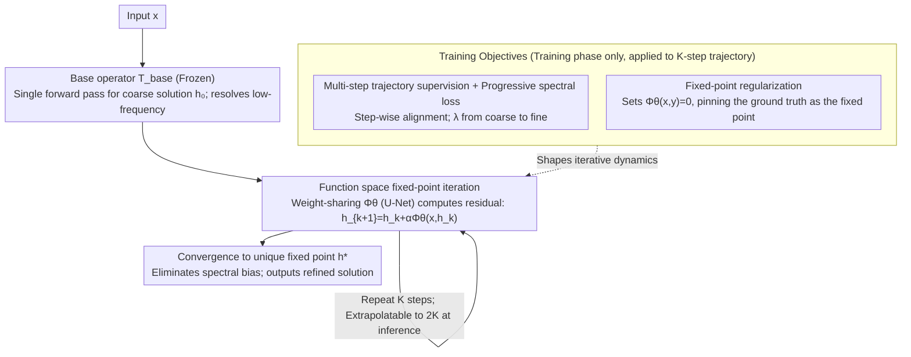

# Iterative Refinement Neural Operators are Learned Fixed-Point Solvers: A Principled Approach to Spectral Bias Mitigation

**Conference**: ICML 2026 Spotlight  
**arXiv**: [2605.24041](https://arxiv.org/abs/2605.24041)  
**Code**: https://github.com/xiaotianliu-dartmouth/Iterative_Refinement_Neural_Operator (Available)  
**Area**: Scientific Computing / Neural Operators / PDE Surrogate Models  
**Keywords**: Neural Operators, Fixed-Point Iteration, Spectral Bias, Inference-Time Iteration, FNO

## TL;DR
The paper proposes an external weight-sharing U-Net refinement module $\Phi_\theta$ for pre-trained neural operators (FNO/TFNO/WDSR, etc.). During inference, it iteratively updates the solution via $h_{k+1}=h_k+\alpha\Phi_\theta(x,h_k)$, transforming a single forward pass into a "learned residual solver" that converges to a unique fixed point. This approach reduces errors by 34%–80% in tasks like turbulence, active matter, and ERA5 super-resolution, while maintaining stable extrapolation to twice the training iterations.

## Background & Motivation

**Background**: Neural operators like FNO and DeepONet have become mainstream fast surrogate models for parameterized PDEs and multiphysics systems. They learn mappings $\mathcal{G}:\mathcal{X}\to\mathcal{H}$ in function spaces, providing entire solution fields in a single forward pass, which is orders of magnitude faster than traditional numerical methods.

**Limitations of Prior Work**: These operators commonly suffer from "spectral bias"—while low-frequency large-scale structures are learned accurately, high-frequency details (turbulent filaments, fine wind textures, orientation gradients in active matter) are significantly smoothed out. Figure 1 illustrates this in ERA5 16× super-resolution: FNO captures the general atmospheric structure but blurs small-scale kinetic energy vortices.

**Key Challenge**: Current solutions rely on "resource-heavy training"—increasing model width, using higher-resolution data, or expanding datasets. This essentially pushes the "single forward pass" paradigm, which regresses the entire solution at once, to its limit. Conversely, classical numerical analysis offers an alternative: initial coarse solutions followed by iterative residual correction (multigrid, defect correction, Krylov), a path yet to be systematically introduced to neural operators.

**Goal**: To transform the single forward pass into an iterative "test-time optimization" without retraining the base operator, decoupling accuracy improvements from computational overhead while providing theoretical convergence guarantees rather than purely heuristic ones.

**Key Insight**: Reinterpret the neural operator prediction process as a dynamical system in function space. A base operator provides a coarse initial value $h_0$, followed by a weight-sharing refinement operator $\Phi_\theta$ that repeatedly computes residual corrections. This corresponds exactly to fixed-point iteration $h_{k+1}=T(h_k)$ in numerical analysis, allowing the use of the Banach Fixed-Point Theorem to prove convergence, extrapolation stability, and error lower bounds.

**Core Idea**: Replace "single-pass forward inference" with "learned residual iteration" to gradually eliminate spectral bias through repeated refinements. A progressive spectral loss is used to explicitly align each iteration step with corrections across different frequency bands.

## Method

### Overall Architecture

IRNO decomposes inference into two stages:

- **Initialization Phase**: Uses a pre-trained and frozen base operator $T_{\text{base}}:\mathcal{X}\to\mathcal{H}$ (e.g., FNO / TFNO / WDSR) to compute a coarse solution $h_0=T_{\text{base}}(x)$, handling large-scale low-frequency structures.
- **Iterative Refinement Phase**: A weight-sharing refinement operator $\Phi_\theta:\mathcal{X}\times\mathcal{H}\to\mathcal{H}$ performs repeated residual updates:

    $h_{k+1} = h_k + \alpha\cdot\Phi_\theta(x, h_k),\quad k=0,\dots,K-1$

    where $\alpha\in(0,1]$ is the step size, balancing convergence speed and stability. At each step, the original input $x$ and current estimate $h_k$ are concatenated as input to $\Phi_\theta$, which outputs the correction.

$\Phi_\theta$ is instantiated as a lightweight U-Net, though the framework is architecture-agnostic. The architecture must satisfy three requirements: (i) smoothness for iteration stability, (ii) multi-scale expressivity for spectral refinement, and (iii) cross-iteration weight sharing for controlled computation. Most importantly, $\Phi_\theta$ learns an "iteration-invariant update rule," allowing more iterations $k>K$ during inference than during training. During training, the $K$-step trajectory is unrolled end-to-end using three losses (multi-step trajectory supervision + progressive spectral loss + fixed-point regularization) to shape the iterative dynamics. During inference, the base operator remains frozen while only $\Phi_\theta$ iterates.

### Key Designs

**1. Function Space Fixed-Point Iteration + Cross-Operator Transferability: Replacing "Retraining for Accuracy" with "Iteration for Accuracy"**

To improve accuracy, traditional neural operators require wider models, more data, or retraining, as the single-pass regression reaches its limit. IRNO rewrites prediction as an iteration $h_{k+1}=T(h_k)=h_k+\alpha\Phi_\theta(x,h_k)$ converging to a unique fixed point. Using the Banach Fixed-Point Theorem, a first-order Taylor expansion near solution $y$ gives $\Phi(x,h)=b(x)+A(x,h)e+R(x,h)$ (where $e=y-h$ is the residual). If the linearization $A(x,y)$ is strongly monotone ($\langle Ae,e\rangle\ge m\|e\|^2$, $\|A\|_{\text{op}}\le M$), then for $0<\alpha<2m/M^2$, the contraction factor $q=\|I-\alpha A\|_{\text{op}}<1$ ensures the error iterates as:

$$\|e_{k+1}\|\le q\|e_k\|+c\|e_k\|^2+\alpha\|b\|$$ (Thm. 3.1)

This results in geometric convergence $\|e_k\|\lesssim q^k\|e_0\|$ (Cor. 3.2) and a limit error bound $\|e^*\|\le\alpha\|b\|/(1-q)$ (Cor. 3.3). Accuracy gain is thus decoupled from retraining—simply running more steps at inference reduces error. Furthermore, $\Phi_\theta$ learns local residual geometry rather than the full solution mapping, allowing it to transition between different base operators seamlessly.

**2. Multi-Step Trajectory Supervision + Progressive Spectral Loss: Aligning Iterations with Frequency Bands**

Pure spatial L2 loss is insensitive to high frequencies, and fixed-weight spectral losses can cause early iterations to be diverted by high-frequency noise. IRNO unrolls the $K$-step trajectory during training and applies trajectory supervision $\mathcal{L}_{\text{spatial}}=\frac1K\sum_k\|h_k-y\|^2$. The spectral loss weights the FFT magnitude difference between prediction and target with $\rho(\omega,\lambda_k)=1+(|\omega|/|\omega|_{\text{nyq}})^{\lambda_k}$. Crucially, the exponent $\lambda_k$ increases linearly from $\lambda_{\text{start}}$ to $\lambda_{\text{end}}$ (experimentally $1.0\to2.0$)—early steps focus on coarse structures, while later steps penalize high-frequency errors. This schedule aligns training dynamics with fixed-point dynamics (large corrections for coarse features early, small corrections for fine details later), isomorphic to the "coarse-to-fine" multigrid V-cycle.

**3. Fixed-Point Regularization to Compress Bias Error: Pinning the Ground Truth as a Fixed Point**

The limit error bound in Cor. 3.3 is proportional to the bias term $\|b\|=\|\Phi_\theta(x,y)\|$. Without constraints, $\Phi_\theta$ might output a non-zero correction at the true solution $y$, meaning the iteration would move away even from a perfect initial value. The authors add $\mathcal{L}_{\text{fp}}=\|\Phi_\theta(x,y)\|^2$, requiring the correction to be zero when the input is the ground truth. This explicitly pins $y$ as the fixed point, lowering the error floor. This is consistent with classical fixed-point solvers where the solution must be a fixed point to prevent convergence to an incorrect state. Figure 3 shows a Pearson correlation >0.93 between $\min_k\|e_k\|$ and $\|b\|$, validating that smaller bias leads to a lower error floor.

### Loss & Training
The total loss is $\mathcal{L}_{\text{total}}=\mathcal{L}_{\text{spatial}}+\beta_{\text{spectral}}\mathcal{L}_{\text{spectral}}+\beta_{\text{fp}}\mathcal{L}_{\text{fp}}$. FNO bases are trained with $K=6$ steps, while TFNO/WDSR bases use $K=4$; during inference, these are evaluated up to $k=12$ and $k=8$, respectively (2× extrapolation). Step size $\alpha\in\{0.2, 0.25\}$ proved most stable. The base operator is frozen throughout training.

## Key Experimental Results

### Main Results

| Dataset | Metric | Base | Single-pass Baseline | IRNO | Gain |
|--------|------|------|---------|------|------|
| TR-2D | VRMSE ↓ | FNO | 0.2394 | 0.1309 | 45.32% |
| TR-2D | VRMSE ↓ | TFNO | 0.2371 | 0.1042 | **56.05%** |
| Active Matter | VRMSE ↓ | FNO | 0.1017 | 0.0501 | 50.73% |
| Active Matter | VRMSE ↓ | TFNO | 0.1981 | 0.0387 | **80.46%** |
| ERA5 16× | ACC ↑ | FNO | 0.7523 | 0.8919 | 18.56% |
| ERA5 16× | RFNE ↓ | FNO | 0.3247 | 0.2140 | 34.09% |
| ERA5 16× | ACC ↑ | WDSR | 0.9091 | 0.9104 | 0.14% |

On ERA5, IRNO (WDSR) outperformed recent spectral-specific methods like HiNOTE (ACC 0.9055 / RFNE 0.2222) and HFS (ACC 0.8915 / RFNE 0.2253), achieving ACC 0.9104 / RFNE 0.1953. It is also complementary to HFS; on Active Matter, HFS + IRNO reduced VRMSE from 0.0631 to 0.0486. Frequency analysis on Active Matter (FNO) showed high-frequency band errors were reduced to 1.48–2.04% of the base, mid-frequency to 5.07–6.68%, and low-frequency to 27.72–36.10%.

### Ablation Study

| Configuration | VRMSE ↓ | Low-freq Ratio | Mid-freq Ratio | High-freq Ratio | Description |
|------|---------|-------|-------|-------|------|
| Prog. Spectral Loss $\lambda:1\to2$ | **0.0387** | 0.0551 | 0.0788 | **0.2393** | Full Model |
| Fixed $\lambda=1.00$ | 0.0509 | 0.0953 | 0.1067 | 0.6023 | Insufficient high-freq weight |
| Fixed $\lambda=1.25$ | 0.0695 | 0.1599 | 0.2101 | 0.8794 | Performance drop across all bands |
| Fixed $\lambda=1.75$ | 0.0586 | 0.1124 | 0.1320 | 0.6949 | Early high-freq weight too high |
| Fixed $\lambda=2.00$ | 0.0666 | 0.2063 | 0.1578 | 0.7677 | Diverted by early high-freq noise |

In cross-operator transfer experiments, IRNO$_{\text{TFNO}}$ used to refine FNO outputs reduced TR-2D VRMSE from 0.2396 to 0.0994 (58.53% gain), surpassing the same-operator IRNO$_{\text{FNO}}$ by 13 percentage points. On the irregular grid CE-Gauss (RIGNO base), 7-step autoregressive rollouts showed improvements rising from 12.5% at $t=1$ to 21.3% at $t=7$, indicating that early refinement inhibits error accumulation.

### Key Findings
- Step size $\alpha$ is critical for stability: $\alpha=0.1$ is slow but stable, $\alpha\in[0.2,0.4]$ converges quickly within training steps, while $\alpha\geq 0.5$ diverges beyond $k=6$, matching the theoretical $q=\|I-\alpha A\|_\text{op}<1$ condition.
- Spectral error reduction is non-uniform: reductions are greatest near the Nyquist limit ($\omega=128$), effectively "inverting" the neural operator's spectral bias.
- Smaller bias yields a lower error floor (Pearson $r>0.93$), confirming the effectiveness of fixed-point regularization.
- Architecture robustness: Using ResNet, ConvNext, or FNO as the backbone for $\Phi_\theta$ yielded >71% VRMSE reduction; choice of normalization (BatchNorm/LayerNorm/GroupNorm) had little impact.
- On the Inference Time-Performance Pareto front, IRNO achieved ACC 0.84 at 1100 GFLOPs, whereas a capacity-matched 15× U-Net baseline only reached 0.79, proving gains stem from the iterative mechanism rather than parameter count.

## Highlights & Insights
- **Spectral bias as a tunable parameter**: Previously viewed as an "inherent defect" of neural operators, IRNO converts spectral bias into "soft knowledge" attainable by increasing iterations, effectively shifting training complexity to inference-time computational depth.
- **Closed theory-experiment loop**: Theorem 3.1 predicts an error floor $\propto\|b\|$ when bias exists; this is empirically verified in Figure 3 with high Pearson correlation. Critical $\alpha$ values scanned in Figure 7 correspond to the $\|I-\alpha A\|<1$ boundary, showcasing the value of classical numerical analysis as a guide.
- **Cross-operator transfer outperforming original base**: IRNO$_{\text{TFNO}}$ refining FNO better than IRNO$_{\text{FNO}}$ suggests that a refinement module trained on a weaker base learns from more diverse residual structures. This hints that **intentionally choosing a weaker base operator to train its refinement module might be a superior strategy**.
- **Stable 2K inference-time extrapolation from K training steps**: This "train short, test long" property is valuable and shares similarities with long-context extrapolation in Transformers, suggesting weight-sharing and strong convergent dynamics as a generalizable approach.

## Limitations & Future Work
- Inference cost increases linearly with $K$. While dominant on the Pareto front against single-pass models, it remains a disadvantage for latency-sensitive real-time scenarios (edge deployment, online control).
- Convergence relies on the base operator's initial value falling within the basin of attraction (Assumption 3). The theory does not cover cases where the initial guess is far off or the base operator fails significantly; no "out-of-basin" detector is provided.
- Spectral analysis is most detailed for Active Matter; TR-2D and ERA5 only have aggregated data. Extrapolation beyond 2× training steps ($8\times$) may require smaller step sizes or scheduling, which was only briefly mentioned in the appendix.
- The refinement operator learns "residual geometry"; its performance on PDE solutions with discontinuities (e.g., shock waves, phase boundaries) has not been specifically tested. Replacing spectral loss with wavelets or non-stationary bases might be necessary.
- A natural extension would be using $\Phi_\theta$ as a learnable Krylov subspace generator combined with deflation or Anderson acceleration to speed up convergence.

## Related Work & Insights
- **vs HiNOTE / HFS**: These improve spectral bias via architecture (hierarchical attention / frequency scaling). IRNO introduces iterative refinement at inference, which is orthogonal and additive—HFS + IRNO achieved an additional 23% error reduction on Active Matter.
- **vs F-Adapter (Parameter-efficient spectral fine-tuning)**: F-Adapter yields 2.31% VRMSE gain with low overhead, while IRNO achieves a 50.73% gain with higher computation. They target different scenarios: resource-constrained vs. accuracy-sensitive.
- **vs Classical Multigrid / Defect Correction**: IRNO is essentially a learned defect correction where the smoother is a neural network. The "coarse-to-fine" spectral loss schedule mirrors the V-cycle, providing a data-driven perspective on smoother design.
- **vs Iterative Denoising in Diffusion Models**: While both involve $h_k\to h_{k+1}$ iterations, DDPM relies on noise scheduling rather than fixed-point theory. IRNO offers an alternative iterative learner framework based on Banach fixed points rather than stochastic differential equations, potentially informing deterministic sampler design.

## Rating
- Novelty: ⭐⭐⭐⭐ Introduces the classical defect correction framework to neural operators with contraction proofs; clean logic though the individual components are not entirely new.
- Experimental Thoroughness: ⭐⭐⭐⭐⭐ Comprehensive evaluation across 4 PDE systems × 4 base operators with ablation on architectures, step sizes, and frequency bands; theory-to-practice alignment is strong.
- Writing Quality: ⭐⭐⭐⭐⭐ Clearly defined theoretical assumptions, each corollary supported by figures, well-structured tables; a model for scientific computing papers.
- Value: ⭐⭐⭐⭐⭐ Provides a universal path to improve accuracy without retraining, applicable to deployed neural operators and inspiring research into inference-time scaling.

<!-- RELATED:START -->

## Related Papers

- [\[ICML 2026\] Learning to Refine: Spectral-Decoupled Iterative Refinement Framework for Precipitation Nowcasting](learning_to_refine_spectral-decoupled_iterative_refinement_framework_for_precipi.md)
- [\[ICML 2026\] Generative Neural Operators Through Diffusion Last Layer](generative_neural_operators_through_diffusion_last_layer.md)
- [\[ICML 2026\] EqGINO: Equivariant Geometry-Informed Fourier Neural Operators for 3D PDEs](eqgino_equivariant_geometry-informed_fourier_neural_operators_for_3d_pdes.md)
- [\[ICLR 2026\] DRIFT-Net: A Spectral--Coupled Neural Operator for PDEs Learning](../../ICLR2026/physics/drift-net_a_spectral--coupled_neural_operator_for_pdes_learning.md)
- [\[CVPR 2026\] Spatial-Spectral Residuals Informed Diffusion Neural Operator for Pan-sharpening](../../CVPR2026/physics/spatial-spectral_residuals_informed_diffusion_neural_operator_for_pan-sharpening.md)

<!-- RELATED:END -->
