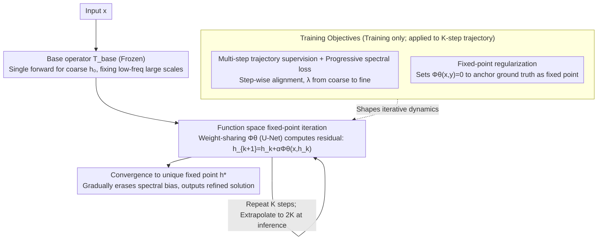

# Iterative Refinement Neural Operators are Learned Fixed-Point Solvers: A Principled Approach to Spectral Bias Mitigation

**Conference**: ICML 2026 Spotlight  
**arXiv**: [2605.24041](https://arxiv.org/abs/2605.24041)  
**Code**: https://github.com/xiaotianliu-dartmouth/Iterative_Refinement_Neural_Operator (Available)  
**Area**: Scientific Computing / Neural Operators / PDE Surrogates  
**Keywords**: Neural Operators, Fixed-point Iteration, Spectral Bias, Inference-time Iteration, FNO

## TL;DR
This paper attaches a weight-sharing U-Net refinement module $\Phi_\theta$ to pre-trained neural operators (FNO/TFNO/WDSR, etc.). During inference, it iteratively updates the solution via $h_{k+1}=h_k+\alpha\Phi_\theta(x,h_k)$, transforming a single forward prediction into a "learned residual solver" that converges to a unique fixed point. This approach reduces errors by 34%–80% in tasks like turbulence, active matter, and ERA5 super-resolution, while maintaining stable extrapolation to twice the training iterations.

## Background & Motivation

**Background**: Neural operators such as FNO and DeepONet have become mainstream fast surrogate models for parameterized PDEs and multi-physics systems. They learn mappings $\mathcal{G}:\mathcal{X}\to\mathcal{H}$ in function spaces, providing an entire solution field in a single forward pass, which is orders of magnitude faster than traditional numerical methods.

**Limitations of Prior Work**: These operators commonly suffer from "spectral bias"—large-scale low-frequency structures are learned accurately, but medium-to-high frequency details (turbulence filaments, fine wind textures, orientation gradients in active matter) are significantly smoothed out. Figure 1 shows this intuitively on ERA5 16× super-resolution: FNO captures the general atmospheric structure but blurs small-scale kinetic vortices.

**Key Challenge**: Current solutions rely on "brute-force training"—increasing model width, using higher-resolution data, or expanding datasets. This essentially pushes the "single-forward" paradigm, which regresses the entire solution at once, to its limit. Conversely, classical numerical analysis offers another path: coarse solutions followed by residual iterative refinement (multigrid, defect correction, Krylov), but this path has not been systematically introduced to neural operators.

**Goal**: To transform a single forward pass into an iterative "test-time optimization" without retraining the base operator, decoupling accuracy gains from training resource consumption while providing theoretical convergence guarantees rather than purely heuristic ones.

**Key Insight**: Reinterpret the neural operator prediction process as a dynamical system in function space. The base operator provided a coarse initial value $h_0$, followed by a weight-sharing refinement operator $\Phi_\theta$ that repeatedly computes residual corrections. This corresponds exactly to fixed-point iteration $h_{k+1}=T(h_k)$ in numerical analysis, allowing the use of the Banach Fixed-Point Theorem to prove convergence, extrapolation stability, and error lower bounds.

**Core Idea**: Replace the "single-forward unit" with a "learned residual iteration" to gradually erase spectral bias and explicitly align each iteration step with spectral corrections across different frequency bands via a progressive spectral loss.

## Method

### Overall Architecture

IRNO splits inference into two stages:

- **Initialization Stage**: Use a pre-trained and frozen base operator $T_{\text{base}}:\mathcal{X}\to\mathcal{H}$ (FNO / TFNO / WDSR) to compute a coarse solution $h_0=T_{\text{base}}(x)$, handling large-scale low-frequency structures.
- **Iterative Refinement Stage**: A weight-sharing refinement operator $\Phi_\theta:\mathcal{X}\times\mathcal{H}\to\mathcal{H}$ iteratively computes residual updates:

    $h_{k+1} = h_k + \alpha\cdot\Phi_\theta(x, h_k),\quad k=0,\dots,K-1$

    where $\alpha\in(0,1]$ is the step size, balancing convergence speed and stability. At each step, the original input $x$ and current estimate $h_k$ are concatenated and fed into $\Phi_\theta$ to output the correction.

$\Phi_\theta$ is instantiated as a lightweight U-Net, though the framework is architecture-agnostic. The architecture must satisfy three requirements: (i) smoothness to ensure iteration stability, (ii) multi-scale expressivity to capture spectral corrections, and (iii) weight sharing across iterations to keep compute manageable. Critically, $\Phi_\theta$ learns "iteration-invariant update rules," allowing more iterations at inference ($k>K$) than during training. During training, the $K$-step trajectory is unrolled end-to-end, and the dynamics are shaped by three losses: multi-step trajectory supervision, progressive spectral loss, and fixed-point regularization.

### Key Designs

**1. Function space fixed-point iteration + Cross-operator transferability: Replacing "retrain for accuracy" with "iterate for accuracy"**

Traditional neural operators improve accuracy by increasing model width or data, essentially pushing the single-forward regression limit. IRNO rewrites prediction as an iteration $h_{k+1}=T(h_k)=h_k+\alpha\Phi_\theta(x,h_k)$ converging to a unique fixed point. Using the Banach Fixed-Point Theorem, a first-order Taylor expansion near solution $y$ gives $\Phi(x,h)=b(x)+A(x,h)e+R(x,h)$ (where $e=y-h$ is the residual). Provided the linearization $A(x,y)$ is strongly monotonic ($\exists m,M$ such that $\langle Ae,e\rangle\ge m\|e\|^2$ and $\|A\|_{\text{op}}\le M$), choosing $0<\alpha<2m/M^2$ guarantees a contraction factor $q=\|I-\alpha A\|_{\text{op}}<1$. The error then recurses as:

$$\|e_{k+1}\|\le q\|e_k\|+c\|e_k\|^2+\alpha\|b\|$$

(Thm. 3.1), showing geometric convergence $\|e_k\|\lesssim q^k\|e_0\|$ (Cor. 3.2), with an asymptotic error floor $\|e^*\|\le\alpha\|b\|/(1-q)$ (Cor. 3.3). This decouples accuracy from retraining—running more steps at inference reduces error. Moreover, $\Phi_\theta$ learns local residual geometry rather than full mapping, allowing it to transition seamlessly to other base operators.

**2. Multi-step trajectory supervision + Progressive spectral loss: Aligning iterations with frequency bands**

Pure spatial L2 loss is insensitive to high frequencies, while fixed-weight spectral losses can bias early iterations with high-frequency noise. IRNO unrolls the $K$-step trajectory during training and applies trajectory supervision $\mathcal{L}_{\text{spatial}}=\frac1K\sum_k\|h_k-y\|^2$ for stability. The spectral loss weights the FFT magnitude difference by frequency as $\rho(\omega,\lambda_k)=1+(|\omega|/|\omega|_{\text{nyq}})^{\lambda_k}$. Crucially, the exponent $\lambda_k$ increases linearly from $\lambda_{\text{start}}$ to $\lambda_{\text{end}}$ (experimentally $1.0\to2.0$)—early steps focus on coarse structures, while later steps penalize high-frequency errors. This schedule aligns training dynamics with fixed-point dynamics, isomorphic to the "coarse-to-fine" strategy in multigrid V-cycles.

**3. Fixed-point regularization to compress bias error: Anchoring ground truth as the dynamical fixed point**

The error floor in Cor. 3.3 is proportional to the bias term $\|b\|=\|\Phi_\theta(x,y)\|$. Left unconstrained, $\Phi_\theta$ might learn a degenerate solution that still outputs corrections at the ground truth $y$, pushing the state away even from a perfect initial value. The authors add $\mathcal{L}_{\text{fp}}=\|\Phi_\theta(x,y)\|^2$, requiring the correction to be zero when the input is the ground truth. This explicitly anchors $y$ as the fixed point. Real-world validation in Figure 3 (Active Matter and TR-2D) shows a Pearson correlation $>0.93$ between $\|b\|$ and $\min_k\|e_k\|$, confirming that smaller bias leads to a lower error floor.

### Loss & Training
The total loss is $\mathcal{L}_{\text{total}}=\mathcal{L}_{\text{spatial}}+\beta_{\text{spectral}}\mathcal{L}_{\text{spectral}}+\beta_{\text{fp}}\mathcal{L}_{\text{fp}}$. FNO base uses $K=6$ training steps, while TFNO/WDSR use $K=4$. Inference is evaluated up to $k=12$ and $k=8$ respectively (2× training steps). Step size $\alpha\in\{0.2, 0.25\}$ proved most stable. The base operator remains frozen throughout training.

## Key Experimental Results

### Main Results

| Dataset | Metric | Base | Single-step Baseline | IRNO | Gain |
|--------|------|------|---------|------|------|
| TR-2D | VRMSE ↓ | FNO | 0.2394 | 0.1309 | 45.32% |
| TR-2D | VRMSE ↓ | TFNO | 0.2371 | 0.1042 | **56.05%** |
| Active Matter | VRMSE ↓ | FNO | 0.1017 | 0.0501 | 50.73% |
| Active Matter | VRMSE ↓ | TFNO | 0.1981 | 0.0387 | **80.46%** |
| ERA5 16× | ACC ↑ | FNO | 0.7523 | 0.8919 | 18.56% |
| ERA5 16× | RFNE ↓ | FNO | 0.3247 | 0.2140 | 34.09% |
| ERA5 16× | ACC ↑ | WDSR | 0.9091 | 0.9104 | 0.14% |

On ERA5, IRNO (WDSR) outperformed recent spectral-bias specialized methods: HiNOTE (ACC 0.9055 / RFNE 0.2222) and HFS (ACC 0.8915 / RFNE 0.2253), achieving ACC 0.9104 / RFNE 0.1953. It is also complementary to HFS—on Active Matter, HFS + IRNO reduced VRMSE from 0.0631 to 0.0486. In spectral band analysis for Active Matter (FNO), high-frequency error was suppressed to 1.48–2.04% of the base, mid-frequency to 5.07–6.68%, and low-frequency to 27.72–36.10%.

### Ablation Study

| Configuration | VRMSE ↓ | Low-freq Ratio | Mid-freq Ratio | High-freq Ratio | Description |
|------|---------|-------|-------|-------|------|
| Prog. Spectral Loss $\lambda:1\to2$ | **0.0387** | 0.0551 | 0.0788 | **0.2393** | Full Model |
| Fixed $\lambda=1.00$ | 0.0509 | 0.0953 | 0.1067 | 0.6023 | Insufficient high-freq weight |
| Fixed $\lambda=1.25$ | 0.0695 | 0.1599 | 0.2101 | 0.8794 | Performance drop across all bands |
| Fixed $\lambda=1.75$ | 0.0586 | 0.1124 | 0.1320 | 0.6949 | Excess early high-freq weight |
| Fixed $\lambda=2.00$ | 0.0666 | 0.2063 | 0.1578 | 0.7677 | Biased by high-freq noise early on |

In cross-operator transfer experiments, IRNO$_{\text{TFNO}}$ applied to FNO's output improved TR-2D VRMSE from 0.2396 to 0.0994 (58.53% gain), outperforming the same-operator IRNO$_{\text{FNO}}$ by 13 percentage points. On irregular grids (CE-Gauss with RIGNO base) during a 7-step autoregressive rollout, improvements grew from 12.5% at $t=1$ to 21.3% at $t=7$, showing that early refinement inhibits error accumulation.

### Key Findings
- Step size $\alpha$ is critical for stability: $\alpha=0.1$ is slow but stable; $\alpha\in[0.2,0.4]$ converges quickly within training steps; $\alpha\geq 0.5$ diverges beyond $k=6$, aligning with the theoretical contraction condition $\|I-\alpha A\|_\text{op}<1$.
- Spectral error reduction is non-uniform: The largest drop occurs near the Nyquist limit ($\omega=128$), where IRNO effectively "reverses" the neural operator's spectral bias.
- Bias correlates with the error floor: Pearson $r>0.93$ empirically validates the role of fixed-point regularization.
- Architecture robustness: Backbone types for $\Phi_\theta$ (ResNet / ConvNext / FNO) all yield $>71\%$ VRMSE reduction; normalization methods (BN / LN / GN) show minimal difference.
- Inference Efficiency: In a Pareto analysis of time vs. performance, IRNO reaches ACC 0.84 at 1100 GFLOPs, while a capacity-matched 15× U-Net baseline only reaches 0.79, indicating results stem from iterative mechanisms rather than raw parameter count.

## Highlights & Insights
- **Turning spectral bias into a tunable parameter**: Previously considered an "inherent flaw" of neural operators, IRNO treats spectral bias as "soft knowledge" attainable through iteration. It effectively shifts training complexity to inference-time graph depth.
- **Clean Theory-Experiment Loop**: Theorem 3.1 predicts an error floor $\propto\|b\|$ when bias exists; the paper provides empirical scatter plots with Pearson correlation $>0.93$. Similarly, critical $\alpha$ values swept in Figure 7 correspond to the $\|I-\alpha A\|<1$ boundary. This "numerical analysis as a compass" approach is highly transferable.
- **Refinement Transferability via Weak Bases**: IRNO$_{\text{TFNO}}$ performed better on FNO than IRNO$_{\text{FNO}}$ because the refinement module trained on a "weaker" base encountered larger and more diverse residual structures. This suggests that **purposely choosing a weak base operator to train the refinement module may be a superior strategy**.
- **Stabilized 2× Extrapolation**: The "train short, test long" property ($K=4 \to k=8$) is valuable for topics like Transformer context extrapolation, where shared weights and strong contraction dynamics can be applied.

## Limitations & Future Work
- Inference compute scales linearly with $K$. While winning against capacity-matched single-model baselines in Pareto efficiency, it remains a drawback for latency-sensitive real-time scenarios (edge deployment, online control).
- Convergence guarantees depend on the base operator's initial value falling within the "attraction basin" (Assumption 3). The theory does not cover cases where the base operator fails significantly or provides random guesses; no detector for "out-of-basin" initialization is provided.
- Detailed spectral analysis is primarily focused on Active Matter; TR-2D and ERA5 have aggregated data. Extreme extrapolation ($>2\times$) requires smaller step sizes or scheduling, which is mentioned but not systematized.
- The module learns "residual geometry," and its performance on PDE solutions with discontinuities (e.g., shocks, phase interfaces) has not been specifically tested; spectral loss might need replacing with wavelets or non-stationary bases.
- A natural extension would be treating $\Phi_\theta$ as a learned Krylov subspace generator, combined with deflation or Anderson acceleration, to accelerate convergence further.

## Related Work & Insights
- **vs HiNOTE / HFS**: These improve spectral bias via architecture (hierarchical attention / frequency scaling). IRNO introduces iterative refinement at inference, which is orthogonal and additive—HFS+IRNO reduced Active Matter error by an additional 23% over HFS alone.
- **vs F-Adapter (Parameter-efficient spectral fine-tuning)**: F-Adapter achieves a 2.31% VRMSE gain at low cost; IRNO achieves a 50.73% gain at higher compute. They are complementary for resource-constrained vs. accuracy-sensitive scenarios.
- **vs Classical Multigrid / Defect Correction**: IRNO is essentially a learned version of defect correction but replaces smoothers with neural networks. The coarse-to-fine spectral loss schedule mirrors the V-cycle philosophy, providing a data-driven smoother perspective for numerical analysis.
- **vs Iterative Denoising in Diffusion Models**: DDPM involves $h_k\to h_{k+1}$ iterations using noise schedules rather than fixed-point theory. IRNO provides an alternative formalism using Banach fixed points over stochastic differential equations, potentially inspiring deterministic sampler designs.

## Rating
- Novelty: ⭐⭐⭐⭐ Introducing the classical defect correction framework to neural operators with contraction proofs is elegant, though iterative refinement is not entirely new.
- Experimental Thoroughness: ⭐⭐⭐⭐⭐ Comprehensive ablation across 4 systems, 4 bases, varied architectures, step sizes, and frequency bands, with theoretical predictions matched by empirical data.
- Writing Quality: ⭐⭐⭐⭐⭐ Clear theoretical assumptions, each corollary supported by figures, well-structured tables; a model for scientific computing papers.
- Value: ⭐⭐⭐⭐⭐ Provides a universal "retrain-free" path for accuracy improvement applicable to deployed neural operators, with a contraction perspective that inspires future inference-time scaling research.

<!-- RELATED:START -->

## Related Papers

- [\[ICML 2026\] Learning to Refine: Spectral-Decoupled Iterative Refinement Framework for Precipitation Nowcasting](learning_to_refine_spectral-decoupled_iterative_refinement_framework_for_precipi.md)
- [\[ICML 2026\] Generative Neural Operators Through Diffusion Last Layer](generative_neural_operators_through_diffusion_last_layer.md)
- [\[ICML 2026\] EqGINO: Equivariant Geometry-Informed Fourier Neural Operators for 3D PDEs](eqgino_equivariant_geometry-informed_fourier_neural_operators_for_3d_pdes.md)
- [\[ICLR 2026\] DRIFT-Net: A Spectral--Coupled Neural Operator for PDEs Learning](../../ICLR2026/physics/drift-net_a_spectral--coupled_neural_operator_for_pdes_learning.md)
- [\[AAAI 2026\] PhysicsCorrect: A Training-Free Approach for Stable Neural PDE Simulations](../../AAAI2026/physics/physicscorrect_a_training-free_approach_for_stable_neural_pde_simulations.md)

<!-- RELATED:END -->
