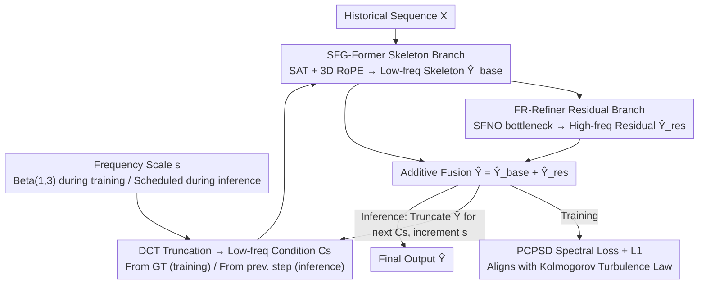

# Learning to Refine: Spectral-Decoupled Iterative Refinement Framework for Precipitation Nowcasting

**Conference**: ICML 2026  
**arXiv**: [2606.02661](https://arxiv.org/abs/2606.02661)  
**Code**: https://github.com/RuntimeWarning/SDIR  
**Area**: Scientific Computing / Weather Forecasting / Spatiotemporal Prediction  
**Keywords**: Precipitation Nowcasting, Spectral Decoupling, Iterative Refinement, Fourier Neural Operator, Power Spectral Density Loss

## TL;DR
SDIR reformulates radar precipitation nowcasting (0–2 hours) as a "frequency-decoupled iterative refinement" process. It employs SFG-Former to extract stable low-frequency weather skeletons and FR-Refiner (utilizing Fourier Neural Operators) to progressively synthesize high-frequency convective details across frequency bands. A PCPSD loss, aligned with the Kolmogorov turbulence power law, replaces pure MSE to prevent over-smoothing. SDIR significantly outperforms both regression-based and diffusion-based SOTAs on CIKM, Shanghai, and SEVIR benchmarks.

## Background & Motivation
**Background**: Precipitation nowcasting is critical for urban flood control, aviation, and disaster prevention. Early methods used optical flow for radar echo extrapolation, followed by spatiotemporal models like ConvLSTM, PredRNN, PhyDNet, Earthformer, and SimVP, which improved accuracy via supervised regression. Recently, GAN-based (DGMR, NowcastNet) and diffusion-based models (PreDiff, CasCast, DiffCast) have pursued visual realism of high-frequency details through generative modeling.

**Limitations of Prior Work**: Both approaches suffer from structural flaws:
- Regression models, driven by pixel-wise losses like MSE, "average out" spatial uncertainty. This leads to rapid power spectral decay at high frequencies, blurred convective cores, and suppressed peak intensities, violating the Kolmogorov power law of atmospheric turbulence.
- Diffusion models restore high frequencies by sampling from Gaussian noise. While visually sharp, the generated convective cells often appear at incorrect locations or with exaggerated intensities, a phenomenon termed "unanchored hallucinations"—visually plausible but physically groundless.

**Key Challenge**: Real-world precipitation evolution is inherently multi-scale and progressive—large-scale synoptic skeletons serve as boundary conditions upon which small-scale convection develops. Single-step or single-branch models fail to balance "global stability" and "local sharpness," resulting in either over-smoothing or hallucinations.

**Goal**: Construct a **deterministic** framework that decomposes forecasting into frequency bands, stabilizing the low-frequency skeleton first, and then synthesizing high-frequency details through iterative steps constrained by physical spectra, ensuring the entire power spectrum conforms to turbulence statistics.

**Key Insight**: Embed the concept of "progressive frequency revelation" into the model architecture. During training, DCT truncation provides low-frequency conditions $C_s$ of varying bandwidths, teaching the model to synthesize the next high-frequency layer given a low-frequency skeleton. During inference, this capability is combined into an iterative schedule from $s=0 \to s=W-1$, functioning as a deterministic, frequency-conditional "diffusion process" targeting specific spectral depths rather than random noise levels.

**Core Idea**: Use frequency bands instead of noise levels as iterative variables, combined with global operators in the Fourier domain (SFNO) and explicit turbulence constraints via PCPSD loss, to achieve results that are neither blurry nor hallucinated.

## Method
SDIR is an end-to-end dual-branch network: SFG-Former outputs the baseline skeleton $\hat Y_{base}$, and FR-Refiner outputs the high-frequency residual $\hat Y_{res}$, with the final prediction being $\hat Y=\hat Y_{base}+\hat Y_{res}$. Both branches are modulated by a frequency scale signal $s\in\{0,1,\dots,W-1\}$, sampled randomly during training and increased according to a schedule during inference.

### Overall Architecture
**Input**: Historical radar echo sequence $X\in\mathbb{R}^{B\times T_{in}\times C\times H\times W}$; during training, low-frequency conditions $C_s=\operatorname{IDCT}(\operatorname{Trunc}_{s\times s}(\operatorname{DCT}(Y)))$ derived from ground truth $Y$ via DCT truncation.  
**Output**: Precipitation field $\hat Y$ for future $T_{out}$ frames.  
**Mechanism**: (i) A frequency scale signal $s\sim\operatorname{Beta}(1,3)$ determines the spectral depth for the current training step; (ii) SFG-Former utilizes Scale-Adaptive Transformer (SAT) + 3D RoPE to fuse $X$ and $C_s$ for the low-frequency skeleton $\hat Y_{base}$; (iii) FR-Refiner is a U-Net style Fourier residual generator with SFNO blocks in the bottleneck, modulated by $s$ via Adaptive Normalization to output $\hat Y_{res}$; (iv) The system is optimized by reconstruction L1 loss and dynamically weighted PCPSD spectral loss; (v) Inference follows a schedule $\mathcal{S}=\{s_1=0,s_2,\dots,s_K\}$, using the DCT truncation of the previous prediction as $C_s$ for the next step.

### Key Designs

**1. Spectral-Decoupled Training Curriculum: Using $C_s$ and Beta(1,3) Sampling**

Precipitation evolution is multi-scale—large-scale weather fields act as boundaries for small-scale convection. SDIR embeds "progressive frequency revelation" into training: for each batch, it samples $\sigma\sim\operatorname{Beta}(1,3), s=\lfloor W\sigma\rfloor$, and applies 2D DCT to the ground truth, truncating coefficients outside the top-left $s\times s$ square to obtain the ideal low-pass condition $C_s$. When $s=0$, $C_s$ is zero (cold start); when $s=W-1$, $C_s \approx Y$ (final detail enhancement). The Beta(1,3) distribution biases towards lower $s$, forcing the model to master large-scale skeletons before addressing high frequencies. This is a deterministic, frequency-domain version of "progressive learning" in diffusion—partitioning by spatial frequency rather than noise levels, providing physical meaning and avoiding stochastic unanchored hallucinations.

**2. SFG-Former + 3D RoPE: Frequency-Adaptive Global Skeleton Branch**

The skeleton branch processes historical sequences and low-frequency conditions to output a stable base prediction $\hat Y_{base}$ for any $s$. After concatenating $X$ and $C_s$ and projecting patches to $z\in\mathbb{R}^{B\times L\times D}$, the Frequency Scale Embedder (FSE) in each SAT block maps $s$ to modulation triplets $(\gamma,\beta,\alpha)$. It applies affine modulation $z_{mod}=(1+\gamma)\odot\operatorname{LN}(z)+\beta$ and returns to the trunk via a gated residual $z_{out}=z+\alpha\odot\operatorname{Transformer}(z_{mod})$. Positional encoding uses 3D RoPE to maintain translation invariance across space and time. By injecting the target spectral depth as a condition into each layer, the branch provides "blurry but stable" predictions at low $s$ and sharper versions at high $s$ without competing with the refiner.

**3. FR-Refiner + SFNO: Deterministic High-Frequency Residual Synthesis Branch**

Since patch-based Transformers naturally lose high frequencies, the residual branch recovers these details. Taking $[X\,\|\,\hat Y_{base}]$ as input and modulated by $s$, it outputs high-frequency residuals $\hat Y_{res}$. It adopts a U-Net topology (using PixelUnshuffle/Shuffle for resolution transitions and residual skips for multi-scale fusion) with 8 SFNO blocks in the bottleneck. SFNO transforms features into the frequency domain, applies linear transformations to real/imaginary parts with SoftShrink (threshold 0.01) for sparsification, and transforms back to the spatial domain. This design, an extension of FourCastNet for nowcasting, captures cross-scale coupling within constant layers. The deterministic nature of this branch is key to avoiding unanchored hallucinations common in diffusion-based residuals.

**4. PCPSD Loss: Differentiable Spectral Supervision for Kolmogorov Law**

Regression models over-smooth because MSE gradients are dominated by low frequencies, leading the model to choose smooth solutions. PCPSD directly supervises the power spectrum: it uses a 24D Hann window to suppress edge artifacts, applies rFFT to obtain the 2D power spectrum, and performs radial bin averaging for the 1D isotropic spectrum $S(k)$. The loss compares spectra in the log domain:

$$\mathcal{L}_{pcpsd}=\frac{\sum_k\Omega(k,s)\big(\log S_{pred}(k)-\log S_{gt}(k)\big)^2}{\sum_k\Omega(k,s)},$$

Dynamic weights $\Omega(k,s)=(k+\epsilon)^\gamma\cdot\{0.2\text{ if }k\le k_s(s);\,1.0\text{ otherwise}\}$ (where $k_s(s)=s/W$) provide stronger supervision for high frequencies and weaker weights for stabilized low frequencies. This forces predictions to distribute energy according to the ground truth spectral distribution, aligning with the Kolmogorov turbulence power law.

### Loss & Training
The total loss is $\mathcal{L}=\mathcal{L}_{base}+\mathcal{L}_{res}+\phi(s)\mathcal{L}_{pcpsd}$, where the first two terms are L1 losses for the base and residual, and $\phi(s)=\eta(s/W)^2$ with $\eta=0.01$. The AdamW optimizer is used with an initial learning rate of $3\times 10^{-4}$ on 4×RTX 4090Ds. SFG-Former contains 8 SAT blocks, and FR-Refiner’s SFNO bottleneck contains 8 blocks.

## Key Experimental Results

### Main Results
Evaluated on CIKM, Shanghai, and SEVIR datasets against ConvLSTM, PredRNN, PhyDNet, SimVP, Earthformer, MIMO, DiffCast, and AlphaPre.

**Table 1 — CIKM Dataset (AVG for HSS / CSI / SSIM ↑, MAE ↓)**

| Model | HSS AVG | CSI AVG | SSIM | MAE |
|---|---|---|---|---|
| ConvLSTM | 0.3142 | 0.2615 | 0.4860 | 738.05 |
| Earthformer | 0.4159 | 0.3544 | 0.4903 | 674.99 |
| DiffCast | 0.4071 | 0.3477 | 0.4710 | 669.01 |
| AlphaPre | 0.3633 | 0.3092 | 0.4775 | 661.40 |
| **SDIR (Ours)** | **0.4724** | **0.4043** | **0.5574** | **600.37** |

**Table 2 — Shanghai and SEVIR Datasets (AVG, SEVIR in brackets)**

| Model | Shanghai HSS / CSI / SSIM / MAE | SEVIR HSS / CSI / SSIM / MAE |
|---|---|---|
| PhyDNet | 0.5203 / 0.3892 / 0.8133 / 1386.0 | 0.4172 / 0.3311 / 0.7063 / 2103.3 |
| Earthformer | 0.5015 / 0.3711 / 0.7643 / 1395.8 | 0.4066 / 0.3230 / 0.6706 / 2241.8 |
| **SDIR (Ours)** | **0.5882 / 0.4497 / 0.8548 / 1129.1** | **0.4401 / 0.3499 / 0.7544 / 1897.9** |

SDIR achieves a +13.6% gain in HSS AVG and +14.1% in CSI AVG over the strongest baseline on CIKM, consistently ranking best across all metrics and thresholds.

### Ablation Study
**Table 4 — Module Ablation (Shanghai)**: S-I = SFG-Former, S-II = FR-Refiner.

| Exp | S-I | S-II | PCPSD | HSS | CSI | SSIM | MAE |
|---|---|---|---|---|---|---|---|
| (a) | ✓ | | | 0.3529 | 0.2559 | 0.8478 | 1248.8 |
| (c) | ✓ | ✓ | | 0.5367 | 0.4057 | 0.8512 | 1138.3 |
| Ours | ✓ | ✓ | ✓ | **0.5882** | **0.4497** | **0.8548** | **1129.1** |

**Table 5–7 — Training & Inference Configuration (Shanghai)**

| Configuration | HSS | CSI | SSIM | MAE | Notes |
|---|---|---|---|---|---|
| Uniform Sampling $s$ | 0.2842 | 0.2097 | 0.8458 | 1284.1 | Fails without curriculum |
| Inference 1 step | 0.5584 | 0.4243 | 0.8522 | 1111.0 | Under-refined |
| Inference 8 steps | 0.5882 | 0.4497 | 0.8548 | 1129.1 | Optimal (Default) |
| Inference 32 steps | 0.5564 | 0.4164 | 0.8475 | 1352.6 | Over-refined (artifacts) |

### Key Findings
- PCPSD is the most critical component: removing it drops HSS from 0.5882 to 0.5367, confirming that spatial losses alone result in spectral collapse.
- Dual branches are complementary: SFG-Former alone lacks high frequencies (CSI 0.2559), while FR-Refiner alone lacks a stable skeleton (MAE 1586.1).
- Sampling distributions and inference steps have "sweet spots": Beta(1,3) is superior to other parameters, and 8 steps balance quality and efficiency.
- Advantage grows with lead time: Differences between SDIR and baselines like AlphaPre/PhyDNet widen at 60–120 minutes, proving SDIR's superior error accumulation control.

## Highlights & Insights
- By replacing noise levels with physical spatial frequencies, SDIR translates the "diffusion" paradigm into a deterministic, controllable process that avoids hallucinations.
- The PCPSD loss provides a stencil for tasks facing high-frequency collapse (super-resolution, fluid simulation) by comparing radial PSDs in the log domain with dynamic weighting.
- The SFNO bottleneck design allows for global receptive fields with low computational cost, successfully repurposing global forecasting concepts for high-resolution nowcasting.
- The framework offers an interpretable speed-quality curve: 1 step for stable skeletons, 8 steps for high-quality forecasts, and 32 steps potentially introducing over-refinement, allowing for flexible deployment.

## Limitations & Future Work
- The 8-step inference introduces ~4× latency compared to single-step models (0.30s vs 1.17s), which may still be slow for some real-time operations. Distillation remained unexplored.
- Frequency schedules and Beta parameters are manually tuned global hyperparameters; they do not adapt to specific regions or weather modes.
- The isotropic assumption in PCPSD may lose directional information in highly anisotropic events like frontal rainfall.
- Evaluation is limited to 2D fields; multi-modal data (satellite, NWP), 3D vertical profiles, and multi-variable coupling (wind, temperature) were not covered.

## Related Work & Insights
- **vs DiffCast (CVPR'24)**: DiffCast uses a deterministic backbone with diffusion residuals, still facing hallucinations. SDIR replaces this with a deterministic frequency-conditioned refiner and explicit PCPSD constraints.
- **vs Earthformer**: Earthformer’s attention is powerful for global structure but lacks specific handling for high-frequency collapse; SDIR incorporates its strengths in SFG-Former and complements them with spectral refinement.
- **vs NowcastNet**: NowcastNet uses physics-conditional GANs; SDIR achieves equivalent physical consistency and sharpness without the instability of adversarial training.

## Rating
- Novelty: ⭐⭐⭐⭐ The combination of spectral decoupling, Fourier refiner, and PCPSD is a precise solution for nowcasting pain points.
- Experimental Thoroughness: ⭐⭐⭐⭐ Comprehensive coverage across three datasets and eight SOTAs.
- Writing Quality: ⭐⭐⭐⭐ Clear physical motivation regarding turbulence energy cascades.
- Value: ⭐⭐⭐⭐ Offers a deterministic, physically consistent, and high-resolution route for mission-critical nowcasting.

<!-- RELATED:START -->

## Related Papers

- [\[ICML 2026\] Iterative Refinement Neural Operators are Learned Fixed-Point Solvers: A Principled Approach to Spectral Bias Mitigation](iterative_refinement_neural_operators_are_learned_fixed-point_solvers_a_principl.md)
- [\[ICLR 2026\] DRIFT-Net: A Spectral--Coupled Neural Operator for PDEs Learning](../../ICLR2026/physics/drift-net_a_spectral--coupled_neural_operator_for_pdes_learning.md)
- [\[ICLR 2026\] MoMa: A Simple Modular Learning Framework for Material Property Prediction](../../ICLR2026/physics/moma_a_simple_modular_learning_framework_for_material_property_prediction.md)
- [\[ICML 2026\] Topology-Preserving Neural Operator Learning via Hodge Decomposition](topology-preserving_neural_operator_learning_via_hodge_decomposition.md)
- [\[ICML 2026\] Hermite-NGP: Gradient-Augmented Hash Encoding for Learning PDEs](hermite-ngp_gradient-augmented_hash_encoding_for_learning_pdes.md)

<!-- RELATED:END -->
