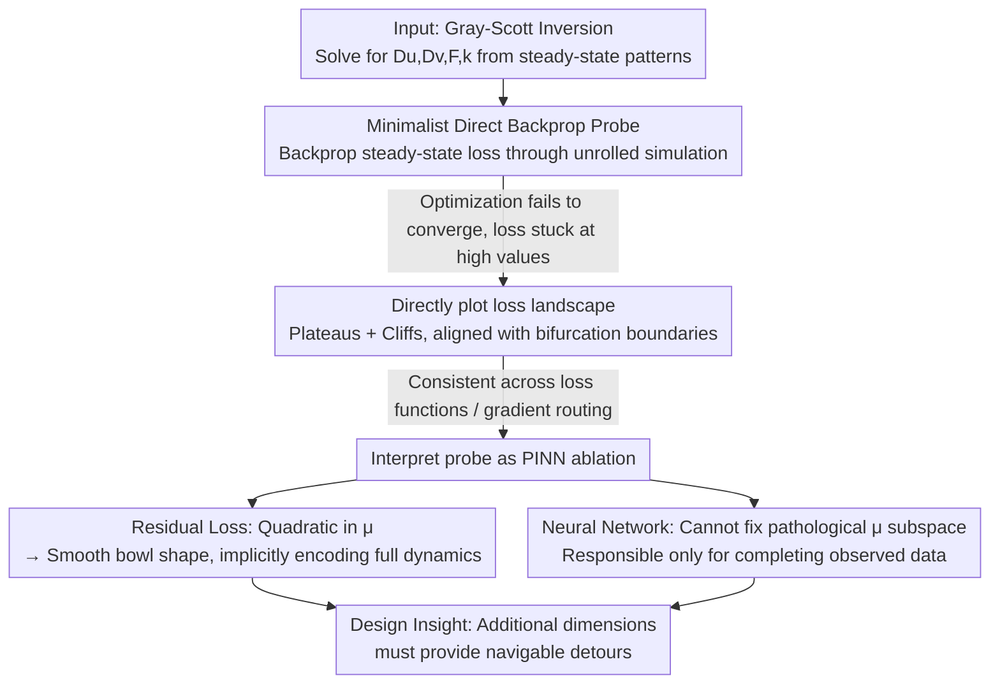

# Loss Landscape Diagnosis for Gradient-Based Gray-Scott System Inversion: Disentangling the Roles of PINN Components

**Conference**: ICML 2026  
**arXiv**: [2606.11258](https://arxiv.org/abs/2606.11258)  
**Code**: https://github.com/Yan-Yang-bot/bp_inversion  
**Area**: Physics (Scientific Machine Learning / PINN)  
**Keywords**: Physics-Informed Neural Networks, Reaction-Diffusion, Inverse Problems, Loss Landscape, Bifurcation, Gradient Optimization

## TL;DR
The authors employ a minimalist approach—directly backpropagating steady-state losses through unrolled Gray-Scott simulations to invert PDE parameters without any surrogate models or neural networks—finding that optimization fails completely. By directly visualizing the loss landscape, they locate the pathology (**plateaus and cliffs, with cliffs precisely aligned with bifurcation boundaries**). Reinterpreting this minimalist probe as an **ablation of PINNs**, the study for the first time distinguishes the roles of PINN components: the **residual loss** independently smoothens the landscape (by implicitly encoding full PDE dynamics), while the **neural network** fails to fix the pathological parameter subspace and is only responsible for completing observed data.

## Background & Motivation
**Background**: Inverting control parameters of dynamical systems from observations (inverse problems) is common in developmental biology and computational neuroscience. Reaction-diffusion systems are representative examples where parameters determine qualitatively distinct patterns like spots, stripes, and mazes. When using machine learning for such inversions, the mainstream approach bypasses "direct backpropagation" in favor of surrogate models or neural network enhancements like PINNs.

**Limitations of Prior Work**: Direct backpropagation (backprop) is the most fundamental and information-efficient optimization mechanism in machine learning, yet it is almost entirely avoided in physical system inversion. The "default assumption" is that the "parameter $\to$ solution" mapping of nonlinear reaction-diffusion is too irregular for direct gradients. However, **why exactly this direct route fails, the extent of its failure, and whether existing methods truly address the root cause** have never been systematically studied.

**Key Challenge**: The issue could stem from three levels: loss function design, gradient propagation methods, or the geometry of the parameter space itself. Without isolating these factors, it is impossible to determine whether the effectiveness of PINNs is due to the neural network or other components.

**Goal**: To use a **fully inspectable** testbed (Gray-Scott with four parameters $D_u, D_v, F, k$, searchable via grid) to thoroughly understand the behavior of direct gradient optimization and answer "which component of PINNs truly solves the problem."

**Key Insight**: The authors intentionally adopt a minimalist setup—backpropagating steady-state loss only through unrolled simulation steps without surrogates or neural networks. If this fails, the cause must be attributed to the geometry of the PDE parameter subspace itself, rather than being masked by other modules.

**Core Idea**: Treat "minimalist direct backprop" as a diagnostic probe and **view it as a complete ablation of PINNs**—removing the neural network and data loss, leaving only the parameter subspace—to deduce the true roles of PINN components.

## Method

### Overall Architecture
This is not a paper proposing a "new model" but rather a **diagnostic + disentanglement** analysis paper, following a three-step logic. Step one builds a minimalist probe: backpropagating through the entire time-unrolled Gray-Scott stepping algorithm to solve for four parameters from 512 steady-state target patterns of $128 \times 128$ (ground truth $D_u=0.16, D_v=0.08, F=0.035, k=0.065$). Step two, upon finding that optimization does not converge, **directly plots the loss landscape** to locate the geometric causes of failure and verifies its invariance across loss functions and gradient routing methods. Step three **reinterprets this probe as an ablation study of PINNs**, analyzing what the "residual loss" and "neural network" can and cannot do, finally providing insights for PINN design and a general heuristic.

### Key Designs

**1. Minimalist Direct Backprop Probe: Treating the PDE Structure as a Differentiable Simulator**

Addressing the pain point that "everyone avoids direct backprop by intuition but no one investigates it," the authors implement the Gray-Scott time-stepping algorithm as a differentiable computational graph ($\Delta t = \Delta x = \Delta y = 1$). They backpropagate the steady-state loss through all unrolled steps **without truncation**, optimizing only the four PDE parameters. To ensure numerical stability, three safeguards are added: adaptive learning rate scaling to prevent $\mathrm{NaN}/\mathrm{Inf}$ or out-of-bounds $v$; reparameterization using $\mathrm{softplus}$ / $\mathrm{sigmoid}$ to constrain $D_u, D_v, F, k$ to valid ranges; and ensuring diffusion coefficients satisfy the 2D CFL condition $D\Delta t(\tfrac{1}{\Delta x^2} + \tfrac{1}{\Delta y^2}) \le \tfrac{1}{2}$. The target and training shared the same initial condition generation mechanism, simplifying the task to "just find four parameters." The value of this design lies in stripping away all interference (surrogates, networks, missing data); **any failure must be blamed on the geometry of the parameter subspace**.

**2. Direct Visualization of Loss Landscape: Plateaus + Cliffs, Invariant Across Losses and Routing**

To identify the exact cause of failure, the authors **directly plot slices of the loss landscape**. During training, the loss remains stuck in a high band (245.0–270.0) without a downward trend, with occasional isolated drops followed by immediate returns. Low loss is also unreliable—two configurations with similar losses might show one matching the target pattern while the other fails completely. Plotting 2D slices across $k, F, D_u, D_v$, the landscape is dominated by **large plateaus (nearly zero gradient signals) and sharp cliffs**. Remarkably, the cliff positions align closely with the **bifurcation boundaries** of Gray-Scott (Saddle-node/Hopf), separating pattern-forming regions from uniform ones. Testing three different losses—unwindowed 2D power spectrum, windowed 2D power spectrum (balancing contributions from $16 \times 16$ sub-blocks), and VGG-19 Gram matrix style loss—yields consistent results: plateaus and cliffs persist. This confirms that **the pathology lies in the geometry, not the loss function**. The authors further infer that any gradient routing (unrolled backprop, implicit differentiation, or forward surrogates) would inherit this pathological landscape.

**3. Interpreting the Probe as PINN Ablation: Disentangling Residual Loss and Neural Networks**

This is the core contribution. Since various "landscape-fixing" remedies strive to transform the same pathological surface, a more fundamental question arises: **Do existing PINNs already bypass this pathology?** Viewing the minimalist probe as a "PINN without the neural network and data loss," the authors analyze both components.

For **Residual Loss**: In PINNs, where PDE parameters are also learnable, the total loss decomposes into $L(\theta, \mu) = L_{\text{data}}(\theta) + L_{\text{res}}(\theta, \mu)$, where $\theta$ are network parameters and $\mu$ are PDE parameters. With $\theta$ fixed, the network outputs $u, v$ (and $\Delta u, \Delta v, uv^2$) are fixed. The elliptic Gray-Scott residual is **linear in $\mu$**, making the residual loss a **quadratic function** of $\mu$, which provides a smooth bowl-shaped landscape (confirmed in Fig. 6). The key insight: the residual loss does not compare "final patterns evolved from a single initial condition" but implicitly compares what the PDE should produce—it **encodes the complete evolution dynamics across all initial conditions simultaneously**, thereby capturing much richer information than a single steady-state trajectory.

For the **Neural Network**: The authors ask whether a network $\theta$ and data loss can fix a pathological $\mu$ subspace. The answer is no. The total gradient decomposes as $\nabla L = (\nabla_\theta L_{\text{data}} + \nabla_\theta \tilde L_{\text{res}}, \nabla_{\tilde \mu} \tilde L_{\text{res}})$. On one hand, moving along $\theta$ at a specific $\mu$ does not translate to a neighboring $\mu$ (each $\mu$ defines a different target pattern and thus a different $\theta$-landscape; discontinuities in $\mu$ cause abrupt changes in the $\theta$-landscape). On the other hand, regardless of how $\theta$ moves, the poor geometry of $\tilde L_{\text{res}}(\theta, \cdot)$ over $\mu$ is inherited, leaving $\nabla_{\tilde \mu} \tilde L_{\text{res}}$ uninformative. The conclusion: **while PINNs lift the search space to higher dimensions, they do not provide navigable detours around pathological structures**; the neural network is only responsible for **completing observed data** and cannot heal the parameter subspace. This leads to a heuristic beyond PDEs: when a parameter subspace landscape is pathological, new auxiliary dimensions must provide "navigable detours" to bypass the pathology, otherwise, lifting dimensions merely adds redundant degrees of freedom.

## Key Experimental Results

### Landscape Comparison of Three Loss Functions

| Loss Function | Value Range | Uniform Solution Region | Pattern Region | Navigable |
| :--- | :--- | :--- | :--- | :--- |
| Unwindowed 2D Power Spectrum | $0 \sim 200+$ | Dominated by high plateau | Low-level plateau | No (Plateau + Cliff) |
| Windowed 2D Power Spectrum | Similar magnitude | High plateau | Slightly higher than target | No (Better separation but no gradient) |
| VGG-19 Gram Loss | $0 \sim 100$ | Mid-level plateau | Fluctuation present | No (Fluctuations intro. new cliffs) |

The geometries are highly similar: the uniform and pattern regions are always separated by **sharp cliffs** with nearly zero gradients on either side, proving the pathology is independent of the specific loss.

### Training Behavior and Component Roles

| Phenomenon / Component | Observation | Conclusion |
| :--- | :--- | :--- |
| Training Loss | Stuck at 245–270 for a long time | Loss provides no convergence signal |
| Low loss config #3 vs #7 | Similar losses, one matches, one doesn't | Low loss $\neq$ correct fit |
| Residual Loss (fixed $\theta$) | Quadratic in $\mu$ $\to$ Smooth bowl | Residual loss alone avoids the pathology |
| Neural Network $\theta$ subspace | Pathological $\mu$ subspace cannot be fixed | Network only completes data, doesn't fix landscape |

### Key Findings
- **Cliffs Align with Bifurcations**: The locations of loss cliffs coincide remarkably with the saddle-node/Hopf bifurcation boundaries of Gray-Scott. Optimizers get trapped in uniform (or quasi-uniform limit cycle) regions and are repelled by steep, narrow cliffs when attempting to enter the pattern region.
- **Residual Loss "Fortuitously" Solves the Issue**: It transforms the landscape into a smooth bowl without requiring neural network contributions because it implicitly compares the full set of dynamics across initial conditions rather than a single steady-state trajectory.
- **Dimensionality Lifting $\neq$ Problem Solving**: Lifting the search space via neural networks is unhelpful unless it provides a detour around the pathology— a heuristic applicable to pathological parameter inversion beyond PDEs.

## Highlights & Insights
- **Basing methodology on "minimalist failure as a probe" is elegant**: By stripping away all modules, the cause of failure is exposed, and this failure is reinterpreted as a PINN ablation to identify the functioning component.
- **First clear disentanglement of PINN components**: Identifying that residual loss handles "smoothing the $\mu$ landscape" (via full dynamics) while the network handles "data completion" provides direct guidance for designing streamlined PINNs.
- **Transferable Heuristic**: The principle that "additional dimensions must provide navigable detours" in pathological subspaces applies to any scenario aiming to bypass poor landscapes via dimensionality lifting.

## Limitations & Future Work
- **Conclusions Limited to Steady-State Single-Frame Settings**: Whether the residual loss remains well-behaved in $\theta$ subspaces, particularly in full spatio-temporal problems (where evidence from Sitzmann and Krishnapriyan conflicts), remains for future work.
- **Matching Configuration #3 was serendipitous**: It was found by manually interrupting a brief loss dip; whether it would climb back to the high band was not observed, though expected.
- **Remedies and Redesign only touched upon**: Directions like better losses, time-augmented surrogates, and intermediate supervision, along with network redesign for "data completion," are mentioned as future work without empirical validation here.

## Related Work & Insights
- **vs. Surrogate Models (Schnörr & Schnörr)**: They learn inverse mappings (pattern $\to$ parameters) to avoid pathological landscapes but only provide coarse estimates and suffer from conflicting samples during training; this paper diagnoses the original loss space directly.
- **vs. Visual Embedding Losses / Evolutionary Search (Najarro et al.)**: They use visual embedding distances to handle identical parameters with different noise, similar to the VGG loss here. While discriminative at discrete points, it does not guarantee a navigable continuous landscape.
- **vs. Standard PINN (Raissi et al.) / PINN Failure Modes (Krishnapriyan et al.)**: This paper decomposes PINNs into residual loss and network, identifying the former as the key to solving parameter landscape pathology, while using Krishnapriyan's work to support the "network only completes data" judgment.

## Rating
- Novelty: ⭐⭐⭐⭐⭐ The "minimalist failure as probe + PINN ablation" perspective is novel and explicitly disentangles PINN roles for the first time.
- Experimental Thoroughness: ⭐⭐⭐⭐ Visualizations of multiple losses, slices, and residual bowls are present, though full spatio-temporal settings and redesigns are left for the future.
- Writing Quality: ⭐⭐⭐⭐⭐ Logical progression from diagnosis to geometry to ablation to heuristics; arguments are clear and self-consistent.
- Value: ⭐⭐⭐⭐ Provides principled guidance for PINN design and a transferable dimensionality-lifting heuristic.

<!-- RELATED:START -->

## Related Papers

- [\[ICLR 2026\] Stretching Beyond the Obvious: A Gradient-Free Framework to Unveil the Hidden Landscape of Visual Invariance](../../ICLR2026/physics/stretching_beyond_the_obvious_a_gradient-free_framework_to_unveil_the_hidden_lan.md)
- [\[ICML 2026\] Hermite-NGP: Gradient-Augmented Hash Encoding for Learning PDEs](hermite-ngp_gradient-augmented_hash_encoding_for_learning_pdes.md)
- [\[ICLR 2026\] MOSIV: Multi-Object System Identification from Videos](../../ICLR2026/physics/mosiv_multi-object_system_identification_from_videos.md)
- [\[ICML 2026\] Quiver: Quantum-Informed Views for Enhanced Representations in Large ML Models](quiver_quantum-informed_views_for_enhanced_representations_in_large_ml_models.md)
- [\[ICML 2026\] From Geometry to Dynamics: Learning Overdamped Langevin Dynamics from Sparse Observations with Geometric Constraints](from_geometry_to_dynamics_learning_overdamped_langevin_dynamics_from_sparse_obse.md)

<!-- RELATED:END -->
