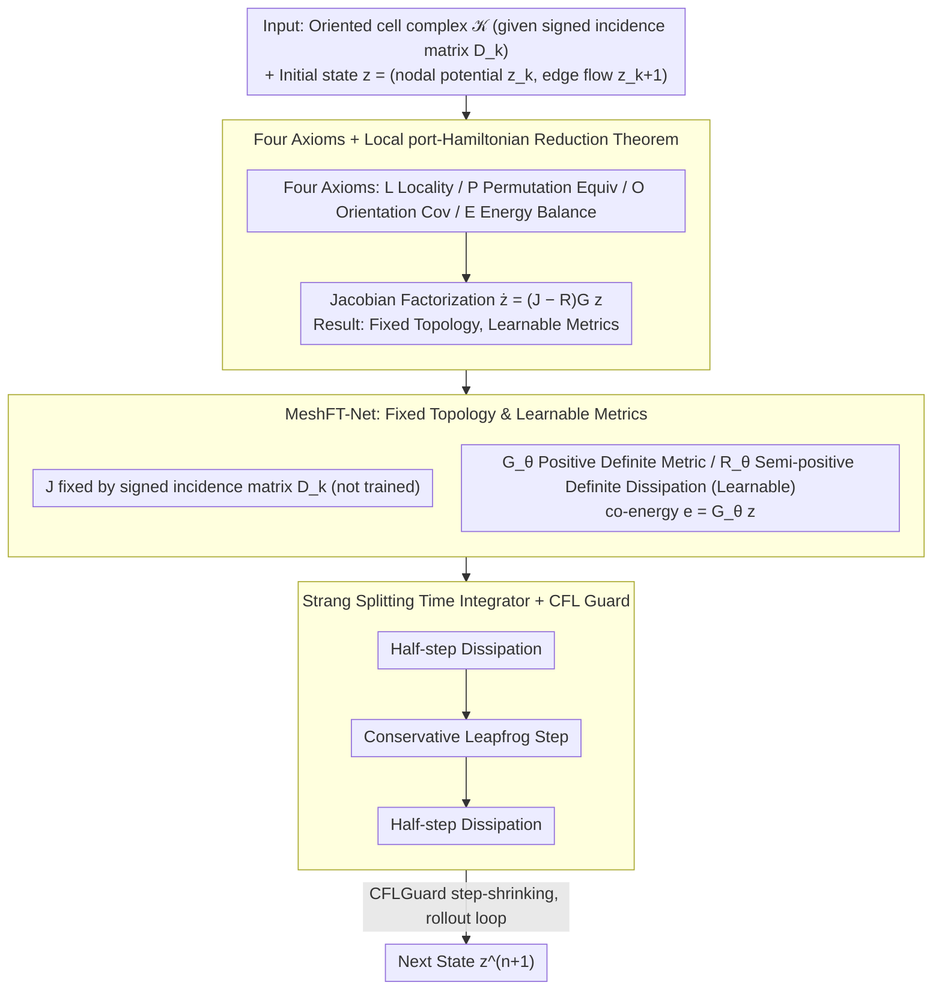

# Mesh Field Theory: Port–Hamiltonian Formulation of Mesh-Based Physics

**Conference**: ICML 2026  
**arXiv**: [2605.00394](https://arxiv.org/abs/2605.00394)  
**Code**: None  
**Area**: 3D Physics Simulation / Structure-Preserving Neural Networks / Mesh Learning  
**Keywords**: Mesh Physics, port-Hamiltonian, Topology–Metric Separation, Energy Conservation, MeshGraphNet

## TL;DR
Starting from four physical principles—"Locality + Permutation Equivariance + Orientation Covariance + Energy Conservation/Dissipation Inequality"—this work proves that any mesh physics dynamics satisfying these axioms can be locally reduced to a port-Hamiltonian form at the Jacobian level. In this formulation, the conservative interconnection structure $J$ is strictly fixed by the mesh topology (signed incidence matrix $D_k$), while metric and dissipation properties enter through learnable components $G$ and $R$. The resulting MeshFT-Net achieves near-zero energy drift, correct dispersion, and momentum over long rollouts, significantly outperforming MGN and HNN.

## Background & Motivation

**Background**: The development of mesh physics learning (fluids, elastodynamics, acoustics) using GNNs or message passing (e.g., MeshGraphNets, SPH-Net, FNO) is progressing rapidly. Another parallel direction involves explicit structure-preserving networks (HNN, LNN, port-Hamiltonian NN, GENERIC) that hard-code energy or symplectic structures into the architecture.

**Limitations of Prior Work**: Pure MGN-based methods suffer from energy drift and the appearance of non-physical modes during long-duration rollouts. Conversely, HNN and global port-Hamiltonian NNs require a manually predefined global Hamiltonian or template, making them less robust to model misspecification. Neither approach clearly identifies which degrees of freedom in mesh physics are non-physical and should be eliminated by the structure itself.

**Key Challenge**: In exterior differential geometry, the exterior derivative $d$ is topological (metric-independent), whereas geometric and material properties enter only through metric operators such as the Hodge $\star$. Unfortunately, existing learned simulators conflate these two, allowing metric learning to pollute topological structures, which in turn causes topological errors to amplify metric errors.

**Goal**: (1) Provide a clean set of physical principles; (2) Formally prove that these principles force the dynamics into a port-Hamiltonian form at the Jacobian level; (3) Design a network that fixes the topology and learns only the metrics, then validate its long-term stability, dispersion, momentum, and OOD generalization.

**Key Insight**: MeshGraphNet is viewed as a superset that already satisfies Locality (L) and Permutation Equivariance (P) but lacks Orientation Covariance (O) and Energy Balance (E). By enforcing O and E, redundant non-physical degrees of freedom are structurally eliminated, leaving behind exactly the topological skeleton of Discrete Exterior Calculus (DEC) combined with local metric operators.

**Core Idea**: "Physical Principles $\Rightarrow$ Jacobian Factorization $\Rightarrow$ Fixed Topology/Learnable Metrics." The topology is fixed by $D_k$ (signed incidence matrix), while only the positive-definite metric $G_\theta$ and semi-positive-definite dissipation $R_\theta$ are learnable.

## Method

### Overall Architecture
The input consists of a fixed oriented cell complex $\mathcal{K}$ and the initial state $z^0 = (z_k^0, z_{k+1}^0)$ (cochain degrees of freedom, e.g., nodal potentials + edge flows). The output is the state at the next time step $z^{n+1}$. The pipeline functions as follows: (1) Use a reduction theorem to constrain the dynamics to a port-Hamiltonian form $\dot z = (J - R(z)) G(z) z$; (2) Fix $J = \begin{pmatrix} 0 & -D_k^\top \\ D_k & 0 \end{pmatrix}$ entirely based on the mesh incidence matrix (no training); (3) Use a Strang splitting integrator to alternate between "half-step dissipation + conservative step + half-step dissipation," where all operations are $O(N)$ sparse matvecs.

The following diagram illustrates this pipeline:

### Key Designs

**1. Axioms & Local port-Hamiltonian Reduction Theorem: Determining "What is Fixed" vs "What is Learned"**

Unlike methods that directly posit a port-Hamiltonian template, this work derives the structure from first principles without assuming a global Hamiltonian. The four axioms are (L) Locality, (P) Permutation Equivariance, (O) Orientation Covariance (reversing a cell orientation only flips oriented variables' signs while scalars like $H$ and $e^\top\dot z$ remain invariant), and (E) Energy Balance (dynamics split into a conservative part $F_\text{con}$ where $e^\top F_\text{con}=0$ and a dissipative part $F_\text{diss}$ where $e^\top F_\text{diss}\le0$). It is proven that any $F$ satisfying these axioms can be written at the Jacobian level as:

$$\frac{\partial F}{\partial z}=(J(z)-R(z))G(z),$$

where the conservative Jacobian is skew-symmetric, the dissipative part is negative semi-definite, and the conservative interconnection off-diagonal blocks must take the signed-incidence structure $J_{k,k+1}=-D_k^\top C_k(z)$ and $J_{k+1,k}=C_k(z)D_k$. This establishes the "division of labor between topology and metrics" as a structural theorem rather than an empirical heuristic.

**2. MeshFT-Net: Fixed Topology, Learnable Metrics**

The theorem dictates that topology is given by the mesh and should not be learned. Thus, the architecture hard-codes the conservative structure $J=\begin{pmatrix}0&-D_k^\top\\D_k&0\end{pmatrix}$. Learnable weights are reserved for the positive-definite metric $G_\theta$ and semi-positive-definite dissipation $R_\theta$. Energy is defined as a quadratic form $H_\theta(z)=\tfrac12 z^\top G_\theta z$ with co-energy $e=G_\theta z$. $G_\theta$ is implemented as a softplus-diagonal or small Cholesky block, conditioned on local geometric/material features via a permutation-equivariant and orientation-even MLP. $R_\theta(z)$ takes a Rayleigh form $z\mapsto\gamma(\cdot)G_\theta^{-1}z$ to ensure PSD. By moving the topology from the training set to the mesh itself, topological stability is maintained even in OOD scenarios.

**3. Strang Splitting Integrator + CFL Guard: Symplecticity and Precise Dissipation**

Standard Euler integration fails to conserve energy exactly. The algorithm employs a Strang-splitting KDK pattern: a half-step of dissipation $\exp(-\tfrac{\Delta t}{2}RG)z$, followed by a symmetric leapfrog for the conservative part, and a final half-step of dissipation. `CFLGuard(Δt)` shrinks the step size based on the maximum local eigenvalue to prevent instability. This splitting ensures $\dot H=-e^\top R(z)e\le0$ is analytically guaranteed, rather than empirically fitted.

### Loss & Training
Supervision is performed on one-step predictions: $\sum_k \text{Loss}(\hat z_k^{n+1}, z_k^{n+1})$. No PDE residual terms are used; the inductive bias stems entirely from the fixed $J$ and the SPD/PSD structures. The model can stack multiple steps with supervision on the final output to adapt to rollout tasks.

## Key Experimental Results

### Main Results
MeshFT-Net was compared against MGN, MGN-HP, HNN, PI-MGN, FNO, and GraphCON across analytical plane waves (regular and Delaunay meshes), Rayleigh damped oscillations, acoustic scattering from "The Well," and OOD frequency/wave-speed/resolution settings.

| Task | Model | One-step MSE | TSMSE (rollout) | Energy Drift |
|------|------|--------------|-----------------|----------|
| Plane Wave (Regular) | MGN | $1.6{\times}10^{-7}$ | $1.3{\times}10^{-1}$ | $25.9$ |
| Plane Wave | HNN | $3.5{\times}10^{-8}$ | $3.0{\times}10^{-3}$ | $1.0{\times}10^{-2}$ |
| Plane Wave | **Ours** | $\mathbf{1.3{\times}10^{-9}}$ | $\mathbf{9.6{\times}10^{-5}}$ | $\mathbf{1.3{\times}10^{-4}}$ |
| Rayleigh Damping | MGN | $5.2{\times}10^{-8}$ | $1.7{\times}10^{-1}$ | NEE $2.2$ |
| Rayleigh Damping | **Ours** | $1.2{\times}10^{-7}$ | $\mathbf{2.1{\times}10^{-2}}$ | NEE $\mathbf{2.1{\times}10^{-2}}$ |

### Ablation Study

| Configuration | TSMSE | Energy Drift |
|------|-------|----------|
| Fixed $J$ + Diagonal $G$ | $4.52{\times}10^{-5}$ | $0.115$ |
| Fixed $J$ + Full $G$ | $3.28{\times}10^{-5}$ | $0.028$ |
| $z$-dependent $J$ + Diagonal $G$ | $\mathbf{6.77{\times}10^{-6}}$ | $0.025$ |
| $z$-dependent $J$ + Full $G$ | $6.17{\times}10^{-6}$ | $0.030$ |

Physical consistency diagnostics show that MeshFT-Net ranks first in wave speed error, gauge relations, PDE residuals, energy equipartition, and momentum conservation. Momentum error was as low as $4.9{\times}10^{-8}$ (compared to $0.39$ for MGN).

### Key Findings
- One-step MSE does not correlate strongly with long-range rollout performance: MGN achieved the lowest one-step MSE in some damping tasks but its rollout TSMSE was 10x higher than MeshFT-Net, indicating that short-term accuracy does not imply long-term physical fidelity.
- Momentum conservation is not explicitly constrained but is naturally inherited because orientation covariance (O) enforces the action-reaction Relationship.
- Under OOD shifts (resolution or wave-speed), MGN/FNO/PI-MGN frequently diverge, whereas MeshFT-Net maintains energy drifts below $\mathcal{O}(10^{-1})$, proving the generalization power of fixed topological biases.
- Nonlinear shallow-water experiments show that when coefficients are state-dependent, making $J$ state-dependent improves performance, though a fixed topology with a full $G$ can partially compensate.

## Highlights & Insights
- The "Theorem-driven architecture design" is the primary methodological contribution: proving that the solution space is structurally restricted before imposing it as a hard architectural constraint.
- The "Topology–Metric Separation" is conceptually deep yet practical: topology ($D_k$) belongs to the mesh and is never learned, while metrics ($G, R$) belong to the physics and are learned. This injects a layer of physical non-generalizability into the GNN.
- Interpretation of MGN: MGN is not "wrong" but rather provides a solution space that is too broad; adding (O) and (E) trims the state space to a physically valid subset.

## Limitations & Future Work
- The main experiments utilized state-independent $G_\theta$; strongly nonlinear PDEs (e.g., Navier-Stokes, plasticity) require nonlinear constitutive laws $G_\theta(z)$, which were only explored in supplementary materials.
- Axioms (O) and (E) are sufficient conditions but do not guarantee correct behavior under complex source terms, boundary conditions, or multi-physics coupling.
- The framework depends on the incidence structure $D_k$ of the cell complex, making it less direct to adapt to unstructured or time-varying topologies (e.g., fracturing materials).

## Related Work & Insights
- **vs MGN**: MGN satisfies only (L) + (P); this work adds (O) + (E), eliminating non-physical DoFs and improving stability by orders of magnitude.
- **vs HNN / port-Hamiltonian NN**: Those methods learn purely on a global Hamiltonian template; this work uses local Jacobian factorization, making it more robust to global template errors.
- **vs DEC / Data-driven Exterior Calculus**: Both share the topology–metric separation idea, but this work derives it from physical axioms rather than differential geometry templates.
- **vs PI-MGN / FNO**: These are data-driven or weak-physics; this work is structure-driven and does not require knowing the explicit PDE form.

## Rating
- Novelty: ⭐⭐⭐⭐ Rigorously maps topology–metric separation to GNN principles.
- Experimental Thoroughness: ⭐⭐⭐⭐ Covers analytical data, physical diagnostics, OOD, and nonlinear ablations.
- Writing Quality: ⭐⭐⭐⭐ Clear theorems and reproducible algorithms.
- Value: ⭐⭐⭐⭐ Provides a theorem-driven design paradigm for the learned simulator community.

<!-- RELATED:START -->

## Related Papers

- [\[ICML 2026\] Understanding Catastrophic Forgetting In LoRA via Mean-Field Attention Dynamics](understanding_catastrophic_forgetting_in_lora_via_mean-field_attention_dynamics.md)
- [\[NeurIPS 2025\] High-order Equivariant Flow Matching for Density Functional Theory Hamiltonian Prediction](../../NeurIPS2025/physics/high-order_equivariant_flow_matching_for_density_functional_theory_hamiltonian_p.md)
- [\[NeurIPS 2025\] Hamiltonian Neural PDE Solvers through Functional Approximation](../../NeurIPS2025/physics/hamiltonian_neural_pde_solvers_through_functional_approximation.md)
- [\[CVPR 2026\] PhysSkin: Real-Time and Generalizable Physics-Based Skin Simulation](../../CVPR2026/physics/physskin_real-time_and_generalizable_physics-based_animation_via_self-supervised.md)
- [\[CVPR 2026\] AeroAgent: A Vision-Physics-Decision Framework for Aerodynamic Vehicle Design](../../CVPR2026/physics/aeroagent_a_vision-physics-decision_framework_for_aerodynamic_vehicle_design.md)

<!-- RELATED:END -->
