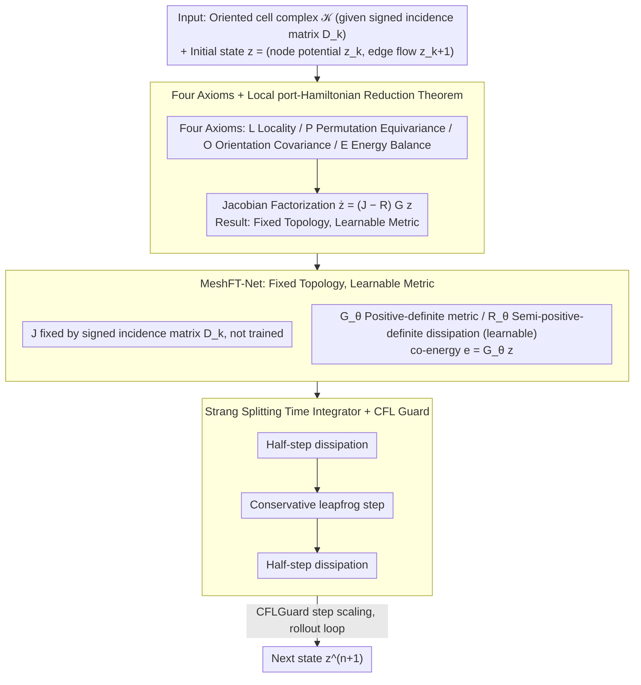

# Mesh Field Theory: Port–Hamiltonian Formulation of Mesh-Based Physics

**Conference**: ICML 2026  
**arXiv**: [2605.00394](https://arxiv.org/abs/2605.00394)  
**Code**: None  
**Area**: 3D Physical Simulation / Structure-Preserving Neural Networks / Mesh Learning  
**Keywords**: Mesh Physics, port-Hamiltonian, Topology–Metric Separation, Energy Conservation, MeshGraphNet

## TL;DR
Starting from four physical principles—"Locality + Permutation Equivariance + Orientation Covariance + Energy Conservation/Dissipation Inequality"—it is proven that any mesh physics dynamics satisfying these axioms can be locally reduced to a port-Hamiltonian form at the Jacobian level. In this formulation, the conservative interconnection structure $J$ is fixed by the mesh topology (signed incidence matrix $D_k$), while metric and dissipation enter through learnable $G$ and $R$. The resulting MeshFT-Net achieves near-zero energy drift on long rollouts, preserves correct dispersion and momentum, and significantly outperforms MGN and HNN.

## Background & Motivation

**Background**: The use of GNN/message passing for learning mesh physics (fluids, elastic solids, acoustics) is evolving rapidly (e.g., MeshGraphNets, SPH-Net, FNO). Another direction involves explicit structure-preserving networks (HNN, LNN, port-Hamiltonian NN, GENERIC) that hard-code energy or symplectic structures into the architecture.

**Limitations of Prior Work**: Pure MGN-style methods suffer from energy drift and non-physical modes during long rollouts. HNN or global port-Hamiltonian NNs require manually selecting a global Hamiltonian or template, showing poor robustness when model settings are incorrect. Neither approach clearly identifies which degrees of freedom in mesh physics are non-physical and should be structurally eliminated.

**Key Challenge**: In exterior differential geometry, the exterior derivative $d$ is topological (independent of the metric), while geometric and material properties enter only through metric operators like the Hodge $\star$. Unfortunately, existing learned simulators blend the two, allowing metric learning to pollute the topological structure, which in turn causes topological errors to amplify metric inaccuracies.

**Goal**: (1) Propose a clean set of physical principles; (2) Formally prove these principles force dynamics into a port-Hamiltonian form at the Jacobian level; (3) Design a network that fixes topology while learning only the metric, validating its long-term stability, dispersion, momentum, and OOD generalization.

**Key Insight**: View MeshGraphNet as a superset that already satisfies Locality (L) and Permutation Equivariance (P) but lacks Orientation Covariance (O) and Energy Balance (E). By imposing O and E, redundant non-physical degrees of freedom are structurally eliminated, leaving exactly the topological skeleton of classical Discrete Exterior Calculus (DEC) combined with local metric operators.

**Core Idea**: "Physical Principles $\Rightarrow$ Jacobian Factorization $\Rightarrow$ Fixed Topology, Learnable Metric"—topology is fixed by $D_k$ (signed incidence matrix), while only the positive-definite metric $G_\theta$ and semi-positive-definite dissipation $R_\theta$ are learnable.

## Method

### Overall Architecture
The input is a fixed directed cell complex $\mathcal{K}$ and initial states $z^0 = (z_k^0, z_{k+1}^0)$ (cochain degrees of freedom, e.g., node potentials + edge flows). The output is the state at the next time step $z^{n+1}$. The pipeline consists of: (1) using the reduction theorem to restrict dynamics to a port-Hamiltonian form $\dot z = (J - R(z)) G(z) z$; (2) fixing $J = \begin{pmatrix} 0 & -D_k^\top \\ D_k & 0 \end{pmatrix}$ by the mesh incidence matrix (non-trainable); (3) using a Strang splitting integrator to alternate between "half-step dissipation + conservation step + half-step dissipation," where all operations are sparse matvecs with $O(N)$ complexity.

The following diagram illustrates the workflow from theorem determination to architectural implementation and integration:

### Key Designs

**1. Four Axioms + Local port-Hamiltonian Reduction Theorem: Determining "what to fix vs. what to learn"**

Unlike "directly positing a port-Hamiltonian template," this work derives the structure from axioms rather than pre-assuming a global Hamiltonian. The four axioms are (L) Locality, (P) Permutation Equivariance, (O) Orientation Covariance (reversing cell orientation only flips the sign of oriented variables while keeping scalar $H$ and $e^\top\dot z$ invariant), and (E) Energy Balance (dynamics split into a conservative part $F_\text{con}$ where $e^\top F_\text{con}=0$ and a dissipative part $F_\text{diss}$ where $e^\top F_\text{diss}\le0$). It is proven that any $F$ satisfying these axioms can be written at the Jacobian level as:

$$\frac{\partial F}{\partial z}=(J(z)-R(z))G(z),$$

where the Jacobian of the conservative part must be skew-symmetric and the dissipative part must be negative semi-definite. Furthermore, the off-diagonal blocks of the conservative interconnection must take the signed-incidence structure $J_{k,k+1}=-D_k^\top C_k(z)$ and $J_{k+1,k}=C_k(z)D_k$. This formalizes the division of labor between topology and metric as a structural theorem rather than engineering heuristic.

**2. MeshFT-Net: Fixed Topology, Learnable Metric**

The theorem dictates that topology is given by the mesh and should not be learned. Consequently, the architecture hard-codes the conservative interconnection $J=\begin{pmatrix}0&-D_k^\top\\D_k&0\end{pmatrix}$, leaving learnable weights only for the positive-definite metric $G_\theta$ and semi-positive-definite dissipation $R_\theta$. Energy is defined as a quadratic form $H_\theta(z)=\tfrac12 z^\top G_\theta z$ with co-energy $e=G_\theta z$. $G_\theta$ is implemented using diagonal softplus or small Cholesky blocks, conditioned on local geometric/material features via permutation-equivariant and orientation-even MLPs. $R_\theta(z)$ takes the Rayleigh form $z\mapsto\gamma(\cdot)G_\theta^{-1}z$ to ensure PSD. This shifts topology from the training set to the mesh itself, resulting in stability under OOD frequencies, wave speeds, and resolutions.

**3. Strang Splitting Time Integrator + CFL Guard: Symplectic Preservation and Exact Dissipation**

Standard Euler integration fails to conserve energy exactly. The algorithm uses a KDK Strang splitting: a half-step of dissipation $\exp(-\tfrac{\Delta t}{2}RG)z$, followed by a symmetric leapfrog for the conservative part ($z_k\leftarrow z_k-\tfrac{\Delta t}{2}D_k^\top G_{k+1}z_{k+1}$ $\rightarrow$ $z_{k+1}\leftarrow z_{k+1}+\Delta t D_k G_k z_k^\text{half}$ $\rightarrow$ another half-step), and finally another half-step of dissipation. A `CFLGuard(Δt)` scales the step size based on the maximum local eigenvalue to prevent explosion. Splitting ensures that conservative and dissipative flows do not interfere, which, combined with the skew-symmetric $J$, provides an analytically provable $\dot H=-e^\top R(z)e\le0$.

### Loss & Training
Supervised one-step prediction is used: $\sum_k \text{Loss}(\hat z_k^{n+1}, z_k^{n+1})$, without PDE residual terms. The inductive bias originates entirely from the fixed $J$ and the SPD/PSD structure. Multiple steps can be stacked with supervision applied only to the final output to adapt to rollout tasks.

## Key Experimental Results

### Main Results
Comparisons were conducted against MGN, MGN-HP, HNN, PI-MGN, FNO, and GraphCON on analytical plane waves (regular and Delaunay meshes), Rayleigh damped oscillations, acoustic scattering from The Well, and OOD settings.

| Task | Model | One-step MSE | TSMSE (rollout) | Energy Drift |
|------|------|--------------|-----------------|----------|
| Analytical Wave (Regular) | MGN | $1.6{\times}10^{-7}$ | $1.3{\times}10^{-1}$ | $25.9$ |
| Analytical Wave | HNN | $3.5{\times}10^{-8}$ | $3.0{\times}10^{-3}$ | $1.0{\times}10^{-2}$ |
| Analytical Wave | **Ours** | $\mathbf{1.3{\times}10^{-9}}$ | $\mathbf{9.6{\times}10^{-5}}$ | $\mathbf{1.3{\times}10^{-4}}$ |
| Rayleigh Damping | MGN | $5.2{\times}10^{-8}$ | $1.7{\times}10^{-1}$ | NEE $2.2$ |
| Rayleigh Damping | **Ours** | $1.2{\times}10^{-7}$ | $\mathbf{2.1{\times}10^{-2}}$ | NEE $\mathbf{2.1{\times}10^{-2}}$ |

### Ablation Study

| Configuration | TSMSE | Energy Drift |
|------|-------|----------|
| Fixed $J$ + Diagonal $G$ | $4.52{\times}10^{-5}$ | $0.115$ |
| Fixed $J$ + Full $G$ | $3.28{\times}10^{-5}$ | $0.028$ |
| $z$-dependent $J$ + Diagonal $G$ | $\mathbf{6.77{\times}10^{-6}}$ | $0.025$ |
| $z$-dependent $J$ + Full $G$ | $6.17{\times}10^{-6}$ | $0.030$ |

Physical consistency diagnostics show MeshFT-Net ranks first across wave speed error, gauge relations, PDE residuals, energy equipartition, and momentum conservation, with momentum error as low as $4.9{\times}10^{-8}$ (compared to $0.39$ for MGN).

### Key Findings
- One-step MSE does not strongly correlate with long-term rollout performance: MGN achieved the lowest one-step MSE in damping tasks but its TSMSE was nearly 10x higher than MeshFT-Net, suggesting short-term local accuracy does not imply long-term physical fidelity.
- Momentum conservation is not explicitly constrained, but MeshFT-Net naturally inherits action-reaction relations by enforcing Orientation Covariance (O).
- Under OOD shifts, MGN/FNO/PI-MGN tend to diverge, whereas MeshFT-Net maintains energy drift $<\mathcal{O}(10^{-1})$, proving that fixing the topological inductive bias grant generalization.
- Nonlinear shallow-water experiments show that when coefficients are state-dependent, making $J$ state-dependent provides significant gains, though a full $G$ with fixed topology can compensate to some extent.

## Highlights & Insights
- "Theorem-driven architectural design" is the core methodological contribution: rather than starting from a global Hamiltonian template, the work proves that under certain axioms, the solution space is structurally restricted to port-Hamiltonian forms.
- The "topology-metric separation" is abstract yet practical: topology (incidence matrix $D_k$) belongs to the mesh and is never learned; the metric ($G, R$) belongs to the physics and is learnable.
- The critique of the MGN series is clear—MGN is not fundamentally incorrect but its axioms are too broad. Adding (O) and (E) allows the state space of the dynamics to be slimmed down to a physically plausible subset.

## Limitations & Future Work
- The main experiments utilized state-independent $G_\theta$. Strongly nonlinear PDEs (e.g., Navier-Stokes, plasticity) require nonlinear constitutive relations $G_\theta(z)$, which were only explored in supplementary toy experiments.
- Axioms (O) and (E) are sufficient conditions but do not guarantee correct behavior under all external sources or complex multi-physics coupling.
- The framework relies on the incidence structure $D_k$ of a cell complex, making it less direct for unstructured or time-varying topologies (e.g., fracturing materials).
- In some OOD shifts, while MeshFT-Net performs better than FNO/GraphCON, the absolute TSMSE remains non-zero, indicating that topological constraints cannot entirely replace the need for diverse data.

## Related Work & Insights
- **vs. MGN**: MGN satisfies (L) and (P); this work adds (O) and (E), eliminating non-physical DoFs and improving stability by orders of magnitude.
- **vs. HNN / port-Hamiltonian NN**: Those methods learn atop a global Hamiltonian template; this work uses local Jacobian factorization, making it more robust to template misspecification.
- **vs. DEC / Data-driven Exterior Calculus**: Both share the topology-metric separation; this work derives it from physical axioms rather than starting from differential geometry templates.
- **vs. PI-MGN / FNO**: These are data-driven or weak-physics approaches; this work is structure-driven and does not require knowing the explicit PDE form.

## Rating
- Novelty: ⭐⭐⭐⭐ Rigorously transforms the topology-metric separation of exterior calculus into a GNN design principle.
- Experimental Thoroughness: ⭐⭐⭐⭐ Covers analytical data, real-world data, physical diagnostics, and OOD performance.
- Writing Quality: ⭐⭐⭐⭐ Clear theorem formulations and reproducible Algorithm 1.
- Value: ⭐⭐⭐⭐ Provides a theorem-driven design paradigm for the learned simulator community.

<!-- RELATED:START -->

<!-- RELATED:END -->

## Related Papers

- [\[ICML 2026\] Understanding Catastrophic Forgetting In LoRA via Mean-Field Attention Dynamics](understanding_catastrophic_forgetting_in_lora_via_mean-field_attention_dynamics.md)
- [\[NeurIPS 2025\] High-order Equivariant Flow Matching for Density Functional Theory Hamiltonian Prediction](../../NeurIPS2025/physics/high-order_equivariant_flow_matching_for_density_functional_theory_hamiltonian_p.md)
- [\[NeurIPS 2025\] Hamiltonian Neural PDE Solvers through Functional Approximation](../../NeurIPS2025/physics/hamiltonian_neural_pde_solvers_through_functional_approximation.md)
- [\[ICLR 2026\] Astral: Training Physics-Informed Neural Networks with Error Majorants](../../ICLR2026/physics/astral_training_physics-informed_neural_networks_with_error_majorants.md)
- [\[AAAI 2026\] Towards a Foundation Model for Partial Differential Equations Across Physics Domains](../../AAAI2026/physics/towards_a_foundation_model_for_partial_differential_equations_across_physics_dom.md)

<!-- RELATED:END -->
