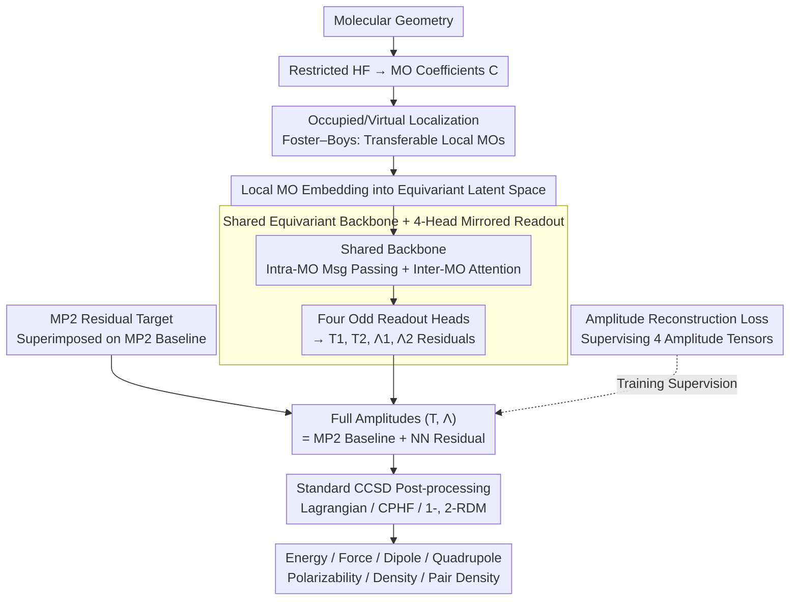

# MōLe-Λ: Learning the Coupled-Cluster Response State for Energies, Gradients, and Properties

**Conference**: ICML 2026  
**arXiv**: [2605.29622](https://arxiv.org/abs/2605.29622)  
**Code**: None  
**Area**: Physics / Quantum Chemistry / Equivariant Neural Networks  
**Keywords**: Coupled Cluster Theory, CCSD, $\Lambda$ Amplitudes, Equivariant Neural Networks, Molecular Orbitals, Response Properties  

## TL;DR
MōLe-Λ extends molecular orbital learning from predicting only Coupled-Cluster right-state $T$ amplitudes to simultaneously predicting left-state $\Lambda$ amplitudes. Using a single equivariant network to read out $(T_1, T_2, \Lambda_1, \Lambda_2)$ directly from localized Hartree–Fock orbitals, it achieves MAEs for energy and force of only 0.10 mHa and 0.12 mHa/Bohr on QM7. It derives response properties including dipole, quadrupole, polarizability, electron density, and pair density from the same learned "response state," accelerating calculations by over two orders of magnitude compared to CCSD+$\Lambda$ solvers.

## Background & Motivation

**Background**: Coupled-Cluster theory (CCSD/CCSD(T)) is considered the "gold standard" of quantum chemistry, but its formal scaling of $\mathcal{O}(N^6)$ renders it impractical for larger molecules. Machine learning has mitigated this conflict through two paths: first, via machine learning interatomic potentials (MLIPs like MACE or eSEN) that directly fit energy and forces; second, by learning one-particle quantities such as density, density matrices, or Fock matrices to accelerate self-consistent fields or reconstruct single-particle observables.

**Limitations of Prior Work**: MLIPs only produce energy and forces, failing to capture quantities that depend on correlated electronic states like dipole, quadrupole, and polarizability. Learning density or Hamiltonians only recovers information at the single-particle level. Any quantity depending on the full response state (dipole/quadrupole/polarizability/electron density/pair density) must be derived via the left-state $\Lambda$ amplitudes in the Coupled-Cluster Lagrangian. However, solving the $\Lambda$ equations themselves still costs $\mathcal{O}(N^6)$, with no previous acceleration.

**Key Challenge**: CC theory is not variational with respect to the right-state $T$ amplitudes; thus, the total derivative of energy with respect to an external parameter $\xi$, $dE/d\xi$, contains extra $\partial t_\mu/\partial \xi$ terms. Only by introducing $\Lambda$ as an adjoint variable and rewriting the objective as the Lagrangian $\mathcal{L}(T, \Lambda)$ does $dE/d\xi = \partial \mathcal{L}/\partial \xi$ hold. Previous MōLe (Thiede et al., 2026) only learned $T_1, T_2$, allowing for energy calculation but not relaxed response observables.

**Goal**: (i) Train a single neural network to provide $(T_1, T_2, \Lambda_1, \Lambda_2)$ simultaneously; (ii) Maintain the equivariant, local, and size-extensible priors of the original MōLe; (iii) Avoid training separate readout heads for every property, deriving all downstream quantities from amplitudes via standard CC post-processing; (iv) Ensure stable extrapolation across molecular sizes and geometric distortions.

**Key Insight**: The tensor structures of $\Lambda_1, \Lambda_2$ are perfectly symmetric to $T_1, T_2$—both are antisymmetric tensors over occupied/virtual orbital indices, satisfying the same sign-equivariance under orbital phase flips and the same locality where interactions vanish between non-interacting fragments. Consequently, the shared equivariant backbone of MōLe can be reused, mirroring it with two "odd readout heads" without redesigning the architecture.

**Core Idea**: Shift from "learning properties" to "learning the state"—predict the complete CCSD response state $(T, \Lambda)$ and let traditional CC post-processing (1-RDM, 2-RDM, CPHF) analytically derive all observables from this single object.

## Method

### Overall Architecture
The input is the molecular geometry $\{\mathbf{R}_A\}$. A cheap Restricted Hartree–Fock (RHF) calculation is performed to obtain MO coefficients $\mathbf{C}$. Occupied and virtual orbitals are localized separately (e.g., Foster–Boys) to transform non-local canonical MOs into transferable local MOs. Each local MO is treated as a graph, where padded AO coefficient vectors on atoms are embedded into an equivariant latent space. A shared backbone performs message passing within MOs and attention-based interaction between MOs. Four independent "odd readout heads" yield residuals for $T_1, T_2, \Lambda_1, \Lambda_2$, which are superimposed onto MP2 zero-order baselines to obtain full amplitudes. During training, the loss supervises only these four amplitude tensors. The predicted amplitudes are passed to standard CCSD post-processing (Lagrangian, CPHF, 1-/2-RDM reconstruction) to generate energy, forces, dipole, quadrupole, polarizability, density, and pair density.

### Key Designs

**1. Shared Equivariant Backbone + 4-Head Mirrored Readout: One network yields $T$ and $\Lambda$ simultaneously**

Dipole, quadrupole, polarizability, and density, which depend on the full response state, must involve the left-state $\Lambda$ amplitudes. The tensor structures of $\Lambda_1, \Lambda_2$ are symmetric to $T_1, T_2$—both are antisymmetric tensors over occupied/virtual indices, satisfying the same sign-equivariance under orbital phase flips and locality. The authors reuse the shared equivariant backbone of MōLe: each local MO is embedded as an equivariant representation, processed via Odd-MACE message passing and inter-MO attention to yield invariant features $\mathbf{y}_{ia}, \mathbf{y}_{ijab}$. Four "odd readout heads" are then mirrored: $t_i^a = \mathrm{OddReadout}_{T_1}(\mathbf{y}_{ia})$, $\lambda_a^i = \mathrm{OddReadout}_{\Lambda_1}(\mathbf{y}_{ia})$, $t_{ij}^{ab} = \mathrm{OddReadout}_{T_2}(\mathbf{y}_{ijab})$, and $\lambda_{ab}^{ij} = \mathrm{OddReadout}_{\Lambda_2}(\mathbf{y}_{ijab})$ ("odd readout" denotes sign-equivariance to orbital phase flips, ensuring correct behavior under MO phase gauge). This shared backbone saves parameters and binds the four tensors into the same latent space, preserving algebraic consistency and aligning $\Lambda$'s inductive bias with $T$.

**2. MP2 Residual Targets: Learning corrections relative to MP2**

CCSD labels are extremely expensive. In the closed-shell real-amplitude case, the authors use MP2 as a zero-order baseline: $t_{ij,\mathrm{MP2}}^{ab} = \langle ij||ab\rangle/(\varepsilon_i+\varepsilon_j-\varepsilon_a-\varepsilon_b)$, with $T_1^{\mathrm{MP2}}=0$, $\Lambda_2^{\mathrm{MP2}}=T_2^{\mathrm{MP2}}$, and $\Lambda_1^{\mathrm{MP2}}=0$. The canonical MP2 amplitudes are transformed to the local gauge via localization matrices, and the network fits residuals $\Delta t_{ij}^{ab} = t_{ij,\mathrm{CCSD}}^{ab} - t_{ij,\mathrm{MP2}}^{ab}$ and $\Delta\lambda_{ab}^{ij} = \lambda_{ab,\mathrm{CCSD}}^{ij} - t_{ij,\mathrm{MP2}}^{ab}$. By removing the known leading-order correlation dynamics, the NN only learns the physically small but chemically critical higher-order differences. This injects physical priors into the objective, significantly reducing sample complexity.

**3. Amplitude Reconstruction Loss Instead of Property Loss: Supervising "states," not "properties"**

Directly supervising specific properties can lead to a model being accurate for those properties while distorting others. MōLe-Λ's loss function includes no properties; it supervises only the four amplitude tensors:

$$\mathcal{J}_{\mathrm{amp}}=\frac{1}{B}\sum_{b}\sum_{X\in\{T_1,T_2,\Lambda_1,\Lambda_2\}}w_X\sum_{n=1}^{N_X^{(b)}}\big(\hat X_{b,n}-X_{b,n}^{\mathrm{ref}}\big)^2$$

(where $w_X=1$). Downstream quantities are analytically derived via standard CC post-processing: energy $E_{\mathrm{corr}}=\sum_{ijab}(\tfrac14 t_{ij}^{ab}+\tfrac12 t_i^a t_j^b)\langle ij||ab\rangle$, forces $\mathbf{F}_A = -\partial\mathcal{L}(T,\Lambda)/\partial\mathbf{R}_A$ (including CPHF orbital response), and 1-/2-particle observables via RDM reconstruction. This ensures all properties share the algebraic consistency of the same amplitude set and naturally supports new observables (e.g., higher multipole moments) without additional training.

## Key Experimental Results

### Main Results

Evaluated using QM7 training (5732 molecules) / testing (1433 molecules) and three generalization sets (18 amino acids, 100 PubChem 14-heavy-atom molecules, three geometric distortion scans) with CCSD/def2-SVP labels. Energy and force MAE (units: mHa, mHa/Bohr):

| Method | QM7 E | QM7 F | Amino Acid E | Amino Acid F | PubChem E | PubChem F | Diels-Alder E | Diels-Alder F |
|------|-------|-------|----------|----------|-----------|-----------|---------------|---------------|
| MP2 | 57.32 | 1.50 | 60.49 | 1.33 | 82.55 | 1.32 | 69.33 | 1.18 |
| Mace (Direct CCSD) | 0.79 | 1.20 | 9.03 | 9.99 | 19.45 | 9.44 | 11.25 | 7.99 |
| Mace+MP2 (Δ-learning) | 0.16 | 0.23 | 0.51 | 1.90 | 2.07 | 2.49 | 1.61 | 1.43 |
| eSEN+MP2 | 0.15 | 0.17 | 3.20 | 0.69 | 8.12 | 1.81 | 1.81 | 1.94 |
| **MōLe-Λ** (Ours) | **0.10** | **0.12** | **0.37** | 0.27 | **0.63** | **0.26** | **1.09** | **0.24** |

Amplitude MAE on QM7: $T_1, \Lambda_1 \approx 2.6\text{-}2.7\times 10^{-5}$, $T_2, \Lambda_2 \approx 5.3\times 10^{-7}$. Response properties (dipole, quadrupole, polarizability) show significantly lower MAE on the QM7 test set compared to HF, MP2, and the right-state-only MōLe-XCCSD.

### Ablation Study

| Configuration / Dimension | Key Findings | Mechanism |
|---|---|---|
| Direct vs. MP2 Residual Mode | Residual mode has significantly lower MAE in low-data regimes; they converge as data increases. | Physical priors are most valuable when samples are scarce. |
| Right-state only MōLe (XCCSD Reconstruction) | Errors for dipole/electron density/pair density are notably larger than MōLe-Λ. | $\Lambda$ is essential information for relaxed response observables. |
| Cross-molecule size (QM7 → Amino Acids/PubChem) | Geometric MLIP error amplifies by 10×+; MōLe-Λ only by 3-6×. | Local orbital amplitudes are truly size-transferable representations. |
| Out-of-equilibrium scanning (Butane dihedral / Methanol C–O stretch) | Mace yields "unstable" predictions; MōLe-Λ remains stable with low error. | Learning the state is more robust than learning properties for extrapolation. |
| Computational Overhead (H100 / C17H36) | Conventional CCSD runs out of VRAM; MōLe-Λ extends beyond C21. $(T, \Lambda)$ prediction is >100× faster than CCSD+Λ solver. | Observed scaling is far lower than $\mathcal{O}(N^3)$ in practice. |

### Key Findings
- **Learning States > Learning Properties**: Supervising only the four amplitude tensors results in superior downstream energy/force/dipole/quadrupole/polarizability/density/pair density without the common trade-off where optimizing one property degrades others.
- **$\Lambda$ provides critical marginal gain**: Without $\Lambda$, electron density residuals diffuse across the molecular volume; with $\Lambda$, errors near bonds are sharply reduced, and broad MP2 error lobes in pair density difference maps (2-RDM) are nearly eliminated.
- **Physical priors significantly reduce data requirements**: MP2 residualization delegates "leading-order correlation" to perturbation theory. Data efficiency gains are particularly pronounced in data-scarce regimes.
- **MLIPs are fragile under geometric distortion**: Mace's direct CCSD fit fails on butane dihedral scans compared to MōLe-Λ, suggesting that geometric feature spaces cannot absorb the pressure of electronic reorganization without involving orbitals.

## Highlights & Insights
- **"Learning the state" paradigm redefines supervision granularity**: While ML for chemistry has long focused on "which property to learn," this work elevates the target to the electronic structure object itself. All properties become byproducts, naturally avoiding multi-task conflicts.
- **Architecture mirroring instead of stacking**: The $\Lambda$ and $T$ heads share a backbone and are symmetric mirrors, meaning adding $\Lambda$ adds almost no parameter or training complexity while expanding the set of recoverable observables by an order of magnitude.
- **Local MOs are truly transferable representations**: Geometry-based MLIPs fail quickly during size extrapolation. Local orbital amplitudes inherently satisfy size-extensibility, suggesting the "correct inductive bias" for molecular ML may not be Euclidean space.
- **Transferable to other physics requiring adjoint variables**: The "right-state + left-state" structure of the CCSD Lagrangian is isomorphic to structures in elasticity, optimal control, and variational inference. The "learning the adjoint" philosophy can be transferred to other scientific computing problems requiring response derivatives.

## Limitations & Future Work
- **Basis set and element limitations**: Trained only on def2-SVP and C/N/O/S/H elements from QM7; larger basis sets (aug-cc-pVTZ), transition metals, and open-shell systems are not yet covered.
- **Dense $T_2, \Lambda_2$ output as a potential bottleneck**: Currently visible for molecules with dozens of heavy atoms; larger systems will require sparse/local/compressed doubles representations.
- **Unoptimized pre-processing**: HF, localization, and MP2 run on CPU, causing a rhythm mismatch with the GPU forward pass—an engineering challenge for the next step.
- **No treatment of triples**: CCSD(T) is the true "gold standard." This work only reaches the CCSD level; incorporating $T_3$ corrections remains an open problem.

## Related Work & Insights
- **vs. MōLe (Thiede et al., 2026)**: MōLe only predicts $T$ and uses XCCSD for energy/1-particle density; MōLe-Λ closes the loop on the response state, recovering $\Lambda$-only observables like dipole/quadrupole/polarizability/pair density.
- **vs. Mace / eSEN and other MLIPs**: MLIPs only provide energy and forces and are fragile in extrapolation/distortion; MōLe-Λ achieves both performance and transferability by obtaining the electronic structure object.
- **vs. Δ-learning (Mace+MP2, eSEN+MP2)**: Δ-learning uses MP2 as a baseline at the property level; MōLe-Λ moves residualization to the amplitude level, aligning the physical prior with the supervision target.
- **vs. Density/Hamiltonian Learning (Brockherde et al., 2017; Yu et al., 2023)**: Those approaches only recover 1-particle observables; this work includes 2-particle quantities via 2-RDM.

## Rating
- Novelty: ⭐⭐⭐⭐⭐ Elevating the ML supervision target from properties to the full CCSD response state $(T, \Lambda)$ is a paradigmatic rather than incremental improvement.
- Experimental Thoroughness: ⭐⭐⭐⭐ QM7 training + 3 generalization sets + out-of-equilibrium scans + multiple observables + scaling comparisons; lacks validation on larger basis sets and heavy elements.
- Writing Quality: ⭐⭐⭐⭐ The causal link between the Lagrangian motivation and mirrored heads is clear; some RDM reconstruction details are relegated to the appendix.
- Value: ⭐⭐⭐⭐⭐ Transforming CC-level response properties from "O(N^6) unreachable" to "one-pass reachable" has immense practical significance for catalysis, materials, and molecular design.

<!-- RELATED:START -->

## Related Papers

- [\[ICLR 2026\] DRIFT-Net: A Spectral--Coupled Neural Operator for PDEs Learning](../../ICLR2026/physics/drift-net_a_spectral--coupled_neural_operator_for_pdes_learning.md)
- [\[CVPR 2025\] Learning Phase Distortion with Selective State Space Models for Video Turbulence Mitigation](../../CVPR2025/physics/learning_phase_distortion_with_selective_state_space_models_for_video_turbulence.md)
- [\[ICLR 2026\] Extending Fourier Neural Operators for Modeling Parameterized and Coupled PDEs](../../ICLR2026/physics/extending_fourier_neural_operators_for_modeling_parameterized_and_coupled_pdes.md)
- [\[ICML 2026\] Topology-Preserving Neural Operator Learning via Hodge Decomposition](topology-preserving_neural_operator_learning_via_hodge_decomposition.md)
- [\[ICML 2026\] Hermite-NGP: Gradient-Augmented Hash Encoding for Learning PDEs](hermite-ngp_gradient-augmented_hash_encoding_for_learning_pdes.md)

<!-- RELATED:END -->
