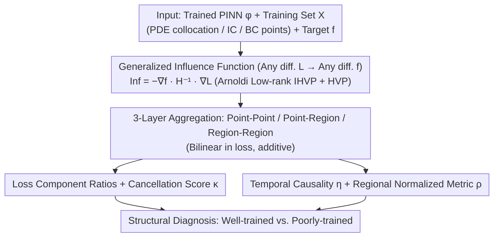

# PINNfluence: Interpreting PINNs Through Influence Functions

**Conference**: ICML 2026  
**arXiv**: [2409.08958](https://arxiv.org/abs/2409.08958)  
**Code**: https://github.com/aleks-krasowski/pinnfluence  
**Area**: Scientific Computing / Physics-Informed Neural Networks / Interpretability  
**Keywords**: PINN Diagnostics, Influence Functions, Training Data Attribution, Loss Decomposition, Temporal Causality Metrics

## TL;DR
This paper extends Influence Functions, a training data attribution method, to Physics-Informed Neural Networks (PINNs), proposing PINNfluence. By using linearized leave-one-out perturbation estimation, it attributes the prediction, loss, or physical quantities of a PINN simultaneously to each training point and each loss component. Based on this, it constructs a set of diagnostic metrics (loss component ratios, cancellation scores, temporal causality metrics, etc.) that consistently distinguish between "well-trained" and "poorly-trained" PINNs across five time-dependent PDEs, providing structural diagnostics that residual analysis fails to identify.

## Background & Motivation
**Background**: PINNs (Raissi 2019) embed PDE residuals as soft constraints into the NN training objective, using a unified loss $\mathcal{L}(\theta)=\lambda_\text{pde}\!\sum L_\text{pde}+\sum_k\lambda_{bc,k}\!\sum L_{bc,k}$ to learn a function $\phi(x;\theta)$ approximating the solution of an IBVP. While widely applied in fluids, electromagnetics, epidemiology, and optics, training failures (propagation failure, overly strong initial conditions, ill-conditioned loss landscapes) are extremely common, and the community has historically relied on "phenomenological diagnostics."

**Limitations of Prior Work**: (1) Almost all understanding of PINNs is based on **training dynamics** (gradient flow analysis, NTK, loss reweighting) rather than **post-hoc interpretability**—identifying that a model has issues, but not why a specific prediction originates from certain training data or which loss term dominates it. (2) Traditional verification fails for PINNs: low training loss **does not equal** a correct PDE solution—PINNs often converge to trivial solutions with low residuals but incorrect physics (Daw 2023, Rohrhofer 2023), which residual checks cannot detect. (3) While XAI is mature in vision/NLP (LRP, IF, SAE), **no dedicated post-hoc interpretation methods exist for PINNs**.

**Key Challenge**: PINN failures are often **structural** (over-reliance on initial conditions, failed boundary propagation, information disconnection at temporal cross-sections), but scalar metrics like loss or residuals flatten this structure. To see the structure, one must unfold three axes: "which training point, which loss term, and which spatio-temporal region."

**Goal**: (1) Generalize the classical Influence Functions of Koh & Liang (2017) to the **composite loss** and **arbitrary differentiable objectives** of PINNs; (2) Provide influence-based diagnostic metrics capable of structurally distinguishing "well-trained" from "poorly-trained" models; (3) Verify the stability of these metrics across multiple PDEs and optimizers.

**Key Insight**: The authors note that PINN loss is naturally a weighted sum of components, and IF is **linear** with respect to loss parameters. This means a single Hessian-vector product calculation allows influence to be "automatically" decomposed into each $L_i$. By combining "training point $\to$ region" and "region $\to$ training point" aggregation directions, one can construct attribution maps at point-point, point-region, and region-region granularities.

**Core Idea**: Extend IF from "loss-to-loss" attribution to "arbitrary differentiable composite loss $L$ to arbitrary differentiable output $f$" attribution $\operatorname{Inf}_{\theta_0}^{L\to f}(x,z)=-\nabla_\theta f(z;\theta_0)^\top \mathcal{H}_{\theta_0}^{-1}\nabla_\theta L(x;\theta_0)$. Utilize **linearity and additivity** to decompose the results into every loss component and spatio-temporal region of the PINN.

## Method
PINNfluence does not alter the PINN training process; it is a post-hoc analysis framework. Given a **pre-trained** PINN $\phi(\cdot;\theta_0)$ and its training set $\mathcal{X}=\mathcal{X}_\text{pde}\cup\bigcup_k\mathcal{X}_{bc,k}$, it computes $\operatorname{Inf}$ to aggregate diagnostic metrics.

### Overall Architecture
- **Input**: Trained PINN $\phi$, training set $\mathcal{X}$ (including PDE collocation and IC/BC points), target quantity of interest $f$ (can be prediction $\hat{u}$, a loss component $L_i$, or physical observables), and test points/regions.
- **Mechanism**: Pair the IHVP $\mathcal{H}_{\theta_0}^{-1}\nabla_\theta L(x;\theta_0)$ with $\nabla_\theta f(z;\theta_0)$ using low-rank Arnoldi approximation and Hessian-vector products to avoid explicit Hessian construction.
- **Three-layer Granularity**:
    - Point-to-Point: $\operatorname{Inf}_{\theta_0}^{L\to f}(x,z)$;
    - Point-to-Region / Region-to-Point: Summing over $z$ or $x$ in a region;
    - Region-to-Region: Double summation with normalization for proportional metrics.
- **Output**: (1) Point-to-point influence heatmaps; (2) Loss component decomposition ratios $r_{L_i}$ and cancellation scores $\kappa$; (3) Spatio-temporal metrics, such as the temporal causality metric $\eta$.

The pipeline structure computes the influence once and branches into multiple diagnostics. The core calculation is the generalized influence function $\operatorname{Inf}^{L\to f}$, which aggregates across three granularities before splitting into "Loss Component" and "Spatio-temporal" diagnostic families to form a structural judgment of "well-trained vs. poorly-trained."

### Key Designs

**1. Extension from "Loss-to-Loss" to "Arbitrary Target + Composite Loss"**

Classical Influence Functions (Koh & Liang 2017) only answer how adding/removing a point affects the training loss, which is insufficient for PINNs. PINN failure diagnosis requires knowing "which loss term and which region dominates a specific prediction." The authors generalize attribution to:

$$\operatorname{Inf}_{\theta_0}^{L\to f}(x,z)=-\nabla_\theta f(z;\theta_0)^\top\mathcal{H}_{\theta_0}^{-1}\nabla_\theta L(x;\theta_0),$$

where $f$ can be $\hat u$, a specific component loss, or any physical observable. They prove this first-order approximates the leave-one-out re-training effect (Thm 2.2). A critical relaxation replaces "strict local minimum + strong convexity" with "non-degenerate stationary point + invertible Hessian," as NN training often settles at saddle points. This allows IF to decompose PINN composite losses $\mathcal{L}=\lambda_\text{pde}L_\text{pde}+\sum_k\lambda_{bc,k}L_{bc,k}$ and explain diagnostic errors.

**2. Loss Component Decomposition + Cancellation Score $\kappa$**

IF is linear with respect to $L$ parameters (Corollary 2.3): $\operatorname{Inf}^{\sum_i\alpha_iL_i\to f}=\sum_i\alpha_i\operatorname{Inf}^{L_i\to f}$. Thus, total influence is decomposed into components for "free." Relative contribution is defined as $r_{L_i}(x,z)=\frac{|\operatorname{Inf}^{L_i\to f}|}{\sum_j|\operatorname{Inf}^{L_j\to f}|}$, and the cancellation score as:

$$\kappa(x,z)=1-\frac{\big|\sum_j\operatorname{Inf}^{L_j\to f}\big|}{\sum_j|\operatorname{Inf}^{L_j\to f}|}.$$

$\kappa$ determines if decomposition is reliable: if components cancel out (large $\kappa$), $r_{L_i}$ might be misleading; if no cancellation occurs, $r_{L_i}$ represents a clear contribution ratio.

**3. Temporal Causality Metric $\eta$ + Regional Normalized Metric $\rho$**

The temporal relationship between training point $x_t$ and test point $z_t$ is encoded to quantify if the PINN "looks from the past to the future":

$$\eta_{\theta_0}^{L\to f}(R_\text{tr},R_\text{te})=1-\frac{1}{|R_\text{te}|}\sum_{z\in R_\text{te}}\frac{\sum_{x\in R_\text{tr}:x_t\le z_t}|\operatorname{Inf}^{L\to f}(x,z)|}{\sum_{x\in\mathcal{X}_\text{train}}|\operatorname{Inf}^{L\to f}(x,z)|},$$

A small $\eta$ implies influence mostly comes from the past (causally aligned), whereas a large $\eta$ suggests future influence. While intuition suggests well-trained PINNs should follow PDE causality, the empirical finding is the opposite: well-trained models show $\eta\approx\bar t$ (near uniform), while failed models show strong "past dominance" (abnormal IC persistence).

### Loss & Training
**No new training loss is introduced**—PINNfluence performs post-hoc analysis. Implementation relies on PyHessian-style HVP + Schioppa 2022's Arnoldi low-rank approximation to estimate $\mathcal{H}^{-1}$, avoiding $O(p^2)$ explicit Hessian construction. Proximal Bregman response functions (PBRF, Bae 2022) are used for reliability checks. It is verified across optimizers like NNCG (Rathore 2024) and SOAP (Vyas 2025).

## Key Experimental Results

Settings: 5 time-dependent PDEs (Heat, Allen-Cahn, Burgers', Wave, Drift-Diffusion) and 2 steady-state PDEs (Poisson, Navier-Stokes). Each problem includes "well-trained" vs. "poorly-trained" configurations across 10 seeds.

### Main Results

| Problem | $\bar{t}$ (Baseline) | Well-trained $\eta$ (pred) | Poorly-trained $\eta$ (pred) | Diagnostic Conclusion |
|------|:------:|:------:|:------:|------|
| Heat | 0.46 | 0.33 ± 0.02 | 0.26 ± 0.06 | Failed models bias toward past (IC dominant) |
| Allen-Cahn | 0.43 | 0.50 ± 0.02 | 0.32 ± 0.05 | Failed models show significant $\eta$ decrease |
| Burgers' | 0.43 | 0.41 ± 0.02 | 0.28 ± 0.02 | Same as above |
| Drift-Diffusion | 0.46 | 0.46 ± 0.04 | 0.21 ± 0.06 | IC influence overwhelms, corresponding to propagation failure |
| Wave | 0.43 | 0.41 ± 0.03 | **0.11 ± 0.02** | Largest gap; failed models almost entirely anchored to IC |

→ Across all 5 problems, **$\eta$ for poorly-trained models is significantly lower than for well-trained models**, with small standard deviations across seeds.

### Ablation Study

| Dimension | Experimental Setup | Key Finding |
|------|---------|---------|
| Loss Component $\bar{r}_{L_\text{ic}}$ | 5 PDEs × 50 time bins | Well-trained: IC share starts at $\approx 0.25$ and decays; Poorly-trained: IC share stays high and plateaus after $t\approx 0.4$. |
| Training Point Count Scan | 5 problems | PINNfluence metrics transition smoothly; the curve shape is **problem-dependent**, revealing data demand structures. |
| Optimizer Independence | Adam / NNCG / SOAP | Distinguishing patterns for $\eta$ and $\bar{r}_{L_i}$ remain consistent across types of optimizers. |
| Hessian Reliability | Low-rank Arnoldi vs PBRF vs Gradient-only | Arnoldi faithfully recovers the projected inverse Hessian even under ill-conditioning, significantly outperforming gradient-only baselines. |
| Cancellation Score $\kappa$ | Loss term decomposition | $\kappa$ is small at most points, making $r_{L_i}$ robust; high $\kappa$ points indicate "competing constraints." |

### Key Findings
- **Structural signals outweigh residual signals**: Residuals only show errors; PINNfluence localizes "why," e.g., IC influence over-persisting or BC being ignored.
- **Counter-intuitive causality**: Well-trained PINNs do **not** strictly follow physical causality ($\eta$ near uniform). Strong causal alignment is often a byproduct of IC overfitting.
- **Consistency across tasks**: IC influence decay patterns consistently distinguish training quality across distinct PDEs, suggesting potential as a **universal diagnostic**.

## Highlights & Insights
- **The generalization of IF is the pivotal step**: Converting "data $\to$ physical quantity" attribution into a single IHVP turns IF from a classifier debugger into a scientific computing tool.
- **$\kappa$ as a "decomposition self-check"**: This addresses the risk of misleading linear sums due to signed cancellations, a detail transferable to LRP/Shapley methods.
- **Well-trained PINNs are globally optimized**: They approximate the PDE solution as a global variational problem rather than a time-stepper, explaining why they don't exhibit strict physical causality in sensitivity patterns.

## Limitations & Future Work
- **First-order approximation**: Subject to $O(1/N^2)$ remainders; large perturbations or extreme ill-conditioning may introduce bias.
- **PINN Hessian ill-conditioning**: While low-rank Arnoldi helps, singular directions may still amplify errors in complex PDEs.
- **Computational overhead**: Linear in $|\mathcal{X}_\text{train}|\times|R_\text{te}|$; potentially expensive for massive 3D time-varying datasets.
- **Loss of directionality**: Aggregating absolute values $|\operatorname{Inf}|$ prevents noise but loses "promotion vs. inhibition" information.

## Related Work & Insights
- **vs. Koh & Liang (2017)**: Extends IF beyond loss-to-loss attribution and strong convexity assumptions to composite losses.
- **vs. PINN Training Dynamics (Wang 2022, Rathore 2024)**: Complementary; these study "why it fails during training," while PINNfluence studies "how it fails structurally" post-training.
- **vs. Neural Operator Interpretability (MacMillan 2025)**: Approaches from training data attribution rather than mechanistic latent feature analysis.

## Rating
- Novelty: ⭐⭐⭐⭐⭐ First attribution framework for PINNs; generalized IF has broad utility.
- Experimental Thoroughness: ⭐⭐⭐⭐ Solid across 5+ PDEs and multiple optimizers; lacks 3D benchmarks.
- Writing Quality: ⭐⭐⭐⭐⭐ Mature progression from theory to metrics to experiments.
- Value: ⭐⭐⭐⭐⭐ Fills a gap in sci-ML interpretability with potential for diagnostic-driven training.

<!-- RELATED:START -->

## Related Papers

- [\[ICLR 2026\] Supervised Metric Regularization Through Alternating Optimization for Multi-Regime PINNs](../../ICLR2026/physics/supervised_metric_regularization_through_alternating_optimization_for_multi-regi.md)
- [\[ICML 2026\] Generative Neural Operators Through Diffusion Last Layer](generative_neural_operators_through_diffusion_last_layer.md)
- [\[NeurIPS 2025\] Neural Green's Functions](../../NeurIPS2025/physics/neural_greens_functions.md)
- [\[NeurIPS 2025\] Scaling Laws and Pathologies of Single-Layer PINNs: Network Width and PDE Nonlinearity](../../NeurIPS2025/physics/scaling_laws_and_pathologies_of_single-layer_pinns_network_width_and_pde_nonline.md)
- [\[ICLR 2026\] HyperKKL: Enabling Non-Autonomous State Estimation through Dynamic Weight Conditioning](../../ICLR2026/physics/hyperkkl_enabling_non-autonomous_state_estimation_through_dynamic_weight_conditi.md)

<!-- RELATED:END -->
