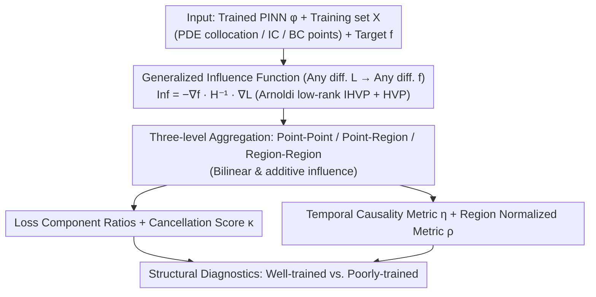

# PINNfluence: Interpreting PINNs Through Influence Functions

**Conference**: ICML 2026  
**arXiv**: [2409.08958](https://arxiv.org/abs/2409.08958)  
**Code**: https://github.com/aleks-krasowski/pinnfluence  
**Area**: Scientific Computing / Physics-Informed Neural Networks / Interpretability  
**Keywords**: PINN Diagnostics, Influence Functions, Training Data Attribution, Loss Decomposition, Temporal Causality Metrics  

## TL;DR
This paper extends the training data attribution method Influence Functions to Physics-Informed Neural Networks (PINNs) by proposing PINNfluence. Through linearized leave-one-out perturbation estimation, PINNfluence attributes PINN predictions, losses, and physical quantities simultaneously to every training point and loss component. Based on this, a set of diagnostic metrics (loss component ratios, cancellation scores, temporal causality metrics, etc.) is constructed to stably distinguish between "well-trained" and "poorly-trained" PINNs across five time-dependent PDEs, providing structural diagnostics invisible to residual analysis.

## Background & Motivation
**Background**: PINN (Raissi 2019) embeds PDE residuals as soft constraints in NN training objectives, using a unified loss $\mathcal{L}(\theta)=\lambda_\text{pde}\!\sum L_\text{pde}+\sum_k\lambda_{bc,k}\!\sum L_{bc,k}$ to learn a function $\phi(x;\theta)$ that approximates the solution to an Initial-Boundary Value Problem (IBVP). While widely applied in fluids, electromagnetics, epidemiology, and optics, training failures (propagation failure, overly strong initial conditions, ill-conditioned loss landscapes, etc.) are extremely common, and the community has relied on "phenomenological diagnostics."

**Limitations of Prior Work**: (1) Almost all interpretability work is based on **training dynamics** (gradient flow analysis, NTK, loss reweighting) rather than **post-hoc interpretability**—telling you "this model has a problem" without explaining "why this prediction comes from this part of the training data" or "which loss term dominates it." (2) Traditional verification fails for PINNs: low training loss **does not equal** a correct PDE solution—PINNs often converge to trivial solutions with low residuals but incorrect physics (Daw 2023, Rohrhofer 2023), which residual checks fail to detect. (3) While XAI is mature in vision/NLP (LRP, IF, SAE), **no dedicated post-hoc interpretation method exists for PINNs**.

**Key Challenge**: PINN failures are often **structural** (over-dependence on initial conditions, boundary propagation failure, information disconnection at certain time slices), but scalar quantities like loss or residuals flatten these structures. To see the structure clearly, one must unfold the three axes: "which training point," "which loss term," and "which spatio-temporal region."

**Goal**: (1) Generalize the classical Influence Functions of Koh & Liang (2017) to the **composite losses** + **arbitrary differentiable target quantities** of PINNs; (2) Provide a set of influence-based diagnostic metrics capable of distinguishing "well-trained" vs. "failed" models at a structural level; (3) Verify the stability of these metrics across various PDEs and optimizers.

**Key Insight**: The authors noticed that PINN loss is naturally a weighted sum of multiple components, and IF is **linear** with respect to loss parameters. This means that a single Hessian-vector product calculation allows for "automatic" decomposition of influence into each $L_i$. combined with aggregation directions ("training point → region" and "region → training point"), attribution maps of point-to-point, point-to-region, and region-to-region granularities can be constructed.

**Core Idea**: Generalize IF from "loss-to-loss" attribution to "any differentiable composite loss $L$ to any differentiable output $f$" attribution: $\operatorname{Inf}_{\theta_0}^{L\to f}(x,z)=-\nabla_\theta f(z;\theta_0)^\top \mathcal{H}_{\theta_0}^{-1}\nabla_\theta L(x;\theta_0)$, leveraging **linearity and additivity** to directly decompose it into each PINN loss component and spatio-temporal region.

## Method
PINNfluence does not alter the PINN training process—it is a post-hoc analysis framework. Given a **pre-trained** PINN $\phi(\cdot;\theta_0)$ and its training set $\mathcal{X}=\mathcal{X}_\text{pde}\cup\bigcup_k\mathcal{X}_{bc,k}$, it computes $\operatorname{Inf}$ and aggregates them into diagnostic metrics.

### Overall Architecture
- **Input**: Trained PINN $\phi$, training set $\mathcal{X}$ (including PDE collocation points and IC/BC points), target quantity of interest $f$ (can be prediction $\hat{u}$, a specific loss component $L_i$, or a physical observable), and test points/regions.
- **Mechanism**: Pairs the IHVP $\mathcal{H}_{\theta_0}^{-1}\nabla_\theta L(x;\theta_0)$ w.r.t $\theta$ with $\nabla_\theta f(z;\theta_0)$—avoiding explicit Hessian construction via low-rank Arnoldi approximation + Hessian-vector products.
- **Three Granularity Levels**:
    - Point-to-Point: $\operatorname{Inf}_{\theta_0}^{L\to f}(x,z)$;
    - Point-to-Region / Region-to-Point: Summation over $z$ or $x$ in a region;
    - Region-to-Region: Double summation, combined with normalization to obtain ratio metrics.
- **Outputs**: (1) Point-to-point influence heatmaps; (2) Loss component decomposition ratios $r_{L_i}$ and cancellation scores $\kappa$; (3) Spatio-temporal region metrics, such as the temporal causality metric $\eta$.

The pipeline structure calculates influence once and branches into multiple diagnostics: the sole core computation is the generalized influence function $\operatorname{Inf}^{L\to f}$, which is aggregated at three levels and then diverted into "loss component" and "spatio-temporal region" diagnostic branches to form a structural judgment of "well-trained vs. poorly-trained."

### Key Designs

**1. Expansion from "Loss-to-Loss" to "Arbitrary Differentiable Target + Arbitrary Composite Loss"**

The classical influence function (Koh & Liang 2017) only answers the effect of adding/removing a training point on the training loss, which is insufficient for PINNs. PINN failures require seeing "which loss term or spatio-temporal region dominates a certain prediction." The authors generalize attribution to:

$$\operatorname{Inf}_{\theta_0}^{L\to f}(x,z)=-\nabla_\theta f(z;\theta_0)^\top\mathcal{H}_{\theta_0}^{-1}\nabla_\theta L(x;\theta_0),$$

where $f$ can be the prediction $\hat u$, a component loss, or any physical observable. They prove it first-order approximates leave-one-out retraining effects (Thm 2.2). A key relaxation is loosening Koh & Liang's "strict minimum + strong convexity" to "non-degenerate stationary point + invertible Hessian"—since NN training usually lands at saddle points rather than global minima, especially in ill-conditioned PINNs. This step allows IF to decompose PINN composite losses $\mathcal{L}=\lambda_\text{pde}L_\text{pde}+\sum_k\lambda_{bc,k}L_{bc,k}$ and explain "where the learning of $\hat u(z)$ went wrong."

**2. Loss Component Decomposition + Cancellation Score $\kappa$**

IF is linear in $L$ parameters (Corollary 2.3): $\operatorname{Inf}^{\sum_i\alpha_iL_i\to f}=\sum_i\alpha_i\operatorname{Inf}^{L_i\to f}$, so total influence can be partitioned "for free" into each loss component. Relative contributions are defined as $r_{L_i}(x,z)=\frac{|\operatorname{Inf}^{L_i\to f}|}{\sum_j|\operatorname{Inf}^{L_j\to f}|}$ along with a cancellation score:

$$\kappa(x,z)=1-\frac{\big|\sum_j\operatorname{Inf}^{L_j\to f}\big|}{\sum_j|\operatorname{Inf}^{L_j\to f}|}.$$

A common failure mode in PINNs is "one boundary condition being ignored" or "IC dominating everything"—structural information invisible to residual analysis. $\kappa$ determines if the decomposition is trustworthy: if component influences cancel each other out ($\kappa$ is large), looking at $r_{L_i}$ alone is misleading; if they do not cancel, $r_{L_i}$ represents a clear contribution ratio.

**3. Temporal Causality Metric $\eta$ + Region Normalized Metric $\rho$**

The relationship between training point time $x_t$ and test point time $z_t$ is encoded into metrics to quantify if the PINN truly learns from the past to the future:

$$\eta_{\theta_0}^{L\to f}(R_\text{tr},R_\text{te})=1-\frac{1}{|R_\text{te}|}\sum_{z\in R_\text{te}}\frac{\sum_{x\in R_\text{tr}:x_t\le z_t}|\operatorname{Inf}^{L\to f}(x,z)|}{\sum_{x\in\mathcal{X}_\text{train}}|\operatorname{Inf}^{L\to f}(x,z)|},$$

A small $\eta$ implies influence mostly from the past (causal alignment), while large $\eta$ suggests influence from the future. This is compared against the mean training time $\bar t$ (approx. 0.5 under uniform sampling). Intuitively, one might expect well-trained PINNs to follow PDE causality, but empirical results show the opposite: well-trained models have $\eta\approx\bar t$ (approaching uniformity), while failed models show strong "past dominance" (IC influence persists abnormally). This counter-intuitive finding demonstrates the diagnostic value of structural metrics.

### Loss & Training
**No new training loss is introduced**—PINNfluence performs post-hoc analysis on pre-trained PINNs. Key engineering details: Uses PyHessian-style HVP combined with the Arnoldi low-rank approximation (Schioppa 2022) to estimate $\mathcal{H}^{-1}$, avoiding explicit $O(p^2)$ Hessian construction. The paper also uses PBRF (Bae 2022) as a reliability check for IF first-order approximations and validates stability under PINN-specific optimizers like NNCG (Rathore 2024) and SOAP (Vyas 2025).

## Key Experimental Results

Setup: 5 time-dependent PDEs (Heat, Allen-Cahn, Burgers', Wave, Drift-Diffusion) + 2 steady-state PDEs (Poisson, Navier-Stokes in Appendix). Each problem includes "well-trained" and "poorly-trained" configurations, with 10 seeds each.

### Main Results

| Problem | $\bar{t}$ (Baseline) | Well-trained $\eta$ (pred) | Poorly-trained $\eta$ (pred) | Diagnostic Conclusion |
|------|:------:|:------:|:------:|------|
| Heat | 0.46 | 0.33 ± 0.02 | 0.26 ± 0.06 | Failed model more biased toward past (IC dominant) |
| Allen-Cahn | 0.43 | 0.50 ± 0.02 | 0.32 ± 0.05 | Failed model has significantly lower $\eta$ |
| Burgers' | 0.43 | 0.41 ± 0.02 | 0.28 ± 0.02 | Same as above |
| Drift-Diffusion | 0.46 | 0.46 ± 0.04 | 0.21 ± 0.06 | IC influence overwhelming, matching propagation failure |
| Wave | 0.43 | 0.41 ± 0.03 | **0.11 ± 0.02** | Largest gap; failed model almost entirely anchored by IC |

→ Across all 5 problems, **$\eta$ for failed models is significantly lower than for well-trained models**, with small standard deviations across 10 seeds.

### Ablation Study

| Dimension | Experimental Setup | Key Finding |
|------|---------|---------|
| Loss Decomposition $\bar{r}_{L_\text{ic}}$ | 5 PDEs × 50 time bins | Well-trained: IC share starts at $\approx 0.25$ and decays; Poorly-trained: IC share remains high and plateaus after $t \approx 0.4$. |
| Data Scaling | Scanning training set size | PINNfluence metrics transition smoothly; curves are **problem-specific**, revealing data requirement structures for each PDE. |
| Optimizer Agnosticism | Adam vs NNCG vs SOAP | All optimizers show consistent "good vs. bad" patterns for $\eta$ and $\bar{r}_{L_i}$, proving robustness. |
| Hessian Reliability | Arnoldi vs PBRF vs Gradient-only | Arnoldi successfully recovers projected inverse Hessians in ill-conditioned cases, aligning with PBRF and outperforming gradient baselines. |
| Cancellation Score $\kappa$ | Loss term decomposition | $\kappa$ is small at most points, confirming $r_{L_i}$ is robust; high $\kappa$ points indicate competing constraints. |

### Key Findings
- **Structural Signals >> Residual Signals**: Failed models have high residuals, but residuals don't explain "why." PINNfluence directly localizes "excessive IC persistence" or "ignored boundary conditions."
- **Counter-intuitive Causality**: Well-trained PINNs **do not** strictly follow physical causality ($\eta$ near uniform baseline); failed PINNs are the ones that appear "causally aligned." Reason: PINNs are global optimization solutions, not time-steppers.
- **Cross-task Consistency**: Consistent IC influence decay patterns across different PDEs allow this to potentially serve as a **universal diagnostic** tool.
- **Robustness to Noise**: While IF is traditionally viewed as fragile in deep networks, it remains reliable for PINNs using low-rank + PBRF validation, even under ill-conditioned Hessians.

## Highlights & Insights
- **The step from "loss-to-loss" to "any differentiable $L$ → any differentiable $f$" is critical**: It transforms IF from a classifier debugger into a scientific computing diagnostic tool. This generalization allows sci-ML models with composite objectives (Neural Operators, DeepONets) to use the framework.
- **The cancellation score $\kappa$ serves as a "decomposition reliability self-check"**: This addresses the risk of misleading results due to signed component influences canceling out, a detail quantifiable and transferable to other attribution methods.
- **Structural Diagnostics ≠ Causality**: The authors emphasize that influence measures "sensitivity," not "physical causality"—this nuance is vital for scientific applications to avoid over-interpretation.
- **Well-trained PINNs as global solvers**: Seeing that well-trained models lack strong "causal sensitivity" forces a rethink of PINNs—they are global variational approximations of PDE solutions, not simulators, so expecting "sensitivity causality" is a misunderstanding of their mechanism.

## Limitations & Future Work
- **Still first-order**: Theorem 2.2 has an $O(1/N^2)$ remainder; large perturbations or extreme ill-conditioning may result in unmanaged errors.
- **Pathological Hessians**: While Arnoldi helps, near-singular directions in PINNs may still amplify errors in complex PDEs.
- **Computational Cost**: Costs are linear in $|\mathcal{X}_\text{train}|\times|R_\text{te}|$. While faster than training, it remains challenging for large-scale 3D time-varying PDEs.
- **Absolute Value Aggregation**: Relying on $|\operatorname{Inf}|$ prevents signal cancellation but loses "promotion vs. inhibition" directional information.
- **Metric Design requires domain knowledge**: $\eta$ and $\rho$ depend on specific PDE spatiotemporal structures; a universal "diagnostic dashboard" still needs more prototyping.

## Related Work & Insights
- **Comparison with Koh & Liang (2017)**: Original IF only does loss-to-loss, assumes strict minima, and ignores composite losses; ours relaxes boundaries and handles the PINN structure.
- **Complementing Training Dynamics**: While prior work studies *why* training fails during the process, PINNfluence studies *how* the final model fails at a data structure level.
- **Generalizing failure mode recognition**: Instead of task-specific failure modes (like propagation failure), PINNfluence provides a family of universal, quantifiable failure metrics.
- **Synergy with Mechanistic Interpretability**: Could be combined with tools like SAE to map "training points" to "latent features" to "outputs."

## Rating
- Novelty: ⭐⭐⭐⭐⭐ First training data attribution framework for PINNs.
- Experimental Thoroughness: ⭐⭐⭐⭐ Extensive across various PDEs and optimizers.
- Writing Quality: ⭐⭐⭐⭐⭐ Logical flow from definitions to diagnostics.
- Value: ⭐⭐⭐⭐⭐ Fills a major gap in sci-ML interpretability with significant downstream potential for diagnostic-driven training.

<!-- RELATED:START -->

## Related Papers

- [\[ICLR 2026\] Supervised Metric Regularization Through Alternating Optimization for Multi-Regime PINNs](../../ICLR2026/physics/supervised_metric_regularization_through_alternating_optimization_for_multi-regi.md)
- [\[ICML 2026\] Generative Neural Operators Through Diffusion Last Layer](generative_neural_operators_through_diffusion_last_layer.md)
- [\[NeurIPS 2025\] Neural Green's Functions](../../NeurIPS2025/physics/neural_greens_functions.md)
- [\[NeurIPS 2025\] Scaling Laws and Pathologies of Single-Layer PINNs: Network Width and PDE Nonlinearity](../../NeurIPS2025/physics/scaling_laws_and_pathologies_of_single-layer_pinns_network_width_and_pde_nonline.md)
- [\[ICLR 2026\] HyperKKL: Enabling Non-Autonomous State Estimation through Dynamic Weight Conditioning](../../ICLR2026/physics/hyperkkl_enabling_non-autonomous_state_estimation_through_dynamic_weight_conditi.md)

<!-- RELATED:END -->
