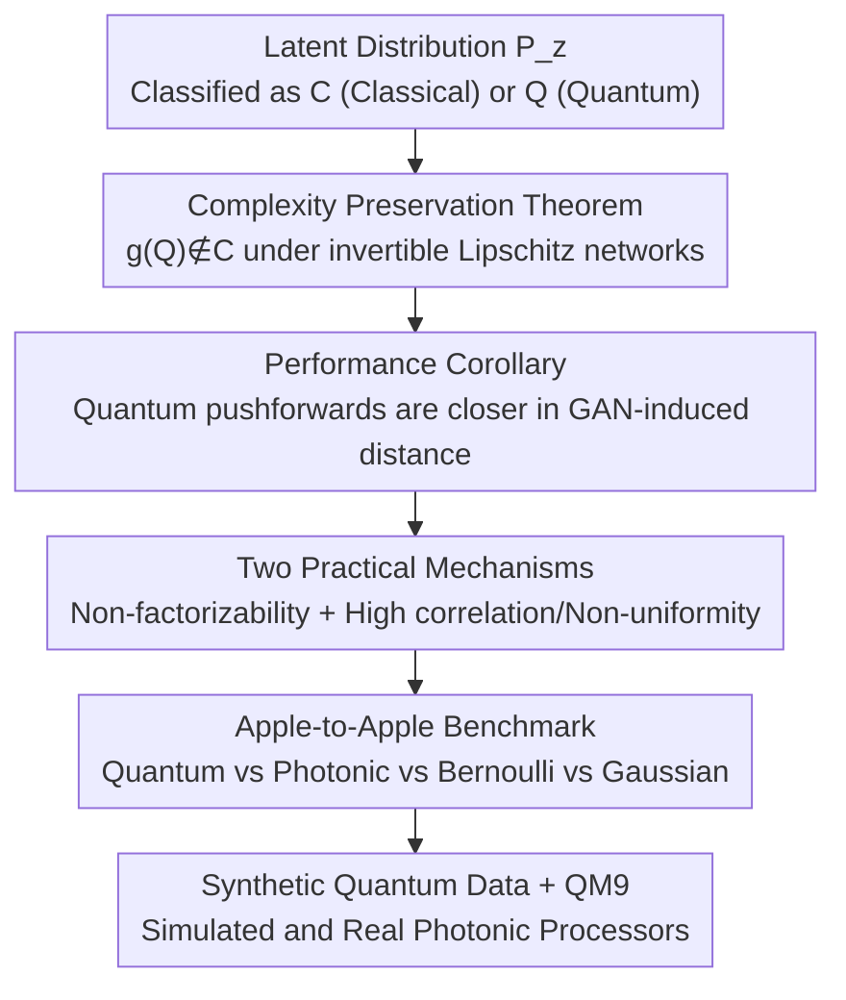

# Quantum latent distributions in deep generative models

**Conference**: ICML2026  
**arXiv**: [2508.19857](https://arxiv.org/abs/2508.19857)  
**Code**: None (Based on a modified version of MolGAN, not public)  
**Area**: Quantum Machine Learning / Deep Generative Models / Photonic Quantum Computing  
**Keywords**: Quantum latent distributions, Boson sampling, GANs, Computational complexity, QM9 molecule generation

## TL;DR
This study investigates when and why "latent space distributions generated by quantum processors" can enhance deep generative models. Theoretically, it proves that under specific network assumptions, quantum latent distributions enable generators to produce data distributions that classical latent distributions cannot efficiently approximate. Experimentally, using real and simulated photonic quantum processors, an apple-to-apple comparison is conducted on synthetic quantum datasets and the QM9 molecule dataset, revealing that statistics originating from quantum interference indeed lead to superior generative performance.

## Background & Motivation

**Background**: Successful deep generative models, such as GANs, latent diffusion, and flow matching, essentially map a low-dimensional **latent distribution** $P_z$ to a high-dimensional data distribution $P_x$. The structure of the latent distribution significantly impacts performance; prior work indicates that matching the structure of the latent distribution to the data structure (e.g., in GANs or flow matching) can substantially improve results.

**Limitations of Prior Work**: Because algorithm design is restricted to the range of "functions that can be efficiently implemented by CPUs/GPUs," practice almost exclusively uses **simple latent distributions** (such as multivariate Gaussians transformed via neural networks). However, the combination of "simple latent distributions + finite capacity networks" acts as a bottleneck for modeling complex data. Many quantum processes cannot be efficiently simulated by classical methods, making it naturally difficult for classical generative models with simple latent distributions to learn such data distributions.

**Key Challenge**: The expressivity of latent distributions is shackled by the requirement of being "classically efficiently samplable." Yet, certain target data distributions possess correlated structures (multimodal, strongly correlated, non-factorizable) that are difficult to generate classically. Simple Gaussian distributions, lacking such structures, struggle to capture complex correlations—as shown in Figure 1, mapping a Gaussian to a 2D Gaussian mixture requires up to 7 network layers to succeed, with the primary failure mode being incorrect interpolation between different modes.

**Key Insight**: Quantum computers (specifically photonic Boson sampling systems) can efficiently generate **highly correlated distributions that are difficult for classical simulation**. While scattered empirical work (mostly on GANs) has observed that quantum latent distributions can improve performance, most lack two things: ① a **theoretical understanding** of why or when quantum distributions help; and ② an **apple-to-apple benchmark** with controlled variables against multiple classical distributions (many previous works compared "trained quantum distributions" against "untrained classical baselines," producing non-generalizable conclusions).

**Core Idea**: Use computational complexity classes to categorize latent distributions into $\mathcal{C}$ (classically efficiently samplable) and $\mathcal{Q}$ (quantumly samplable but classically difficult). The study characterizes the sufficient conditions under which quantum latent distributions provide an advantage by investigating how the "complexity class of the latent distribution" determines the "complexity class of the generated distribution." Furthermore, a photonic distribution where quantum interference can be "turned off" is used as a control to isolate the contribution of multi-photon quantum interference.

## Method

### Overall Architecture

The work consists of "theoretical characterization" and "controlled benchmarking experiments," linked by a core metric. On the theoretical side: define the classical sampling class $\mathcal{C}$ (polynomial $\mathrm{Poly}(n,1/\epsilon)$ time classical approximate sampling) and the quantum class $\mathcal{Q}$ (quantumly samplable, classically not). Utilizing the GAN-induced distance introduced in [26]:

$$D^G(P_z,P_x)=\inf_{g\in G}D(P_{g(z)},P_x),$$

where $G$ is a family of networks with bounded complexity (limited width/depth/Lipschitz constant), and $P_{g(z)}$ is the pushforward distribution of the latent distribution through $g$. This distance reflects the discriminator loss: the better $P_z$ can approximate $P_x$ within $G$, the smaller the distance. On the experimental side: fix the model and only vary the latent distribution, comparing four types (Quantum / Photonic / Bernoulli / Gaussian) on synthetic quantum datasets and QM9, using "photonic distributions with switchable interference" to isolate the contribution of multi-photon interference.

The logic chain is summarized as follows:

### Key Designs

**1. Complexity Preservation Theorem: Sufficient conditions for quantum latents to remain non-classical after network transformation**

This addresses whether a quantum distribution degrades into a classical one after passing through a network. A basic observation (Remark 1) is: if $P_z \in \mathcal{C}$ and $g$ is Lipschitz continuous, then the pushforward $P_{g(z)} \in \mathcal{C}$—classical in, classical out. The reverse is not necessarily true: a quantum distribution could become classical after a network (e.g., if the network outputs a constant). **Theorem 1** provides a sufficient condition: if the inverse $g^{-1}$ of $g \in G$ exists, is classically efficiently implementable, and is Lipschitz continuous, and $P_z \in \mathcal{Q}$, then the pushforward distribution $P_{g(z)} \notin \mathcal{C}$.

The intuition is straightforward: if $P_{g(z)}$ were classically efficiently samplable, one could efficiently sample $P_z$ by applying the efficient $g^{-1}$ to samples of $P_{g(z)}$, implying $P_z \in \mathcal{C}$, which contradicts $P_z \in \mathcal{Q}$. The authors **explicitly construct** deep networks satisfying these assumptions: multilayer perceptrons with widening linear layers and invertible LeakyReLU activations, where inputs can be efficiently reconstructed from outputs by solving linear equations—this architecture is used in the QM9 experiments. Even when conditions are not strictly met, the theorem suggests that many modern networks (mostly Lipschitz continuous with often-solvable "generator inversion") can map non-classical distributions to non-classical ones.

**2. Performance Corollary on GAN-induced Distance: Quantum pushforwards cannot be approximated by classical latents**

This addresses what complexity non-degradation means for performance. **Corollary 1**: For $g$ satisfying Theorem 1 and a quantum latent distribution $P_{z_\mathcal{Q}} \in \mathcal{Q}$, using the Wasserstein distance, $D^G(P_{z_\mathcal{Q}}, P_{g(z_\mathcal{Q})}) = 0$ by definition. However, for any classical latent distribution $P_{z_\mathcal{C}} \in \mathcal{C}$, there exists $\epsilon > 0$ such that $D^G(P_{z_\mathcal{C}}, P_{g(z_\mathcal{Q})}) > \epsilon$. That is, the class of pushforward distributions reachable by quantum latents under certain conditions **cannot be approximated by any classical latent distribution**.

Based on this, data distributions are categorized into cases (Figure 2): if the target distribution falls within the "pushforward distributions of classical latents" (D1), quantum provides no theoretical advantage. However, if the target is **outside** the classical pushforward range—a common scenario given finite generator capacity and latent dimensions smaller than data space—then certain quantum pushforward distributions will be closer in GAN-induced distance than any classical ones. **Even if the target data is a classical distribution, quantum latent distributions may offer an advantage.**

**3. Two Practical Mechanisms: Connecting abstract complexity to empirical improvement**

The theoretical conditions are abstract, so the authors provide two operational mechanisms, viewing quantum latents as "structured priors with statistical properties matching the data" rather than just computational separation. First, **non-factorizability**: multi-particle entanglement prevents the quantum distribution from being decomposed into independent factors, stopping the model from learning "factorized representations." While factorized representations are more interpretable, they often perform poorly on multimodal data; determinantal point processes (non-factorizable) have been used to improve diversity in GANs/flow matching. Quantum distributions exhibit a strong form of non-factorizability—unlike classical distributions where probabilities are computable and can be transformed into factorized ones via cumulative transformations, quantum distributions generally **lack** such efficient transformations. Second, **highly non-uniform + multi-order strong correlations**: quantum distributions are naturally non-uniform and strongly correlated across orders, providing a beneficial inductive bias for datasets with similar properties (especially those originating from quantum physical processes). However, the authors honestly note that non-uniformity and correlation are not exclusive to quantum, which is why they designed the "photonic distribution with interference off" as a control.

**4. Apple-to-Apple Comparison of Four Latent Distributions: Isolating multi-photon interference**

To avoid the flaws of previous works, all experiments **only vary the latent distribution while keeping everything else identical**. Four distributions produce samples of length $d_z = L$: **Quantum**—indistinguishable photons into an $L$-dimensional interferometer, shaped by multi-photon interference; **Photonic**—distinguishable photons into the same interferometer, where each photon is routed independently (self-interference remains, but no multi-photon interference); **Bernoulli**—discrete uniform bitstrings $z \in \{0,1\}^L$; **Gaussian**—standard continuous $z \sim \mathcal{N}(0, I)$. Both Quantum and Photonic samples are photon-count vectors across $L$ output channels. The **only difference is multi-photon quantum interference**—this control isolates the specific contribution of quantum interference. To ensure findings reflect general properties, the interferometer circuits are re-sampled for each seed; while circuits could be trained, they are kept static here to avoid an unfair advantage over the static Gaussian/Bernoulli baselines.

### Loss & Training
The model is a GAN based on an improved MolGAN [16]. The generator is a feedforward network (non-decreasing layers + invertible LeakyReLU, following Theorem 1's requirement), and the discriminator is a relational GCN (Graph Convolutional Network). Synthetic experiments use the "average L1 distance between output and nearest integer" (smaller is better for discrete data). QM9 uses Frechet ChemNet Distance (FCD, lower is better), the number of valid and unique molecules in 10k generations (# Valid), and the number of those that are novel (# Novel). Experiments are conducted with 12 or 20 random seeds.

## Key Experimental Results

### Main Results

**Synthetic Dataset (L1 Distance, lower is better, 12 runs)**: The "Quantum Dataset" is generated by simulating the interference of 8 indistinguishable photons in a 16-channel random optical path. The "Bernoulli Dataset" is generated from a 16-dimensional Bernoulli distribution. Optical paths for latent space and data distributions are sampled independently to avoid trivial identity mapping.

| Dataset | Gaussian | Bernoulli | Photonic | Quantum |
| :--- | :--- | :--- | :--- | :--- |
| Quantum Dataset | 0.061±0.001 | 0.065±0.001 | 0.041±0.002 | **0.036±0.001** |
| Bernoulli Dataset | **0.012±0.002** | 0.020±0.013 | 0.017±0.002 | 0.015±0.002 |

On the more difficult Quantum Dataset, the quantum latent distribution is optimal and outperforms the Photonic baseline (distinguishable photons), indicating that quantum interference statistics are a useful resource. On the simpler Bernoulli Dataset, the gap is small, and Gaussian is slightly better—confirming that the quantum advantage is most significant when data originates from quantum processes.

**QM9 Dataset (20 seeds, Haar random circuits, photons = half of channels)**:

| Latent Dist. | $d_z$ | FCD ↓ | # Valid & unique ↑ | # Novel ↑ |
| :--- | :--- | :--- | :--- | :--- |
| Quantum | 16 | **1.160±0.06** | **2522±65** | **1331±37** |
| Photonic | 16 | 1.333±0.07 | 1954±103 | 1067±54 |
| Gaussian | 16 | 1.529±0.08 | 1814±115 | 1017±64 |
| Bernoulli | 16 | 1.822±0.09 | 1244±102 | 702±56 |
| Quantum | 32 | **1.536±0.08** | **1791±106** | **951±37** |
| Gaussian | 32 | 1.823±0.07 | 1320±53 | 768±35 |
| Quantum | 48 | 1.696±0.08 | **1528±65** | **856±40** |
| Photonic | 48 | 1.713±0.06 | 1307±77 | 746±43 |

### Ablation Study

| Configuration | Key Metric | Description |
| :--- | :--- | :--- |
| Quantum vs. Photonic (Same Interferometer) | Quantum consistently superior | Isolates multi-photon interference as the sole variable, proving its benefit. |
| Latent Dim 16 vs. 32 vs. 48 | Largest advantage at 16 | Advantage narrows as $d_z$ increases, but Quantum still leads in Valid & Unique at 48. |
| Circuit Type: Haar vs. Delay lines 1-1 / 1-3-9 | Quantum > Photonic in all | Advantage is not limited to Haar random circuits but is a general property of photonic interference. |

### Key Findings
- **Quantum interference is a real resource**: Quantum consistently outperforms "Photonic (interference off)," indicating that gains come from quantum mechanical statistics rather than non-exclusive features like non-uniformity.
- **Maximized advantage in small latent spaces**: At $d_z = 16$, Quantum dominates all metrics; as $d_z$ increases, the advantage narrows, suggesting quantum latents are most effective in "capacity-constrained" scenarios—matching theoretical cases where data space is much larger than latent space.
- **Data-Quantum statistical alignment requirement**: In synthetic experiments, Quantum wins big on quantum data but shows no significant advantage on Bernoulli data—the advantage is data/model-dependent, not a universal speedup.
- **Robustness across circuit types**: Quantum beats Photonic under both Haar random and delay line circuits, proving the result is not an artifact of a specific circuit implementation.

## Highlights & Insights
- **"Photonic distribution with interference off" is the stroke of genius**: By using distinguishable photons as a control, the authors isolate "multi-photon quantum interference" from attributes like "non-uniformity" shared by classical distributions. This provides a rigorous answer to "whether quantum actually helps," which was missing in prior empirical work.
- **Complexity classes bridge theory and experiment**: The use of $\mathcal{C}$/$\mathcal{Q}$ and GAN-induced distance creates a provable chain from "latent complexity → pushforward complexity → performance." The explicit construction of invertible networks makes the theory actionable.
- **Argument for non-factorizability is transferable**: Attributing quantum advantages to "strong non-factorizability without efficient transformations to factorized forms" echoes empirical results using determinantal point processes for diversity—this suggests "non-factorizable priors" are an inductive bias worth migrating to other generative tasks.
- **Hardware-Software dual benchmarking**: Validation on both simulated and real photonic processors, combined with the observation that photonic systems are sensitive to loss but not decoherence (which would push results toward classical uniformity), makes Boson sampling an ideal platform for observing quantum advantages.

## Limitations & Future Work
- **Non-universal advantage**: The performance gain depends on the dataset and model; there is no rigorous proof that QM9 belongs to a specific complexity class—it remains a heuristic choice.
- **Advantage narrows with latent size**: At $d_z=48$, the advantage is slim, raising questions about scalability. Overall performance also drops with larger latent dimensions.
- **Limited to GANs**: The authors acknowledge GANs are no longer SOTA for most data. GANs were chosen for their direct latent-to-data mapping to facilitate apple-to-apple comparisons; whether findings transfer to diffusion or flow matching remains unverified.
- **Static Quantum Circuits**: For fairness, circuits were not trained. Whether trained quantum circuits yield much larger (or perhaps "unfair") advantages is an open question, especially given the poor scaling often seen in quantum circuit training.
- **Theory provides sufficient conditions**: Theorem 1 provides sufficient but not necessary conditions. Practical mechanisms like non-factorizability are "intuitions/hypotheses" rather than rigid proofs for all gains on real data.

## Related Work & Insights
- **vs. [26]**: While [26] introduced GAN-induced distance to quantify latent-data fit, this paper extends it to "how latent computational complexity affects performance."
- **vs. Early Quantum GANs [36, 28, 62, etc.]**: Most previous works were limited to feasibility demonstrations and often compared trained quantum models against untrained classical ones. This work provides both theory and rigorous controls (including the photonic baseline without interference).
- **vs. Classical Latent Research [29]**: Where classical work argues that non-correlated latents fail to capture correlated features, this work uses complexity classes to provide a stronger conclusion regarding "non-approximability."
- **vs. Boson Sampling [1, 7, 25, 44]**: Rather than pursuing quantum supremacy in sampling itself, this work treats the classically hard distributions from Boson sampling as a latent space resource for generative models.

## Rating
- Novelty: ⭐⭐⭐⭐⭐ (Complexity-based theoretical characterization + "Interference-off" control)
- Experimental Thoroughness: ⭐⭐⭐⭐ (Synthetic + QM9, simulation + hardware, but limited to GANs)
- Writing Quality: ⭐⭐⭐⭐⭐ (Excellent transition between theory, intuition, and experiment; honest control design)
- Value: ⭐⭐⭐⭐ (Moves "quantum latent advantages" from empirical observation to quantifiable research)

<!-- RELATED:START -->

## Related Papers

- [\[ICML 2026\] Quiver: Quantum-Informed Views for Enhanced Representations in Large ML Models](quiver_quantum-informed_views_for_enhanced_representations_in_large_ml_models.md)
- [\[NeurIPS 2025\] Physics-Constrained Flow Matching: Sampling Generative Models with Hard Constraints](../../NeurIPS2025/physics/physics-constrained_flow_matching_sampling_generative_models_with_hard_constrain.md)
- [\[ICML 2026\] Generative Neural Operators Through Diffusion Last Layer](generative_neural_operators_through_diffusion_last_layer.md)
- [\[ICML 2025\] Rethink the Role of Deep Learning towards Large-scale Quantum Systems](../../ICML2025/physics/rethink_the_role_of_deep_learning_towards_large-scale_quantum_systems.md)
- [\[ICML 2026\] Spectrally Regularized Latent Flow Matching for Turbulence Generation](spectrally_regularized_latent_flow_matching_for_turbulence_generation.md)

<!-- RELATED:END -->
