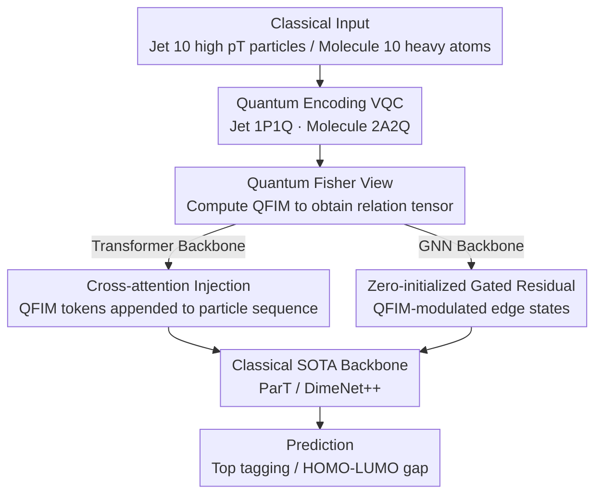

# Quiver: Quantum-Informed Views for Enhanced Representations in Large ML Models

**Conference**: ICML 2026  
**arXiv**: [2606.02785](https://arxiv.org/abs/2606.02785)  
**Code**: None (Repository not disclosed in the paper)  
**Area**: Physics / Hybrid Quantum-Classical Learning / High-Energy Physics + Molecular Chemistry  
**Keywords**: Variational Quantum Circuit (VQC), Quantum Fisher Information Matrix (QFIM), Multimodal Representation, Particle Transformer, DimeNet++  

## TL;DR
Quiver feeds categorical inputs into an additional Variational Quantum Circuit (VQC) to extract the Quantum Fisher Information Matrix (QFIM) as a "quantum geometric view." It then injects this into classical backbones using cross-attention (for Transformers) or residual gating (for GNNs), achieving consistent improvements across distinct physical tasks: JetClass top quark tagging and QM9 HOMO-LUMO gap regression.

## Background & Motivation

**Background**: Jet tagging in high-energy physics and property prediction in molecular chemistry (QM9) are high-dimensional structured data problems. Mainstream methods such as Particle Transformer (~2.14M parameters) and geometric/equivariant GNNs like DimeNet++ have approached SOTA on their respective benchmarks.

**Limitations of Prior Work**: These models are trained entirely in classical feature spaces. For samples requiring higher-order or non-local correlations (e.g., color-singlet $W$ jets vs. color-connected QCD jets, or electronic structure properties in QM9 depending on multi-body correlations), models must rely on implicit learning via model capacity rather than having these correlations explicitly "exposed."

**Key Challenge**: Classical feature engineering (kinematic variables, structural descriptors) is inherently poor at expressing multi-body coherent correlations. Simply scaling model capacity or data volume does not efficiently bridge this structural gap. A fundamentally different geometric perspective is needed that is complementary, rather than redundant, to classical features.

**Goal**: Decomposition into two sub-problems: (1) How to extract "geometric correlation structures" from classical inputs using quantum circuits to form a compact, system-agnostic tensor; (2) How to fuse this tensor into existing SOTA classical backbones with minimal parameter cost and physical alignment.

**Key Insight**: After encoding inputs into Hilbert space using a VQC $|\psi(\boldsymbol{\Theta})\rangle=U(\boldsymbol{\Theta})|0\rangle^{\otimes N}$, the parameter manifold naturally carries the Fubini-Study metric, which is equivalent (up to a factor of 4) to the Quantum Fisher Information Matrix (QFIM). The diagonal terms of the QFIM represent "single-parameter sensitivity," while off-diagonal terms represent "coherent coupling"—the geometric encoding of multi-body correlations, computable via classical simulators (e.g., PennyLane).

**Core Idea**: Use the "Quantum Fisher View" as a second modality complementary to the classical view. Once fused, classical backbones can directly consume quantum geometric information instead of learning it implicitly from scratch.

## Method

### Overall Architecture
Quiver = Classical Input → Task-Specific VQC → QFIM Measurement → Modality Fusion Layer → Classical SOTA Backbone. Two quantum encodings are designed: 1P1Q (one qubit per particle) for jets and a novel 2A2Q (one two-qubit block per bonded atom pair) for molecules. Fusion methods are tailored to backbone types: cross-attention via sequence concatenation for Transformers, and QFIM-modulated residual gated edge states for GNNs. The VQC is classically simulated via PennyLane, with QFIM pre-computed and cached.

### Key Designs

**1. Quantum Fisher View: Extracting Multi-body Coherence with VQCs**

Classical features are naturally inept at expressing multi-body coherent correlations, a gap that capacity scaling cannot fill. Quiver maps classical input $x$ to a parameterized quantum state $|\psi(\boldsymbol{\Theta}(x),\boldsymbol{\theta})\rangle$ and calculates the QFIM at a fixed reference point $\boldsymbol{\theta}_0$:

$$F_{ij}(\boldsymbol{\theta};x)=4\,\mathrm{Re}\big[\langle\partial_i\psi|\partial_j\psi\rangle-\langle\partial_i\psi|\psi\rangle\langle\psi|\partial_j\psi\rangle\big],$$

generating a compact, input-dependent relation tensor. Its physical significance is direct: diagonal $F_{ii}$ represents local sensitivity (dynamic importance per qubit), while off-diagonal $F_{ij}$ is non-zero only if two directions act on overlapping qubit subsystems, thus directly encoding coherent coupling between input dimensions. Under 1P1Q encoding, 10 particles × 3 rotations per qubit yield a 30×30 real symmetric matrix (stored as 90 channels × 10 particles). Under 2A2Q, 10 qubits × 2 layers × 3 rotations yield a 60×60 matrix, organized into 10×10 sub-blocks of size 6×6, where sub-block $Q_{ij}$ corresponds to atom-pair coupling. As the intrinsic geometry of the parameter manifold, QFIM is independent of the measurement basis; its off-diagonal elements naturally mark "joint behavior," making this view fundamentally complementary to the classical view.

**2. 2A2Q Molecular Encoding: Fusing Chemical Bond Information into Entanglement while Maintaining Invariance**

Encoding Cartesian coordinates directly via single-atom-per-qubit mapping introduces frame dependence, which is fatal for geometric tasks like QM9. 2A2Q uses pairwise encoding: each heavy atom is assigned a qubit with an initial embedding $R_Y(w_{\text{atom}}^j)|0\rangle$. For each bonded pair with $d_{ij}<d_{\text{CUTOFF}}=1.7\,\text{Å}$, three angles $\omega_1^{(ij)}=e_{d_1}(1-d_{ij}/d_{\text{CUTOFF}})\cos\theta_{ij}$, $\omega_2^{(ij)}=e_{\text{bond}}^{(ij)}\pi$, and $\omega_3^{(ij)}=e_{d_2}(1-d_{ij}/d_{\text{CUTOFF}})\cos\phi_{ij}$ are used to jointly encode and entangle: $\mathcal{U}_{ij}=(I_{YY}(\omega_3)I_{ZZ}(\omega_2)I_{XX}(\omega_1))(R_Y\otimes R_Y)|00\rangle$, followed by $R_Z R_Y R_Z$ per qubit. Merging "encoding + entanglement" into pairwise operations makes the pairing distance $d_{ij}$ naturally invariant, and $e_{\text{bond}}$ allows entanglement strength to learn chemical bond types, ensuring QFIM sub-blocks directly reflect bonding correlations.

**3. Differentiated Architectural Injection: Cross-attention for Transformers and Zero-initialized Gated Residuals for GNNs**

The QFIM modality must be fused with minimal parameter cost while isolating whether Gains stem solely from increased parameters. For Particle Transformer, the 90 QFIM channels per particle are embedded into 128-dimensional tokens $q_i=\mathrm{MLP}_{\text{QFIM}}(\mathbf{Q}[:,i])$ and appended to the classical sequence, forming an input of length $2P$. Transformers naturally utilize cross-attention, making sequence concatenation an intuitive fusion strategy. For DimeNet++, which lacks cross-modality mechanisms, a residual gate $\tilde{x}_{ij}^{(l)}=(1+\alpha\cdot\Theta(Q_{ij}))x_{ij}^{(l)}$ modulates edge states, where $\alpha$ is a zero-initialized global learnable scalar, and $\Theta(Q_{ij})\in[-1,1]$ is processed by a small CNN on the 6×6 QFIM sub-block followed by $\tanh$. The zero-initialized gate is a critical design: it strictly guarantees equivalence to the baseline when $\alpha=0$, ensuring that any improvement must originate from the QFIM information itself.

### Loss & Training
JetClass binary classification uses standard Cross-Entropy. QM9 uses Huber loss (robust to outliers, combining $\ell_2$ and $\ell_1$). VQCs are simulated in PennyLane, with QFIM computed via its standard implementation. Both tasks use multiple seeds (5 for JetClass, 10 for QM9).

## Key Experimental Results

### Main Results 1: JetClass Top Quark vs. QCD Classification

| Feature Set | Model | Params | AUC ↑ | 1/ε_B @ ε_S=0.5 ↑ |
|------|------|------|------|------|
| Kin | ParT | 5M | 0.97832 ± 0.00004 | 176 ± 1 |
| Kin | **Quiver** | 5M | **0.98070 ± 0.00003** | **240 ± 1** |
| Full | ParT | 5M | 0.99235 ± 0.00003 | 1306 ± 8 |
| Full | **Quiver** | 5M | **0.99244 ± 0.00003** | **1362 ± 28** |
| Full | ParT | 0.1M | 0.98875 ± 0.00008 | 570 ± 13 |
| Full | **Quiver** | 0.1M | **0.98893 ± 0.00005** | **590 ± 7** |

With kinematic features only, the 5M parameter Quiver improves the QCD rejection rate from 176 to 240 (+36%). With full features, it improves from 1306 to 1362 (+4%). The parameter cost is only +7% (2.14M → 2.29M).

### Main Results 2: QM9 HOMO-LUMO Gap Regression

| Model | Params | Test MAE (meV) ↓ | Paired Δ MAE (meV) | Relative Decr. |
|------|------|------|------|------|
| DimeNet++ | 1.886M | 72.42 ± 1.52 | — | — |
| **𝒬DimeNet++ (Ours)** | 1.891M | **67.92 ± 1.98** | **4.50 ± 2.46** | **6.21%** |

With only a 0.27% parameter increase, a paired $t$-test across 10 seeds yields $t_9=5.78, p<10^{-3}$, proving statistical significance.

### Key Findings
- Improvements are "persistent": Training curves show that Δ MAE for 𝒬DimeNet++ remains positive across all epochs, establishing a lead early on.
- Gains do not vanish with scaling: Quiver outperforms at 0.1M, 0.5M, and 5M scales, indicating QFIM provides "information" rather than just "capacity."
- Relative improvements are achieved with minimal parameter costs (+0.27% to +7%), providing empirical evidence for "Quantum Advantage ≠ Quantum Speedup"—even simulated VQCs provide informational value.
- Success across both architectures (Transformer cross-attention and GNN residual gating) validates the "architecture-agnostic" claim.

## Highlights & Insights
- **QFIM as a Modality, Not Auxiliary Loss**: Unlike prior hybrid methods that treat VQCs as part of an end-to-end chain, Quiver extracts QFIM as "data" to be consumed by SOTA models. This decoupling ensures the method is usable today via classical simulation without relying on NISQ hardware.
- **Zero-Initialized Gate Design**: Initializing $\alpha=0$ guarantees baseline equivalence, ensuring the claim "improvement stems from QFIM" is rigorous by design. This "falsifiable-by-design" approach is a valuable template for modality fusion research.
- **2A2Q Encoding**: By using $e_{\text{bond}}$ to learn entanglement strength and residual truncation for sparsity, the VQC acts as a "physics-aware feature extractor" tailored to the task.
- **Cross-Domain Stability**: Success in both high-energy physics (Transformer + sequence concat) and molecular chemistry (GNN + edge gating) suggests that Quantum Fisher geometry encodes a "domain-agnostic multi-body correlation structure."
- **"Harvesting the Future"**: Quiver demonstrates quantifiable performance gains for large models using simulated VQCs, offering a practical direction for quantum machine learning in the pre-fault-tolerant era.

## Limitations & Future Work
- Simulation constraints limit the system to $\le 10$ qubits (10 particles or heavy atoms). Most JetClass particles and QM9 hydrogen atoms are discarded, explaining why absolute precision is slightly lower than reported in original papers. Scaling requires multi-GPU simulation or real hardware.
- QFIM is computed at a fixed reference $\boldsymbol{\theta}_0$ and not jointly optimized. Future work involves joint optimization, though backpropagating through QFIM measurements (rather than observable expectations) is technically challenging.
- Storage and time costs for QFIM pre-computation are not fully discussed, leaving scalability questions for industrial datasets.
- Baseline comparisons are relatively narrow (only ParT and DimeNet++), missing comparisons with other "explicit higher-order" methods like EFN or PointNet++.

## Related Work & Insights
- **vs. Bal et al. 2025 (1P1Q)**: While adopting their 1P1Q jet encoding, Quiver innovates by using QFIM as a fused view rather than using VQC for direct prediction, bypassing the performance bottleneck of current VQCs.
- **vs. Classical Multimodal Fusion**: Unlike image/text fusion, the second modality in Quiver is a physically interpretable transformation of the first, eliminating alignment issues—it is purely a "different geometric perspective of the same input."
- **vs. Model Capacity**: Comparison with "isoparametric widened baselines" and the 0.27% parameter increase in 𝒬DimeNet++ confirm that Gains arise from information content, not parameter stacking.

<!-- RELATED:START -->

## Related Papers

- [\[ICML 2026\] Softplus Attention with Re-weighting Boosts Length Extrapolation in Large Language Models](softplus_attention_with_re-weighting_boosts_length_extrapolation_in_large_langua.md)
- [\[ICML 2026\] TriForces: Augmenting Atomistic GNNs for Transferable Representations](triforces_augmenting_atomistic_gnns_for_transferable_representations.md)
- [\[ICML 2026\] Quantum latent distributions in deep generative models](quantum_latent_distributions_in_deep_generative_models.md)
- [\[ICML 2025\] L2D: Large Language Models to Diffusion Finetuning](../../ICML2025/physics/large_language_models_to_diffusion_finetuning.md)
- [\[AAAI 2026\] SAOT: An Enhanced Locality-Aware Spectral Transformer for Solving PDEs](../../AAAI2026/physics/saot_an_enhanced_locality-aware_spectral_transformer_for_solving_pdes.md)

<!-- RELATED:END -->
