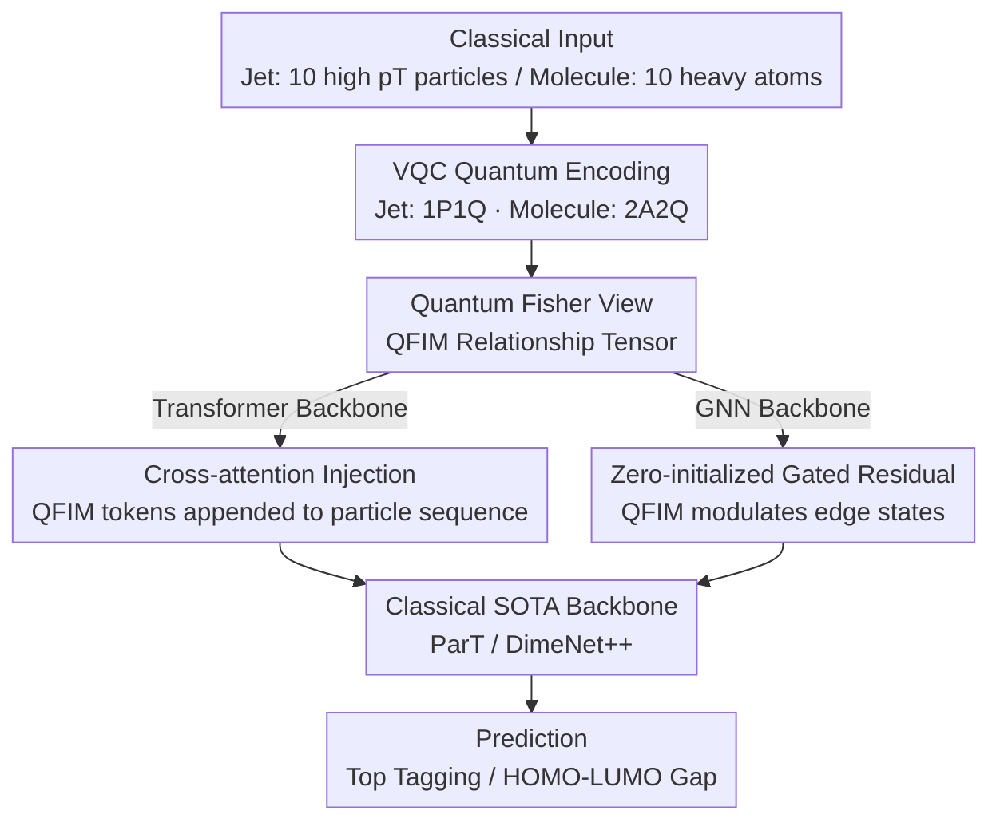

# Quiver: Quantum-Informed Views for Enhanced Representations in Large ML Models

**Conference**: ICML 2026  
**arXiv**: [2606.02785](https://arxiv.org/abs/2606.02785)  
**Code**: None (Repository not released in the paper)  
**Area**: Physics / Hybrid Quantum-Classical Learning / High-Energy Physics + Molecular Chemistry  
**Keywords**: Variational Quantum Circuits, Quantum Fisher Information Matrix, Multimodal Representation, Particle Transformer, DimeNet++  

## TL;DR
Quiver feeds categorized inputs into a Variational Quantum Circuit (VQC) to extract the Quantum Fisher Information Matrix (QFIM) as a "Quantum Geometric View." This view is then injected into classical backbones via cross-attention (for Transformers) or residual gating (for GNNs), achieving stable improvements in two distinct physical tasks: JetClass top quark tagging and QM9 HOMO-LUMO gap regression.

## Background & Motivation

**Background**: Jet tagging in high-energy physics and property prediction in molecular chemistry (QM9) are high-dimensional structured data problems. Prevailing methods, such as Particle Transformer (~2.14M parameters) and geometric/equivariant GNNs like DimeNet++, have approached SOTA on their respective benchmarks.

**Limitations of Prior Work**: These models train entirely within classical feature spaces. For samples requiring higher-order or non-local correlations (e.g., color-singlet $W$ jets vs. color-connected QCD jets, or electronic structures in QM9 that depend on multi-body correlations), models must rely on implicit learning via increased capacity, as these correlations are not explicitly "exposed."

**Key Challenge**: Classical feature constructions (kinematic variables, structural descriptors) are naturally poor at expressing multi-body coherent correlations. Simply stacking model capacity or data volume does not efficiently bridge this structural blind spot. A fundamentally different geometric perspective is required to complement classical features without redundancy.

**Goal**: The objective is split into two sub-problems: (1) extracting "geometric correlation structures" from classical inputs using quantum circuits to form a compact, system-agnostic tensor; (2) integrating this tensor into SOTA classical backbones with minimal parameter cost and physical alignment.

**Key Insight**: When a VQC $|\psi(\boldsymbol{\Theta})\rangle=U(\boldsymbol{\Theta})|0\rangle^{\otimes N}$ encodes input into a Hilbert space, the parameter manifold naturally carries the Fubini-Study metric, which is equivalent (up to a factor of 4) to the Quantum Fisher Information Matrix (QFIM). The diagonal terms of the QFIM represent "single-parameter sensitivity," while off-diagonal terms represent "coherent coupling"—the geometric encoding of "multi-body correlation" that can be calculated on classical simulators (PennyLane).

**Core Idea**: Use the "Quantum Fisher View" as a second modality complementary to the classical view. Once fused, classical backbones can directly consume quantum geometric information instead of learning it implicitly from scratch.

## Method

### Overall Architecture
Quiver = Classical Input → Task-specific VQC → QFIM Measurement → Modality Fusion Layer → SOTA Classical Backbone. Two distinct encodings are used: 1P1Q (one particle, one qubit) for jets, and a novel 2A2Q (two atoms, two qubits as a block for bond coupling) for molecules. Fusion designs are differentiated by backbone: Transformers utilize cross-attention via sequence concatenation, while GNNs use residual gating modulated by the QFIM for edge states. The VQC is simulated classically via PennyLane, with the QFIM pre-computed and cached.

### Key Designs

**1. Quantum Fisher View: Extracting Multi-body Structures Challenging for Classical Features**

Classical features (kinematics, structural descriptors) are inherently limited in expressing multi-body correlations. Quiver maps the classical input $x$ to a parameterized quantum state $|\psi(\boldsymbol{\Theta}(x),\boldsymbol{\theta})\rangle$ and calculates the QFIM at a fixed reference point $\boldsymbol{\theta}_0$:

$$F_{ij}(\boldsymbol{\theta};x)=4\,\mathrm{Re}\big[\langle\partial_i\psi|\partial_j\psi\rangle-\langle\partial_i\psi|\psi\rangle\langle\psi|\partial_j\psi\rangle\big],$$

producing a compact relationship tensor determined by the input. Its physical significance is direct: diagonal $F_{ii}$ represents local sensitivity to $\theta_i$ (dynamic importance per qubit), and off-diagonal $F_{ij}$ is non-zero only if two directions act on overlapping qubit subsystems, thus encoding coherent coupling between input dimensions. Under 1P1Q encoding (10 particles × 3 rotations/qubit), this yields a 30×30 matrix; under 2A2Q, it results in a 60×60 matrix organized by atomic pairs. Since the QFIM is the intrinsic geometry of the parameter manifold and is independent of the measurement basis, its off-diagonal elements naturally tag "joint behaviors," making this view fundamentally complementary to classical features.

**2. 2A2Q Molecular Encoding: Bonding Info in Entanglement with Symmetry Invariance**

Encoding Cartesian coordinates directly into qubits introduces reference frame dependence, which is detrimental for geometric tasks like QM9. 2A2Q employs pairwise encoding: each heavy atom is assigned one qubit with a single-atom embedding $R_Y(w_{\text{atom}}^j)|0\rangle$. For each pair of bonded atoms where $d_{ij}<d_{\text{CUTOFF}}=1.7\,\text{Å}$, three angles $\omega_1^{(ij)}, \omega_2^{(ij)}, \omega_3^{(ij)}$ (based on distance and bond type) are used to entangle the qubits via $\mathcal{U}_{ij}$. By merging encoding and entanglement into pairwise operations, the pairwise distance $d_{ij}$ remains invariant, avoiding coordinate system issues, while $e_{\text{bond}}$ allows entanglement strength to reflect chemical bonding.

**3. Differentiated Architectural Injection: Transformers vs. GNNs**

The QFIM modality must be integrated with minimal parameter cost to distinguish gains from simple capacity increases. For the Particle Transformer, 90 QFIM channels per particle are embedded via an MLP into 128-dimensional tokens $q_i$, which are appended to the classical sequence. For DimeNet++, which lacks built-in cross-modality mechanisms, a residual gate $\tilde{x}_{ij}^{(l)}=(1+\alpha\cdot\Theta(Q_{ij}))x_{ij}^{(l)}$ is used to modulate edge states, where $\alpha$ is a zero-initialized learnable scalar. Zero-initialization is a critical design choice: it ensures that at $\alpha=0$, the model is strictly equivalent to the baseline, forcing any improvement to originate from the QFIM information itself.

### Loss & Training
JetClass binary classification utilizes standard Cross-Entropy. QM9 utilizes Huber loss for robustness against outliers. VQCs are classically simulated on PennyLane, and QFIMs are computed using its standard implementation. Both tasks were executed with multiple seeds (5 for JetClass, 10 for QM9).

## Key Experimental Results

### Main Results 1: JetClass Top Quark vs. QCD Classification

| Feature Set | Model | Params | AUC ↑ | 1/ε_B @ ε_S=0.5 ↑ |
|------|------|------|------|------|
| Kin | ParT | 5M | 0.97832 ± 0.00004 | 176 ± 1 |
| Kin | **Quiver** | 5M | **0.98070 ± 0.00003** | **240 ± 1** |
| Full | ParT | 5M | 0.99235 ± 0.00003 | 1306 ± 8 |
| Full | **Quiver** | 5M | **0.99244 ± 0.00003** | **1362 ± 28** |
| Full | ParT | 0.1M | 0.98875 ± 0.00008 | 570 ± 13 |
| Full | **Quiver** | 0.1M | **0.98893 ± 0.00005** | **590 ± 7** |

With kinematics features only, Quiver (5M) increases the QCD rejection rate from 176 to 240 (+36%). With full features, it increases from 1306 to 1362 (+4%), with a parameter cost of only +7%.

### Main Results 2: QM9 HOMO-LUMO Gap Regression

| Model | Params | Test MAE (meV) ↓ | Paired Δ MAE (meV) | Rel. Reduction |
|------|------|------|------|------|
| DimeNet++ | 1.886M | 72.42 ± 1.52 | — | — |
| **𝒬DimeNet++ (Ours)** | 1.891M | **67.92 ± 1.98** | **4.50 ± 2.46** | **6.21%** |

With a param increase of only 0.27%, the paired $t$-test across 10 seeds yields $t_9=5.78, p<10^{-3}$, indicating statistical significance.

### Key Findings
- Improvements are "persistent": The Δ MAE between 𝒬DimeNet++ and the baseline remains positive across all training epochs, maintaining a gap from start to convergence.
- Gains do not vanish with scaling: Quiver outperforms baselines across 0.1M, 0.5M, and 5M parameter scales, suggesting QFIM adds information rather than just capacity.
- Minimal parameter overhead (+0.27% to +7%) yields percentage-level relative improvements, providing evidence for "quantum advantage without quantum speedup"—quantum geometric features possess intrinsic informational value even when simulated classically.
- Success across different architectures (Transformer and GNN) validates the architecture-agnostic nature of Quiver.

## Highlights & Insights
- **QFIM as a Modality, Not Auxiliary Loss**: Unlike previous hybrid methods that treat VQCs as part of an end-to-end chain, Quiver extracts QFIM as independent data, allowing SOTA classical models to consume it directly. This decoupling permits the method to run on classical simulators today without NISQ hardware dependency.
- **Experimental Design of Zero-initialized Gating**: Initializing $\alpha$ to 0 ensures baseline equivalence, making the argument that "improvements stem from QFIM information" rigorously sound and more credible than post-hoc ablation studies.
- **2A2Q Physical Awareness**: Encoding bond information into entanglement and using distance-based thresholds makes the quantum circuit a "physics-aware feature extractor," which is more suitable than general-purpose VQCs.
- **Cross-domain Stability**: Stable performance gains across high-energy physics (jets) and chemistry (molecules) strongly imply that quantum Fisher geometry captures domain-agnostic multi-body correlation structures.
- **"Harvesting the Future"**: By demonstrating quantifiable performance gains with classically simulated VQCs, this work provides a practical path for quantum machine learning research in the pre-fault-tolerant era.

## Limitations & Future Work
- Classical simulation costs limit the qubit count to $\le 10$, necessitating the truncation of JetClass particles and QM9 hydrogen atoms. Expansion requires multi-GPU nodes or real quantum hardware.
- The VQC utilizes a fixed reference $\boldsymbol{\theta}_0$. Joint optimization of the VQC and the neural model is a future direction, though it faces the technical challenge of backpropagating through QFIM measurements rather than observable expectations.
- The paper lacks a comprehensive discussion on the storage and time costs of QFIM pre-computation, particularly for industrial-scale datasets.
- The comparison against classical baselines is relatively narrow (focused on ParT and DimeNet++), missing comparisons with other "explicit higher-order correlation" methods like EFN or PointNet++.

## Related Work & Insights
- **vs. Bal et al. 2025 (1P1Q)**: While adopting their 1P1Q encoding, Quiver innovatively treats QFIM as a view fused into classical backbones rather than using VQCs for direct prediction, circumventing the performance limitations of stand-alone VQCs.
- **vs. Classical Multimodal Fusion**: Unlike image/text fusion, Quiver's second modality is generated via a physically interpretable transformation of the first, eliminating cross-modal alignment difficulties.
- **vs. Increasing Model Capacity**: Comparisons with wider baselines of equivalent parameter counts and the minimal 0.27% overhead for 𝒬DimeNet++ provide rigorous evidence that improvements are driven by information content rather than parameter stacking.

<!-- RELATED:START -->

## Related Papers

- [\[ICML 2026\] Softplus Attention with Re-weighting Boosts Length Extrapolation in Large Language Models](softplus_attention_with_re-weighting_boosts_length_extrapolation_in_large_langua.md)
- [\[ICML 2026\] TriForces: Augmenting Atomistic GNNs for Transferable Representations](triforces_augmenting_atomistic_gnns_for_transferable_representations.md)
- [\[ICML 2025\] L2D: Large Language Models to Diffusion Finetuning](../../ICML2025/physics/large_language_models_to_diffusion_finetuning.md)
- [\[AAAI 2026\] SAOT: An Enhanced Locality-Aware Spectral Transformer for Solving PDEs](../../AAAI2026/physics/saot_an_enhanced_locality-aware_spectral_transformer_for_solving_pdes.md)
- [\[ICLR 2026\] Augmenting Representations with Scientific Papers](../../ICLR2026/physics/augmenting_representations_with_scientific_papers.md)

<!-- RELATED:END -->
