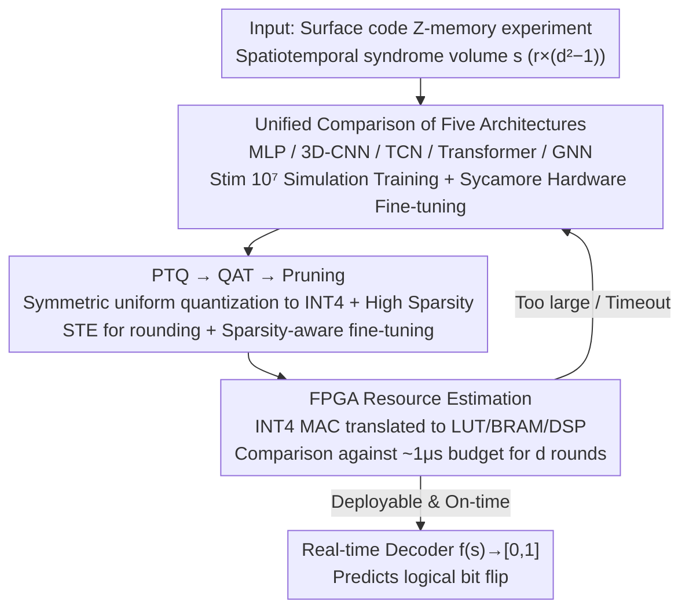

# Rethink the Role of Neural Decoders in Quantum Error Correction

**Conference**: ICML 2026  
**arXiv**: [2605.12046](https://arxiv.org/abs/2605.12046)  
**Code**: Not yet public  
**Area**: Quantum Error Correction / Neural Compression & Hardware Deployment  
**Keywords**: Surface Code, Neural Decoder, FPGA, INT4 Quantization, Inductive Bias

## TL;DR
This paper systematically re-evaluates five types of neural decoders (MLP, 3D-CNN, TCN, Transformer, and GNN) on surface codes with $d\le9$. By integrating "quantization + pruning + FPGA resource modeling" as first-class citizens into the training pipeline, the study concludes that contemporary decoding performance is dominated by data volume rather than architectural complexity, and that INT4 + QAT is a necessary prerequisite for achieving microsecond-level real-time decoding.

## Background & Motivation
**Background**: In Quantum Error Correction (QEC), surface codes combined with real-time decoding are considered essential algorithmic primitives toward fault-tolerant quantum computing. Traditional methods like MWPM and BP represent extremes in accuracy and speed, respectively. Recently, neural decoders (e.g., AlphaQubit, TCN, GNN-BP) have been frequently published, highlighting "high accuracy" as a primary selling point.

**Limitations of Prior Work**: Existing neural decoders generally compare only logical error rates, rarely discussing real-world deployment constraints such as microsecond-level latency, FPGA resource consumption, or low-bit-width quantization. Furthermore, it has never been systematically verified whether reported improvements stem from architectural innovation or simply larger training sets through controlled variable experiments.

**Key Challenge**: QEC decoding must physically satisfy two contradictory requirements: accuracy must be high enough to "exponentially suppress" logical errors, while inference must be completed within $\sim 1\mu s$ to keep pace with the coherence time windows of superconducting qubits. Previous works often optimized only one side, resulting in SOTA models in literature that are undeployable on hardware.

**Goal**: To treat accuracy and latency as two sides of the same objective, answering two specific questions: Q1: Does the performance gain come from the architecture or the data? Q2: How can neural decoders be made to truly complete inference on time on FPGAs?

**Key Insight**: Using "surface code + Z-memory experiments + binary classification objective" as a unified benchmark, the authors re-implement five representative architectures. By coupling these with an end-to-end pruning + PTQ/QAT compression pipeline and FPGA resource modeling, all methods are forced to undergo simultaneous scrutiny for both accuracy and latency.

**Core Idea**: Replace "architecture stacking + post-processing compression" with "data-priority + moderate inductive bias + INT4 QAT." The study proves that small models with $\sim 10^5$ parameters can approach performance saturation for $d\le9$ while satisfying real-time FPGA constraints.

## Method

### Overall Architecture
The work centers on a unified binary classification task: feeding a spatiotemporal syndrome volume $s$ of size $r\times(d^2-1)$ generated from surface code Z-memory experiments into a network $f(s;\theta)\in[0,1]$ to predict whether a logical bit flip occurred. Under this fixed interface, the paper performs three steps. First, it re-trains five architectures with different inductive biases (MLP / dilated 3D-CNN / TCN / Transformer / GNN) on a large-scale Stim-simulated dataset and fine-tunes them with Sycamore hardware data to answer if gains come from architecture or data. Second, it compresses each network down to INT4 + high sparsity to check accuracy retention. Finally, it translates the compressed networks into FPGA resource usage and latency to determine if they can run within the $1\mu s$ window.

### Key Designs

**1. Unified Comparison of Five Architectures: Decoupling Bias vs. Data**
Previous improvements were often not clearly attributed to architectural intelligence or training set size. This paper evaluates five representative inductive biases under identical datasets and ground truths: MLP flattens $s$ as a zero-bias baseline; 3D-CNN uses $3\times3\times3$ dilated convolutions to preserve resolution without pooling; TCN assigns space to 2D convs and time to 1D convs to avoid RNN saturation at low bit widths; Transformer uses a convolutional tokenizer with positional encoding to alleviate embedding degradation of sparse inputs; GNN performs learnable message passing on the Tanner graph (a "neural BP") to mitigate oscillations caused by short cycles in surface codes.

**2. PTQ → QAT → Pruning: Shifting Networks into FPGA LUTs instead of scarce DSPs**
Compression is treated as a design component rather than an afterthought. Symmetric uniform quantization $x_{int} = \mathrm{clamp}(\lfloor x/\eta\rceil,\, -2^{b-1},\, 2^{b-1}-1)\cdot\eta$ is applied with per-channel weights and per-tensor activations. PTQ initially serves as a feasibility probe, though it causes accuracy to collapse at INT4. Thus, the pipeline switches to QAT, using a straight-through estimator (STE) for backpropagation. Finally, unstructured pruning is applied via a binary mask with threshold $\tau_k$. Focusing on INT4 + sparsity allows multiplications to be implemented via LUTs, while static zero weights are trimmed by synthesis tools, fitting the network into the timing budget.

**3. FPGA Resource Estimation: Rejecting Infeasible Designs Early**
The paper turns "inference completion on target FPGA" into a calculable metric to constrain architecture and bit-width choices. Networks are decomposed into total INT4 MAC counts and translated into LUT consumption per Processing Element (PE), alongside BRAM and DSP requirements. Wall-clock latency is estimated based on clock frequency and compared against the $\sim 1\mu s$ physical budget for $d$ rounds. Resource estimation thus acts as a feedback loop during training.

### Loss & Training
The objective is standard Binary Cross Entropy: $\mathcal{L} = -\mathbb{E}_{(s,y)}[y\log f(s) + (1-y)\log(1-f(s))]$. Stim simulations provide a large-scale training set of $10^7$ samples, while Sycamore hardware data is used for fine-tuning at $d=3,5$. INT4 QAT is implemented via Brevitas, initialized with pre-trained FP32 parameters to accelerate convergence.

## Key Experimental Results

### Main Results

| Setting | Architecture / Config | Key Findings |
|------|------------|----------|
| $d=9$ surface code, Stim $10^7$ samples | Simple CNN/TCN | Decoding accuracy approaches saturation, significantly outperforming complex architectures trained on standard datasets |
| MLP | Any scale | Fails to scale even with increased parameters, proving zero inductive bias is non-viable |
| GNN-BP | $d\le9$ | Significantly affected by short cycles, overall lagging behind CNN/TCN |
| INT4 PTQ | Most models | Accuracy "cliff" observed; logical error rate increases dramatically |
| INT4 QAT | Most models | Successfully restores performance to FP32 levels; essential for 1μs latency |

### Ablation Study

| Configuration | Effect |
|------|------|
| Large Data + Simple CNN | Superior to "Small Data + Complex Architecture" |
| Local Conv + Temporal Aggregation (CNN+TCN) | Most robust across all scales |
| Transformer w/o Conv Tokenizer | Significant accuracy drop due to embedding degradation |
| GNN (Neural BP) | Resolves BP oscillation but remains limited by graph topology |
| Pruning only (No Quantization) | Fails to reach LUT-bound region; latency budget not met |

### Key Findings
- "Increasing data" provides higher decoding gains for $d\le9$ surface codes than "changing architecture." This implies industrial QEC investment should prioritize simulation/hardware data generation over model innovation.
- Inductive bias is indispensable: Pure MLP does not scale, and GNN-BP suffers from short cycles. Only "local + temporal" combinations like CNN/TCN are consistently superior.
- INT4 is a hard constraint, not just a performance optimization: Only QAT can sustain INT4; PTQ almost always fails. Microsecond-level real-time decoding requires hardware awareness during the training phase.

## Highlights & Insights
- Treating "FPGA resources" as a hard constraint within the pipeline allows complex but "seemingly SOTA" decoders to be immediately rejected at the engineering level. This co-design approach is applicable to other latency-critical fields like autonomous driving and network packet processing.
- The unified re-implementation provides a design checklist for future QEC neural decoders: biases must include local + temporal elements, parameter counts of $\sim 10^5$ are sufficient, and INT4 is the baseline requirement.
- The data-driven discovery (Simple Net + Big Data > Complex Net + Standard Data) serves as a reminder against the tendency toward "over-engineering" in ML4Science.

## Limitations & Future Work
- Evaluations are limited to $d=9$ (161 physical qubits); inductive bias choices and latency feasibility for higher code distances remain uncharacterized.
- FPGA resource estimation is based on linear MAC decomposition and does not account for real power consumption post-routing/placement.
- There is no theoretical lower bound provided for the accuracy gap of INT4 training relative to FP32, leaving "why INT4 is sufficient" as an open question.

## Related Work & Insights
- **vs. AlphaQubit Series**: This work serves as an engineered, deployable "stress test" version, evaluating transformer blocks under INT4 LUT-bound settings.
- **vs. MWPM/BP**: While traditional decoders remain "general + heuristic," this paper shows neural decoders can consistently surpass them with sufficient data, provided they are compressed for real-time feasibility.
- **vs. General Model Compression (e.g., Gholami et al.)**: This work does not propose a new compression algorithm but rather strictly combines existing PTQ/QAT/pruning under hardware constraints to validate boundaries in the QEC context.

## Rating
- Novelty: ⭐⭐⭐ (Main contribution is the systematic comparison and hardware-aware pipeline)
- Experimental Thoroughness: ⭐⭐⭐⭐⭐ (5 architectures × multiple $d$ × simulation + hardware + full FPGA modeling)
- Writing Quality: ⭐⭐⭐⭐ (Clearly argued through the core Q1/Q2 questions)
- Value: ⭐⭐⭐⭐ (Provides a rare empirical baseline for "AI for QEC" deployment, directly usable for hardware team selection)

<!-- RELATED:START -->

## Related Papers

- [\[ICLR 2026\] SAQ: Stabilizer-Aware Quantum Error Correction Decoder](../../ICLR2026/physics/saq_stabilizer-aware_quantum_error_correction_decoder.md)
- [\[ICML 2025\] Rethink the Role of Deep Learning towards Large-scale Quantum Systems](../../ICML2025/physics/rethink_the_role_of_deep_learning_towards_large-scale_quantum_systems.md)
- [\[ICML 2026\] Score-Based Error Correcting Code Decoder](score_based_error_correcting_code_decoder.md)
- [\[ICML 2026\] Quiver: Quantum-Informed Views for Enhanced Representations in Large ML Models](quiver_quantum-informed_views_for_enhanced_representations_in_large_ml_models.md)
- [\[ICML 2026\] ANTIC: Adaptive Neural Temporal In-situ Compressor](antic_adaptive_neural_temporal_in-situ_compressor.md)

<!-- RELATED:END -->
