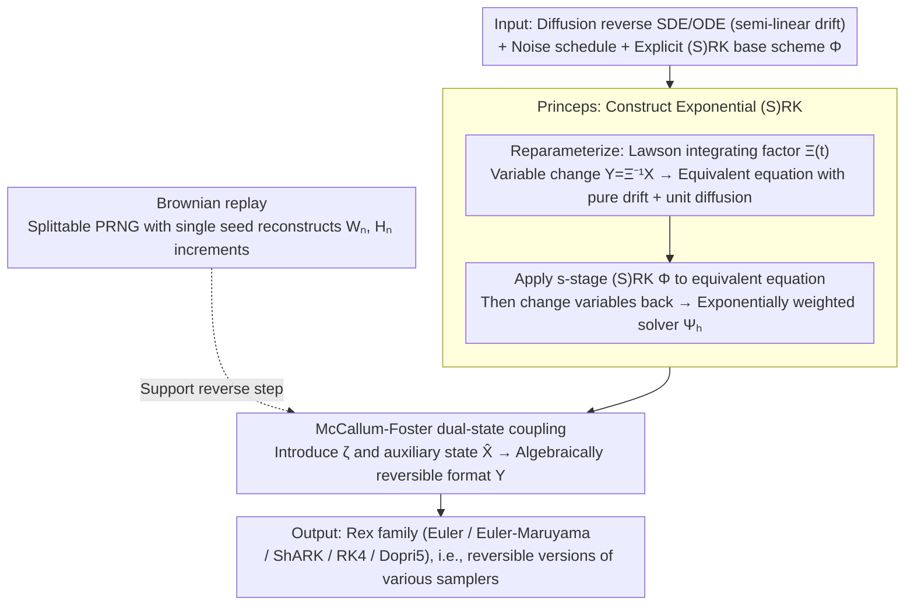

# REX: A Family of Reversible Exponential Stochastic Runge-Kutta Solvers

**Conference**: ICML 2026 Oral  
**arXiv**: [2502.08834](https://arxiv.org/abs/2502.08834)  
**Code**: https://github.com/zblasingame/Rex-solver  
**Area**: Scientific Computing / Numerical Methods / Diffusion Model Sampling  
**Keywords**: Reversible solvers, exponential integrators, stochastic Runge-Kutta, diffusion model inversion, Boltzmann sampling

## TL;DR
This paper proposes Rex—a family of algebraically reversible (stochastic) Runge-Kutta solvers constructed based on Lawson exponential integrators. It automatically transforms any explicit (S)RK scheme into a precisely invertible ODE/SDE solver, ensuring arbitrary high-order convergence and non-zero stability regions while achieving near machine-precision inversion for diffusion model image reconstruction/editing and Boltzmann sampling in flow models.

## Background & Motivation
**Background**: Diffusion models and continuous normalizing flows based on neural differential equations have become SOTA for generative tasks. Forward integration (noise to data) utilizes high-order (S)RK formats like DDIM, DPM-Solver, or SEEDS-1. Many critical applications—gradient descent fine-tuning through generative models, real-world image editing, differentiable rewards, and exact likelihoods for Boltzmann distributions—require **backward integration (data to noise) to be strictly precise**.

**Limitations of Prior Work**: Standard explicit solvers accumulate discretization errors $\varepsilon>0$ during forward-backward round trips, causing the end point to deviate from the original trajectory. Existing "exact inversion" methods (EDICT, BDIA, BELM/O-BELM, etc.) face significant issues: poor stability (BDIA's LPIPS reaches 0.885 in editing tasks), low order, and **primary limitation to ODEs**. Reversible schemes for diffusion SDEs remain mostly non-existent, except for "pseudo-reversible" solutions that store the entire Brownian motion in memory.

**Key Challenge**: Achieving algebraic reversibility (operator-level equality), high-order accuracy, non-zero linear stability regions, adaptive step sizes, and SDE support simultaneously is difficult. The McCallum-Foster (MF) method achieved "reversible + non-zero stability region" for ODEs but did not support SDEs or utilize the semi-linear structure $f(t)\bm{x} + g(t)\bm{f}_\theta$ common in diffusion models.

**Goal**: (1) Extend the reversibility of MF to diffusion SDEs; (2) fully utilize the semi-linear structure to construct exponential integrators for significantly improved accuracy; (3) support adaptive step sizes while retaining arbitrary order convergence and non-zero stability regions.

**Key Insight**: The drift term of diffusion ODE/SDEs naturally follows a semi-linear form $a(t)\bm{x}+b(t)\bm{f}_\theta$. Implementing an integrating factor $\Xi(t)=\exp\int_0^t a(\tau)d\tau$ via the Lawson method allows changing the state variable to $\bm{Y}=\Xi^{-1}\bm{X}$. This results in an equivalent SDE with **pure drift + unit diffusion**. Applying explicit (S)RK and MF wrapping to this "clean" equation, then transforming the variables back, forms the three-step recipe for Rex.

**Core Idea**: Use Lawson exponential integrators to handle the semi-linear component and wrap explicit (S)RKs with McCallum-Foster coupling to construct a family of diffusion solvers that are simultaneously invertible, high-order, stable, and SDE-compatible.

## Method
Rex is a **recipe** rather than a single format: given an explicit (S)RK scheme $\bm{\Phi}$, Rex (denoted as $\bm{\Upsilon}$) is derived through three steps.

### Overall Architecture
- **Input**: Diffusion reverse SDE $d\bm{X}_t=[f(t)\bm{X}_t-g^2(t)\nabla\log p_t(\bm{X}_t)]dt+g(t)d\bar{\bm{W}}_t$ (or similar ODE), noise schedule $(\alpha_t,\sigma_t)$, and the extended Butcher tableau of the explicit (S)RK base scheme $\bm{\Phi}$.
- **Mechanism**:
  1. **Reparameterize**: Formulate as $d\bm{X}_t=[a(t)\bm{X}_t+b(t)\bm{f}_\theta]dt+g(t)d\bar{\bm{W}}_t$. Use integrating factor $\Xi(t)=\exp\int_0^t a(\tau)d\tau$ and time transformation $\varsigma_t=\int\Xi^{-1}(t)b(t)dt$ to obtain $d\bm{Y}_\varsigma=\bm{f}_\theta(\varsigma,\Xi(\varsigma)\bm{Y}_\varsigma)d\varsigma+d\bm{W}_\varsigma$ (Prop 3.1).
  2. **Princeps**: Apply explicit (S)RK $\bm{\Phi}$ to the transformed equation, then change variables back to the original $\bm{X}$ to obtain the exponentially weighted solver $\bm{\Psi}_h$ (Eq 11). Princeps encompasses DDIM, DPM-Solver-1/2/12, DPM-Solver++, SDE-DPM-Solver, SEEDS-1, and gDDIM (Thm 3.3).
  3. **Rex**: Wrap $\bm{\Psi}_h$ in McCallum-Foster dual-state coupling to obtain the reversible format $\bm{\Upsilon}$ (Prop 3.2).
- **Output**: A family of solvers such as Rex (Euler), Rex (Euler-Maruyama), Rex (ShARK), Rex (RK4), Rex (Dopri5), etc., serving as "reversible versions" of DDIM, DPM-Solver, etc.

### Key Designs

**1. Princeps: Merging explicit (S)RK and semi-linear structure into "Exponential (S)RK"**

The drift of diffusion reverse SDEs is naturally semi-linear ($a(t)\bm{x}+b(t)\bm{f}_\theta$). Direct application of explicit (S)RK fails to exploit this structure. Princeps utilizes the Lawson integrating factor to transform the equation: letting $\bm{Y}=\Xi^{-1}\bm{X}$ results in $d\bm{Y}_\varsigma=\bm{f}_\theta(\varsigma,\Xi(\varsigma)\bm{Y}_\varsigma)d\varsigma+d\bm{W}_\varsigma$. Applying $s$-stage SRK results in: $\bm{Z}_i=\Xi^{-1}(\varsigma_n)\bm{X}_n+h\sum_{j<i}a_{ij}\bm{f}_\theta^j+a_i^W\bm{W}_n+a_i^H\bm{H}_n$. Stepping back to $\bm{X}$ yields:
$$\bm{X}_{n+1}=\frac{\Xi(\varsigma_{n+1})}{\Xi(\varsigma_n)}\bm{X}_n+\Xi(\varsigma_{n+1})\bm{\Psi},$$
where $\bm{H}_n$ is the space-time Lévy area. Exponential weighting handles the semi-linear component for precision, while (S)RK provides higher order. This inherits the base scheme's order (Thm 3.4) and covers DDIM, DPM-Solver, and SEEDS-1 (Thm 3.3).

**2. McCallum-Foster dual-state coupling: General algebraic reversibility**

To ensure strict reversibility, Ours wraps the Princeps $\bm{\Psi}$ within McCallum-Foster dual-state coupling. Introducing parameter $\zeta\in(0,1]$ and auxiliary state $\hat{\bm{X}}_n$, the forward step is:
$$\bm{X}_{n+1}=\tfrac{\kappa_{n+1}}{\kappa_n}\big(\zeta\bm{X}_n+(1-\zeta)\hat{\bm{X}}_n\big)+\kappa_{n+1}\bm{\Psi}_h(\varsigma_n,\hat{\bm{X}}_n,\bm{W}_n),\quad \hat{\bm{X}}_{n+1}=\tfrac{\kappa_{n+1}}{\kappa_n}\hat{\bm{X}}_n-\kappa_{n+1}\bm{\Psi}_{-h}(\varsigma_{n+1},\bm{X}_{n+1},\bm{W}_n).$$
The backward step can be solved in closed form for $\hat{\bm{X}}_n,\bm{X}_n$. Rex inherits the non-zero linear stability region of MF. The $\zeta$ parameter acts as a toggle between "inversion precision" and "stability" (e.g., $\zeta=0.999$ for image editing and $\zeta=0.001$ for stable Boltzmann sampling).

**3. Brownian motion replay: Splittable PRNG instead of trajectory caching**

Reverse SDE iteration requires the **exact same** Brownian realization $\bm{W}_n(\omega)$ as the forward step. Unlike prior methods that store the full trajectory (causing memory explosion and preventing adaptive steps), Rex uses a splittable PRNG. This generates Brownian increments and space-time Lévy areas $\bm{H}_{s,t}$ for any interval $[s,t]$ from a single seed via a binary tree. This makes Rex the first solver capable of exact diffusion SDE inversion without full trajectory storage, enabling adaptive step schemes like Rex (Dopri5).

### Loss & Training
Rex is a pure **inference-time solver** and requires no new training loss. It can replace existing samplers in pre-trained models (DDPM, SD v1.5, DiT). Thm 3.4 proves that if $\bm{\Phi}$ is a $k$-th order RK, Rex is a $k$-th order reversible solver $\|\bm{x}_n-\bm{x}_{t_n}\|\le Ch^k$ under variance-preserving schedules. Thm 3.5 proves the strong convergence order $\xi$ of SRK is fully inherited by Princeps.

## Key Experimental Results

### Main Results

| Task | Method | Key Metrics | Remarks |
|------|------|---------|------|
| SD v1.5 Recon Error (50 steps FP32, latent MSE) | DDIM | Order ≫ Rex | Non-reversible baseline |
| Same as above | EDICT / BDIA / O-BELM | 1–several orders higher than Rex | O-BELM error grows with steps (unstable) |
| Same as above | **Rex (Euler)** | **Close to machine precision** | Lowest across all steps (10/20/50) |
| Text-to-Img (COCO, SD v1.5) | EDICT / BDIA / O-BELM | Inferior to Rex | Across three metrics |
| Same as above | **Rex (Euler-Maruyama / ShARK)** | **Top Image Reward & PickScore** | SDE variants lead |
| Image Editing (pix2pix, 50+50 steps) | DDIM (non-reversible) | LPIPS = 0.214 | Baseline |
| Same as above | O-BELM (SOTA reversible) | LPIPS = 0.140 | |
| Same as above | BDIA | LPIPS = 0.885, ImgReward = −2.21 | Catastrophic failure (no stability region) |
| Same as above | **Rex (Dopri5)** | **LPIPS = 0.107**, Top Reward/PickScore | ~2× improvement; first adaptive reversible solver |
| Boltzmann Sampling (tri-alanine, $10^4$ samples) | DiT + Dopri5 (non-rev.) | ESS=0.140, $\mathcal{E}\text{-}\mathcal{W}_2$=0.737 | Control for inversion necessity |
| Same as above | **DiT + Rex (Dopri5)** | ESS=0.104, $\mathcal{E}\text{-}\mathcal{W}_2$=**0.495** | Energy distribution most accurate |

### Ablation Study

| Configuration | Key Observation | Description |
|------|---------|------|
| Rex (Euler) vs Rex (RK4) in Recon | Euler stronger on CelebA-HQ FD/Precision | High-order inversion may not lead in low-step regimes (App. H.2). |
| $\zeta=0.999$ vs $\zeta=0.001$ | Precise inversion vs Max stability | Same Rex covers different use cases via $\zeta$ toggle. |
| BDIA / O-BELM (Stability) | Error diverges with steps | Validates Rex necessity for inheriting MF stability regions. |
| Rex on SD v1.5 (No-tuning) | Outperforms tuned O-BELM / EDICT | Demonstrates recipe robustness without hyperparameter tuning. |
| Princeps Universality | Strictly covers DDIM, DPM-Solver, SEEDS-1 | Provides a "free upgrade" to existing pipelines. |

### Key Findings
- **Only stable reversible SDE solver**: Rex is the first to achieve exact diffusion SDE inversion without trajectory caching, enabling SDE editing and SDE Boltzmann sampling.
- **Criticality of stability regions**: The failure of BDIA and O-BELM in reconstruction/editing correlates strongly with the lack of linear stability regions—Rex benefits immediately from inheriting the MF stability region.
- **No trade-off between inversion and sampling quality**: Rex not only reduces reconstruction error by orders of magnitude but also **outperforms non-reversible DDIM** in generation quality (CelebA-HQ FD).
- **Adaptive step sizing is a major unlock**: Rex (Dopri5) reduces editing LPIPS from 0.140 to 0.107, an improvement previously impossible for reversible methods.

## Highlights & Insights
- **"Operator Recipe" over "Format"**: Ours provides a standardized process to **make any explicit (S)RK reversible**. Future samplers can be instantly converted via Princeps + MF wrapping.
- **Princeps as a Unified Theory**: Thm 3.3 proves Princeps covers almost all mainstream samplers, identifying them as specializations of explicit (S)RKs under exponential integrators.
- **Splittable PRNG for Engineering Success**: Replacing trajectory caching with seed-based replay reduces memory complexity from $O(N)$ to $O(1)$, making high-resolution reversible SDEs practical.
- **The $\zeta$ Toggle Insight**: Decoding "precise inversion" from "stability" via $\zeta$ provides a parameterization applicable to any "hard constraint vs. soft optimization" design space.
- **Transferability to Semi-linear Systems**: The methodology applies to any SDE of the form $d\bm{X}=a(t)\bm{X}dt+b(t)\bm{f}_\theta dt+g d\bm{W}$, including flow matching and molecular generators.

## Limitations & Future Work
- **Theoretical scope**: Convergence proofs currently focus on variance-preserving (VP) schedules; VE schedules require further analysis.
- **Noise structure**: Dependent on additive noise; multiplicative noise SDEs are not yet supported.
- **High-order performance**: High-order Rex may not always be superior in shallow step counts, consistent with standard SDE solver behavior.
- **Computational overhead**: Calculating space-time Lévy areas via splittable PRNG incurs additional costs; wall-clock comparisons were not detailed.
- **Future Directions**: Applying Rex to differentiable rewards in flow matching, molecule generation, and limited-time optimal transport.

## Related Work & Insights
- **vs McCallum-Foster (2024)**: MF provided the "reversible + stable" ODE wrapper; Rex expands this with exponential integrators for semi-linear structures and SDE support.
- **vs EDICT / BDIA / O-BELM**: These are ad-hoc for diffusion ODEs but lack stability regions; Rex offers a more stable and unified generic wrapper.
- **vs SDE caching (Nie 2024)**: These use trivial reversibility (caching $\bm{W}$); Rex achieves $O(1)$ memory via splittable PRNG.
- **vs DPM-Solver / SEEDS-1**: Rex provides the "reversible upgrade" to these popular samplers via the Princeps framework.

## Rating
- Novelty: ⭐⭐⭐⭐⭐ 
- Experimental Thoroughness: ⭐⭐⭐⭐⭐ 
- Writing Quality: ⭐⭐⭐⭐⭐ 
- Value: ⭐⭐⭐⭐⭐ 

<!-- RELATED:START -->

## Related Papers

- [\[NeurIPS 2025\] Quantum Doubly Stochastic Transformers](../../NeurIPS2025/physics/quantum_doubly_stochastic_transformers.md)
- [\[NeurIPS 2025\] Adaptive Stochastic Coefficients for Accelerating Diffusion Sampling](../../NeurIPS2025/physics/adaptive_stochastic_coefficients_for_accelerating_diffusion_sampling.md)
- [\[ICML 2026\] Iterative Refinement Neural Operators are Learned Fixed-Point Solvers: A Principled Approach to Spectral Bias Mitigation](iterative_refinement_neural_operators_are_learned_fixed-point_solvers_a_principl.md)
- [\[NeurIPS 2025\] Hamiltonian Neural PDE Solvers through Functional Approximation](../../NeurIPS2025/physics/hamiltonian_neural_pde_solvers_through_functional_approximation.md)
- [\[NeurIPS 2025\] INC: An Indirect Neural Corrector for Auto-Regressive Hybrid PDE Solvers](../../NeurIPS2025/physics/inc_an_indirect_neural_corrector_for_auto-regressive_hybrid_pde_solvers.md)

<!-- RELATED:END -->
