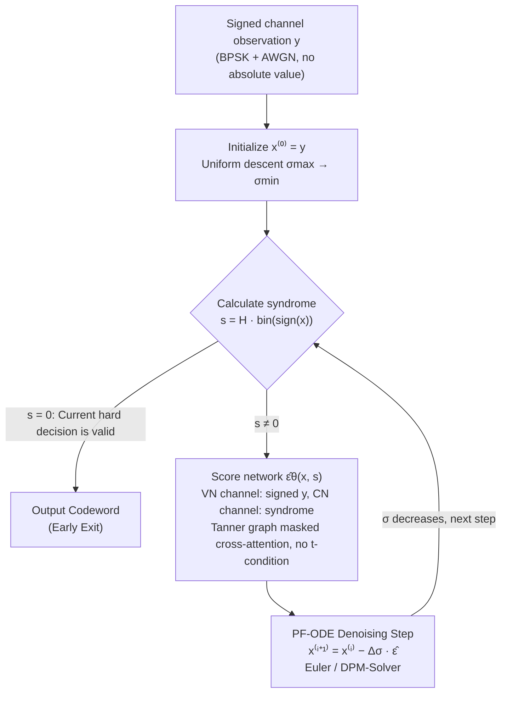

# Score-Based Error Correcting Code Decoder

**Conference**: ICML2026  
**arXiv**: [2605.28358](https://arxiv.org/abs/2605.28358)  
**Code**: https://github.com/alonhelvits/SB-ECC  
**Area**: Signal & Communications / Neural Decoding / Diffusion Models  
**Keywords**: Error Correcting Codes, Score-based Models, Probability Flow ODE, Neural Decoding, DPM-Solver

## TL;DR
This paper proposes SB-ECC: reinterpreting the soft decoding of binary linear block codes as the reverse denoising of a Variance Exploding (VE) diffusion process. By using a **time-unconditional** score network that directly accepts **signed channel observations** $\mathbf{y}$ to solve a parity-constraint-guided Probability Flow ODE, it achieves the best BER in 39 out of 42 code-SNR configurations, with an average SNR gain of 0.17 dB and a maximum of 0.46 dB.

## Background & Motivation

**Background**: Soft decoding of Error Correcting Codes (ECC) has long been dominated by iterative algorithms like Belief Propagation (BP) over factor graphs. In the deep learning era, research has branched into two paths: (a) *model-driven* neural decoders that unfold BP/Min-Sum into trainable networks, preserving the Tanner graph structure; (b) *model-agnostic* decoders that directly learn the $\mathbf{y} \mapsto$ codeword mapping. Transformer-based decoders like ECCT and CrossMPT use parity-check matrix $H$-guided masked attention to inject the inductive bias of (a) into the flexible architectures of (b), outperforming classical BP. Recently, DDECC introduced diffusion concepts to channel decoding, viewing "transmission as forward noise addition and decoding as reverse denoising."

**Limitations of Prior Work**: Current strong baselines (ECCT / CrossMPT / DDECC) share a seemingly harmless but practically restrictive preprocessing choice—taking the absolute value of channel observations $\mathbf{y} \mapsto |\mathbf{y}|$ to obtain "reliability," which is then fed into the network along with the syndrome calculated from hard decisions. This has two issues:
1. The mapping $\mathbf{y} \mapsto |\mathbf{y}|$ is **non-invertible**: all $2^n$ points in the set $\{\mathbf{s} \odot \mathbf{y} : \mathbf{s} \in \{\pm 1\}^n\}$ are mapped to the same input, discarding directional information;
2. These methods directly predict bit logits, whereas diffusion/score models naturally learn a **continuous vector field** in $\mathbb{R}^n$, creating an inherent mismatch between discrete bit outputs and continuous ODE solving.

**Key Challenge**: Implementing diffusion models (like DDECC) within the "reliability preprocessing + discrete bit output" framework diminishes the geometric advantages of score models. However, preserving geometry risks overfitting due to the extreme sparsity of training samples relative to the codeword space $|\mathcal{C}|=2^k$ (a classic pain point noted by Bennatan et al., 2018).

**Goal**: (a) Design a decoder that directly processes signed $\mathbf{y}$ and outputs continuous denoising directions in $\mathbb{R}^n$; (b) Remove the conditional dependence on SNR/time during inference, as the receiver usually does not know the exact channel SNR; (c) Allow for adjustable computational budgets, enabling flexible selection of ODE solver steps based on latency requirements.

**Key Insight**: The authors observe that an AWGN channel $\mathbf{y} = \mathbf{x}_s + \mathbf{z},\ \mathbf{z}\sim\mathcal{N}(\mathbf{0},\sigma_{ch}^2 I)$ is essentially a marginal of a VE diffusion process at some unknown $t^\star$. Thus, the entire AWGN channel can be treated as a "single slice of forward diffusion," and decoding becomes reverse integration along the PF-ODE to $t=0$.

**Core Idea**: Use a **time/SNR-independent** score network $\hat{\boldsymbol{\epsilon}}_\theta(\mathbf{y}, \mathbf{s})$ that accepts signed $\mathbf{y}$ and the syndrome to run a parity-guided PF-ODE on a uniform $\sigma$-space, fully preserving the channel geometry.

## Method

### Overall Architecture

SB-ECC views decoding as a reverse denoising trajectory in $\sigma$-space:

1. **Modeling Perspective**: After BPSK, $\mathbf{x}_0 \in \{\pm 1\}^n$ passed through AWGN yields $\mathbf{y} = \mathbf{x}_0 + \sigma_{ch}\boldsymbol{\epsilon}$. This is equivalent to the VE-SDE marginal $\mathbf{x}_t = \mathbf{x}_0 + \sigma(t)\boldsymbol{\epsilon}$ at $\sigma(t^\star) = \sigma_{ch}$.
2. **Training**: Sample $t\sim\mathcal{U}(0,1)$ uniformly, sample Gaussian noise $\boldsymbol{\epsilon}$, and construct synthetic observations $\mathbf{y} = \mathbf{x}_0 + \sigma(t)\boldsymbol{\epsilon}$. Calculate the syndrome $\mathbf{s} = H\,\mathrm{bin}(\mathrm{sign}(\mathbf{y}))^\top$. The network fits $\boldsymbol{\epsilon}$ via noise prediction. Notably, the network **does not receive** $t$ or $\sigma$, eliminating the need for SNR estimation during inference.
3. **Inference (Algorithm 2 — Early-Exit Decoding)**: Starting from $\mathbf{x}^{(0)} = \mathbf{y}$, calculate the syndrome at each step. If $\mathbf{s}=0$, the current hard decision is a valid codeword, and the process exits early. Otherwise, call $\hat{\boldsymbol{\epsilon}}_\theta(\mathbf{x}^{(i)}, \mathbf{s})$ for the denoising direction and use an Euler step $\mathbf{x}^{(i+1)} = \mathbf{x}^{(i)} - \Delta\sigma\,\hat{\boldsymbol{\epsilon}}$, descending uniformly from $\sigma_{\max} \to \sigma_{\min}$.
4. **Solver Substitution**: Euler can be seamlessly replaced by DPM-Solver (which fits the linear $\sigma$-schedule naturally), reducing end-to-end latency by an average of 8.86% and a maximum of 12.82% without performance loss.

### Key Designs

**1. Signed Inputs + Tanner Graph Masked Attention: Preserving Geometry without Losing Structure**

Strong baselines (ECCT/CrossMPT/DDECC) preprocess channel observations as absolute values $\mathbf{y}\mapsto|\mathbf{y}|$ to represent "reliability." This is a $2^n$-to-1 folding mapping that discards directional information for each coordinate—information crucial for score-field learning. SB-ECC adopts the dual-modality architecture of CrossMPT (variable node tokens and check node tokens exchanging messages via $H$-guided masked cross-attention) but changes the VN channel from $|\mathbf{y}|$ to signed $\mathbf{y}$. The output is changed from "bit flip probabilities/logits" to the denoising direction $\hat{\boldsymbol{\epsilon}}_\theta$ in $\mathbb{R}^n$. This approach preserves geometric information for the vector field while using $H$-guided attention to inject parity constraints, preventing the model from being overwhelmed by the $2^k$ combinatorics of the codeword space.

**2. Time-Unconditional + Linear $\sigma$-schedule: No SNR Estimation Required**

Actual receivers often lack accurate channel SNR, and SNR-conditioned models are sensitive to SNR bias. The authors note that the AWGN channel $\mathbf{y}=\mathbf{x}_0+\sigma_{ch}\boldsymbol{\epsilon}$ exactly matches the VE-SDE marginal $\mathbf{x}_t=\mathbf{x}_0+\sigma(t)\boldsymbol{\epsilon}$ at $\sigma(t^\star)=\sigma_{ch}$. By taking a linear schedule $\sigma(t)=\sigma_{\min}+(\sigma_{\max}-\sigma_{\min})t$ with $t\sim\mathcal{U}(0,1)$ during training, the network learns a denoising field shared across all SNR levels. During inference, one proceeds along a fixed $\sigma$-grid for $N_{\text{steps}}$ without estimating $\sigma_{ch}$. While the network must learn a robust "mean field," the syndrome implicitly provides a strong signal regarding the distance to a valid codeword.

**3. Parity-guided PF-ODE + Early Exit: Adjustable Accuracy and Controllable Latency**

Parity constraints are treated as soft guidance within the Probability Flow ODE $d\mathbf{x}_t=-\tfrac12 g(t)^2\nabla_{\mathbf{x}}\log p_t(\mathbf{x}_t)\,dt$, with $\hat{\boldsymbol{\epsilon}}_\theta(\mathbf{x},\mathbf{s})$ replacing the score. At each iteration, the hard decision and syndrome are recalculated. If the syndrome is zero, the process terminates early—naturally porting the "syndrome-check" early exit of traditional BP into continuous dynamics. Replacing Euler steps with DPM-Solver allows the budget of $N_{\text{steps}}$ NFEs to achieve equivalent BER with fewer actual steps. Combined with time-unconditionality, inference becomes a tunable slider for accuracy vs. latency.

### Loss & Training
A single denoising loss is used: $\mathcal{L}_\epsilon = \mathbb{E}\|\hat{\boldsymbol{\epsilon}}_\theta(\mathbf{y}, \mathbf{s}(\mathbf{y})) - \boldsymbol{\epsilon}\|_2^2$ (Algorithm 1). For each batch, $t \sim \mathcal{U}(0,1)$ and $\boldsymbol{\epsilon}$ are sampled to construct synthetic observations and syndromes. Training is performed end-to-end with Adam. Architecture hyperparameters (layers, d_model, heads) follow CrossMPT for controlled comparison.

## Key Experimental Results

### Main Results

Evaluated across 14 codewords from 5 families (BCH, Polar, LDPC, MacKay, CCSDS) with $E_b/N_0 \in \{4, 5, 6\}$ dB for 42 total configurations. Metric: $-\ln(\mathrm{BER})$ (higher is better).

| Code (n, k) | $E_b/N_0$ | BP-50 | CrossMPT | DDECC | SB-ECC (Ours) | Gain over Strongest Baseline |
|----------|-----------|-------|----------|-------|---------------|--------------|
| BCH(63,45) | 6 dB | 7.26 | 11.62 | 11.41 | **13.17** | +1.55 |
| Polar(128,64) | 6 dB | 6.15 | 14.76 | 16.27 | **16.94** | +0.67 |
| LDPC(121,80) | 6 dB | 17.33 | 18.15 | 18.26 | **20.42** | +2.16 |
| LDPC(121,70) | 6 dB | 15.62 | 17.52 | 17.98 | **19.24** | +1.26 |
| MacKay(96,48) | 6 dB | 12.57 | 15.52 | 16.04 | **16.25** | +0.21 |

SB-ECC achieved the **best BER in 39 out of 42** cases, with an average SNR gain of **0.17 dB** and a maximum of **0.46 dB**.

### Ablation Study

| Config | Change | Key Metric Change |
|------|------|--------------|
| Full SB-ECC (Euler) | signed $\mathbf{y}$ + Tanner Attn + Time-unconditional + PF-ODE | Baseline $-\ln(\mathrm{BER})$ |
| w/o signed (use $\|\mathbf{y}\|$) | Revert to standard reliability preprocessing | BER significantly degrades; confirms value of geometry (Sec 5.3) |
| Time-conditioned ($\sigma$) | Concatenate $\sigma$ into tokens | Requires SNR estimation; slight performance drop and loss of robustness |
| Euler → DPM-Solver | Solver substitution | $-\ln(\mathrm{BER})$ remains consistent; end-to-end latency ↓8.86% (max ↓12.82%) |

### Key Findings
- **Signed inputs provide the largest gains on LDPC/BCH medium-length codes**: Where $k$ and $|\mathcal{C}|$ are large, the geometric value of directional information is maximized by the score field.
- **DPM-Solver effectiveness stems from the linear $\sigma$-schedule**: High-order ODE solver assumptions are directly met because the discretization is done over $\sigma$ rather than $t$.
- **Early exit significantly lowers average NFE**: At high SNR, most samples converge to a zero syndrome in the first few steps, leaving latency to be dominated by difficult samples.

## Highlights & Insights
- **"AWGN Channel = A Slice of VE Diffusion"** is an elegant unifying perspective. While DDECC maps the channel to artificial discrete diffusion steps, this work aligns directly with SDE marginals, ensuring consistent math between training and testing.
- **Time-unconditional design is a prerequisite for DPM-Solver**: The combination of time-unconditionality and linear $\sigma$ creates a uniform $\sigma$-grid that enables high-order solvers. This is a prime example where a design choice for robustness opens space for latency optimization.
- **Syndrome as *conditional input rather than supervision signal***: Unlike DDECC which uses syndrome as a step index, this work treats syndrome as tokens, allowing cross-attention with $H$-masking to route constraint information automatically.
- **Generalizability**: The "unconditional score + constraints as tokens + early exit" template could be applied to other denoising problems with known constraints, such as image restoration with parity constraints or CRC-guided speech denoising.

## Limitations & Future Work
- **Incremental Architectural Innovation**: The backbone relies heavily on CrossMPT; the contribution lies more in "re-designing the correct inputs/outputs/scheduling."
- **Engineering Value of 0.17 dB**: While statistically significant, the gain is not massive in all scenarios.
- **Scaling to Longer Codes**: Performance on LDPC(1024, 512) is untested. As $n$ increases, CrossMPT's $\mathcal{O}(n \cdot |E|)$ complexity and score field learning difficulty may become bottlenecks.
- **Soft Parity Guidance**: The method provides an empirical approximation without the optimality proofs found in lattice-based or generalized sparsity methods.
- **Future Directions**: (a) Incorporating syndrome as a training-time guide (CFG style); (b) Using higher-order solvers like DPM++; (c) Distilling into a single-step decoder via consistency models.

## Related Work & Insights
- **vs DDECC (Choukroun & Wolf, 2022)**: DDECC uses discrete steps and absolute value preprocessing. SB-ECC uses continuous VE diffusion and signed inputs, outperforming it across the board.
- **vs CrossMPT (Park et al., 2024)**: Shares the backbone but differs in input channels, output semantics, and inference paradigms. SB-ECC upgrades CrossMPT from "single-shot logits" to "PF-ODE multi-step denoising."
- **vs Foundation Decoder (Choukroun & Wolf, 2024)**: While others explore scaling decoders with larger Transformers, this work shows that **reformulating the task** can be more effective than simply adding parameters.

## Rating
- Novelty: ⭐⭐⭐⭐ The alignment of AWGN ↔ VE and the trio of signed inputs/time-unconditionality/PF-ODE is a clever integration.
- Experimental Thoroughness: ⭐⭐⭐⭐ Coverage of 5 code families and latency benchmarks for DPM-Solver.
- Writing Quality: ⭐⭐⭐⭐ Clear mathematical derivations and descriptions of SDE/DSM/Tanner graphs.
- Value: ⭐⭐⭐⭐ Sets a new design template for score-based neural decoding.

<!-- RELATED:START -->

## Related Papers

- [\[ICLR 2026\] SAQ: Stabilizer-Aware Quantum Error Correction Decoder](../../ICLR2026/physics/saq_stabilizer-aware_quantum_error_correction_decoder.md)
- [\[ICML 2026\] Rethink the Role of Neural Decoders in Quantum Error Correction](rethink_the_role_of_neural_decoders_in_quantum_error_correction.md)
- [\[ICLR 2026\] LD-EnSF: Synergizing Latent Dynamics with Ensemble Score Filters for Fast Data Assimilation with Sparse Observations](../../ICLR2026/physics/ld-ensf_synergizing_latent_dynamics_with_ensemble_score_filters_for_fast_data_as.md)
- [\[NeurIPS 2025\] Score-informed Neural Operator for Enhancing Ordering-based Causal Discovery](../../NeurIPS2025/physics/score-informed_neural_operator_for_enhancing_ordering-based_causal_discovery.md)
- [\[ICML 2026\] Quantum latent distributions in deep generative models](quantum_latent_distributions_in_deep_generative_models.md)

<!-- RELATED:END -->
