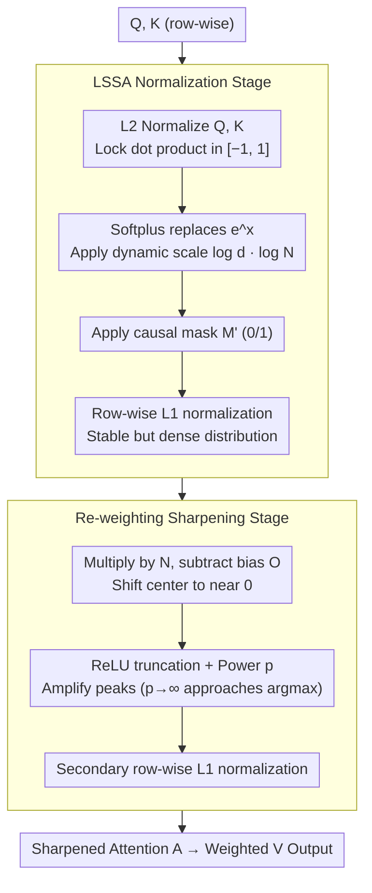

# Softplus Attention with Re-weighting Boosts Length Extrapolation in Large Language Models

**Conference**: ICML 2026  
**arXiv**: [2501.13428](https://arxiv.org/abs/2501.13428)  
**Code**: Not explicitly provided (experiments reproduced based on GPT-2 small + RoPE)  
**Area**: LLM Efficiency / Attention Mechanism / Length Extrapolation  
**Keywords**: Softmax Alternatives, Softplus Attention, Length Extrapolation, Attention Sharpening, Attention Sink

## TL;DR
The authors deconstruct traditional Softmax attention into two independent components: "non-negativity" and "L1 normalization." They demonstrate that L1 normalization, rather than the exponential function, is the critical factor. By replacing the exponential with Softplus paired with a dynamic length scale factor, they derive LSSA. Adding a power-function-based "re-weighting" for sharpening results in LSSAR, which maintains nearly constant validation loss at 16× training length and enables a GPT-109M to "rediscover" Newton's law of universal gravitation from trajectory data.

## Background & Motivation

**Background**: The core of the Transformer is scaled dot-product attention $A = \mathrm{Softmax}(QK^T/\sqrt{d} + M)$. Softmax has become the default for LLMs due to its smoothness, differentiability, and "non-negative normalization." However, Softmax-based attention fails in two scenarios: (i) numerical instability at trillion-parameter scales due to the exponential $e^x$; (ii) "attention smoothing" and "attention sink" issues when inference length exceeds training length, making it difficult for the model to focus on critical tokens.

**Limitations of Prior Work**: Existing Softmax-free attentions (e.g., Sigmoid, ReLU) solve numerical stability but either lose length extrapolation capability (loss spikes at 8K) or suffer from "dead neurons" that block gradient paths for distant tokens. Post-hoc remedies like Position Interpolation or ALiBi stretch embeddings but do not address the fundamental flattening of the attention distribution.

**Key Challenge**: Current approaches assume the non-negativity of Softmax is its core strength and focus on finding better non-negative activations. By coupling "non-negativity" and "L1 normalization" in one function, they cannot independently control them to replace the unstable exponential while maintaining normalization benefits.

**Goal**: (i) Re-analyze which part of Softmax drives attention performance; (ii) Design a numerically stable, length-extrapolatable normalization; (iii) Structurally eliminate attention smoothing to keep distributions sharp.

**Key Insight**: The authors express Softmax as $\mathrm{Softmax}(x) = \phi(x)/\|\phi(x)\|_1$, where $\phi(x) = e^x$ handles non-negativity and the $L_1$ norm handles competitive normalization. Ablations (Appendix Table A4/A6) reveal that replacing $\phi$ with any "globally non-zero" function (like Softplus) yields no performance drop, whereas removing $L_1$ normalization leads to model collapse—identifying L1 as the critical component.

**Core Idea**: Attention is split into "Normalization + Sharpening" stages. The normalization stage uses Softplus with a dynamic length scale factor for stability and extrapolation. The sharpening stage uses a $\mathrm{ReLU}^p$ power function followed by re-normalization to "squeeze" the distribution onto sparse, relevant tokens, structurally addressing attention smoothing.

## Method

### Overall Architecture
LSSAR (Length Scaled Softplus Attention with Re-weighting) consists of two serial stages. Stage 1 (Normalization, LSSA): $L_2$ normalization is applied to $Q$ and $K$ rows to lock dot products in $[-1, 1]$; Softplus replaces $e^x$; $\log d \cdot \log N$ serves as a position-aware dynamic scale factor; finally, $L_1$ normalization is applied. Stage 2 (Sharpening): The LSSA output is multiplied by $N$ (number of tokens), shifted by a bias matrix $O$, truncated via ReLU, raised to power $p$, and re-normalized via $L_1$. Both stages integrate into the GPT-2 small (124M) + RoPE framework with mid-layer modifications only.

### Key Designs

**1. Softmax Deconstruction + LSSA: Isolating L1 and replacing the unstable exponential**

The work starts by rewriting $\mathrm{Softmax}(x)=\phi(x)/\|\phi(x)\|_1$. Finding that the specific non-negative function $\phi$ is irrelevant as long as it is non-zero, LSSA replaces $e^x$ with Softplus and introduces position-aware scaling. By setting $Q_i\leftarrow Q_i/\|Q_i\|_2$ and $K_i\leftarrow K_i/\|K_i\|_2$, the dot product is constrained to $[-1,1]$. Then:

$$A=\mathrm{Softplus}\big((\log d\cdot\log\mathbf N)\odot QK^T\big)\odot M',\qquad A_i\leftarrow A_i/\|A_i\|_1,$$

where $\mathbf N$ is an $L\times L$ matrix with the $i$-th row equal to $i$. Softplus $\log(1+e^x)$ is globally non-zero but prevents explosion. The $\log N$ factor ensures entropy invariance (Chiang & Cholak 2022) by adjusting "temperature" per position, maintaining entropy stability across inference lengths.

**2. Re-weighting: Decoupling "Non-negativity" and "Sharpening" to cure smoothing**

Normalization produces a stable but dense distribution that flattens in long sequences. The sharpening stage applies a post-weighting:

$$A\leftarrow \mathrm{ReLU}^p(A\odot\mathbf N - O),\qquad A_i\leftarrow A_i/\|A_i\|_1,$$

$O$ is a bias matrix of ones. Shifting the distribution and applying $\mathrm{ReLU}^p$ amplifies peaks. The paper proves that as $p\to\infty$, the distribution converges to a hard argmax. The decoupling is critical: using ReLU directly as $\phi$ creates "dead neurons" (zero gradients). By using Softplus first, all tokens maintain a gradient path during L1 competition, while the subsequent ReLU/power operation enforces sparsity without killing learning.

**3. Minimally Invasive Integration: Encapsulating changes within attention**

To ensure engineering utility, LSSAR keeps RoPE and feed-forward layers unchanged. It replaces the $\mathrm{Softmax}(\cdot)$ block with the "LSSA → Re-weighting" pipeline. Since Softplus is non-negative, the causal mask $M'$ is changed from $-\infty$ addition to $0/1$ multiplication. This design allows LSSAR to be orthogonally combined with other techniques like Position Interpolation or Sliding Window Attention.

### Loss & Training
Models are based on GPT-2 small (124M) + RoPE, trained on FineWeb-10B with a sequence length of 1024 for 18,865 steps (10.2B tokens). Training used 8×A100 80GB GPUs. The parameter $p$ is a key hyper-parameter; $p=3$ is reported as optimal for 1K lengths, while $p=15$ is optimal for 8K+ lengths to provide stronger sharpening.

## Key Experimental Results

### Main Results
Validation loss comparison (GPT-2 124M + RoPE, trained at 1K, extrapolated to 8K):

| Attention | 1K | 2K | 4K | 8K |
|-----------|-----|-----|-----|-----|
| Softmax baseline | 3.19 | 4.17 | 5.45 | 6.28 |
| Sigmoid (RamapuRam 2024) | 3.19 | 7.46 | 11.84 | 14.50 |
| ReLU (Wortsman 2023) | 3.21 | 6.27 | 8.50 | 10.35 |
| LSSA (Normalization only) | 3.19 | 4.13 | 5.30 | 5.94 |
| LSSAR ($p=3$) | 3.18 | 4.24 | 5.41 | 6.30 |
| **LSSAR ($p=15$)** | **3.19** | **3.19** | **3.23** | **3.32** |

Downstream zero-shot (Softmax 124M vs LSSAR 124M): ARC-E 39.77→40.57, HellaSwag 32.42→33.03, PIQA 64.09→65.34, SciQ 60.6→62.1.

### Ablation Study

| Configuration | 8K Val Loss | Description |
|---------------|--------------|-------------|
| Full LSSAR ($p=15$) | 3.32 | Full model, near-lossless extrapolation |
| LSSA only (No re-weighting) | 5.94 | Contribution of sharpening stage |
| Re-weighting + Softmax ($p=15$) | 7.02 | Softmax is incompatible as a normalization base |
| Sigmoid + L1 + re-weighting | 3.86 | L1 + Re-weighting is the effective combination |
| ReLU as $\phi$ | >10 | "Dead neurons" failure in long sequences |

Passkey retrieval (needle-in-a-haystack):

| Length | Softmax Accuracy | LSSAR ($p=15$) Accuracy |
|--------|------------------|-------------------------|
| 1K | 64% | **86%** |
| 1.5K | 0% | 45% |
| 4K | 0% | 20% |
| 8K | 0% | Non-zero |

### Key Findings
- Validation loss remains almost constant at 8K length (3.19→3.32), a first for "free" length extrapolation.
- LSSAR maintains non-zero accuracy on Passkey tasks at 8× training length, whereas Softmax drops to 0% immediately.
- In symbolic regression, a GPT-109M + LSSAR recovered Newton’s $1/r^2$ law from trajectory data, while the Softmax version and even trillion-parameter models like o3 failed, suggesting attention inductive bias is more critical than scale for physical laws.
- Optimal $p$ depends on sequence length ($p=3$ for 1K, $p=15$ for long context), suggesting a need for adaptive $p$ in the future.

## Highlights & Insights
- The conclusion that "L1 is the core of Softmax performance, not $\phi$" redirects the entire Softmax-free research field.
- Decoupling sparsity from the gradient path (LSSA first, then sharpening) avoids the pitfalls of direct ReLU attention.
- The $\log d \cdot \log N$ factor provides a universal scaling rule for normalization that preserves attention temperature regardless of input length.
- Symbolic regression experiments provide a rigorous new benchmark for attention inductive bias beyond traditional NLP tasks.

## Limitations & Future Work
- The scale factor $\log d \log N$ was validated at $d=64$; it may require tuning for larger embedding dimensions.
- The choice of $p=15$ is empirical; future work should explore learnable or adaptive $p$ parameters.
- Experiments were limited to 124M/109M scales; performance on 7B+ models remains to be verified.
- High $p$ values ($p=15$) risk numerical overflow ($x^{15}$), requiring optimized kernels for FP16 training stability.

## Related Work & Insights
- **vs Sigmoid attention**: Demonstrates that Sigmoid fails primarily due to the lack of L1 normalization.
- **vs ReLU attention**: LSSAR avoids "dead neurons" by applying thresholds after a stable L1 competition.
- **vs PE-based methods**: LSSAR solves attention smoothing at the structural level and is orthogonal to ALiBi or RoPE-based techniques.

## Rating
- Novelty: ⭐⭐⭐⭐⭐ "Softmax = $\phi$ + L1" is a groundbreaking insight.
- Experimental Thoroughness: ⭐⭐⭐⭐ Strong internal validation; needs larger-scale LLM testing.
- Writing Quality: ⭐⭐⭐⭐ Clear logical progression from deconstruction to two-stage design.
- Value: ⭐⭐⭐⭐⭐ Offers a numerically stable and practically "free" length extrapolation solution.

<!-- RELATED:START -->

## Related Papers

- [\[ICML 2025\] L2D: Large Language Models to Diffusion Finetuning](../../ICML2025/physics/large_language_models_to_diffusion_finetuning.md)
- [\[ICML 2026\] Quiver: Quantum-Informed Views for Enhanced Representations in Large ML Models](quiver_quantum-informed_views_for_enhanced_representations_in_large_ml_models.md)
- [\[ICML 2025\] Liger: Linearizing Large Language Models to Gated Recurrent Structures](../../ICML2025/physics/liger_linearizing_large_language_models_to_gated_recurrent_structures.md)
- [\[ICML 2026\] Understanding Catastrophic Forgetting In LoRA via Mean-Field Attention Dynamics](understanding_catastrophic_forgetting_in_lora_via_mean-field_attention_dynamics.md)
- [\[ICML 2026\] $\mathbb{R}^{2k}$ is Theoretically Large Enough for Embedding-based Top-$k$ Retrieval](mathbbr2k_is_theoretically_large_enough_for_embedding-based_top-k_retrieval.md)

<!-- RELATED:END -->
