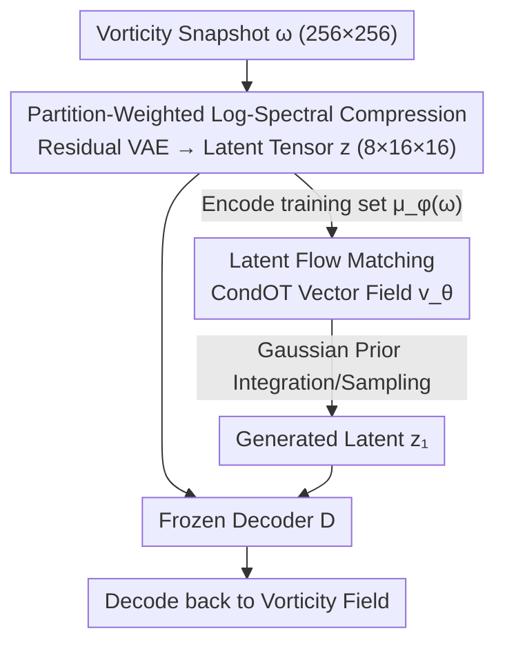

# Spectrally Regularized Latent Flow Matching for Turbulence Generation

**Conference**: ICML 2026  
**arXiv**: [2606.11691](https://arxiv.org/abs/2606.11691)  
**Code**: TBD  
**Area**: Scientific Computing / Generative Models / Turbulence Generation  
**Keywords**: Turbulence Generation, Latent Flow Matching, Spectral Regularization, VAE, Dissipation Range

## TL;DR
Replaces the common MSE-based compression VAE in latent flow matching for turbulence generation with a "partition-weighted log-spectral" objective. This specifically resolves the systematic underestimation of dissipation range magnitudes—improving spectral power retention from 25% to 94% during reconstruction and from 20% to 79% during unconditional generation, breaking the quality ceiling of MSE latent spaces with only 20 integration steps.

## Background & Motivation
**Background**: Generating synthetic turbulence fields using generative models can replace expensive Direct Numerical Simulation (DNS) for downstream tasks such as uncertainty quantification, ensemble statistics, and closure model training. The current mainstream approach is the "latent generation pipeline": first compress the turbulence field into a low-dimensional latent representation using a VAE, then train a diffusion or flow matching model on that latent space.

**Limitations of Prior Work**: These models suffer from a persistent failure mode—when the VAE is trained with a point-wise reconstruction objective (MSE), it systematically underestimates the magnitude of the dissipation range (high wavenumbers). High-wavenumber dynamics govern enstrophy dissipation and strongly influence the evolution of downstream flow physics; losing them means losing the most critical details of turbulence.

**Key Challenge**: The root cause is the vast magnitude disparity across scales. In the 2D turbulence data used here, the vorticity magnitude in the Inertial Range (IR) is $O(\pm 7.5)$, while the Deep Dissipation (DD) range is only $O(\pm 0.4)$, a $20\times$ difference. Under $\ell_2$ point-wise loss, this imbalance in squared error weighting is amplified to approximately $400\times$. Consequently, the MSE objective focuses almost exclusively on large-scale structures and suppresses fine-scale content as noise—this is a structural bias of the loss function itself rather than an algorithmic bug.

**Goal**: Without changing the architecture or the generator, specifically correct the "compression objective" so that dissipation range magnitudes are faithfully preserved in both reconstruction and generation, while clarifying whether this gain occurs in the encoder or decoder and why MSE fails.

**Key Insight**: The authors realize that in latent generation, the encoder does more than just compress data; it shapes the geometry of the latent manifold where sampling and transport occur. Changing the compression objective may simultaneously alter generation fidelity and sampling efficiency.

**Core Idea**: Replace MSE with a partition-weighted log-spectral reconstruction objective, allowing the loss to explicitly compensate for magnitude differences across IR, DO, and DD zones on Fourier shells, effectively recovering the "suppressed high wavenumbers."

## Method

### Overall Architecture
The method is a two-stage pipeline separating "representation learning" from "latent generation transport." **Stage 1** consists of a residual VAE that compresses vorticity snapshots $\omega\in\mathbb{R}^{1\times256\times256}$ into structured latent tensors $z\in\mathbb{R}^{8\times16\times16}$ ($32\times$ spatial volume compression) and reconstructs them; the only modification in this paper is the training objective for this stage. **Stage 2** freezes the decoder, encodes the training set into latent representations using the encoder mean $\mu_\phi(\omega)$, and trains an unconditional CondOT flow matching generator on the latent manifold. During sampling, the learned vector field is integrated starting from a Gaussian prior, and the terminal latent code is passed to the frozen decoder to recover the vorticity field.

To isolate the effects, the authors instantiate two models with identical architectures and hyperparameters, differing only in the compression objective: **Model A** uses the standard MSE-VAE objective, and **Model B** uses the partition-weighted log-spectral objective.

### Key Designs

**1. Partition-weighted log-spectral compression objective: Directly compensating for the $400\times$ magnitude imbalance using spectral space penalties**

This is the only architectural-level change, specifically targeting the "MSE suppression of high wavenumbers." The resolution spectrum is divided into three zones: Inertial Range (IR, $k=6\text{–}40$), Dissipation Onset (DO, $k=41\text{–}65$), and Deep Dissipation (DD, $k=66\text{–}85$). For each integer wavenumber shell $\mathcal{S}_k$, the shell-averaged vorticity power is defined as $Z_\omega(k)=\frac{1}{|\mathcal{S}_k|}\sum_{(k_x,k_y)\in\mathcal{S}_k}|\hat\omega(k_x,k_y)|^2$, and the mean squared error is calculated in log-spectral space for each zone:

$$\mathcal{L}_z=\frac{1}{|\mathcal{K}_z|}\sum_{k\in\mathcal{K}_z}\big[\log(Z_{\hat\omega}(k)+\epsilon)-\log(Z_\omega(k)+\epsilon)\big]^2.$$

The full objective adds weighted spectral penalties for the three zones to the standard VAE loss $\mathcal{L}_A$ (MSE + KL): $\mathcal{L}_B=\mathcal{L}_A+\lambda_{\mathrm{IR}}\mathcal{L}_{\mathrm{IR}}+\lambda_{\mathrm{DO}}\mathcal{L}_{\mathrm{DO}}+\lambda_{\mathrm{DD}}\mathcal{L}_{\mathrm{DD}}$. The log transform allows zones with vast magnitude differences to be compared on the same scale, while partition weighting (determined via Bayesian search as $\lambda_{\mathrm{IR}}:\lambda_{\mathrm{DO}}:\lambda_{\mathrm{DD}}=1:4:6$) places more weight on the often-ignored high-wavenumber regions. Notably, this objective constrains the magnitude of Fourier modes but is insensitive to single-mode phases, relative phases between modes, or energy distribution within a shell.

**2. Encoder-Decoder Swap Diagnosis: Proving gains stem from latent space reorganization on the encoder side**

To locate where the gain resides, the authors evaluate all four pairs of $\{\mathcal{E}_A, \mathcal{E}_B\}\times\{\mathcal{D}_A, \mathcal{D}_B\}$. The results are clear: only the matched $\mathcal{D}_B\circ\mathcal{E}_B$ maintains low bias across all three zones. The cross-pair $\mathcal{D}_A\circ\mathcal{E}_B$ (Spectral Encoder with MSE Decoder) performs worse than the baseline (DD bias $-0.96$), suggesting that $\mathcal{E}_B$ reorganizes latent representations into a form that $\mathcal{D}_A$ cannot interpret. Conversely, $\mathcal{D}_B\circ\mathcal{E}_A$ partially restores DD ($-0.23$ vs baseline $-0.61$) but degrades in IR/DO. Conclusion: the gain is achieved through **collaborative adaptation** of the encoder and decoder, but the encoder-side latent reorganization is the fundamental driver.

**3. Support-Magnitude Decomposition: Exposing the "conservative suppression" failure of point-wise loss**

The authors address a counter-intuitive phenomenon: while Model B has much higher spectral fidelity, its point-wise MSE in the DD zone is actually slightly higher ($6.7\times10^{-3}$ vs $6.2\times10^{-3}$). By thresholding the band-passed DD field into binary support masks, they decompose model predictions into True Positive (TP), False Negative (FN), and False Positive (FP). The two pipelines behave differently: Model A is a **conservative suppression model**—predicting near-zero in sparse DD regions to minimize MSE, which systematically underestimates real support and magnitude by $\approx 2\times$ (magnitude ratio $\approx 0.44$). Model B is a **recovery model**—it accepts a slightly higher point-wise error to recover most of the true support and magnitude budget (magnitude ratio $\approx 0.91$, with higher IoU and recall). This insight suggests that low MSE on sparse intermittent signals may reflect suppression rather than faithful reconstruction.

## Key Experimental Results

Dataset: 2D incompressible Navier–Stokes equations (vorticity form) solved with jax-cfd on a $256^2$ grid, $\nu=10^{-3}$, forcing wavenumber $k_f=4$, $Re_f\approx 2250$. 5000 statistically steady fields are sampled, split into 4500 training / 500 test. The core metric is "retained spectral power" $\text{ret.}=100\times 10^{\text{bias}}$, where $\text{bias}=\log_{10}[Z_{\omega,\text{model}}(k)/Z_{\omega,\text{true}}(k)]$.

### Main Results: Retained Spectral Power in Reconstruction and Generation

| Stage | Zone | Model A (MSE) Ret. Power | Model B (Spec-Reg) Ret. Power |
|------|----|----|----|
| Stage 1 Recon | IR | 90.8% | 97.1% |
| Stage 1 Recon | DO | 54.1% | 92.3% |
| Stage 1 Recon | DD | 24.8% | 93.6% |
| Stage 2 Gen | IR | 79.8% | 92.5% |
| Stage 2 Gen | DO | 43.8% | 79.6% |
| Stage 2 Gen | DD | 20.0% | 79.4% |

Spectral gains from Stage 1 translate fully to Stage 2: generation retention in the DD zone improved from 20% to 79%, DO from 44% to 80%, and IR from 80% to 93%. While both pipelines produce visually plausible samples, only Model B closely matches the ground truth across all zones.

### Ablation Study: Encoder-Decoder Swap (DD Zone Spectral Bias, closer to 0 is better)

| Configuration | IR bias | DO bias | DD bias | Description |
|------|---------|---------|---------|------|
| $\mathcal{D}_A\circ\mathcal{E}_A$ | $-0.042$ | $-0.267$ | $-0.606$ | MSE baseline, severe DD under-representation |
| $\mathcal{D}_B\circ\mathcal{E}_B$ | $-0.013$ | $-0.035$ | $-0.029$ | Matched spectral model, low bias across zones |
| $\mathcal{D}_A\circ\mathcal{E}_B$ | $-0.286$ | $-0.702$ | $-0.961$ | Spec-Encoder with old Decoder, total collapse |
| $\mathcal{D}_B\circ\mathcal{E}_A$ | $-0.171$ | $-0.321$ | $-0.228$ | Only partial DD recovery |

### Key Findings
- **Sampling Quality Ceiling**: Latent spaces trained with MSE have an insurmountable ceiling—Model A's Heun integrator saturates at a DD bias of $-0.70$ from NFE=20 onwards. Model B achieves a DD bias of $-0.117$ with only 20 function evaluations ($\approx 3.4$ ms/NFE). The bottleneck is the latent geometry itself, not the integrator.
- **Spectral Fidelity $\neq$ Low Point-wise Error**: Model B has a slightly higher MSE in the DD zone, which confirms that MSE rewards "suppression" in sparse intermittent structures.
- **Cascade Direction Obtained Unsupervised**: Both pipelines recover the correct signs for the second-order structure function $S_2(r)$ and third-order structure function $S_3(r)$ (correct cascade direction) without explicit supervision. However, a residual gap remains in the **magnitude** of $S_3$, which spectral regularization cannot close because shell-averaged penalties are inherently insensitive to phase organization and triplet coherence.

## Highlights & Insights
- **Controlled Comparative Experimentation**: By freezing everything except the compression objective, the authors cleanly isolate the effects of spectral regularization.
- **Transferable Diagnostic Tools**: The trio of spectral partitioning, encoder-decoder swapping, and support-magnitude decomposition can be applied to any latent generation scenario where high wavenumbers are suppressed.
- **"Low MSE is suppression, not reconstruction"**: This serves as a universal warning for generative models handling sparse or intermittent signals (medical imaging, sparse events, fine textures), where point-wise metrics can misidentify suppression as success.
- **Phase as an Orthogonal Axis**: The authors honestly identify the $S_3$ magnitude gap as a consequence of spectral objectives being phase-insensitive, marking phase-coherent triplet organization as a future direction rather than a competing factor.

## Limitations & Future Work
- **Limited to 2D and Moderate Reynolds Numbers** ($Re_f\approx 2250$): It remains unknown if the method holds for 3D, high Reynolds numbers, or wider cascade ranges where spectral imbalances are more extreme.
- **Unconditional Generation Scenario**: The study focuses on generating full fields from latent priors; performance in conditional tasks (e.g., given boundaries or initial conditions) is unexplored.
- **Unresolved Phase/Triad Coherence**: Since shell-averaged spectral penalties do not govern phase organization, phase-sensitive objectives (like bispectrum or explicit triad constraints) are needed.
- **Hyperparameter Reliance**: Partitioning and weights ($1:4:6$) were determined via Bayesian search; sensitivity to these weights across different datasets or physical systems was not fully detailed.

## Related Work & Insights
- **vs. CoNFiLD / Parikh et al. Latent Models**: These also use latent compression but rely on point-wise MSE, systematically under-resolving the dissipation range. This paper shows the bottleneck is the compression objective, not the generator.
- **vs. Spectral Loss in Neural Operators**: Prior works use spectral loss as a "prediction penalty" in forward operators. This work applies spectral regularization to the compression bottleneck of generative models and targets range disparities using log-spectral partitioning.
- **vs. Sub-grid Modeling / Super-resolution**: Those works restore high wavenumbers from filtered or coarse fields (conditional). Here, dissipation structures must emerge from a latent prior (unconditional).

## Rating
- Novelty: ⭐⭐⭐⭐ Innovative application of spectral regularization at the compression bottleneck with rigorous mechanism diagnostics.
- Experimental Thoroughness: ⭐⭐⭐⭐ Well-designed controlled comparisons and diagnostics, though limited to a single 2D moderate-Re dataset.
- Writing Quality: ⭐⭐⭐⭐⭐ Clear progression from motivation to mechanism to diagnosis; exceptionally honest about limitations (phase gap).
- Value: ⭐⭐⭐⭐ Highly relevant to the generative scientific computing community; the diagnostic tools are broadly reusable.

## Related Papers

- [\[NeurIPS 2025\] Physics-Constrained Flow Matching: Sampling Generative Models with Hard Constraints](../../NeurIPS2025/physics/physics-constrained_flow_matching_sampling_generative_models_with_hard_constrain.md)
- [\[NeurIPS 2025\] High-order Equivariant Flow Matching for Density Functional Theory Hamiltonian Prediction](../../NeurIPS2025/physics/high-order_equivariant_flow_matching_for_density_functional_theory_hamiltonian_p.md)
- [\[ICML 2026\] Quantum latent distributions in deep generative models](quantum_latent_distributions_in_deep_generative_models.md)
- [\[ICLR 2026\] Accelerating Eigenvalue Dataset Generation via Chebyshev Subspace Filter](../../ICLR2026/physics/accelerating_eigenvalue_dataset_generation_via_chebyshev_subspace_filter.md)
- [\[NeurIPS 2025\] Balanced Conic Rectified Flow](../../NeurIPS2025/physics/balanced_conic_rectified_flow.md)

<!-- RELATED:END -->

<!-- RELATED:START -->

## Related Papers

- [\[ICML 2026\] Quantum latent distributions in deep generative models](quantum_latent_distributions_in_deep_generative_models.md)
- [\[ICML 2026\] PINNfluence: Interpreting PINNs Through Influence Functions](pinnfluence_interpreting_pinns_through_influence_functions.md)
- [\[ICML 2026\] BALLAST: Bayesian Active Learning with Look-ahead Amendment for Sea-drifter Trajectories under Spatio-Temporal Vector Fields](ballast_bayesian_active_learning_with_look-ahead_amendment_for_sea-drifter_traje.md)
- [\[ICML 2026\] Speculative Sampling for Faster Molecular Dynamics](speculative_sampling_for_faster_molecular_dynamics.md)
- [\[ICML 2026\] REX: A Family of Reversible Exponential Stochastic Runge-Kutta Solvers](rex_a_family_of_reversible_exponential_stochastic_runge-kutta_solvers.md)

<!-- RELATED:END -->
