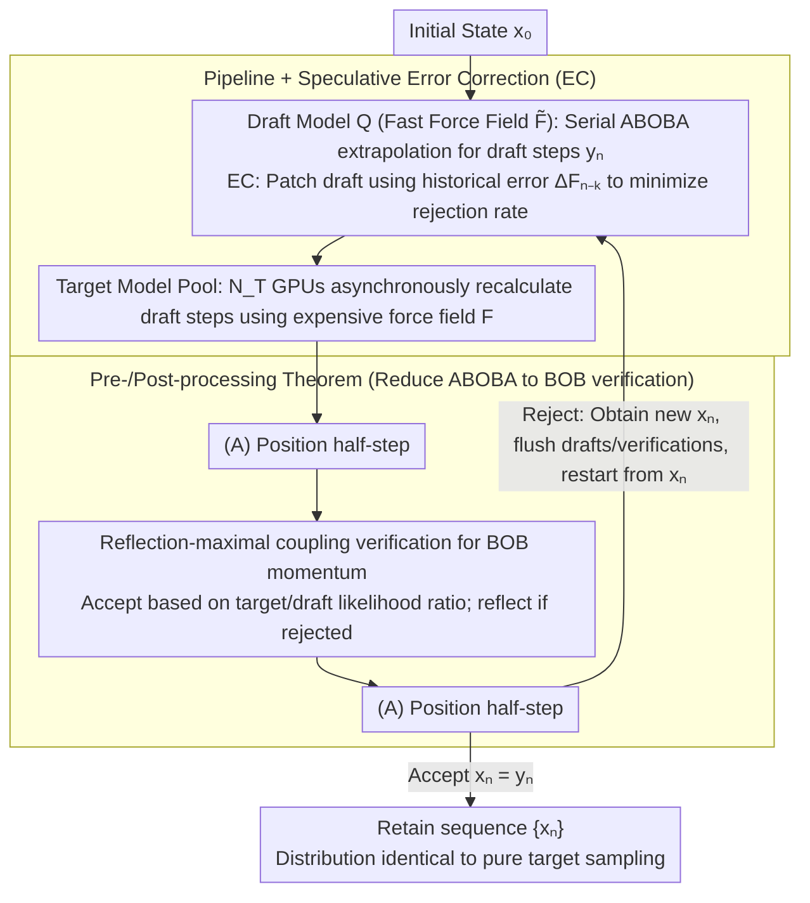

# Speculative Sampling for Faster Molecular Dynamics

**Conference**: ICML2026  
**arXiv**: [2606.02455](https://arxiv.org/abs/2606.02455)  
**Code**: https://github.com/facebookresearch/LSD  
**Area**: Scientific Computing / Molecular Dynamics / Machine Learning Interatomic Potentials (MLIP)  
**Keywords**: Speculative Sampling, Langevin Dynamics, MLIP Acceleration, Reflection-Maximal Coupling, Parallel Verification

## TL;DR
This paper transfers speculative sampling from language models to second-order Langevin molecular dynamics, proposing LSD: serial extrapolation using a fast draft potential and parallel verification using a slow target potential. By ensuring trajectory distributions strictly match the target model through reflection-maximal coupling, it achieves 3–9× lossless speedup on systems such as FCC copper.

## Background & Motivation

**Background**: Molecular Dynamics (MD) is a standard tool for simulating time evolution at the atomic scale. Recently emerged Machine Learning Interatomic Potentials (MLIPs) achieve linear complexity at DFT quantum accuracy but remain the core computational bottleneck in MD simulations.

**Limitations of Prior Work**: Numerical integration in MD requires time steps $\Delta t \sim 0.5\text{–}1$ fs, while many target physical processes occur at the 100+ ns scale, necessitating $10^8$ serial integration steps. MLIPs are several orders of magnitude more expensive per step than classical force fields, making long-timescale simulations practically infeasible. MD is inherently serial—the force at the next step depends on the current position—preventing the use of data parallelism to increase the throughput of a single trajectory.

**Key Challenge**: MLIPs exhibit a natural "accuracy vs. speed" trade-off on the Pareto frontier, with many "fast but coarse" and "slow but accurate" model pairs. However, existing acceleration schemes (large-step extrapolation, embedding reuse, distillation, multi-time-stepping) are almost all *lossy*, introducing unknown trajectory distribution biases that are unsafe for physical observables.

**Goal**: To transfer the "fast draft + slow target" parallel verification paradigm from LLMs/diffusion models to MD without introducing any relative error, shifting the source of acceleration from sacrificing precision to leveraging cross-time-step parallelism.

**Key Insight**: The authors observe that both LLM speculative sampling and MD share a "serial Markov chain + expensive transition kernel" structure, but with two key differences: (1) MD state space is continuous $\mathbb{R}^{6N}$; (2) the transition kernel is a second-order Langevin SDE numerical integrator (e.g., ABOBA splitting) rather than a first-order Euler-Maruyama. These differences prevent direct application of discrete/first-order speculative algorithms from LLM/diffusion (work by De Bortoli et al. 2025 only covers first-order Langevin).

**Core Idea**: Graft the "accept/reject-rollback" mechanism of speculative sampling and **reflection-maximal coupling** from HMC literature onto ABOBA-type splitting integrators. Perform coupling verification on the (BOB) momentum update and prove that the full-step coupling remains optimal under reversible position updates (A).

## Method

### Overall Architecture

The LSD (Langevin Speculative Dynamics) runtime is a pipelined asynchronous system:

1.  **Draft Model** $Q(\cdot|\cdot)$ continuously produces serial draft steps $y_n = (\tilde{\mathbf{q}}_n, \tilde{\mathbf{p}}_n)$ on one GPU. Each step executes an ABOBA integration using a cheap force field $\tilde{\mathbf{F}}$ (e.g., EMT classical force field or Orb-v3-direct small MLIP).
2.  **Target Model Instance Pool** $\{P^{(i)}\}_{i=1}^{N_T}$ asynchronously consumes draft steps across $N_T$ other GPUs. Each instance takes a draft step $y_{n-1}$ and recalculates it using the expensive force field $\mathbf{F}$ to obtain the mean momentum $\langle \mathbf{p}_n \rangle$ intended by the target model.
3.  **Verification Protocol**: When the target returns, reflection-maximal coupling determines whether to accept $x_n = y_n$ or reject and reflect to a new $x_n$. If rejected, all drafts newer than the current step and unfinished verifications are "flushed," and the draft restarts from $x_n$. The resulting sequence $\{x_n\}$ is distributionally identical to serial sampling with the pure target model.

The system does not require a pre-specified lookahead length $L$, making it easier to analyze than synchronous algorithms like Leviathan et al. (2023). Optimal resource allocation requires $N_T \geq \lceil 1/c \rceil$, where $c$ is the draft/target compute ratio.

### Key Designs

**1. Reflection-Maximal Coupling for BOB Momentum: Minimizing Rejection Rates**

In the ABOBA splitting integrator, only the middle (BOB) step is affected by the force field, producing a Gaussian momentum update $\mathcal{N}(\cdot;\langle\mathbf{p}_n\rangle,\boldsymbol{\Sigma})$, where the covariance $\boldsymbol{\Sigma}=\mathbf{M}k_BT(1-e^{-2\gamma\Delta t})$ is independent of the force field—draft and target only differ in the mean. During verification, let $\mathbf{z}=\boldsymbol{\Sigma}^{-1/2}(\tilde{\mathbf{p}}_n-\langle\tilde{\mathbf{p}}_n\rangle)$. Acceptance is based on the likelihood ratio $\min\{1,\mathcal{N}(\tilde{\mathbf{p}}_n;\langle\mathbf{p}_n\rangle,\boldsymbol{\Sigma})/\mathcal{N}(\tilde{\mathbf{p}}_n;\langle\tilde{\mathbf{p}}_n\rangle,\boldsymbol{\Sigma})\}$. If rejected, $\mathbf{z}$ is specularly reflected along the equi-likelihood hyperplane (normal $\boldsymbol{\delta}=\boldsymbol{\Sigma}^{-1/2}(\langle\tilde{\mathbf{p}}_n\rangle-\langle\mathbf{p}_n\rangle)$) and added back to the target mean. Bou-Rabee et al. proved this is a maximal coupling—maximizing $\mathbb{P}(x_n=y_n)$ among all couplings satisfying the target distribution. Choosing maximal coupling directly minimizes the rejection rate, which determines the effective average acceptance length of the pipeline. The theoretical rejection rate has a closed-form $\beta_n=\mathrm{erf}(\|\boldsymbol{\delta}\|/\sqrt8)$, enabling analytical study of scaling with system size, temperature, and friction.

**2. Pre-/Post-Processing Theorem: Reducing Full ABOBA to BOB Verification**

A full ABOBA step is $(A)\cdot(BOB)\cdot(A)$. Designing a coupling directly in the $6N$-dimensional joint position-momentum space is complex and potentially sub-optimal. Thm 3.1 formalizes a reduction: if target and draft distributions can be decomposed as $P=g_*P'(\cdot\mid f(y_{n-1}))$, then coupling $P', Q'$ and applying deterministic transformations $f$ (pre) and $g$ (post) results in a valid coupling of $P, Q$. If $g$ is reversible, it inherits maximality. By setting $f=g=(A)$, full-step verification reduces to "Step (A) → Reflection verification for BOB → Step (A)". This avoids high-dimensional joint coupling and ensures the optimal acceptance rate does not degrade due to position updates. The theorem also generalizes LSD to other splitting schemes like OBABO and is compatible with non-reversible post-processing such as center-of-mass fixing or constraint projection.

**3. Pipeline + Speculative Error Correction (EC): Maximizing Throughput and Minimizing Rejections**

The synchronous "accumulate $L$ drafts then batch verify" approach leaves draft GPUs idle. LSD adopts an asynchronous pool where target instances consume draft steps and rejections trigger immediate rollbacks, keeping draft GPUs running continuously. The speedup upper bound simplifies to $\text{speedup}\lesssim1/(c+\langle\beta\rangle)$, where $c$ is the draft/target compute ratio and $\langle\beta\rangle$ is the mean rejection rate. However, the semi-empirical rejection rate model $\langle\beta\rangle\approx\mathrm{erf}((N\tau\Delta t)^{1/2}T^{-1/2}\varepsilon)$ shows that as atom count $N$ or friction $\tau$ increases, $\langle\beta\rangle$ is pushed toward 1 by the erf function, zeroing out speedup. EC assumes the draft-target force error $\Delta\mathbf{F}_{n-k}$ changes slowly. It patches the current draft using the most recent verified error $\mathbf{F}_n\approx\tilde{\mathbf{F}}_n+\Delta\mathbf{F}_{n-k}$, effectively upgrading the draft to a "draft + historical error" composite model. This reduces the per-atom error constant $\varepsilon$, decreasing rejection rates by up to 75% and making high-friction/large-system cases viable.

### Loss & Training
LSD is an *inference-time* algorithm and requires no additional training. The MLIPs used (UMA-S, UMA-M, UMA-tiny-direct, Orb-v3-direct) are off-the-shelf pre-trained general potentials. The actual overhead of the pipeline comes from cross-GPU communication and $\mathcal{O}(N)$ matrix-vector operations for reflection verification, which are negligible compared to a single MLIP force call.

## Key Experimental Results

### Main Results

Measured speedup for various draft-target combinations on FCC copper ($T=1500$ K, $\Delta t=1$ fs, $\tau=1$ ps). Targets are UMA-S and the slower UMA-M; drafts include EMT (classical), Orb-v3-direct, and UMA-tiny-direct.

| Draft / Target | Atom Count N | Draft/Target Ratio c | Mean Rejection Rate ⟨β⟩ | Measured Speedup |
| :--- | :--- | :--- | :--- | :--- |
| EMT / UMA-S | 32 | Negligible | ≈0.20 | ≈4.3× |
| Orb-v3 / UMA-S | 32 | ≈0.18 | ≈0.10 | ≈3.5× |
| Orb-v3 / UMA-M | 128 | ≈0.08 | ≈0.18 | ≈4× |
| UMA-tiny / UMA-M | 256 | ≈0.10 | ≈0.10 | ≈6× |
| UMA-tiny / UMA-M | Large System | ≈0.10 | ≈0.07 | Up to 9× |

Correctness Verification: For bulk water under the non-conservative UMA-tiny-direct, the set temperature of 300 K deviated by as much as $42.8 \pm 0.7$ K (excess heating). The LSD combination with UMA-S as the target reduced the deviation to $1.1 \pm 0.8$ K, statistically indistinguishable from the pure UMA-S result of $1.0 \pm 0.9$ K.

### Ablation Study

Comparison of rejection rates for the copper system under high friction $\tau=1$ ps across different atom counts:

| Configuration | N=32 | N=500 | N=2048 | Remarks |
| :--- | :--- | :--- | :--- | :--- |
| Naive LSD | 0.08 | 0.35 | ≈0.85 | Matches erf formula; near-total rejection for large N |
| LSD + EC | 0.02 | 0.10 | 0.30 | EC reduces rejection rate by up to 75% |
| Theory $\mathrm{erf}(\dots)$ | 0.08 | 0.35 | 0.84 | Highly consistent with naive LSD measurements |

Li-ion diffusivity in LGPS: The Arrhenius fit slopes and 95% CIs for UMA-S and the LSD combination overlap perfectly in the 650–1400 K range. In high-dimensional MMD tests, the MMD between LSD and UMA-S is of the same order as the MMD between different random seeds of UMA-S, whereas Orb alone yields significantly larger MMD.

### Key Findings
- **Speedup is entirely determined by $1/(c+\langle\beta\rangle)$**: The authors plotted all (draft, target, N) combinations on a $(c, \langle\beta\rangle)$ plane, showing that measured speedups closely follow theoretical contours. The saturation point of speedup depends on which of $c$ or $\langle\beta\rangle$ is larger, providing a guide for draft selection.
- **Graphic Parallelism vs. LSD Crossover**: For UMA-S, LSD is an order of magnitude faster than spatial graph parallelism for small atom counts. For $N > 10^3$, GP takes the lead as LSD's rejection rate approaches the upper limit. The two are orthogonal and can be combined.
- **EC is "Critical" for High Friction/Large Systems**: Without EC, simulations at $\tau=1$ ps fail at a few hundred atoms. EC pushes the usable window to $\sim 2000$ atoms.

## Highlights & Insights
- **First work on Speculative Sampling for 2nd-Order Langevin**: While De Bortoli et al. (2025) extended speculative sampling to first-order Langevin for diffusion, this work extends it to the second-order SDE required for MD and completes the coupling analysis for ABOBA/OBABO schemes.
- **Thm 3.1 "Reversible Transformation Inherits Maximality" is portable**: Any scenario that splits a transition kernel into "fixed preprocessing → coupling block → reversible postprocessing" (e.g., token generation with normalization layers, diffusion with conditional scaling) can use this pattern to avoid designing couplings in high-dimensional spaces.
- **Physical intuition of $\mathrm{erf}((N\tau\Delta t/T)^{1/2}\varepsilon)$**: This explains why large systems or large time steps cause speculative failure—it is essentially the "Mahalanobis distance between two Gaussian means." This provides a budget tool for draft selection and parameter scheduling.
- **EC as "Online Model Distillation"**: Treating historical target-draft differences as stale residual caches could be transferred to LLM speculative decoding, using logit residuals from recently accepted tokens to calibrate draft logits.

## Limitations & Future Work
- **The $N\tau\Delta t$ barrier in the erf function**: Rejection rates dominate for $N > \mathcal{O}(10^3)$, causing speedup collapse. This is unfavorable for large systems like proteins; future work requires target-to-draft online distillation or specialized drafts to push back this wall.
- **Dependency on Parallel Compute**: Optimal pipelining requires $\lceil 1/c \rceil$ target GPUs reliably available; single-card machines or clusters with tight quotas cannot achieve the claimed speedups.
- **Coupling constraints require shared parameters**: Draft and target must share $\gamma, \Delta t, \boldsymbol{\Sigma}$, meaning LSD cannot use a larger draft time step to achieve faster drafts—this locks the $\Delta t$ in the rejection rate formula.
- **Physical drift in EC**: Historical error approximation may fail during phase transitions, chemical reactions, or long-range slow structural changes. No diagnostic metrics were provided for such non-stationary scenarios.
- **Future Directions**: (a) Adaptive EC fitting $\Delta\mathbf{F}_{n-k}$ with a small GNN; (b) Multi-level drafts (draft-of-draft) to compress $c$; (c) Combining domain decomposition with LSD for simultaneous space-time parallelism in long-range interaction systems.

## Related Work & Insights
- **vs. De Bortoli et al. (2025) (1st order)**: This work proves that 2nd-order ABOBA requires additional pre-/post-processing theorems for optimization and derives analytical dependencies on MD physical parameters.
- **vs. Leviathan / Chen et al. (2023) (LLM)**: LSD uses an asynchronous pipeline and reflection-maximal coupling in continuous $\mathbb{R}^{6N}$ rather than synchronous lookahead $L$ with token-level likelihood ratios.
- **vs. Hybrid Monte Carlo (HMC)**: HMC accepts/rejects based on energy and requires Hamiltonians; LSD uses only forces, allows non-conservative draft MLIPs, and ensures product distribution of the target kernel rather than asymptotic Boltzmann.
- **vs. FlashMD / Lossy Extrapolation**: Those are lossy and hyperparameter-dependent; LSD is lossless and can be stacked (using FlashMD as a draft).

## Rating
- Novelty: ⭐⭐⭐⭐⭐ Rigorous extension to 2nd-order Langevin MD with closed-form rejection rates.
- Experimental Thoroughness: ⭐⭐⭐⭐ Coverage of thermodynamics, kinetics, and high-dimensional distributions across copper, water, and LGPS; lacks large biomolecular systems.
- Writing Quality: ⭐⭐⭐⭐⭐ Clear mathematical derivations; appendix covers OBABO and algorithm correctness thoroughly.
- Value: ⭐⭐⭐⭐⭐ Provides a "free" acceleration path for MLIP MD and likely triggers a wave of "specialized draft model" research.

<!-- RELATED:START -->

## Related Papers

- [\[ICML 2026\] Teaching Molecular Dynamics to a Non-Autoregressive Ionic Transport Predictor](teaching_molecular_dynamics_to_a_non-autoregressive_ionic_transport_predictor.md)
- [\[ICLR 2026\] ATOM: A Pretrained Neural Operator for Multitask Molecular Dynamics](../../ICLR2026/physics/atom_a_pretrained_neural_operator_for_multitask_molecular_dynamics.md)
- [\[NeurIPS 2025\] FlashMD: Long-Stride, Universal Prediction of Molecular Dynamics](../../NeurIPS2025/physics/flashmd_long-stride_universal_prediction_of_molecular_dynamics.md)
- [\[ICML 2026\] From Geometry to Dynamics: Learning Overdamped Langevin Dynamics from Sparse Observations with Geometric Constraints](from_geometry_to_dynamics_learning_overdamped_langevin_dynamics_from_sparse_obse.md)
- [\[ICML 2026\] Understanding Catastrophic Forgetting In LoRA via Mean-Field Attention Dynamics](understanding_catastrophic_forgetting_in_lora_via_mean-field_attention_dynamics.md)

<!-- RELATED:END -->
