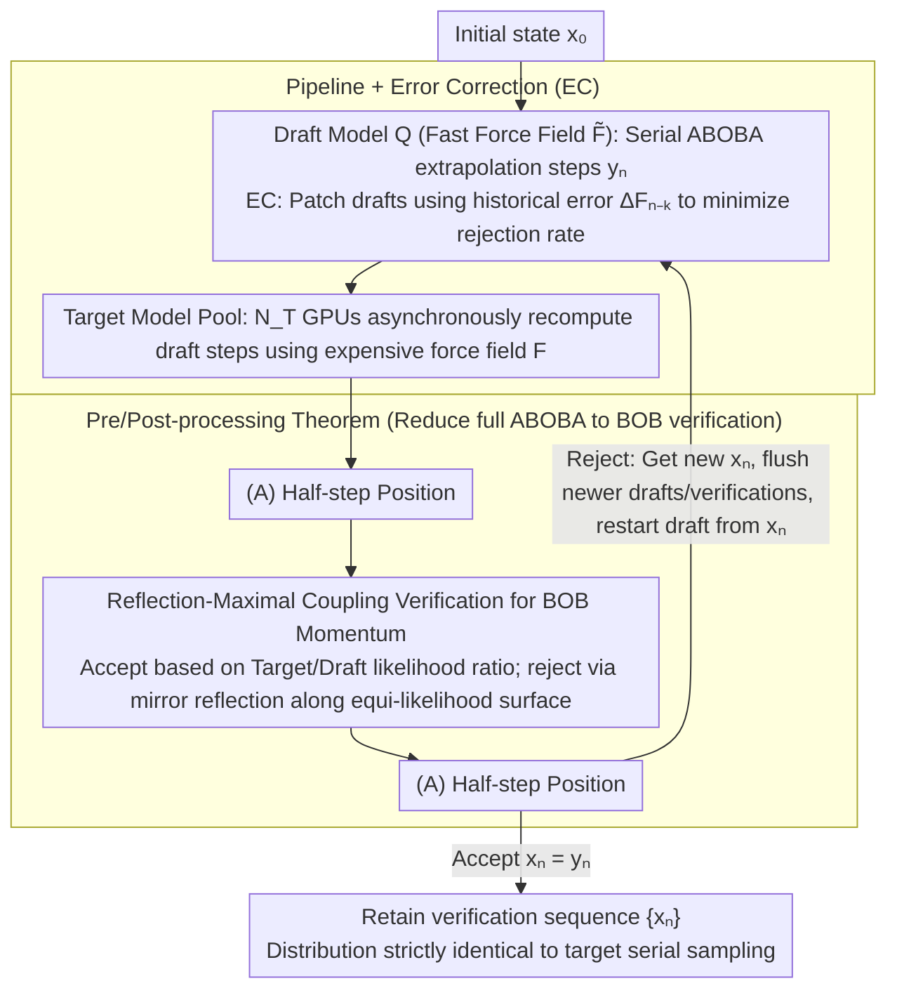

# Speculative Sampling for Faster Molecular Dynamics

**Conference**: ICML2026  
**arXiv**: [2606.02455](https://arxiv.org/abs/2606.02455)  
**Code**: https://github.com/facebookresearch/LSD  
**Area**: Scientific Computing / Molecular Dynamics / Machine Learning Interatomic Potentials (MLIP)  
**Keywords**: Speculative Sampling, Langevin Dynamics, MLIP Acceleration, Reflection-Maximal Coupling, Parallel Verification

## TL;DR
This paper transfers speculative sampling from language models to second-order Langevin molecular dynamics and proposes LSD: serial extrapolation using a fast draft potential function and parallel verification using a slow target potential function. By ensuring the trajectory distribution is strictly consistent with the target model via reflection-maximal coupling, it achieves a 3–9× lossless speedup on systems such as FCC copper.

## Background & Motivation

**Background**: Molecular dynamics (MD) is a standard tool for simulating time evolution at the atomic scale. Machine learning interatomic potentials (MLIP) developed recently achieve linear complexity with DFT-level quantum accuracy, representing a core computational bottleneck in MD simulations.

**Limitations of Prior Work**: Numerical integration in MD requires time steps $\Delta t \sim 0.5\text{–}1$ fs, whereas many target physical processes occur at $100+$ ns scales, requiring $10^8$ serial integration steps. MLIPs are several orders of magnitude more expensive per step than classical force fields, rendering long-timescale simulations practically infeasible. MD is inherently serial—the force at the next step depends on the current position—preventing single-trajectory throughput increases via data parallelism across multiple GPUs.

**Key Challenge**: MLIPs exhibit a natural "accuracy vs. speed" trade-off on the Pareto frontier, with many "fast but crude" and "slow but accurate" model pairs. However, existing acceleration schemes (large-step extrapolation, embedding reuse, distillation, multi-time-stepping) are almost all *lossy*, introducing unknown trajectory distribution biases that are unsafe for physical observables.

**Goal**: Transfer the "fast draft + slow target" parallel verification paradigm from LLMs/diffusion models to MD without introducing any relative error, ensuring acceleration comes from cross-time-step parallelism rather than sacrificed precision.

**Key Insight**: The authors observe that both LLM speculative sampling and MD share a structure of "serial Markov chains + expensive transition kernels." However, two key differences exist: (1) the state space in MD is continuous $\mathbb{R}^{6N}$; (2) the transition kernel is a second-order Langevin SDE numerical integrator (e.g., ABOBA splitting) rather than first-order Euler-Maruyama. Neither allows for the direct application of discrete/first-order speculative algorithms used in LLMs or diffusion (the work by De Bortoli et al. 2025 only covers first-order Langevin).

**Core Idea**: Graft the "accept/reject-rollback" mechanism of speculative sampling and **reflection-maximal coupling** from HMC literature onto ABOBA-type splitting integrators. Perform coupling verification for the (BOB) momentum updates of the integrator and prove that the full-step coupling still achieves optimal acceptance rates under reversible position updates (A).

## Method

### Overall Architecture

The LSD (Langevin Speculative Dynamics) runtime is a pipelined asynchronous system:

1.  **Draft model** $Q(\cdot|\cdot)$ continuously produces serial draft steps $y_n = (\tilde{\mathbf{q}}_n, \tilde{\mathbf{p}}_n)$ on a single GPU. Each step performs an ABOBA integration using a cheap force field $\tilde{\mathbf{F}}$ (e.g., EMT classical force field or Orb-v3-direct small MLIP).
2.  **Target model instance pool** $\{P^{(i)}\}_{i=1}^{N_T}$ asynchronously consumes draft steps across $N_T$ additional GPUs. Each instance takes a draft step $y_{n-1}$ and recomputes the ABOBA step with the expensive force field $\mathbf{F}$ to obtain the mean momentum $\langle \mathbf{p}_n \rangle$ that the target model would have produced.
3.  **Verification Protocol**: When a target result returns, the reflection-maximal coupling determines whether to accept $x_n = y_n$ or reject it and reflect a new $x_n$. Upon rejection, all drafts newer than the current step and unfinished verifications are "flushed," and the draft model restarts from $x_n$. The resulting $\{x_n\}$ sequence is identical in distribution to a serial sampling of the pure target model.

The system does not require a pre-specified lookahead length $L$, making it easier to analyze than synchronous algorithms (e.g., Leviathan et al. 2023). Optimal resource allocation requires $N_T \geq \lceil 1/c \rceil$, where $c$ is the draft/target time ratio.

### Key Designs

**1. Reflection-Maximal Coupling for BOB Momentum: Minimizing Rejection via Maximal Coupling**

In the ABOBA splitting integrator, only the middle (BOB) steps are affected by the force field. It produces a Gaussian momentum update $\mathcal{N}(\cdot;\langle\mathbf{p}_n\rangle,\boldsymbol{\Sigma})$, where the covariance $\boldsymbol{\Sigma}=\mathbf{M}k_BT(1-e^{-2\gamma\Delta t})$ is independent of the force field—draft and target differ only in the mean. During verification, let $\mathbf{z}=\boldsymbol{\Sigma}^{-1/2}(\tilde{\mathbf{p}}_n-\langle\tilde{\mathbf{p}}_n\rangle)$. Acceptance is decided by the draft/target likelihood ratio $\min\{1,\mathcal{N}(\tilde{\mathbf{p}}_n;\langle\mathbf{p}_n\rangle,\boldsymbol{\Sigma})/\mathcal{N}(\tilde{\mathbf{p}}_n;\langle\tilde{\mathbf{p}}_n\rangle,\boldsymbol{\Sigma})\}$. If rejected, $\mathbf{z}$ is specularly reflected across the equi-likelihood hyperplane (normal $\boldsymbol{\delta}=\boldsymbol{\Sigma}^{-1/2}(\langle\tilde{\mathbf{p}}_n\rangle-\langle\mathbf{p}_n\rangle)$) and added back to the target mean. Bou-Rabee et al. proved this is maximal coupling—maximizing $\mathbb{P}(x_n=y_n)$ among all couplings satisfying the target distribution. Choosing maximal coupling directly minimizes the rejection rate, which determines the effective average acceptance length of the pipeline. The theoretical rejection rate has a closed form $\beta_n=\mathrm{erf}(\|\boldsymbol{\delta}\|/\sqrt8)$, allowing for analytical analysis of system size, temperature, and friction.

**2. Pre/Post-processing Theorem: Reducing Full ABOBA Verification to BOB Verification**

A complete ABOBA step is $(A)\cdot(BOB)\cdot(A)$. Designing a coupling directly in the $6N$-dimensional joint position-momentum space is complex and potentially sub-optimal. Thm 3.1 formalizes a reduction: if target and draft distributions can be decomposed as $P=g_*P'(\cdot\mid f(y_{n-1}))$, then coupling on $P', Q'$ followed by deterministic transformations $f$ and $g$ yields a coupling on $P, Q$. If $g$ is reversible, maximality is inherited. By substituting $f=g=(A)$, full-step verification reduces to "Performing (A) → Reflection verification of BOB → Performing (A)." This avoids high-dimensional joint coupling while ensuring the optimal acceptance rate does not degrade due to the additional position updates. The theorem also extends LSD to other splitting schemes like OBABO and remains compatible with non-reversible post-processing such as center-of-mass fixing or constraint projection.

**3. Pipeline + Error Correction (EC): Maximizing Throughput and Minimizing Rejection**

Synchronous "accumulate $L$ drafts then batch verify" schemes leave the draft GPU idle. LSD adopts an asynchronous pool of target instances and immediate rollback upon rejection, keeping the draft GPU running indefinitely. The speedup upper bound simplifies to $\text{speedup}\lesssim1/(c+\langle\beta\rangle)$ (where $c$ is the draft/target time ratio and $\langle\beta\rangle$ is the average rejection rate). However, the semi-empirical rejection rate model $\langle\beta\rangle\approx\mathrm{erf}((N\tau\Delta t)^{1/2}T^{-1/2}\varepsilon)$ shows that as atom count $N$ or friction time $\tau$ increases, $\langle\beta\rangle$ is pushed toward 1 by the erf function, zeroing out speedup. EC assumes the draft-target force error $\Delta\mathbf{F}_{n-k}$ changes slowly physically. It patches the current draft using the error from the most recent verified step $\mathbf{F}_n\approx\tilde{\mathbf{F}_n}+\Delta\mathbf{F}_{n-k}$. This effectively upgrades the draft into a "draft + historical error" combined model, reducing the per-atom error constant $\varepsilon$. Rejection rates drop by up to 75%, making the system viable for high-friction or large-scale scenarios.

### Loss & Training
LSD is an *inference-time* algorithm and requires no additional training. The MLIPs used (UMA-S, UMA-M, UMA-tiny-direct, Orb-v3-direct) are off-the-shelf pretrained general-purpose potentials. The actual overhead of the pipeline comes primarily from cross-GPU communication and the $\mathcal{O}(N)$ matrix-vector operations of the reflection verification itself, which are negligible compared to a single MLIP force call.

## Key Experimental Results

### Main Results

Real speedup for different draft-target combinations on FCC copper ($T=1500$ K, $\Delta t=1$ fs, $\tau=1$ ps). Target models are UMA-S and the slower UMA-M; draft models include EMT (classical), Orb-v3-direct, and UMA-tiny-direct.

| Draft / Target | Atom Count N | Time Ratio c | Avg Rejection Rate ⟨β⟩ | Real Speedup |
| :--- | :--- | :--- | :--- | :--- |
| EMT / UMA-S | 32 | Negligible | ≈0.20 | ≈4.3× |
| Orb-v3 / UMA-S | 32 | ≈0.18 | ≈0.10 | ≈3.5× |
| Orb-v3 / UMA-M | 128 | ≈0.08 | ≈0.18 | ≈4× |
| UMA-tiny / UMA-M | 256 | ≈0.10 | ≈0.10 | ≈6× |
| UMA-tiny / UMA-M | Large system | ≈0.10 | ≈0.07 | Up to 9× |

Correctness Verification: In bulk water, the non-conservative UMA-tiny-direct deviates from the set 300 K temperature by $42.8 \pm 0.7$ K (excess heating). The LSD combination with UMA-S as the target suppresses this deviation to $1.1 \pm 0.8$ K, statistically indistinguishable from the $1.0 \pm 0.9$ K of pure UMA-S.

### Ablation Study

Comparison of rejection rates for a copper system under high friction $\tau=1$ ps at different atom counts:

| Config | N=32 | N=500 | N=2048 | Description |
| :--- | :--- | :--- | :--- | :--- |
| Naive LSD | 0.08 | 0.35 | ≈0.85 | Consistent with erf formula; large N leads to near total rejection |
| LSD + EC | 0.02 | 0.10 | 0.30 | Rejection rate falls by up to 75% after historical error substitution |
| Theoretical $\mathrm{erf}((N\tau\Delta t)^{1/2}T^{-1/2}\varepsilon)$ | 0.08 | 0.35 | 0.84 | Highly consistent with Naive LSD measurements |

LGPS Lithium-Ion Diffusivity: The Arrhenius fit slopes and 95% CI for the UMA-S and LSD combination overlap completely in the 650–1400 K range. In high-dimensional MMD tests, the MMD of LSD vs. UMA-S is of the same order as the MMD between different random seeds of UMA-S, whereas Orb used alone shows a significantly larger MMD.

### Key Findings
- **Speedup is entirely determined by $1/(c+\langle\beta\rangle)$**: The authors plot all (Draft, Target, N) combinations on the $(c, \langle\beta\rangle)$ plane; measured speedups closely fit the theoretical contours. The saturation point of improvement depends on whichever is larger, $c$ or $\langle\beta\rangle$, providing an engineering guideline for balancing draft selection.
- **Crossover Point of Graph Parallelism vs. LSD**: For UMA-S, LSD is an order of magnitude faster than spatial graph parallelism for small atom counts. Once $N$ exceeds approximately $10^3$, GP overtakes LSD as the latter's rejection rate is pushed to its upper limit. The two are orthogonal and can be combined.
- **EC is the "lifeline" for high-friction/large systems**: Without EC, $\tau=1$ ps crashes at a few hundred atoms; EC pushes the usability window to $\sim 2000$ atoms.

## Highlights & Insights
- **First work on speculative sampling for second-order Langevin**: While De Bortoli et al. (2025) generalized speculative sampling to first-order Langevin for diffusion sampling, this work extends it to the second-order SDE required for MD. It completes the coupling analysis for splitting schemes like ABOBA/OBABO, acting as a bridge between "speculative sampling × physical simulation."
- **Theorem 3.1's "inherited maximality under reversible pre/post-transformations" is a transferable tool**: Any scenario that splits a transition kernel into "fixed preprocessing → coupling block → reversible post-processing" (e.g., token generation with normalization layers, diffusion with conditional normalization) can utilize this pattern to avoid designing coupling in full state spaces.
- **The physical intuition of the semi-empirical rejection rate formula $\mathrm{erf}((N\tau\Delta t/T)^{1/2}\varepsilon)$ is strong**: It explains why large systems or long steps cause spec-sampling failure—it is essentially the "Mahalanobis distance between two Gaussian means." This provides a budget tool for draft selection and parameter scheduling that is extrinsically predictable from a single experiment.
- **EC as a form of "online model distillation"**: Using historical target-draft differences as a stale residual cache could be transferred back to LLM speculative decoding, where logit residuals from recently accepted tokens calibrate draft logits.

## Limitations & Future Work
- **The $N\tau\Delta t$ in the erf rejection rate is a "hard wall"**: The authors honestly note that for $N > \mathcal{O}(10^3)$, the rejection rate dominates and acceleration collapses, which is unfriendly toward large systems like proteins. Future target→draft online distillation or specialized drafts are needed to push back this wall.
- **Dependency on sufficient parallel computing resources**: The pipeline optimally requires $\lceil 1/c \rceil$ target GPUs to be always online. Significant speedups may be unattainable on single-card machines or clusters with tight quotas.
- **Coupling assumptions require shared integrator/thermostat parameters**: Draft and target must share the same $\gamma, \Delta t, \boldsymbol{\Sigma}$. Consequently, LSD cannot use larger draft steps to increase draft speed, as this would lock the $\Delta t$ in the rejection rate formula.
- **Physical assumption drift in EC**: Historical error approximations may fail during phase transitions, chemical reactions, or long-range slow structural changes. No diagnostic indicators are provided for such non-stationary scenarios.
- **Future Directions**: (a) Adaptive EC, using small GNNs to fit $\Delta\mathbf{F}_{n-k}$ online instead of direct reuse; (b) Multi-level drafts (draft-of-draft) to further compress $c$; (c) Combining domain decomposition + LSD for long-range interaction systems to leverage both spatial and temporal parallelism.

## Related Work & Insights
- **vs. De Bortoli et al. (2025) First-order Langevin Speculative Diffusion**: They use speculative sampling for Euler-Maruyama first-order SDEs in diffusion models. Ours proves that second-order ABOBA requires additional pre/post-processing theorems for optimization and derives analytical dependencies of rejection rates on MD physical parameters, yielding more engineerable conclusions.
- **vs. Leviathan / Chen et al. (2023) LLM Speculative Decoding**: LLMs use synchronous lookahead $L$ and token-level likelihood ratios. LSD uses an asynchronous pipeline + reflection-maximal coupling in a continuous $\mathbb{R}^{6N}$ state space. Although the analysis frameworks differ, the speedup formula form $1/(c+\beta)$ is similar, suggesting that the "speedup upper bound depends only on draft/target time ratio and divergence" is a cross-modal law.
- **vs. Hybrid Monte Carlo (Duane et al., 1987) / Nagai et al. (2020) DFT-MLIP HMC**: HMC utilizes Metropolis-Hastings on energy, requiring a potential that provides a Hamiltonian. LSD only requires forces, allowing non-conservative MLIPs as drafts and guaranteeing the "target transition kernel product distribution" rather than asymptotic Boltzmann, which is more engineering-flexible.
- **vs. FlashMD / Long-step Extrapolation (Bigi et al., 2025; Klein et al., 2023)**: Those methods are lossy and require hyperparameters. LSD provides lossless acceleration, and the two can be stacked (using FlashMD as a draft for a slow MLIP target).

## Rating
- Novelty: ⭐⭐⭐⭐⭐ First rigorous extension of speculative sampling to second-order Langevin MD with a closed-form rejection rate.
- Experimental Thoroughness: ⭐⭐⭐⭐ Covers thermodynamics, kinetics, and high-dimensional distributions across three systems (Cu, water, LGPS), though lacks large biomolecules.
- Writing Quality: ⭐⭐⭐⭐⭐ Clear mathematical derivations; appendix complements OBABO consistency and optimizations well. High reproducibility.
- Value: ⭐⭐⭐⭐⭐ Provides a "free" acceleration path for MLIP MD and is likely to spark a wave of research into "specialized draft models."

<!-- RELATED:START -->

## Related Papers

- [\[ICML 2026\] Teaching Molecular Dynamics to a Non-Autoregressive Ionic Transport Predictor](teaching_molecular_dynamics_to_a_non-autoregressive_ionic_transport_predictor.md)
- [\[NeurIPS 2025\] FlashMD: Long-Stride, Universal Prediction of Molecular Dynamics](../../NeurIPS2025/physics/flashmd_long-stride_universal_prediction_of_molecular_dynamics.md)
- [\[ICML 2026\] Understanding Catastrophic Forgetting In LoRA via Mean-Field Attention Dynamics](understanding_catastrophic_forgetting_in_lora_via_mean-field_attention_dynamics.md)
- [\[CVPR 2026\] Δynamics: Language-Based Representation for Inferring Rigid-Body Dynamics From Videos](../../CVPR2026/physics/δynamics_language-based_representation_for_inferring_rigid-body_dynamics_from_vi.md)
- [\[NeurIPS 2025\] Adaptive Stochastic Coefficients for Accelerating Diffusion Sampling](../../NeurIPS2025/physics/adaptive_stochastic_coefficients_for_accelerating_diffusion_sampling.md)

<!-- RELATED:END -->
