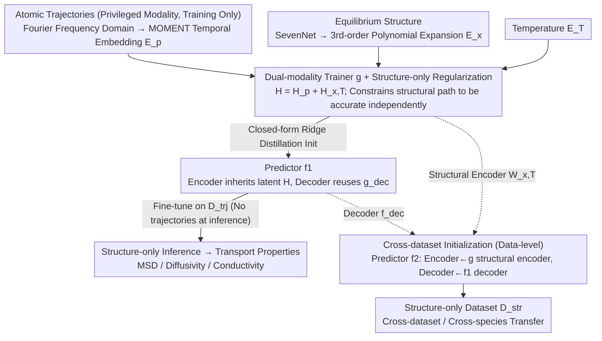

# Teaching Molecular Dynamics to a Non-Autoregressive Ionic Transport Predictor

**Conference**: ICML 2026  
**arXiv**: [2605.09311](https://arxiv.org/abs/2605.09311)  
**Code**: https://github.com/jykim-git/MD.git (Available)  
**Area**: AI for Science / Material Prediction / Auxiliary Modality Learning  
**Keywords**: Ionic Transport, Molecular Dynamics, Auxiliary Modality Learning, Closed-form Ridge Regression Initialization, Privileged Information

## TL;DR
This paper treats expensive atomic trajectories as "privileged auxiliary modalities" during training. A dual-modality trainer first learns dynamics from trajectories, then distills its hidden representations into a structure-only non-autoregressive (NAR) predictor via closed-form Ridge Regression. On Li-ion mean squared displacement (MSD) prediction, it is 200× faster and more accurate than autoregressive SOTA models.

## Background & Motivation
**Background**: Predicting ionic transport properties (MSD, diffusivity, conductivity) of battery materials currently relies on Molecular Dynamics (MD) simulations. Starting from an equilibrium structure, Newton’s equations are numerically integrated to obtain atomic trajectories, from which transport quantities are calculated. Even with MLIP acceleration, a single material takes hours. The ML community offers two alternatives: autoregressive MD acceleration (e.g., LiFlow, step-by-step trajectory generation) and non-autoregressive material property prediction (e.g., MatFormer, ComFormer, DenseGNN, mapping structure → property in a single forward pass).

**Limitations of Prior Work**:
- Autoregressive solutions are slow in inference and accumulate errors, leading to trajectory divergence.
- Non-autoregressive solutions are fast but sacrifice accuracy because they lack access to dynamical information.
- Existing methods can only utilize either "trajectory-labeled" or "structure-only" datasets, whereas in real-world scenarios, both types of data are scarce and cannot support each other.

**Key Challenge**: Ionic transport is essentially long-term dynamics (rare jump events + vibrational background), but fast inference requires starting from a static structure. Incorporating dynamics while maintaining fast inference is a fundamental contradiction between "input modality vs. inference cost." Furthermore, in few-shot scenarios, the iterative optimization of traditional knowledge distillation (KD) suffers from high variance, making reliable knowledge transfer difficult.

**Goal**: (i) Enable a non-autoregressive predictor to learn dynamical priors without requiring trajectories during inference; (ii) Simultaneously utilize both "trajectory-labeled" and "structure-only" datasets; (iii) Ensure stable knowledge transfer even in few-shot scenarios with extremely limited trajectory data.

**Key Insight**: Atomic trajectories are positioned as "privileged information" / "auxiliary modalities" (Auxiliary Modality Learning, AML), existing only during training. Pre-trained scientific foundation models (SevenNet for structural embeddings, MOMENT for temporal embeddings) are used to provide strong priors and avoid learning from scratch on scarce data. Closed-form Ridge Regression replaces iterative optimization for modality alignment, avoiding the variance explosion of SGD in small samples.

**Core Idea**: A trio of "privileged dynamics modality + closed-form distillation + cross-dataset representation initialization" allows a structure-only predictor to implicitly inherit dynamical representations learned from trajectories.

## Method

### Overall Architecture
Two levels of auxiliary modality learning: (1) **Model-level** — A dual-modality trainer $g$ is first trained on a trajectory-labeled dataset $\mathcal{D}^{trj}$ (taking trajectory embeddings $\mathbf{E}_\mathbf{p}$, structural embeddings $\mathbf{E}_\mathbf{x}$, and temperature embeddings $\mathbf{E}_T$). A closed-form Ridge Regression then distills the combined hidden representation $\mathbf{H}=\mathbf{H}_\mathbf{p}+\mathbf{H}_{\mathbf{x},T}$ from $g$ into the encoder of predictor $f_1$, followed by fine-tuning. (2) **Data-level** (Optional) — When training predictor $f_2$ for structure-only datasets $\mathcal{D}^{str}$, the encoder is initialized from the structural encoder of $g$, and the decoder is initialized from the decoder of $f_1$, transferring dynamical knowledge across datasets.

### Key Designs

**1. Dual-modality Trainer $g$ + Structure-only Regularization: Forcing the structural encoder to learn meaningful features despite trajectory availability**

If trajectories and structures are trained together directly, the strong trajectory signal might cause the structural encoder to become a "placeholder." $g$ includes two linear layers $\mathbf{W}_\mathbf{p}$ (trajectory) and $\mathbf{W}_{\mathbf{x},T}$ (structure + temperature). Their sum $\mathbf{H}$ is passed to an MLP decoder. Crucially, an auxiliary structure-only constraint $\mathcal{L}(\hat y^i,y_s^i)+\lambda_b\mathcal{L}(\hat y^i_{\mathbf{x},T},y_s^i)$ is added to the loss, forcing the structural path to independently handle the prediction task. Structural embeddings are also enhanced using a 3rd-order polynomial expansion $\mathbf{E}_\mathbf{x}=[\mathbf{E}_{a,s};\mathbf{E}_{a,s}\odot\mathbf{E}_{a,s};\mathbf{E}_{a,s}^{\odot 3}]$ to supplement the linear layer's expressivity. This regularization ensures the structural encoder learns dynamics-related representations eligible for distillation.

**2. Closed-form Ridge Regression Distillation Initialization: Replacing high-variance iterative KD with an analytical solution**

To transfer the hidden representation $\mathbf{H}^i$ of $g$ to the encoder of the structure-only predictor $f_1$, the authors solve a Ridge Regression:

$$\mathbf{W}^{trj}=\Big(\sum_i(\mathbf{X}^i)^\top\mathbf{X}^i+\lambda_r\mathbf{I}\Big)^{-1}\Big(\sum_i(\mathbf{X}^i)^\top\mathbf{H}^i\Big),$$

Using Cholesky decomposition allows for direct calculation to floating-point precision, and the decoder directly reuses $g_{\text{dec}}$. Subsequent fine-tuning on the trajectory dataset uses only structure-temperature embeddings. The closed-form solution requires no tuning and provides a stable choice for few-shot scenarios compared to iterative SGD.

**3. Cross-dataset Initialization (Data-level AML): Cross-initialization of structural and trajectory paths**

To transfer dynamics priors to a structure-only dataset $\mathcal{D}^{str}$, directly reusing $\mathbf{W}^{trj}$ fails because it is overfitted to the trajectory distribution. The authors use cross-initialization: the encoder $\mathbf{W}^{str}$ of $f_2$ starts from the structural encoder $\mathbf{W}_{\mathbf{x},T}$ of $g$ (which learned more general representations), while the decoder starts from $f_{\text{dec}}^{trj}$ of $f_1$ (which captured a robust mapping to transport properties). This "general structural encoder + robust trajectory decoder" approach enables dynamics knowledge to transfer across datasets and even ionic species.

### Loss & Training
$L_1$ loss is used throughout to predict transport quantities on a $\log_{10}$ scale. The dual-modality trainer includes an additional structure-only auxiliary term weighted by $\lambda_b$. Three datasets are used: Dataset 1 (MD-calculated Li-MSD, trajectory-based), Dataset 2 (MD-calculated multi-element diffusivity, structure-only), and Dataset 3 (Experimental Li conductivity, structure-only).

## Key Experimental Results

### Main Results

| Method | Type | Dataset 1 Inference Time (s) | MAE@600K | MAE@800K | MAE@1000K | MAE@1200K |
|------|------|----------------------|----------|----------|-----------|-----------|
| LiFlow (Nam 2025) | Autoregressive | 2910 | 0.378 | 0.392 | 0.457 | 0.407 |
| MatFormer | Non-autoregressive | 22 | 0.604 | 0.685 | 0.894 | 1.207 |
| ComFormer | Non-autoregressive | 14 | 0.451 | 0.531 | 0.642 | 0.760 |
| DenseGNN | Non-autoregressive | 29 | 0.412 | 0.472 | 0.531 | 0.523 |
| **Ours** | Non-autoregressive | **14** | **0.344** | **0.367** | **0.402** | **0.390** |

The proposed method is approximately 200× faster than LiFlow, with lower MAE across all temperatures.

Cross-dataset results:

| Method | Dataset 2 MAE($\log_{10}D_{Na}$)@2500K | Dataset 3 MAE($\log_{10}\sigma_{Li}$)@300K |
|------|----------------------------------------|--------------------------------------------|
| MatFormer | 0.651 | 2.090 |
| ComFormer | 0.517 | 2.150 |
| DenseGNN | 0.312 | 2.048 |
| **Ours** | **0.064** | **1.388** |

### Ablation Study

| Configuration | Dataset 1 MAE@600K |
|------|-------------------|
| Full | 0.344 |
| w/o model-level AML | 0.395 |

### Key Findings
- **Dynamics priors are distillable**: Even without trajectories during inference, models can inherit vibration + jump patterns via Fourier frequency domain representations and temporal foundation models.
- **Cross-dataset and cross-species transfer works**: Na-ions benefit from dynamics representations learned from Li data.
- **Small data + Strong priors**: Closed-form solutions + pre-trained foundation model embeddings outperform training deep networks from scratch on limited samples.

## Highlights & Insights
- **Practical combination of "Privileged Information + Closed-form Distillation"**: Successfully applies the LUPI framework to material science, proving that analytical solutions are more stable than SGD distillation for small data.
- **Polynomial embeddings to supplement linear layers**: Using $[\mathbf{E}; \mathbf{E}^{\odot 2}; \mathbf{E}^{\odot 3}]$ gains expressivity without significantly increasing parameters.
- **Encoder/Decoder cross-initialization**: A robust strategy to prevent encoders from being "tied" to the trajectory distribution after distillation, facilitating transfer to structure-only domains.

## Limitations & Future Work
- Closed-form solutions require $D\times D$ matrix inversion, which scales poorly with very large embedding dimensions.
- Validated primarily on Li / Na; multi-element co-diffusion scenarios require further testing.
- The MAE on real experimental data (Dataset 3) remains substantial, indicating that sim-to-real domain adaptation is still an open problem.
- Assumptions on consistent trajectory length $L$ limit flexibility for varying MD protocols.

## Related Work & Insights
- **vs. LiFlow (Autoregressive)**: Generative models for trajectories are slow and accumulate error; the proposed NAR approach is faster and more accurate.
- **vs. MatFormer / ComFormer / DenseGNN**: These NAR models lack dynamics-aware structural representations, which the proposed AML strategy provides.
- **Insight**: In domains where data is scarce but "expensive oracles" (like MD or wet labs) exist, the "pre-train on rich modality, distill via closed-form, transfer to structure-only" paradigm is highly valuable.

## Rating
- Novelty: ⭐⭐⭐⭐
- Experimental Thoroughness: ⭐⭐⭐⭐
- Writing Quality: ⭐⭐⭐⭐
- Value: ⭐⭐⭐⭐

<!-- RELATED:START -->

## Related Papers

- [\[ICML 2026\] Speculative Sampling for Faster Molecular Dynamics](speculative_sampling_for_faster_molecular_dynamics.md)
- [\[NeurIPS 2025\] FlashMD: Long-Stride, Universal Prediction of Molecular Dynamics](../../NeurIPS2025/physics/flashmd_long-stride_universal_prediction_of_molecular_dynamics.md)
- [\[ICML 2026\] Understanding Catastrophic Forgetting In LoRA via Mean-Field Attention Dynamics](understanding_catastrophic_forgetting_in_lora_via_mean-field_attention_dynamics.md)
- [\[ICML 2025\] Teaching LLMs to Speak Spectroscopy](../../ICML2025/physics/teaching_llms_to_speak_spectroscopy.md)
- [\[ICML 2025\] Universal Neural Optimal Transport](../../ICML2025/physics/universal_neural_optimal_transport.md)

<!-- RELATED:END -->
