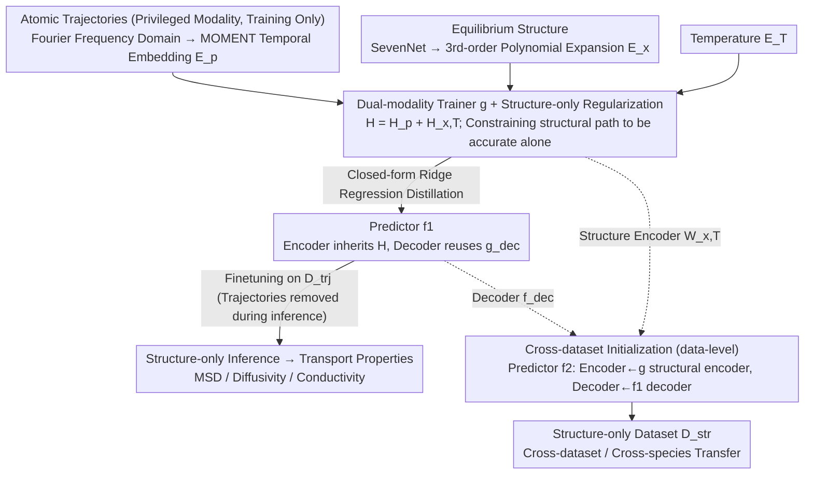

# Teaching Molecular Dynamics to a Non-Autoregressive Ionic Transport Predictor

**Conference**: ICML 2026  
**arXiv**: [2605.09311](https://arxiv.org/abs/2605.09311)  
**Code**: https://github.com/jykim-git/MD.git (Available)  
**Area**: AI for Science / Material Prediction / Auxiliary Modality Learning  
**Keywords**: Ionic transport, Molecular Dynamics, Auxiliary Modality Learning, Closed-form ridge regression initialization, Privileged information

## TL;DR
This paper treats expensive atomic trajectories as "privileged auxiliary modalities" during training. A dual-modality trainer first learns dynamics from trajectories, which are then distilled into a non-autoregressive (NAR) predictor that only uses equilibrium structures via closed-form ridge regression. On lithium-ion mean squared displacement (MSD) prediction, the method is 200× faster and more accurate than autoregressive SOTA.

## Background & Motivation
**Background**: Predicting ionic transport properties (MSD, diffusivity, conductivity) of battery materials primarily relies on Molecular Dynamics (MD) simulations, which involve numerical integration of Newton’s equations from equilibrium structures to obtain trajectories. Even with MLIP acceleration, a single material still requires hours of computation. The machine learning community offers two alternatives: autoregressive MD acceleration (e.g., LiFlow), which generates trajectories step-by-step, and non-autoregressive property prediction (e.g., MatFormer, ComFormer, DenseGNN), which maps structure to property in a single forward pass.

**Limitations of Prior Work**:
- Autoregressive solutions are slow in inference and suffer from accumulated errors leading to trajectory divergence.
- Non-autoregressive solutions are fast but sacrifice accuracy because they lack exposure to dynamical information.
- Existing methods typically utilize either "trajectory-rich" or "structure-only" datasets, whereas in real scenarios, both data types are scarce and cannot easily support each other.

**Key Challenge**: Ionic transport is inherently a long-term dynamical process (rare hopping events + vibrational background), yet fast inference requires starting from static structures. Using dynamics while maintaining fast inference presents a fundamental conflict between "input modality vs. inference cost." Furthermore, iterative optimization in traditional Knowledge Distillation (KD) exhibits high variance in small-sample scenarios, making reliable knowledge transfer difficult.

**Goal**: (i) Enable an NAR predictor to learn dynamics priors without requiring trajectories at inference time; (ii) Utilize both "trajectory-based" and "structure-only" datasets; (iii) Ensure stable knowledge transfer in few-shot scenarios with minimal trajectory data.

**Key Insight**: Atomic trajectories are positioned as "privileged information" or an "auxiliary modality" (auxiliary modality learning, AML), existing only during training. Pre-trained scientific foundation models (SevenNet for structural embeddings, MOMENT for temporal embeddings) are used to provide strong priors, avoiding learning from scratch on scarce data. Modality alignment is performed via closed-form ridge regression instead of iterative optimization to bypass variance issues associated with SGD in small samples.

**Core Idea**: A tripartite strategy consisting of "privileged dynamics modality + closed-form distillation + cross-dataset representation initialization" allows the structure-only predictor to implicitly inherit dynamical representations learned from trajectories.

## Method

### Overall Architecture
The framework employs two levels of auxiliary modality learning: (1) **Model-level**: A dual-modality trainer $g$ is first trained on a trajectory dataset $\mathcal{D}^{trj}$ (processing trajectory embeddings $\mathbf{E}_\mathbf{p}$, structural embeddings $\mathbf{E}_\mathbf{x}$, and temperature embeddings $\mathbf{E}_T$). Its combined hidden representation $\mathbf{H}=\mathbf{H}_\mathbf{p}+\mathbf{H}_{\mathbf{x},T}$ is then distilled into the encoder of predictor $f_1$ via closed-form ridge regression, followed by finetuning. (2) **Data-level** (Optional): When training predictor $f_2$ for structure-only datasets $\mathcal{D}^{str}$, the encoder is initialized from the structural encoder of $g$, and the decoder is initialized from the decoder of $f_1$, enabling cross-dataset transfer of dynamics knowledge.

### Key Designs

**1. Dual-modality trainer $g$ + Structure-only Regularization: Forcing structural encoders to learn dynamics**

If trajectories and structures are trained together directly, the trajectory signal may dominate, causing the structural encoder to become a redundant "placeholder." This would result in no useful knowledge for the structure-only model to inherit during distillation. $g$ includes two linear layers $\mathbf{W}_\mathbf{p}$ (trajectories) and $\mathbf{W}_{\mathbf{x},T}$ (structure+temperature). After summation to obtain $\mathbf{H}$, an MLP decodes the property. Crucially, an auxiliary constraint is added to the loss: $\mathcal{L}(\hat y^i,y_s^i)+\lambda_b\mathcal{L}(\hat y^i_{\mathbf{x},T},y_s^i)$, forcing the structural path to perform the prediction task independently. Structural embeddings also use a 3rd-order polynomial expansion $\mathbf{E}_\mathbf{x}=[\mathbf{E}_{a,s};\mathbf{E}_{a,s}\odot\mathbf{E}_{a,s};\mathbf{E}_{a,s}^{\odot 3}]$ after SevenNet feature aggregation to enhance the expressiveness of the linear layers.

**2. Closed-form ridge regression distillation initialization: Replacing high-variance iterative KD with analytic solutions**

Transferring the hidden representation $\mathbf{H}^i$ of $g$ to the encoder of the structure-only predictor $f_1$ via traditional KD involves iterative gradient optimization. However, ionic transport datasets often contain only dozens to hundreds of samples, where SGD exhibits extreme variance. The authors instead solve a ridge regression problem:

$$\mathbf{W}^{trj}=\Big(\sum_i(\mathbf{X}^i)^\top\mathbf{X}^i+\lambda_r\mathbf{I}\Big)^{-1}\Big(\sum_i(\mathbf{X}^i)^\top\mathbf{H}^i\Big),$$

using Cholesky decomposition for floating-point precision. The decoder is directly reused from $g_{\text{dec}}$. During subsequent finetuning on the trajectory dataset, trajectories are removed, and only structure-temperature embeddings are used. The closed-form solution is a stable alternative for small-sample scenarios.

**3. Cross-dataset initialization (data-level AML): Intersection of structural and trajectory paths**

To transfer dynamics priors to structure-only datasets $\mathcal{D}^{str}$ entirely lacking trajectories, simply reusing $\mathbf{W}^{trj}$ fails as it is overfitted to the trajectory distribution. The authors use cross-initialization: the encoder $\mathbf{W}^{str}$ for $f_2$ starts from the structural encoder $\mathbf{W}_{\mathbf{x},T}$ of $g$ (which learned more general structural features under regularization), while the decoder starts from $f_{\text{dec}}^{trj}$ of $f_1$ (which captured robust mappings from hidden representations to transport properties). This ensures that the dynamics knowledge is transferred effectively across datasets and even across ionic species.

### Loss & Training
The entire process uses $L_1$ loss to predict transport properties in $\log_{10}$ scale. The dual-modality trainer includes an auxiliary structure-only term weighted by $\lambda_b$. Closed-form initialization uses $\lambda_r$ to control the fit vs. overfit trade-off. Three datasets are used: Dataset 1 (MD-calculated Li-MSD, trajectory-based), Dataset 2 (MD-calculated multi-element diffusivity, structure-only, with Na as an unseen species), and Dataset 3 (Experimental Li conductivity, structure-only).

## Key Experimental Results

### Main Results

| Method | Type | Dataset 1 Inf. Time (s) | MAE@600K | MAE@800K | MAE@1000K | MAE@1200K |
|------|------|----------------------|----------|----------|-----------|-----------|
| LiFlow (Nam 2025) | Autoregressive | 2910 | 0.378 | 0.392 | 0.457 | 0.407 |
| MatFormer | NAR | 22 | 0.604 | 0.685 | 0.894 | 1.207 |
| ComFormer | NAR | 14 | 0.451 | 0.531 | 0.642 | 0.760 |
| DenseGNN | NAR | 29 | 0.412 | 0.472 | 0.531 | 0.523 |
| **Ours** | **NAR** | **14** | **0.344** | **0.367** | **0.402** | **0.390** |

The method is approximately 200× faster than LiFlow while achieving lower MAE across all temperatures.

Cross-dataset results:

| Method | Dataset 2 MAE($\log_{10}D_{Na}$)@2500K | Dataset 3 MAE($\log_{10}\sigma_{Li}$)@300K |
|------|----------------------------------------|--------------------------------------------|
| MatFormer | 0.651 | 2.090 |
| ComFormer | 0.517 | 2.150 |
| DenseGNN | 0.312 | 2.048 |
| **Ours** | **0.064** | **1.388** |

Ours shows a 5× improvement on Dataset 2 and a decrease of 0.66 MAE on experimental Dataset 3.

### Ablation Study

| Configuration | Dataset 1 MAE@600K |
|------|-------------------|
| Full | 0.344 |
| w/o model-level AML | 0.395 |

Removing the structure-only regularization renders the structural encoder useless after distillation. Removing data-level AML leads to a significant drop in performance on Datasets 2 and 3.

### Key Findings
- **Dynamics priors are distillable**: Even without trajectories during inference, vibration and hopping patterns can be inherited via Fourier transformation and temporal foundation models.
- **Cross-dataset/species transfer is feasible**: Sodium (Na) ions, despite being excluded from training, benefit from representations learned from Lithium (Li) data.
- **Small data + Strong priors**: For datasets with a few hundred samples, closed-form solutions and pre-trained embeddings significantly outperform deep networks trained from scratch.

## Highlights & Insights
- **Combination of Privileged Information and Closed-form Distillation**: This implements the LUPI framework for materials science, proving that analytic solutions are more stable than SGD distillation for small datasets.
- **Polynomial Embeddings for Linear Layers**: Using $[\mathbf{E}; \mathbf{E}^{\odot 2}; \mathbf{E}^{\odot 3}]$ provides finite-order non-linearity to linear mappings, enhancing expressiveness without adding significant parameters.
- **Encoder/Decoder Cross-initialization**: Avoiding the trap where distilled encoders are locked into the source domain distribution, allowing dynamics knowledge to move across domains.

## Limitations & Future Work
- Closed-form solutions require $D\times D$ matrix inversion, which may become costly for high-dimensional embeddings.
- Validation is limited to Li/Na species; multi-element co-diffusion scenarios require further study.
- MAE on experimental Dataset 3 (1.388) remains high, indicating that the sim-to-real gap is still an open challenge demanding domain adaptation.
- Assumes fixed trajectory length $L$; handling variable-lengthTrajectories or temperature ramps requires redesigning the Fourier representation.

## Related Work & Insights
- **vs. LiFlow (Autoregressive)**: Generative models sample trajectories step-by-step; Ours uses NAR prediction for speed and error mitigation.
- **vs. MatFormer / ComFormer / DenseGNN**: These NAR models lack dynamical input; Ours injects it via AML.
- **vs. Traditional KD (Hinton 2015)**: Uses iterative gradient-based logit distillation; Ours uses closed-form representation distillation for data-scarce environments.
- **Insight**: In domains like biomedicine or chemistry where data is scarce but "expensive oracles" (simulations/experiments) exist, this "pretrain on rich modality, distill via closed form, transfer across datasets" paradigm is highly reusable.

## Rating
- Novelty: ⭐⭐⭐⭐ Utilizing atomic trajectories as privileged modalities with closed-form distillation is a fresh approach in AI4Science.
- Experimental Thoroughness: ⭐⭐⭐⭐ Covers sim+real datasets, compares against AR and multiple NAR baselines.
- Writing Quality: ⭐⭐⭐⭐ Clearly defined motivations and intuitive methodological illustrations.
- Value: ⭐⭐⭐⭐ 200× acceleration and cross-dataset transfer capabilities offer direct engineering value for material screening.

<!-- RELATED:START -->

## Related Papers

- [\[ICML 2026\] Speculative Sampling for Faster Molecular Dynamics](speculative_sampling_for_faster_molecular_dynamics.md)
- [\[ICLR 2026\] ATOM: A Pretrained Neural Operator for Multitask Molecular Dynamics](../../ICLR2026/physics/atom_a_pretrained_neural_operator_for_multitask_molecular_dynamics.md)
- [\[NeurIPS 2025\] FlashMD: Long-Stride, Universal Prediction of Molecular Dynamics](../../NeurIPS2025/physics/flashmd_long-stride_universal_prediction_of_molecular_dynamics.md)
- [\[ICML 2026\] Understanding Catastrophic Forgetting In LoRA via Mean-Field Attention Dynamics](understanding_catastrophic_forgetting_in_lora_via_mean-field_attention_dynamics.md)
- [\[ICML 2025\] Teaching LLMs to Speak Spectroscopy](../../ICML2025/physics/teaching_llms_to_speak_spectroscopy.md)

<!-- RELATED:END -->
