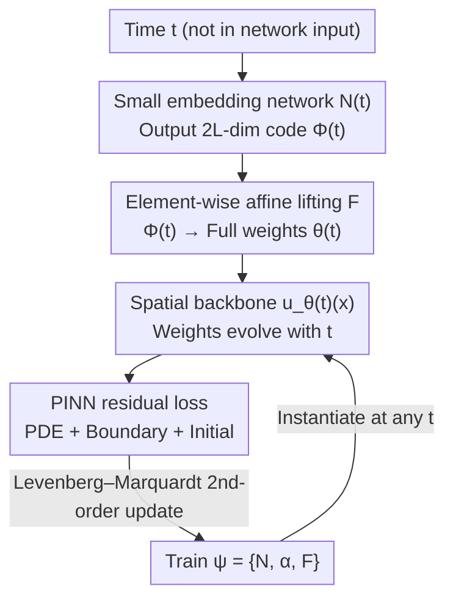

# TINNs: Time-Induced Neural Networks for Solving Time-Dependent PDEs

**Conference**: ICML 2026  
**arXiv**: [2601.20361](https://arxiv.org/abs/2601.20361)  
**Code**: https://github.com/CYDai-ml/TINN  
**Area**: Scientific Computing / Physics-Informed Neural Networks (PINN)  
**Keywords**: Time-varying PDEs, PINN, time-entanglement, hypernetwork, Levenberg–Marquardt  

## TL;DR
To address the "time-entanglement" issue where standard spatio-temporal PINNs treat time as an extra input and share a single set of weights, TINNs formulate the network weights themselves as a function of time $u_{\theta(t)}(\mathbf{x})$. This allows spatial representations to evolve over time. By utilizing a compact layer-wise time embedding to avoid parameter explosion and a Levenberg–Marquardt second-order optimizer, TINNs reduce relative $L^2$ error by up to $4\times$ and accelerate convergence by $\approx 10\times$ across various time-dependent PDEs.

## Background & Motivation
**Background**: Physics-Informed Neural Networks (PINNs) fit PDE solutions using a differentiable, mesh-free neural network $u_\theta(\mathbf{x},t)$ by minimizing the weighted sum of squares of PDE residuals, boundary conditions, and initial conditions. They are particularly suitable for scenarios involving complex geometries, high dimensions, and inverse problems where traditional finite difference or finite element methods struggle. For time-dependent PDEs, the mainstream approach is "spatio-temporal PINNs," which treat time $t$ as an additional input dimension alongside spatial coordinates.

**Limitations of Prior Work**: The spatial complexity of time-dependent solutions often changes drastically over time. Taking the viscous Burgers' equation as an example, the solution evolves from a smooth curve to a extremely steep transition layer near $x=0$. While the overall shapes are similar, the late-stage spatial gradients are much larger than the early ones. Spatio-temporal PINNs with shared weights are forced to represent these distinct dynamics using the same set of deep features, leading to representation interference and unstable optimization when joint constraints are applied.

**Key Challenge**: The authors term this the **time-entanglement problem**. Using a 1D affine toy example $u_\theta(x,t)=U(wx+vt+b)$, the bottleneck becomes clear: the spatial derivative is $\partial_x u = U'(wx+vt+b)\,w$. Here, time $t$ can only influence the network through an additive translation $vt$, while the scaling factor $w$ controlling spatial steepness remains fixed for all moments. Consequently, the model cannot "stretch spatial features" over time and must instead indirectly shift the activation function's argument to steeper regions—a mechanism that is fragile in practice. Deepening the network does not resolve this as the same entanglement persists.

**Goal & Key Insight**: Rather than patching the optimization process (e.g., adaptive sampling, loss reweighting, causal curriculum), the goal is to redesign the architecture—specifically how time enters the network. The authors observe that since spatial scales need to change explicitly with time, time should modulate the **parameters** rather than being grouped with inputs.

**Core Idea**: Represent the time-dependent solution as a trajectory in parameter space $u_{\theta(t)}(\mathbf{x})$—using the same spatial backbone network but with weights $\theta(t)$ that evolve smoothly over time. In the toy example, this becomes $u_{\theta(t)}(x)=U(w(t)x+b(t))$, where the spatial derivative $\partial_x u = w(t)\,U'(\cdot)$ allows time to **directly** modify spatial steepness through $w(t)$, providing the exact degree of freedom missing in standard PINNs.

## Method

### Overall Architecture
TINN takes spatio-temporal collocation points as input (though time no longer enters the network input directly) and outputs the PDE solution at any $(\mathbf{x},t)$. The mechanism follows three steps: (1) Parametrizing the solution as $u_{\theta(t)}(\mathbf{x})$, where the spatial backbone captures structure and $\theta(t)$ encodes temporal dynamics; (2) To prevent $\theta(t)$ from introducing excessive parameters, a **compact layer-wise time embedding** $\Phi(t)\in\mathbb{R}^{2L}$ is combined with element-wise affine lifting to generate the full weight vector; (3) Training with the **Levenberg–Marquardt (LM)** second-order optimizer, which exploits the natural nonlinear least squares structure of PINN losses. The learnable variables are $\psi=\{\mathcal{N},\alpha,\mathbf{F}\}$ (embedding network, gating, affine mapping). Once trained, $\theta(t)$ can be instantiated for any $t$ to obtain $u_{\theta(t)}$.

### Key Designs

**1. Time into Parameter Space: Representing solutions as parameter trajectories $u_{\theta(t)}(\mathbf{x})$**

This is the core contribution. Standard spatio-temporal PINNs share $\theta$ across all $t$, causing entanglement. TINN **removes** time from inputs and allows weights $\theta(t)$ to carry temporal dynamics. In this view, the backbone $u_\theta$ handles spatial structure, while temporal evolution becomes a trajectory $t\mapsto\theta(t)$ producing a family of "time-indexed spatial networks." This allows the model to **explicitly** adjust spatial steepness over time via $w(t)$, rather than indirectly through shifts—explaining why TINN is more stable when gradients sharpen. The authors show that TINN maintains stable spatial derivative errors even after shock formation, whereas standard MLPs exhibit sharp error increases.

**2. Compact Layer-wise Time Embedding: Avoiding parameter explosion via $2L$-dim codes + affine lifting**

Using a full hypernetwork to output $\theta(t)\in\mathbb{R}^{N_D}$ is impractical; the last layer would require $\mathcal{O}(N_D h)$ parameters, which scales poorly. Simple functions (e.g., linear trajectories $\theta(t)=wt+b$) are too rigid. The authors propose a compromise: a small network $\mathcal{N}(t)$ outputs a $2L$-dimensional per-layer encoding $\Phi(t)$ (one pair for weights and biases per layer), which is "lifted" to $N_D$ dimensions via element-wise affine mappings. The encoding is a gated mixture:

$$\Phi(t)=(\mathbf{1}-\alpha)\,t+\alpha\odot\mathcal{N}(t),$$

where $\alpha\in\mathbb{R}^{2L}$ is learnable. During lifting, all elements in a parameter group share the same $\Phi_\ell(t)$ but have independent affine coefficients $w_\ell^{ij}(t)=a^{ij}\Phi_\ell(t)+b^{ij}$, denoted as $\theta(t)=\mathbf{F}(\Phi(t))$. This ensures **macro-consistency** (coordinated parameter changes during rapid shifts) and **micro-diversity** (different layers evolving at different time scales).

**3. Levenberg–Marquardt Second-order Training: Exploiting the nonlinear least squares structure**

PINN losses are naturally nonlinear least squares sums of PDE, boundary, and initial residuals:

$$L(\theta)=\frac{\lambda_r}{N_r}\sum_i\|\mathcal{L}(u_\theta)(\mathbf{x}_i^r,t_i^r)\|_2^2+\frac{\lambda_b}{N_b}\sum_i\|\mathcal{B}(u_\theta)\|_2^2+\frac{\lambda_{ic}}{N_{ic}}\sum_i\|\mathcal{I}(u_\theta)\|_2^2.$$

Most PINNs use Adam or L-BFGS, which do not explicitly exploit this structure. TINN employs the LM algorithm—a standard second-order solver that interpolates between gradient descent and Gauss–Newton via adaptive damping. By solving a damped linearized subproblem at each step, LM better balances competing constraints. While LM's per-step cost is usually prohibitive for large networks, TINN's parameter efficiency makes it feasible, leading to faster and more stable convergence.

### Loss & Training
TINN uses the same physics-informed loss as standard PINNs to ensure fair comparison. The backbone is an MLP (following literature conventions). The optimizer is LM, with hyperparameters, training points, and iterations aligned across methods.

## Key Experimental Results

### Main Results
Testing on four time-dependent PDEs (Burgers, Allen–Cahn, Klein–Gordon, Korteweg–De Vries) on a single A6000, TINN leads with approximately 1,185 parameters compared to 300k–530k for baselines.

| Equation | Method | Rel. $L^2$ Error ↓ | Time ↓ | Params |
|------|------|------|------|------|
| Burgers | PINN | 2.19E-04 | 1.24hr | 309440 |
| Burgers | PirateNet SOAP | 1.97E-06 | 1.70hr | 534853 |
| Burgers | **TINN** | **6.89E-07** | **0.75hr** | **1145** |
| Allen–Cahn | PINN | 4.65E-01 | 0.95hr | 309760 |
| Allen–Cahn | PirateNet SOAP | 8.32E-06 | 1.50hr | 534981 |
| Allen–Cahn | **TINN** | **3.85E-06** | **0.78hr** | **1185** |
| Klein–Gordon | CoPINN* | 6.61E-06 | 0.70hr | 212832 |
| Klein–Gordon | **TINN** | **4.78E-06** | **0.67hr** | **1185** |
| Korteweg–De Vries| PirateNet SOAP | 4.26E-04 | 1.86hr | 534981 |
| Korteweg–De Vries| **TINN** | **1.53E-04** | **0.69hr** | **1185** |

Compared to the strongest baselines, TINN reduces error on Burgers to $\approx 1/2.9$ while using two orders of magnitude fewer parameters and shorter training time.

### Ablation Study
Table 1 compares different parametrizations of $\theta(t)$:

| Equation | $\theta(t)$ Form | Rel. $L^2$ Error ↓ | Params |
|------|------|------|------|
| Burgers | Linear Trajectory | 2.65E-06 | 1144 |
| Burgers | Single Neuron | 2.93E-06 | 1188 |
| Burgers | **TINN Layered Emb.** | **5.67E-07** | 1145 |
| Allen–Cahn | Linear Trajectory | 3.25E-06 | 1188 |
| Allen–Cahn | Single Neuron | 1.47E-05 | 1242 |
| Allen–Cahn | **TINN Layered Emb.** | **2.73E-06** | 1185 |

### Key Findings
- Simple parametrizations (linear/single neuron) show inconsistent performance across PDEs, whereas compact layer-wise embeddings are optimal for all, validating the "macro-consistency + micro-diversity" design.
- TINN demonstrates that "time into parameter space" provides representational efficiency rather than just capacity.
- Unlike hybrid methods that separate space/time and use ODE integrators, TINN remains end-to-end and continuous, avoiding cumulative numerical integration errors.

## Highlights & Insights
- TINN diagnoses time-entanglement as an **architectural** flaw rather than an optimization issue, providing a clean "time-to-parameters" solution that is orthogonal to existing optimization strategies.
- The gated mixture $\Phi(t)$ smartly ensures that the model can revert to linear time or utilize nonlinearity where needed.
- Low parameter counts "unlock" second-order optimization (LM), creating a positive coupling between a compact model and a powerful optimizer.

## Limitations & Future Work
- Experiments are focused on 1D spatial domains and classic PDEs; scalability to high-dimensional or highly nonlinear systems remains to be verified.
- The embedding dimension $2L$ is tied to backbone depth; it is unclear if this is sufficient for extremely deep backbones or problems requiring finer temporal diversity within layers.
- The method currently relies on a small backbone for LM feasibility; larger backbones might necessitate block-diagonal or approximate LM strategies.

## Related Work & Insights
- **vs. Causal PINN**: Causal PINNs use loss reweighting to handle error propagation but still use a single spatio-temporal network. TINN changes the architecture and can be combined with causal weighting.
- **vs. Space/Time Separation + ODE Integral**: Separation methods often freeze spatial features and use discrete solvers. TINN maintains end-to-end, physics-informed training and does not suffer from integration error accumulation.
- **vs. Naive Hypernetworks**: TINN's layer-wise code + affine lifting reduces parameter costs from $\mathcal{O}(N_D h)$ to $2N_D+\mathcal{O}(Lh)$.

## Rating
- Novelty: ⭐⭐⭐⭐⭐ 
- Experimental Thoroughness: ⭐⭐⭐⭐ 
- Writing Quality: ⭐⭐⭐⭐⭐ 
- Value: ⭐⭐⭐⭐ 

<!-- RELATED:START -->

## Related Papers

- [\[ICLR 2026\] Orbital Transformers for Predicting Wavefunctions in Time-Dependent Density Functional Theory](../../ICLR2026/physics/orbital_transformers_for_predicting_wavefunctions_in_time-dependent_density_func.md)
- [\[ICLR 2026\] Physics-Informed Inference Time Scaling for Solving High-Dimensional Partial Differential Equations via Defect Correction](../../ICLR2026/physics/physics-informed_inference_time_scaling_for_solving_high-dimensional_partial_dif.md)
- [\[ICLR 2026\] Sublinear Time Quantum Algorithm for Attention Approximation](../../ICLR2026/physics/sublinear_time_quantum_algorithm_for_attention_approximation.md)
- [\[ICLR 2026\] Test-Time Accuracy-Cost Control in Neural Simulators via Recurrent-Depth](../../ICLR2026/physics/test-time_accuracy-cost_control_in_neural_simulators_via_recurrent-depth.md)
- [\[ICML 2026\] Hermite-NGP: Gradient-Augmented Hash Encoding for Learning PDEs](hermite-ngp_gradient-augmented_hash_encoding_for_learning_pdes.md)

<!-- RELATED:END -->
