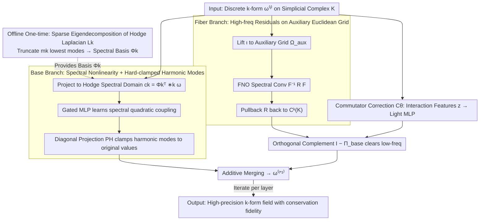

# Topology-Preserving Neural Operator Learning via Hodge Decomposition

**Conference**: ICML 2026  
**arXiv**: [2605.13834](https://arxiv.org/abs/2605.13834)  
**Code**: https://github.com/ContinuumCoder/Hodge-Spectral-Duality (Available)  
**Area**: 3D Vision / Neural Operators / Manifold PDEs  
**Keywords**: Hodge Decomposition, Neural Operators, Discrete Exterior Calculus, Manifold PDEs, Spectral Methods

## TL;DR
This paper proposes the Hodge Spectral Duality (HSD) neural operator, which decomposes the solution operator of manifold PDEs into a dual-branch structure via Hodge orthogonal decomposition: a "low-frequency topological component (spectral basis) + high-frequency geometric component (FNO auxiliary grid)." A commutator correction term is introduced to couple the two, achieving both high precision and conservation law fidelity on complex meshes.

## Background & Motivation

**Background**: Neural operators (FNO, DeepONet, PINNs) have demonstrated the ability to learn resolution-independent solution operator mappings on regular Euclidean grids. However, practical engineering PDEs often occur on Riemannian manifolds with boundaries, curvature, and non-trivial topology (e.g., aerodynamic surfaces of cars, geophysical spheres, biological organ geometries). These physical fields are naturally differential forms: 0-forms (scalar potentials), 1-forms (fluxes), 2-forms (vorticity/flux), whose evolution is constrained by both de Rham cohomological structures and Riemannian metrics.

**Limitations of Prior Work**: Existing methods have structural deficiencies. GNN-based local message passing suffers from over-smoothing and over-squashing, failing to capture global topology determined by the null space of the Hodge Laplacian. Extrinsic spectral methods like FNO are friendly to FFT on Euclidean grids but treat cohomology and boundary topology as "soft constraints," where harmonic components can only be preserved via loss penalties. Intrinsic geometric methods (geodesic/tangent bundle convolutions) preserve manifold structure but require geometrically adaptive kernels, leading to prohibitive computation on large meshes and poor representation of high-frequency details.

**Key Challenge**: Topological constraints (stemming from the kernel of the Hodge Laplacian $\Delta_k=d\delta+\delta d$, corresponding to conservation laws and global circulation) and geometric constraints (stemming from the metric $g$ and material tensor $\kappa$, dominating high-frequency boundary layers and anisotropic diffusion) arise from two distinct algebraic structures. A single representation space struggles to efficiently approximate both components simultaneously, creating an "efficiency-expressivity-topology fidelity" trade-off triangle.

**Goal**: To construct a neural operator framework that is both resolution-independent and structure-preserving, capable of learning PDE solution operators on general Riemannian manifolds while strictly enforcing topological invariants (Betti numbers $b_k$, circulation, flux).

**Key Insight**: The authors observe that the Hodge orthogonal decomposition can uniquely split any $k$-form into three **orthogonal** subspaces: exact (gradient-type), co-exact (curl-type), and harmonic. This orthogonality implies that additive approximation can be performed at the operator level—decomposing $\mathcal{G}_\theta^k$ into a low-frequency topological branch $\mathcal{G}_{\mathrm{base},\theta}^k$ and a high-frequency geometric branch $\mathcal{G}_{\mathrm{fiber},\theta}^k$, which operate in orthogonal subspaces without interference.

**Core Idea**: Use Discrete Exterior Calculus (DEC) to perform an offline eigendecomposition of the low-frequency eigenvectors of the Hodge Laplacian as the "Base space" dedicated to topology-driven low-frequency responses. Use FNO on an auxiliary Euclidean grid to learn metric-driven high-frequency residuals, enforcing them into the orthogonal complement of the Base via an orthogonal projection $(\mathbf{I}-\Pi_{\mathrm{base}})$. Finally, use a commutator correction term $\mathcal{C}_\theta$ derived from Lie-Trotter operator splitting to compensate for the splitting residual between the two non-commutative operators.

## Method

### Overall Architecture
HSD formulates each layer of operator learning as an additive structure consisting of a "Base branch + Fiber branch + Commutator correction":

$\boldsymbol{\omega}_k^{(\ell+1)}=\mathcal{G}_{\mathrm{base}}^{(\ell)}(\boldsymbol{\omega}_k^{(\ell)})+(\mathbf{I}-\Pi_{\mathrm{base}}^k)\bigl[\mathcal{G}_{\mathrm{fiber}}^{(\ell)}(\boldsymbol{\omega}_k^{(\ell)})+\mathcal{C}_\theta^{(\ell)}(\mathbf{z}^{(\ell)})\bigr]$

The input is a discrete $k$-form on a simplicial complex $K$ (0-forms on nodes, 1-forms on edges, 2-forms on faces). During the offline phase, a sparse eigendecomposition $\mathbf{L}_k \mathbf{\Psi}_k = \mathbf{\Psi}_k \mathbf{\Lambda}_k$ is performed, truncated to the $m_k$ lowest-frequency eigenvectors to form the spectral basis $\mathbf{\Phi}_k$. During the online phase, the field is projected onto the Base space (spectral coefficients) and lifted via an operator $\iota$ to an auxiliary Euclidean grid for FFT. The outputs are added after back-projection and orthogonal complement constraints. The key is that the Base is added directly, while the Fiber and commutator corrections are constrained to the orthogonal complement of the Base by $(\mathbf{I}-\Pi_{\mathrm{base}})$, ensuring the two branches reside in complementary subspaces.

### Key Designs

**1. Base Branch: Learning Nonlinearity in the Hodge Spectral Domain with Hard-clamped Harmonic Modes**

FNO's soft penalties cannot maintain conservation laws, and GNNs fail to capture global circulation because topological constraints originate from the kernel space of the Hodge Laplacian—only harmonic modes can encode them. The Base branch specifically handles this: each layer projects the field to a low-dimensional spectral domain $\mathbf{c}_k^{(\ell)}=\mathbf{\Phi}_k^\top *_k\boldsymbol{\omega}_k^{(\ell)}\in\mathbb{R}^{m_k}$ using the Hodge inner product. Precomputed spectral derivative matrices $\mathcal{M}_d^{(k)},\mathcal{M}_\delta^{(k)}$ construct $(k\pm1)$-order derivative features, followed by a gated MLP to learn quadratic nonlinear coupling in the spectral domain (e.g., advection terms $\mathbf{u}\cdot\nabla\mathbf{u}$):

$$\tilde{\mathbf{c}}_k=\mathbf{W}_{\mathrm{out}}\big(\phi(\mathbf{W}_g\mathbf{q})\odot(\mathbf{W}_c\mathbf{q})\big)+\mathbf{c}_k.$$

The critical step follows the update: a diagonal projection $\mathbf{P}_H^k$ is used to **overwrite the harmonic mode positions (zero eigenvalues) directly with original values**, thereby enforcing hard persistence of cohomology classes and global fluxes layer-by-layer. This is feasible and efficient because the number of harmonic modes equals the Betti number $b_k$, which is typically small.

**2. Fiber Branch: Learning High-frequency Residuals on Auxiliary Euclidean Grids with Orthogonal Complements**

Metric-driven high-frequency details (anisotropic diffusion, boundary layers) are assigned to FNO, which excels at FFT, but it must not be allowed to modify conserved components. The Fiber branch uses a lift operator $\iota$ (Whitney forms + KDE) to elevate the discrete cochain to a tensor field on an auxiliary Euclidean grid $\Omega_{\mathrm{aux}}$, executes standard FNO spectral convolutions $\mathcal{F}^{-1}\mathbf{R}_{\mathrm{loc}}\mathcal{F}$, and pulls it back to $C^k(K)$ via an adjoint pullback $\mathcal{R}$. Finally, it is multiplied by $(\mathbf{I}-\Pi_{\mathrm{base}}^k)$ to clear all low-frequency components, ensuring the Fiber only modifies high frequencies. Compared to intrinsic manifold convolutions, Euclidean FFT enjoys $\mathcal{O}(N\log N)$ complexity and inherent anisotropic expressivity; the orthogonal complement constraint directly utilizes the orthogonality of the Hodge decomposition.

**3. Commutator Correction $\mathcal{C}_\theta$: Compensating Splitting Residuals of Non-commutative Operators**

Simply adding the Base and Fiber branches implies a Lie-Trotter operator splitting. However, the topological operator $\mathcal{A}_{\mathrm{Topo}}^k$ and geometric operator $\mathcal{A}_{\mathrm{Geom}}^k$ do not commute ($[\mathcal{A}_{\mathrm{Topo}}^k,\mathcal{A}_{\mathrm{Geom}}^k]\neq0$), leading to systematic residuals of $O(\Delta t^2)$ that a simple sum cannot represent. The authors concatenate geometric lift features $\iota(\boldsymbol{\omega}_k)$ and spectral-domain first derivatives $(\mathbf{c}_k,\mathcal{M}_d\mathbf{c}_k,\mathcal{M}_\delta\mathbf{c}_k)$ into an interaction feature $\mathbf{z}^{(\ell)}$, processed by a lightweight MLP to output a correction. This term is similarly constrained to the Fiber subspace via $(\mathbf{I}-\Pi_{\mathrm{base}})$. Ablations show that removing this term increases error by 18% in Magnetostatics, confirming its role in eliminating splitting bias.

### Loss & Training
The model uses end-to-end MSE supervision (without PDE residual loss). The offline phase performs a one-time sparse eigendecomposition of $\mathbf{L}_k$ (approx. 57s on a $20k$-element tetrahedral mesh). Online training costs comprise $\mathcal{O}(Nk)$ spectral projection and $\mathcal{O}(N\log N)$ FFT, with overall training time significantly lower than message-passing models like MGN.

## Key Experimental Results

### Main Results
Evaluations were conducted on DrivAerNet++ car aerodynamics, multi-connected domain magnetostatics, and toroidal advection-diffusion. All methods were standardized to 207k–310k parameters.

| Task | Model | MSE↓ | Spectral Fidelity↑ | $\beta_0$ Score↑ | IoU↑ |
|------|------|------|----------|----------------|------|
| Ext. Aero | FNO-3D | $1.80\times 10^{-2}$ | 0.7110 | 0.5584 | 0.3010 |
| Ext. Aero | HSD | $\mathbf{1.08\times 10^{-2}}$ | **0.8423** | **0.6112** | **0.3398** |
| Magnetostatics | DeepONet | $2.89\times 10^{-4}$ | 0.9468 | 0.7877 | 0.7834 |
| Magnetostatics | HSD | $\mathbf{1.84\times 10^{-4}}$ | **0.9492** | **0.8176** | **0.8110** |
| Toroidal | FNO-3D | $5.55\times 10^{-4}$ | 0.9079 | 0.6721 | 0.7515 |
| Toroidal | HSD | $\mathbf{3.56\times 10^{-4}}$ | **0.9115** | **0.7829** | **0.8131** |

HSD reduced MSE by 36%–40% compared to the second-best method across all tasks; the improvement in topological fidelity ($\beta_0$ score, measuring connected component consistency) is particularly significant.

### Ablation Study

| Configuration | Magnetostatics | Ext. Aero | Toroidal |
|------|----------------|-----------|----------|
| HSD Full | $1.84\times 10^{-4}$ | $1.08\times 10^{-2}$ | $3.56\times 10^{-4}$ |
| w/o $\mathcal{C}_\theta$ (No Commutator) | $2.18\times 10^{-4}$ (+18%) | $1.17\times 10^{-2}$ (+8%) | $3.79\times 10^{-4}$ (+6%) |
| w/o $\Pi_{\mathrm{base}}$ (No Projection) | $2.20\times 10^{-4}$ (+20%) | $1.45\times 10^{-2}$ (+34%) | $3.72\times 10^{-4}$ (+4%) |
| FNO-3D Baseline | $8.51\times 10^{-4}$ (+363%) | $1.80\times 10^{-2}$ (+67%) | $5.55\times 10^{-4}$ (+56%) |

Experiments varying the spectral mode count $k=64\to 256$ show monotonic MSE decrease with diminishing returns, validating the "Base for few low-freq modes + Fiber for high-freq" duality philosophy.

### Key Findings
- The orthogonal projection $\Pi_{\mathrm{base}}$ is most critical for geometrically complex domains (Ext. Aero); removing it causes a 34% MSE surge, as FNO spectral convolutions introduce non-physical low-frequency noise that pollutes conserved components.
- The commutator correction $\mathcal{C}_\theta$ is most impactful in multi-connected domains (Magnetostatics); removing it causes an 18% surge, confirming that topological-geometric non-commutativity must be explicitly compensated.
- For external aerodynamics, increasing the inference mesh from 3,000 to 7,000 nodes only fluctuated HSD's error by 30%, while all baseline errors amplified at least 10-fold, suggesting HSD learns the PDE operator rather than a mesh-specific mapping.
- In terms of training efficiency, HSD is 56× faster than MGN on Ext. Aero (33s vs 1865s), proving the feasibility of the offline-online design for engineering applications.

## Highlights & Insights
- **Operator-level Additive Decomposition**: Hodge orthogonality provides a powerful algebraic structure where topological and geometric modes are strictly orthogonal. This makes the dual-branch approach a mathematically justified operator splitting rather than just an engineering trick.
- **Hard Constraints vs. Soft Penalties**: Directly overwriting harmonic mode updates with diagonal projections is a representative "hard constraint" for topological invariants. This structural approach is superior to loss-based PINN constraints as it requires no weight tuning.
- **Offline-Online Decoupling**: Outsourcing expensive geometric encoding (eigendecomposition) to an offline phase makes deployment efficient—amortized costs are nearly zero when reusing the same geometry for multiple inferences.
- **Commutator Correction**: Explicitly modeling $[A,B]$ is an overlooked but vital design. When underlying operators do not commute, simple additive branches will always miss second-order terms.

## Limitations & Future Work
- Dependency on one-time offline sparse eigendecomposition restricts support to fixed geometries or small isometric perturbations. The authors suggest using Functional Maps or iso-spectral deformation for low-cost spectral basis transfer in time-varying geometries.
- Currently limited to Eulerian views of 3D or lower manifolds. Lagrangian particle tracking or strong discontinuities (shocks) are not yet applicable due to the low-pass nature of auxiliary grid mollification.
- Scalability to industrial-scale meshes (millions of nodes) regarding eigendecomposition stability and memory remains unverified.
- Approximating the commutator with a light MLP lacks theoretical bounds; higher-order splitting schemes (Strang, Yoshida-4) or more structured correction operators could be explored.

## Related Work & Insights
- **vs. FNO/Geo-FNO**: FNO performs spectral convolutions on Euclidean grids; Geo-FNO uses diffeomorphisms to map geometry back to Euclidean space. HSD avoids "straightening" the geometry, instead defining operator learning directly in the Hodge spectral domain.
- **vs. DeepONet**: DeepONet uses branch-trunk inner products for global fitting. While MSE can be decent for scalar fields, its topological fidelity is lower (IoU 0.78 vs. HSD 0.81).
- **vs. GNN/MGN**: Message passing inherently suffers from over-smoothing/squashing. HSD bypasses this by outsourcing global structure to a spectral basis.
- **vs. Topological Deep Learning (SCN/SCNN)**: Most TDL work focuses on classification or interpolation. HSD is the first to combine DEC with neural operators for continuous operator learning.

## Rating
- Novelty: ⭐⭐⭐⭐⭐ Hodge Spectral Duality makes original contributions at both the mathematical (orthogonal decomposition) and engineering (dual-branch + commutator) levels.
- Experimental Thoroughness: ⭐⭐⭐⭐ Covers various topological cases with comprehensive metrics; mesh scales are somewhat moderate.
- Writing Quality: ⭐⭐⭐⭐ Mathematically rigorous with clear motivation, though some DEC background is required.
- Value: ⭐⭐⭐⭐⭐ Establishes a "fast, accurate, and conservative" baseline for neural operators in scientific computing and CAE.

<!-- RELATED:START -->

## Related Papers

- [\[ICLR 2026\] DRIFT-Net: A Spectral--Coupled Neural Operator for PDEs Learning](../../ICLR2026/physics/drift-net_a_spectral--coupled_neural_operator_for_pdes_learning.md)
- [\[ICLR 2026\] One Operator to Rule Them All? On Boundary-Indexed Operator Families in Neural PDE Solvers](../../ICLR2026/physics/one_operator_to_rule_them_all_on_boundary-indexed_operator_families_in_neural_pd.md)
- [\[CVPR 2026\] NESTOR: A Nested MOE-based Neural Operator for Large-Scale PDE Pre-Training](../../CVPR2026/physics/nestor_a_nested_moe-based_neural_operator_for_large-scale_pde_pre-training.md)
- [\[ICML 2026\] EqGINO: Equivariant Geometry-Informed Fourier Neural Operators for 3D PDEs](eqgino_equivariant_geometry-informed_fourier_neural_operators_for_3d_pdes.md)
- [\[ICCV 2025\] JPEG Processing Neural Operator for Backward-Compatible Coding](../../ICCV2025/physics/jpeg_processing_neural_operator_for_backward-compatible_coding.md)

<!-- RELATED:END -->
