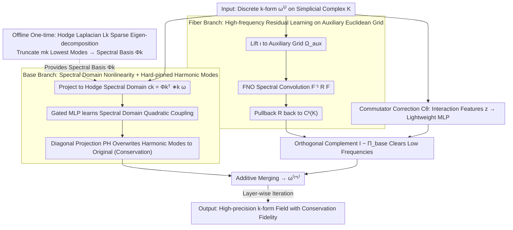

# Topology-Preserving Neural Operator Learning via Hodge Decomposition

**Conference**: ICML 2026  
**arXiv**: [2605.13834](https://arxiv.org/abs/2605.13834)  
**Code**: https://github.com/ContinuumCoder/Hodge-Spectral-Duality (Available)  
**Area**: 3D Vision / Neural Operators / Manifold PDEs  
**Keywords**: Hodge decomposition, Neural operators, Discrete exterior calculus, Manifold PDEs, Spectral methods

## TL;DR
This paper proposes the Hodge Spectral Duality (HSD) neural operator, which decomposes the solution operator of manifold PDEs according to Hodge orthogonal decomposition into a dual-branch structure: a "low-frequency topological component (spectral basis) + high-frequency geometric component (FNO auxiliary grid)." These are coupled via a commutator correction term, achieving both high precision and conservation law fidelity on complex meshes.

## Background & Motivation

**Background**: Neural operators (FNO, DeepONet, PINN) have demonstrated the ability to learn resolution-independent solution operator mappings on Euclidean regular grids. However, practical engineering PDEs often occur on Riemann manifolds with boundaries, curvature, and non-trivial topology (e.g., automotive aerodynamic surfaces, geophysical spheres, biological organ geometries). These physical fields are naturally differential forms: 0-forms (scalar potentials), 1-forms (flux), and 2-forms (vorticity/flux), whose evolution is constrained by both de Rham cohomology structures and Riemann metrics.

**Limitations of Prior Work**: Existing methods possess structural shortcomings. GNN-based local message passing suffers from over-smoothing / over-squashing and fails to capture global topology determined by the Hodge Laplacian null space. FNO-based extrinsic spectral methods are friendly to FFT on Euclidean grids but treat cohomology and boundary topology as "soft constraints," where harmonic components can only be preserved via loss penalties. Intrinsic geometric methods (geodesic / tangent bundle convolutions) preserve manifold structures, but their kernels require geometric adaptation, leading to explosive computational costs on large meshes and an inability to handle high-frequency details.

**Key Challenge**: Topological constraints (arising from the kernel space of the Hodge Laplacian $\Delta_k=d\delta+\delta d$, corresponding to conservation laws and global circulation) and geometric constraints (arising from the metric $g$ and material tensor $\kappa$, dominating high-frequency boundary layers and anisotropic diffusion) stem from two entirely different algebraic structures. A single representation space struggles to efficiently approximate both components simultaneously, resulting in an "efficiency-expressivity-topology" trade-off triangle.

**Goal**: To construct a neural operator framework that is both resolution-independent and structure-preserving, capable of learning PDE solution operators on general Riemann manifolds while strictly enforcing topological invariants (Betti numbers $b_k$, circulation, flux).

**Key Insight**: The authors observe that Hodge orthogonal decomposition uniquely splits any $k$-form into three **orthogonal** subspaces: gradient-like, curl-like, and harmonic-like. This orthogonality implies that "additive approximation" can be performed at the operator level—decomposing $\mathcal{G}_\theta^k$ into a low-frequency topological branch $\mathcal{G}_{\mathrm{base},\theta}^k$ and a high-frequency geometric branch $\mathcal{G}_{\mathrm{fiber},\theta}^k$, which reside in orthogonal subspaces and do not interfere with each other.

**Core Idea**: Use Discrete Exterior Calculus (DEC) to perform an offline eigen-decomposition of the low-frequency eigenvectors of the Hodge Laplacian as a "Base space" dedicated to learning topology-driven low-frequency responses. Use FNO on an auxiliary Euclidean grid to learn metric-driven high-frequency residuals, and use an orthogonal projection $(\mathbf{I}-\Pi_{\mathrm{base}})$ to force these residuals into the orthogonal complement of the Base space. Finally, use a Lie-Trotter operator splitting commutator correction term $\mathcal{C}_\theta$ to compensate for the splitting residual between the two non-commutative operators.

## Method

### Overall Architecture
HSD formulates each layer of operator learning as an additive structure consisting of a "Base branch + Fiber branch + Commutator correction":

$$\boldsymbol{\omega}_k^{(\ell+1)}=\mathcal{G}_{\mathrm{base}}^{(\ell)}(\boldsymbol{\omega}_k^{(\ell)})+(\mathbf{I}-\Pi_{\mathrm{base}}^k)\bigl[\mathcal{G}_{\mathrm{fiber}}^{(\ell)}(\boldsymbol{\omega}_k^{(\ell)})+\mathcal{C}_\theta^{(\ell)}(\mathbf{z}^{(\ell)})\bigr]$$

The input is a discrete $k$-form on a simplicial complex $K$ (0-form on nodes, 1-form on edges, 2-form on faces). In the offline phase, a sparse eigen-decomposition $\mathbf{L}_k \mathbf{\Psi}_k = \mathbf{\Psi}_k \mathbf{\Lambda}_k$ is performed, truncated to $m_k$ lowest-frequency eigenvectors to form the spectral basis $\mathbf{\Phi}_k$. In the online phase, the field is projected into the Base space (spectral coefficients) and lifted via a lift operator $\iota$ onto an auxiliary Euclidean grid for FFT. The output is summed after back-projection and orthogonal complement constraints. The key is that the Base branch is added directly, while the Fiber and commutator correction are first constrained by $(\mathbf{I}-\Pi_{\mathrm{base}})$ to the orthogonal complement of the Base, ensuring the two branches fall into complementary subspaces without interference.

### Key Designs

**1. Base Branch: Learning Nonlinearity in Hodge Spectral Domain and Hard-pinning Harmonic Modes**

FNO's soft penalty fails to maintain conservation laws, and GNNs fail to capture global circulation because topological constraints arise from the kernel space of the Hodge Laplacian, which only harmonic modes can encode. The Base branch specifically handles this: each layer projects the field into a low-dimensional spectral domain $\mathbf{c}_k^{(\ell)}=\mathbf{\Phi}_k^\top *_k\boldsymbol{\omega}_k^{(\ell)}\in\mathbb{R}^{m_k}$ using the Hodge inner product. Precomputed spectral domain differential matrices $\mathcal{M}_d^{(k)},\mathcal{M}_\delta^{(k)}$ construct $(k\pm1)$-order derivative features, followed by a gated MLP to learn spectral quadratic nonlinear coupling (e.g., advection terms $\mathbf{u}\cdot\nabla\mathbf{u}$):

$$\tilde{\mathbf{c}}_k=\mathbf{W}_{\mathrm{out}}\big(\phi(\mathbf{W}_g\mathbf{q})\odot(\mathbf{W}_c\mathbf{q})\big)+\mathbf{c}_k.$$

The critical step follows the update: a diagonal projection $\mathbf{P}_H^k$ **directly overwrites** the positions of zero-eigenvalue (harmonic) modes with their original values, thereby strictly preserving cohomology classes and global fluxes layer-by-layer. This is feasible and efficient because the number of harmonic modes equals the Betti number $b_k$, which is usually very small (units to tens), allowing them to be hard-pinned without affecting high-frequency learnability.

**2. Fiber Branch: High-frequency Residual Learning on Auxiliary Euclidean Grid with Orthogonal Complement Constraint**

Metric-driven high-frequency details (anisotropic diffusion, boundary layers) should be handled by FNO, which excels at FFT, but it must not be allowed to modify conservation components. The Fiber branch uses a lift operator $\iota$ (Whitney form + KDE) to elevate the discrete cochain to a tensor field on an auxiliary Euclidean grid $\Omega_{\mathrm{aux}}$. It runs standard FNO spectral convolution $\mathcal{F}^{-1}\mathbf{R}_{\mathrm{loc}}\mathcal{F}$ and uses an adjoint pullback operator $\mathcal{R}$ to return it to $C^k(K)$. Finally, it is multiplied by $(\mathbf{I}-\Pi_{\mathrm{base}}^k)$ to clear all low-frequency components, ensuring the Fiber branch only refines high frequencies. Compared to intrinsic manifold convolutions, Euclidean grid FFT has a complexity of $\mathcal{O}(N\log N)$ and inherent anisotropic expressivity; the orthogonal complement hard constraint directly leverages the orthogonality of the Hodge decomposition.

**3. Commutator Correction $\mathcal{C}_\theta$: Compensating for Splitting Residuals of Non-commutative Operators**

Simply adding Base and Fiber components implicitly assumes Lie-Trotter operator splitting. however, the topological operator $\mathcal{A}_{\mathrm{Topo}}^k$ and the geometric operator $\mathcal{A}_{\mathrm{Geom}}^k$ do not commute ($[\mathcal{A}_{\mathrm{Topo}}^k,\mathcal{A}_{\mathrm{Geom}}^k]\neq0$), leading to systematic residuals of $O(\Delta t^2)$ that simple summation cannot represent. The authors concatenate geometric lift features $\iota(\boldsymbol{\omega}_k)$ and spectral domain first-order derivatives $(\mathbf{c}_k,\mathcal{M}_d\mathbf{c}_k,\mathcal{M}_\delta\mathbf{c}_k)$ into interaction features $\mathbf{z}^{(\ell)}$, passing them through a lightweight MLP to output a correction. This is similarly constrained to the Fiber subspace via $(\mathbf{I}-\Pi_{\mathrm{base}})$, with gated initialization near zero to start from a decoupled state and gradually learn coupling. Ablations show that removing this term increases error by 18% in Magnetostatics, confirming its role in eliminating splitting bias.

### Loss & Training
End-to-end MSE supervision is used (no PDE residual loss). The offline phase performs a one-time sparse eigen-decomposition of $\mathbf{L}_k$ (approx. 57s on a $\sim 20k$ element tetrahedral mesh). Online training costs consist of $\mathcal{O}(Nk)$ spectral projection + $\mathcal{O}(N\log N)$ FFT, with overall training time significantly lower than message-passing models like MGN.

## Key Experimental Results

### Main Results
Comparison across DrivAerNet++ automotive aerodynamics, multi-connected domain magnetostatics, and toroidal advection-diffusion tasks. Models were standardized to a parameter range of 207k–310k.

| Task | Model | MSE↓ | Spectral Fidelity↑ | $\beta_0$ Score↑ | IoU↑ |
|------|------|------|----------|----------------|------|
| Ext. Aero | FNO-3D | $1.80\times 10^{-2}$ | 0.7110 | 0.5584 | 0.3010 |
| Ext. Aero | HSD | $\mathbf{1.08\times 10^{-2}}$ | **0.8423** | **0.6112** | **0.3398** |
| Magnetostatics | DeepONet | $2.89\times 10^{-4}$ | 0.9468 | 0.7877 | 0.7834 |
| Magnetostatics | HSD | $\mathbf{1.84\times 10^{-4}}$ | **0.9492** | **0.8176** | **0.8110** |
| Toroidal | FNO-3D | $5.55\times 10^{-4}$ | 0.9079 | 0.6721 | 0.7515 |
| Toroidal | HSD | $\mathbf{3.56\times 10^{-4}}$ | **0.9115** | **0.7829** | **0.8131** |

HSD reduced MSE by 36%–40% compared to the second-best method across all three tasks; improvements in topological fidelity ($\beta_0$ score, measuring connected component consistency) were particularly significant.

### Ablation Study

| Configuration | Magnetostatics | Ext. Aero | Toroidal |
|------|----------------|-----------|----------|
| HSD Full | $1.84\times 10^{-4}$ | $1.08\times 10^{-2}$ | $3.56\times 10^{-4}$ |
| w/o $\mathcal{C}_\theta$ (No Commutator) | $2.18\times 10^{-4}$ (+18%) | $1.17\times 10^{-2}$ (+8%) | $3.79\times 10^{-4}$ (+6%) |
| w/o $\Pi_{\mathrm{base}}$ (No Projection) | $2.20\times 10^{-4}$ (+20%) | $1.45\times 10^{-2}$ (+34%) | $3.72\times 10^{-4}$ (+4%) |
| FNO-3D Baseline | $8.51\times 10^{-4}$ (+363%) | $1.80\times 10^{-2}$ (+67%) | $5.55\times 10^{-4}$ (+56%) |

Experiments with spectral mode count $k=64\to 256$ showed monotonically decreasing MSE with diminishing returns, validating the "Base handles low-freq + Fiber handles high-freq" dualistic design philosophy.

### Key Findings
- The orthogonal projection $\Pi_{\mathrm{base}}$ had the greatest impact on geometrically complex domains (Ext. Aero); removing it increased MSE by 34% because FNO spectral convolutions introduce non-physical low-frequency noise that pollutes conservation components.
- The commutator correction $\mathcal{C}_\theta$ was most critical for multi-connected domains (Magnetostatics), where its removal caused an 18% error increase, confirming that topology-geometry operator non-commutativity must be explicitly compensated.
- For external aerodynamics, refining the inference mesh from 3000 nodes to 7000 nodes resulted in only a 30% fluctuation in HSD error, whereas baseline errors increased by at least 10x, indicating that HSD learns the PDE operator rather than mesh-specific mappings.
- Training efficiency: HSD was 56× faster than MGN on Ext. Aero (33s vs 1865s) and utilized only 5% of MGN's training time for Magnetostatics, proving the feasibility of the offline spectral decomposition + online low-dimensional update design.

## Highlights & Insights
- **Operator-level Additive Decomposition**: Hodge orthogonality provides a powerful algebraic structure where "topological modes and geometric modes are strictly orthogonal." this makes the dual-branch approach more than just an engineering trick—it is a mathematically sound operator splitting that could be transferred to other geometric learning tasks (e.g., manifold diffusion models, geometric GANs).
- **Hard Constraints vs. Soft Penalties**: Directly overwriting harmonic mode updates using diagonal projection is a representative method for "hard-preserving topological invariants." Compared to PINN-like approaches that put conservation laws in the loss, this structural hard constraint requires no weight tuning and offers mathematical guarantees.
- **Offline-Online Decoupling**: Offloading expensive geometric encoding (sparse eigen-decomposition) to an offline stage while performing low-dimensional spectral updates and FFT online is highly friendly to engineering deployment, with zero amortized cost when reusing geometries for multiple inferences.
- The commutator correction $\mathcal{C}_\theta$ is an undervalued design: many dual-branch works assume branches are simply additive, but when underlying operators are non-commutative, this assumption inevitably misses second-order terms. Explicitly modeling $[A,B]$ is an insight with broad utility in multi-modal fusion and hybrid architectures.

## Limitations & Future Work
- Dependency on one-time offline Hodge Laplacian sparse eigen-decomposition limits the method to fixed geometries or those with small isometric perturbations. Time-varying geometries (remeshing at each step) are currently unsupported; the authors envision using Functional Maps or iso-spectral deformation for low-cost spectral basis transfer.
- The current framework is tailored for Eulerian-perspective simulations on manifolds of dimension 3 and below. It is not currently applicable to Lagrangian particle tracking or strong discontinuities (shocks, phase boundaries), as the auxiliary Euclidean grid mollification is low-pass and cannot represent jumps.
- Experiments were conducted on medium-scale meshes ($\sim 3000$ nodes); the scalability, eigen-decomposition stability, and memory footprint on industrial-scale (million-node) meshes have not yet been verified.
- The approximation of the commutator correction (lightweight MLP) lacks theoretical characterization regarding its ability to cover higher-order splitting residuals, leaving room for improvement using higher-order splitting schemes (e.g., Strang splitting, Yoshida-4) or more structured correction operators.

## Related Work & Insights
- **vs FNO/Geo-FNO**: FNO performs spectral convolutions on Euclidean grids; Geo-FNO uses diffeomorphisms to map geometry back to Euclidean space. HSD does not attempt to "flatten" geometry but defines operator learning directly in the Hodge spectral domain, fundamentally preserving manifold cohomology.
- **vs DeepONet**: DeepONet uses branch-trunk inner products for global fitting. While its MSE is decent for scalar fields in tasks like Magnetostatics, its topological fidelity is lower (IoU 0.78 vs HSD 0.81). HSD's hard constraints on harmonic modes provide a systematic lead.
- **vs GNN/MGN**: Message passing inherently faces over-smoothing / over-squashing and struggles with global flux. HSD "outsources" global structure to the spectral basis, leaving only high frequencies to local FNO, architecturally avoiding GNN weaknesses.
- **vs Topological Deep Learning (SCN/SCNN)**: Existing TDL work mainly focuses on classification/interpolation and lacks continuous operator mapping. HSD is the first work to combine DEC with neural operators, pushing TDL into the field of operator learning.

## Rating
- Novelty: ⭐⭐⭐⭐⭐ Hodge Spectral Duality makes original contributions at both the mathematical structure (orthogonal decomposition) and engineering implementation (dual-branch + commutator) levels, bridging algebraic topology and neural operators.
- Experimental Thoroughness: ⭐⭐⭐⭐ Three tasks cover closed surfaces, multi-connected domains, and non-zero genus tori. Evaluation metrics are comprehensive (accuracy + conservation + topology), and ablations are complete; however, mesh scales are relatively small and lack validation on large-scale industrial CFD.
- Writing Quality: ⭐⭐⭐⭐ Rigorous mathematical notation, clear problem motivation, and complete appendix derivations. Some sections have high formula density requiring a background in DEC.
- Value: ⭐⭐⭐⭐⭐ Provides a new "fast, accurate, and conservative" neural operator baseline for scientific computing/CAE, with direct potential for deployment in industrial CFD and electromagnetic simulation.

<!-- RELATED:START -->

## Related Papers

- [\[ICLR 2026\] DRIFT-Net: A Spectral--Coupled Neural Operator for PDEs Learning](../../ICLR2026/physics/drift-net_a_spectral--coupled_neural_operator_for_pdes_learning.md)
- [\[ICLR 2026\] One Operator to Rule Them All? On Boundary-Indexed Operator Families in Neural PDE Solvers](../../ICLR2026/physics/one_operator_to_rule_them_all_on_boundary-indexed_operator_families_in_neural_pd.md)
- [\[ICML 2026\] EqGINO: Equivariant Geometry-Informed Fourier Neural Operators for 3D PDEs](eqgino_equivariant_geometry-informed_fourier_neural_operators_for_3d_pdes.md)
- [\[CVPR 2026\] Spatial-Spectral Residuals Informed Diffusion Neural Operator for Pan-sharpening](../../CVPR2026/physics/spatial-spectral_residuals_informed_diffusion_neural_operator_for_pan-sharpening.md)
- [\[ICCV 2025\] JPEG Processing Neural Operator for Backward-Compatible Coding](../../ICCV2025/physics/jpeg_processing_neural_operator_for_backward-compatible_coding.md)

<!-- RELATED:END -->
