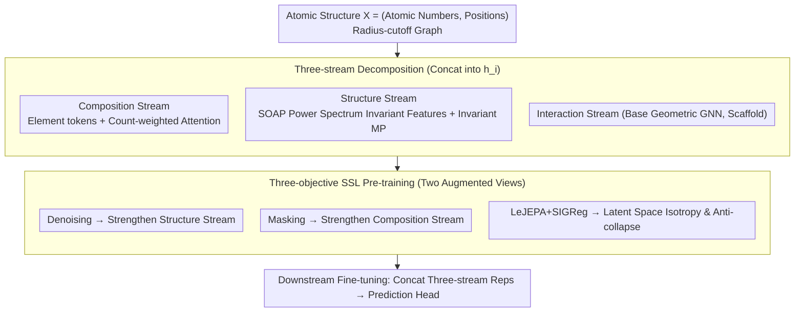

# TriForces: Augmenting Atomistic GNNs for Transferable Representations

**Conference**: ICML 2026  
**arXiv**: [2605.20581](https://arxiv.org/abs/2605.20581)  
**Code**: https://github.com/Ramlaoui/triforces (Available)  
**Area**: Physics / Atomistic Machine Learning Interatomic Potentials / Geometric Graph Neural Networks  
**Keywords**: MLIP, Self-supervised Pre-training, Three-stream Architecture, SOAP Descriptors, Transfer Learning  

## TL;DR
TriForces decomposes atomistic graph neural networks into three parallel streams—"Composition-Structure-Interaction"—and overlays multi-objective self-supervised pre-training (LeJEPA + Denoising + Masking). This ensures that MLIPs are more robust in few-shot transfer, cross-domain fine-tuning, and similar structure retrieval compared to single-stream baselines.

## Background & Motivation

**Background**: Machine Learning Interatomic Potentials (MLIP) trained on DFT data have become the workhorse of materials discovery and molecular dynamics. Geometric GNNs such as MACE, eSEN, and Orb-v3 have achieved energy and force prediction accuracies on large-scale datasets like OMat24 and MPtrj that approach the errors of DFT itself.

**Limitations of Prior Work**: Practical applications almost always require fine-tuning on small, expensive downstream data, yet current MLIP transferability is highly unstable. A model pre-trained on 100M structures may fail to fine-tune on diagnostic tasks such as "predicting crystal systems" or "predicting majority elements." Performance fluctuates significantly across different crystal systems, functionals, or chemical domains.

**Key Challenge**: Representations are optimized for predicting energy and forces, not for reusability. Supervised training entangles compositional and geometric information within the same latent vector. If a downstream task cares only about composition or geometry, it cannot retrieve a clean, reusable representation. Although self-supervised learning (SSL) has been proven to preserve semantic structures in vision/language, in the atomistic domain, SSL has primarily been treated as an auxiliary loss without systematic verification of its interaction with architectural inductive biases.

**Goal**: To decompose the problem into two sub-problems: (1) how to make the architecture itself explicitly preserve composition and geometry information; and (2) how to make SSL truly effective for "non-prediction" tasks such as low-data transfer, representation organization, and retrieval.

**Key Insight**: The authors observe that "energy and force coupling gradients" compete during conservative training, which prior methods mitigated using tricks like multi-stage scheduling or special initializations. By isolating composition-related "force-preserving" degrees of freedom, it is possible to lower energy MAE without sacrificing force MAE.

**Core Idea**: Replace single-stream supervised training with a "three-stream decomposition + multi-objective SSL" framework, providing dedicated channels for composition, structure, and interaction information in the representation space.

## Method

### Overall Architecture
The input is an atomic structure $\mathcal{X}=(\{z_i\},\{\mathbf{x}_i\})$, consisting of atomic numbers $z_i$ and positions $\mathbf{x}_i$, with graph construction based on a radius cutoff. TriForces decomposes node-level representations into three concatenated segments: $\mathbf{h}_i=[\mathbf{h}^{\text{comp}}_i,\mathbf{h}^{\text{struct}}_i,\mathbf{h}^{\text{int}}_i]$—where the composition and structure streams handle specific information, and the interaction stream is the original base geometric GNN (scaffold). Pre-training is conducted on 5M bulk structures from LeMat-Bulk. The three SSL objectives share the same set of random augmented views, each aligning with one architectural stream. During downstream fine-tuning, all three streams are fed into the prediction head. Three variants are distinguished: TriForces-Streams (architecture only, random initialization), TriForces (architecture + SSL), and Base+SSL (SSL only).

### Key Designs

**1. Composition Transformer + Count-weighted Attention: Decoupling Chemical Fingerprints from Geometry**

Supervised training entangles composition and geometry. To obtain clean representations for composition-only tasks, the composition stream compresses the structure into $T$ unique element tokens $\{(z_t,c_t)\}$. Each token is initialized with a learnable element embedding $\mathbf{u}_t=\mathbf{e}(z_t)$ and passed through a Transformer. A key modification adds a log-count bias to the attention logits:

$$a^{(h)}_{ts}=\frac{(\mathbf{q}_t^{(h)})^\top\mathbf{k}_s^{(h)}}{\sqrt{d_h}}+\log(c_s),$$

which is strictly equivalent to "making the attention between tokens equal to the attention across all atoms of that type," while reducing complexity from $\mathcal{O}(N^2)$ to $\mathcal{O}(T^2)$, independent of the number of atoms. Unlike Roost or CrabNet which normalize stoichiometry into fractions, absolute counts $c_t$ are preserved as they encode physical information like system size and energy magnitude.

**2. Type-agnostic Structure Stream: Capturing Cross-system Geometric Motifs via Invariant Descriptors**

To make geometric information independent of element identity, the structure stream constructs rotation-invariant features using SOAP-style power spectra. Each neighbor displacement $\mathbf{r}_{ij}$ is expanded into mixed channels using radial basis functions $\phi_k(r)$, real spherical harmonics $Y_{lm}(\hat{\mathbf{r}})$, and multi-scale cutoffs $s_s(r)$. These are accumulated into local density coefficients $c_{\alpha lm}(i)$, and rotation invariance is enforced via the power spectrum $p_{\alpha\alpha'l}(i)=\sum_m c_{\alpha lm}(i)c_{\alpha'lm}(i)$. Finally, a few invariant message-passing layers are applied to incorporate connectivity. This stream is crucial because in conservative MLIPs, forces are the gradient of energy with respect to positions. The extra degrees of freedom from the composition stream "preserve forces" as long as they do not disrupt geometric dependencies. The type-agnostic structure stream allows energy gradients to propagate only through the interaction stream, theoretically avoiding gradient competition between energy and force losses (rank-based bounds are provided in the appendix), explaining why energy MAE drops significantly on OMat24 without regressing force MAE.

**3. Three-objective Complementary SSL Pre-training: Aligning Objectives with Architectural Streams**

Architecture splitting alone is insufficient; self-supervised objectives must also align with these paths. Pre-training uses two views under the same set of random augmentations (positional noise, atom type masking, random graph construction, and rotation for non-equivariant models). The total loss is driven by:

$$\mathcal{L}=\mathcal{L}_{\text{denoise}}+\lambda_{\text{mask}}\mathcal{L}_{\text{mask}}+\lambda_{\text{LeJEPA}}\mathcal{L}_{\text{LeJEPA}},$$

where denoising $\mathcal{L}_{\text{denoise}}=\sum_i\|f_\theta(\tilde{\mathcal{G}})_i-\boldsymbol{\epsilon}_i\|^2$ stabilizes geometric representations and strengthens the structure stream; masking $\mathcal{L}_{\text{mask}}=-\sum_{i\in\mathcal{M}}\log p_\theta(z_i\mid\tilde{\mathcal{G}})$ strengthens the composition stream's learning of element co-occurrence; and LeJEPA aligns the two views at both node and graph levels, while SIGReg constrains representations to an isotropic Gaussian to prevent collapse (without requiring stop-gradient or momentum encoders). The complementarity is clear: non-reconstructive objectives alone only pull alignment and lose fine differences, while purely reconstructive objectives fail to organize the latent space. Their combination corresponds one-to-one with the three architectural streams.

### Loss & Training
Pre-training is performed on 5M LeMat-Bulk structures, initializing eSEN, Orb-v3, and MACE backbones from scratch. During fine-tuning, three-stream representations are concatenated and fed into downstream prediction heads. OMat24 fine-tuning is run for 2 epochs, while MatBench uses standard 5-fold cross-validation.

## Key Experimental Results

### Main Results: OMat24 Fine-tuning (4M Subset)

| Backbone / Mode | Configuration | E MAE (meV/atom) ↓ | F MAE (meV/Å) ↓ | σ MAE (meV/ų) ↓ |
|------|------|------|------|------|
| Orb-v3 Conservative | Baseline | 107 | 150 | 7.8 |
| Orb-v3 Conservative | + Streams | 35.6 | 149 | 6.2 |
| Orb-v3 Conservative | + TriForces (full) | **19.4** | **95.5** | **4.7** |
| eSEN (equivariant) | Baseline | 104 | 80.3 | 6.3 |
| eSEN (equivariant) | + TriForces (full) | **18.8** | **78.0** | **4.4** |
| MACE (equivariant) | Baseline | 117 | 150 | 8.1 |
| MACE (equivariant) | + TriForces (full) | **34.3** | **142** | **6.1** |

On the conservative Orb-v3, energy MAE was reduced from 107 to 19.4 (82% relative improvement), while force MAE dropped from 150 to 95.5, validating the theoretical expectation that the composition stream does not disrupt force predictions.

### Ablation Study: MatBench 8 Tasks (vs. DFT-labeled Pre-training Baseline)

| Task (Unit) | MACE† | TriForces MACE | Orb† | TriForces Orb | eSEN† | TriForces eSEN |
|------|------|------|------|------|------|------|
| Phonons (cm⁻¹) | 36.7 | 27.6 | 26.2 | 22.6 | 57.8 | **19.5** |
| Log GVRH | 0.082 | 0.073 | 0.063 | 0.058 | 0.093 | 0.058 |
| Perovskites (meV) | 61.4 | 35.1 | 30.7 | 26.5 | 40.1 | **25.6** |
| MP Gap (eV) | 0.370 | 0.250 | 0.194 | 0.132 | 0.392 | 0.139 |
| MP E Form (meV/atom) | 40.8 | 34.4 | 21.1 | 17.1 | 83.5 | 20.2 |

TriForces achieved the best overall results in 6 out of 8 tasks using purely self-supervised pre-training without DFT labels. On the Phonons task, eSEN error dropped from 57.8 to 19.5.

### Key Findings
- In large-scale supervised scenarios (full OMat24), architectural decomposition is the primary contributor, whereas SSL only slightly improves final accuracy but significantly accelerates convergence. In low-data scenarios, SSL is critical—with 20K samples, TriForces reduces energy MAE from 81.3 to 34.6 (57% reduction).
- Conservative models (force = energy gradient) benefit the most from TriForces, confirming the hypothesis that the composition stream provides "force-preserving degrees of freedom."
- Compared to wider baselines with similar parameter counts, TriForces remains superior in 8/8 MatBench tasks and 6/7 QM9 targets, ruling out parameter scaling as the sole explanation.
- The learned latent space supports decomposable similar structure retrieval by chemistry, geometry, or both, opening new uses for MLIP representations beyond prediction.

## Highlights & Insights
- **Architectural splitting $\neq$ simple multi-tasking**: By decomposing composition, structure, and interaction into independent encoding paths, the three SSL objectives can manage their respective domains without interference. This "architectural inductive bias × SSL objective" alignment is a valuable design for other multi-modal or multi-task scenarios.
- **Count-weighted attention** is an elegant trick: Equating "per-element deduplication + log-count bias" with "attention over all atoms" saves computation while preserving physical meaning, and can be directly applied to any set-based chemical/molecular representation.
- **Architecture-level solution for energy-force gradient coupling**: While others use scheduling strategies or diffusion pre-training to bypass competition between energy and force losses, TriForces provides "force-preserving degrees of freedom" at the architectural level, allowing conservative models to train efficiently without extensive hyperparameter tuning.
- **Repositioning role of SSL**: The authors emphasize that TriForces is not "just another SSL method" but an "architectural framework + SSL augmentation." This experimental design of decoupling architecture and objective evaluation (TriForces-Streams vs. Base+SSL vs. TriForces) serves as a standard ablation paradigm for multi-task methods.

## Limitations & Future Work
- The parameter count increases after three-stream concatenation (e.g., TriForces Orb-v3 42M vs. Orb-v3 25.5M); although it outperforms parameter-controlled baselines, deployment costs remain a concern, and no systematic inference speed comparison was provided.
- Computational overhead of SOAP-style power spectra on large systems was not fully detailed. Whether type-agnostic structure streams lose critical element differences in H-containing organic molecules is not explicitly discussed.
- The regularization weight $\lambda$ for LeJEPA + SIGReg is a key hyperparameter, and its sensitivity across different systems/tasks was not analyzed.
- Retrieval results were only shown via qualitative visualization, lacking quantitative metrics such as nearest-neighbor mAP.

## Related Work & Insights
- **vs. JMP / DFT Pre-trained MLIPs**: JMP and others use DFT labels for supervised pre-training. While TriForces does not surpass JMP-L on all MatBench tasks, it significantly closes the gap using only self-supervision, without requiring expensive DFT labels.
- **vs. Roost / CrabNet (Compositional Models)**: These discard geometry to focus on stoichiometry. TriForces embeds the composition stream into a geometric GNN, retaining compositional signals without losing geometric resolution.
- **vs. Noisy Nodes / Force Field Denoising**: Prior SSL in MLIPs mostly served as a single auxiliary loss. TriForces systematically compares the complementarity of non-reconstructive, denoising, and masking objectives, providing empirical conclusions on which SSL is most useful in specific scenarios.

<!-- RELATED:START -->

## Related Papers

- [\[ICLR 2026\] Augmenting Representations with Scientific Papers](../../ICLR2026/physics/augmenting_representations_with_scientific_papers.md)
- [\[ICML 2026\] Quiver: Quantum-Informed Views for Enhanced Representations in Large ML Models](quiver_quantum-informed_views_for_enhanced_representations_in_large_ml_models.md)
- [\[AAAI 2026\] Learning Fair Representations with Kolmogorov-Arnold Networks](../../AAAI2026/physics/learning_fair_representations_with_kolmogorov-arnold_networks.md)
- [\[ICML 2026\] PINNfluence: Interpreting PINNs Through Influence Functions](pinnfluence_interpreting_pinns_through_influence_functions.md)
- [\[ICML 2026\] EqGINO: Equivariant Geometry-Informed Fourier Neural Operators for 3D PDEs](eqgino_equivariant_geometry-informed_fourier_neural_operators_for_3d_pdes.md)

<!-- RELATED:END -->
