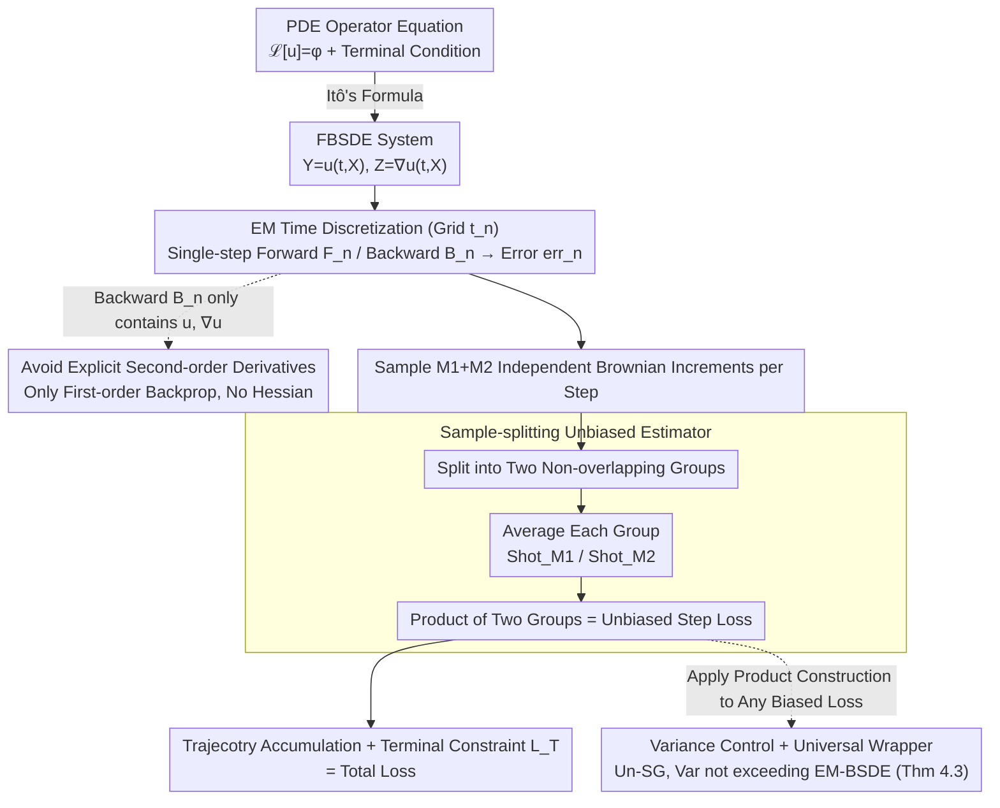

# Unbiased and Second-Order-Free Training for High-Dimensional PDEs

**Conference**: ICML 2026  
**arXiv**: [2605.14643](https://arxiv.org/abs/2605.14643)  
**Code**: https://github.com/seojaemin22/Un-EM-BSDE (Available)  
**Area**: Scientific Computing / Neural PDE Solvers  
**Keywords**: BSDE, High-dimensional PDEs, Euler-Maruyama, Unbiased estimation, Second-order-free

## TL;DR
This paper addresses the discretization bias issue in EM-BSDE training loss by proposing Un-EM-BSDE: it forms an unbiased estimator by taking the "product" of single-step errors averaged over two independent Monte Carlo sub-samples. This approach eliminates bias without requiring the Hessian, achieving the accuracy of Heun-BSDE / FS-PINNs on benchmarks such as HJB, BSB, and AC, while training time remains only 1.79× that of EM-BSDE (compared to 42.91× for Heun-BSDE and 32.07× for FS-PINNs).

## Background & Motivation

**Background**: High-dimensional PDE solvers have two main streams: PINNs, which incorporate PDE residuals into the loss function but suffer from training instability for high-frequency or multiscale solutions; and Deep BSDE, which leverages the connection between PDEs and Stochastic Differential Equations (SDEs) to transform the problem into a probabilistic representation along trajectories, circumventing the curse of dimensionality. Deep BSDE typically utilizes Euler-Maruyama (EM) for temporal discretization to construct a self-consistency loss $\ell_{\text{EM}}=\mathbb{E}[|\text{err}^{\text{EM}}_n|^2]$.

**Limitations of Prior Work**: Park & Tu (2025) proved that the EM-BSDE loss is a **discretization-biased estimator** under finite step size $\Delta t$—the bias term $\frac{1}{2}\text{Tr}[(\sigma^T(\nabla^2 u_\theta)\sigma)^2]$ directly contaminates gradient directions. To eliminate bias, they proposed Heun-BSDE (using Stratonovich + Heun integration), but at the cost of explicitly computing second-order derivatives (Hessian), making training **42.91 times** slower than EM-BSDE. The Shotgun method by Xu & Zhang (2025) only reduces the bias to $1/M$ rather than eliminating it entirely.

**Key Challenge**: The objectives of unbiasedness and efficiency (avoiding second-order derivatives) appear mutually exclusive in BSDE training—Heun-BSDE sacrifices efficiency for unbiasedness, Shotgun/Multi-Shot EM sacrifice unbiasedness for efficiency, and FS-PINNs uses forward SDE sampling but still requires the Hessian.

**Goal**: (i) Completely eliminate EM discretization bias; (ii) Avoid any $\nabla^2 u_\theta$ computation; (iii) Maintain training efficiency comparable to EM-BSDE; (iv) Generalize to complex dynamics such as BZ (fully-coupled FBSDE) and PIDE (with jumps).

**Key Insight**: Utilize the classic statistical principle of sample-splitting—if a second moment $\mathbb{E}[X^2]$ is replaced by the product of two independent sub-samples $\mathbb{E}[X_1\cdot X_2]$, then since $X_1$ and $X_2$ are independent, $\mathbb{E}[X_1 X_2]=\mathbb{E}[X_1]\mathbb{E}[X_2]=(\mathbb{E}[X])^2$, and the bias term (originating from $\text{Var}(X)$) naturally vanishes.

**Core Idea**: Replace the "square of a single sample group" with the "product of two independent Shot sub-samples" to form an unbiased single-step error estimator $\ell^{M_1, M_2}_{\text{UEM}}=\mathbb{E}[\text{Shot}_{M_1}[\text{err}^{\text{EM}}_n]\cdot\text{Shot}_{M_2}[\text{err}^{\text{EM}}_n]]$.

## Method

### Overall Architecture
The PDE $\mathcal{L}[u](t,x)=\phi(t,x,u,\nabla u)$ is transformed via Itô's formula into an FBSDE system $dX_t=\mu\,dt+\sigma\,dW_t$, $dY_t=\phi\,dt+Z_t^T\sigma\,dW_t$, where $Y_t=u(t,X_t)$ and $Z_t=\nabla u(t,X_t)$. Using EM discretization on a time grid $t_n=n\Delta t$ yields the single-step forward mapping $F_n(x)=x+\mu\Delta t+\sigma\Delta W_n$ and the backward mapping $B_n(x;u)=u(t_n,x)+\phi_u\Delta t+\nabla u\cdot\sigma\Delta W_n$. The single-step error is defined as $\text{err}^{\text{EM}}_n(x;u)=\frac{u(t_{n+1}, F_n(x))-B_n(x;u)}{\Delta t}$. Un-EM-BSDE samples $M_1+M_2$ independent Brownian increments $\Delta W_{n,i}$ at each step, splits them into two groups, averages them, and computes their product to obtain an unbiased single-step loss, which is then accumulated along the trajectory. The entire pipeline only modifies the loss construction (sampling + splitting + product) without altering the network or time-stepping, thereby maintaining training costs at the EM level.

### Key Designs

**1. Sample-splitting Unbiased Estimator: Replacing Squared Single Samples with Product of Independent Noises**

The bias of the EM-BSDE loss under finite step sizes stems from using the same noise $\Delta W_n$ for both forward and backward mappings, causing the variance of the single-step error to be absorbed into $\mathbb{E}[X^2]$, forming the bias term $\frac12\mathrm{Tr}[(\sigma^T\nabla^2u_\theta\sigma)^2]$. Borrowing from statistical sample-splitting, the authors define $\text{Shot}_M[\xi]=\frac1M\sum_m\xi_m$ and use $M_1+M_2$ i.i.d. Brownian increments to calculate $M_1+M_2$ independent single-step errors. These are divided into two non-overlapping groups, averaged, and multiplied:

$$\ell^{M_1,M_2}_{\text{UEM}}=\mathbb{E}\big[\text{Shot}_{M_1}[\text{err}^{\text{EM}}_n]\cdot\text{Shot}_{M_2}[\text{err}^{\text{EM}}_n]\big].$$.

Since the two groups are independent, $\mathbb{E}[X_1X_2]=\mathbb{E}[X_1]\mathbb{E}[X_2]=(\mathbb{E}[X])^2$, the variance-induced bias naturally disappears. Lemma 4.1 proves this is exactly equal to the square of the continuous-time PDE residual $([\mathcal{L}[u_\theta]-\phi_{u_\theta}])^2+O(\Delta t^{1/2})$, completely removing the Hessian term from the EM bias. Separating the variance from the squared mean is the core mechanism of the method.

**2. Avoiding Explicit Second-order Derivatives: Staying within the Itô Framework Using Only First-order Gradients**

The reason Heun-BSDE is 42.91× slower is that it follows the Itô-to-Stratonovich conversion, which introduces second-order spatial derivative correction terms, necessitating Hessian calculations. In $d$-dimensional PDEs, the Hessian is a $d\times d$ matrix, and AD costs are $O(d)$ times higher than first-order gradients; at the scale of $d=100$, this determines whether training can even be completed on a GPU. Un-EM-BSDE remains entirely in the Itô framework; the single-step backward formula $B_n$ only involves $u$ and $\nabla u$. The entire pipeline requires only first-order backpropagation (a single `grad` call in PyTorch/JAX). This is not an extra trick but a natural consequence of sample-splitting—eliminating the need for second-order terms to correct bias. This is why training time is suppressed to 1.79×.

**3. Variance Control + Shotgun Universal Wrapper: Proving No Extra Variance and Generalizing the Bias-remover**

Sample-splitting uses cross-moments instead of second moments, which can be noisier and introduce extra variance. Variance analysis is thus critical for practicality. Theorem 4.3 proves that under the conditions $\alpha=2/M-1/(2M_1)-1/(2M_2)\ge4/(3M+\beta M^4)$ and $\beta=1/(2M^2)-1/(4M_1M_2)>0$, $\mathbb{V}[\hat\ell^{M_1,M_2}_{\text{UEM}}]\le\mathbb{V}[\hat\ell^M_{\text{SG}}]\le\mathbb{V}[\hat\ell_{\text{EM}}]$. Specifically, the estimator with $M_1=1, M_2=2$ does not have higher variance than EM-BSDE. The same product construction can be applied to any biased single-step loss as a universal bias-remover. Applying this to the Shotgun loss (Un-SG) reduces RL2 by 2.67× on BSB with hard constraints while only increasing training time by 1.78×. This extends the contribution to a general class of techniques for de-biasing any biased single-step loss.

### Loss & Training
The default experiment setting uses $M_1=M_2=5$. Baseline comparisons use Shotgun with $M=50$ and Multi-Shot EM with $M=10$ to align the internal sampling budget with $M_1+M_2=10$. The loss supports both soft constraints (terminal condition as an extra loss term $L_T$) and hard constraints (built-in via trial functions). The batched implementation (Algorithm 1) uses tensors $X\in\mathbb{R}^{B\times(N+1)\times(M_1+M_2)\times d}$ for batch size $B$, time steps $N$, and sub-sample count $M_1+M_2$, allowing parallel computation of forward trajectories and single-step predictions $\hat Y[b,n+1,i]$ across all shots.

## Key Experimental Results

### Main Results

RL2 error ($\times10^{-2}$) across 5 benchmark PDEs (best in **bold**, second-best <u>underlined</u>):

| PDE / Constraint | EM-BSDE (Biased) | Shotgun (Biased) | Multi-Shot EM | Heun-BSDE (Unbiased) | FS-PINNs (Unbiased) | **Un-EM-BSDE (Ours)** |
|------------|-----------------|------------------|---------------|--------------------|-------------------|-------------------------|
| HJB soft | 0.4055 | 1.1409 | 0.1617 | 0.1424 | **0.0867** | <u>0.1348</u> |
| BSB soft | 0.3483 | 39.99 | 0.1046 | 0.1030 | **0.0478** | <u>0.0814</u> |
| AC soft | 0.0462 | 0.0951 | <u>0.0206</u> | 0.0774 | 0.0325 | **0.0147** |
| BSB hard | 0.3456 | 0.1629 | 0.0739 | 0.0201 | **0.0048** | <u>0.0120</u> |
| PIDE hard | 0.0374 | 0.4057 | 0.0245 | 0.1874 | **0.0137** | <u>0.0226</u> |

Training time multipliers (Table 1):

| Method | Unbiased | 2nd-order-free | Training Time |
|------|----------|----------------|----------|
| EM-BSDE | ✗ | ✓ | 1× |
| Shotgun | ✗ | ✓ | 0.75× |
| Multi-Shot EM-BSDE | ✗ | ✓ | 1.74× |
| Heun-BSDE | ✓ | ✗ | **42.91×** |
| FS-PINNs | ✓ | ✗ | **32.07×** |
| **Un-EM-BSDE (Ours)** | ✓ | ✓ | **1.79×** |

### Ablation Study

| Configuration | Effect |
|------|------|
| Full Un-EM-BSDE | Nearly all settings are second-best or best |
| Sample-splitting wrapper on Shotgun (Un-SG) | RL2 drops 2.67× on BSB hard, time increases by 1.78× |
| Hard vs Soft constraint | Hard constraints are significantly more stable in complex dynamics (BZ, PIDE) |
| BZ (fully-coupled FBSDE) soft | Un-EM is at 5.18 level, while Shotgun surges to 86.53 |

### Key Findings
- **Efficiency as a Killer App**: In high-dimensional $(d)$ scenarios, Heun-BSDE and FS-PINNs might "never finish" due to Hessian computation. Un-EM-BSDE’s 1.79× training time is the sweet spot.
- **Value of Universal Wrapper**: Applying the same product construction to Shotgun immediately yields a 2.67× accuracy Gain, indicating this is a generalized de-biasing technique.
- **Hard Constraints for Complex Dynamics**: Loss balancing issues for soft constraints are magnified in fully-coupled or jump scenarios. Hard constraints are more stable by eliminating weight tuning.
- **Variance Stability**: Theorem 4.3 and experiments verify that the Un-EM estimator's variance does not exceed that of EM-BSDE; the classic concern regarding sample-splitting variance is not a practical issue here.

## Highlights & Insights
- **Precise Application of Statistical Fundamentals**: Sample-splitting is a classic trick, but plugging it precisely into the single-step loss of BSDE to achieve both unbiasedness and efficiency demonstrates deep understanding—the bias is hidden in $\text{Var}(X)$, and independent sampling automatically isolates it.
- **Universal Wrapper Design**: Section 5.3 abstracts the method so that any biased single-step loss with a $\tau$-parameter can be de-biased. This framework-level contribution extends the value far beyond a single algorithm.
- **Bypassing the Itô vs Stratonovich Dilemma**: Heun-BSDE forces a Stratonovich approach for unbiasedness, which introduces the Hessian. Un-EM achieves the same unbiasedness in the Itô framework via randomization, bypassing the trade-off.
- **Tight Coupling of Theory and Experiments**: The trio of Lemma 4.1 (Unbiasedness), Theorem 4.2 (Consistency), and Theorem 4.3 (Variance) are all supported by corresponding experiments, avoiding the common ML paper pitfall of "good theory, poor performance."

## Limitations & Future Work
- The current theory assumes bounded $\mu, \sigma$ and $u_\theta\in C^{1,2}$. For fully-coupled FBSDE and PIDE with unbounded coefficients or jumps, theoretical guarantees are only partially covered.
- The algorithm requires $M_1+M_2$ independent Brownian increments (default 10). Compared to 1 for EM-BSDE, the batched implementation requires $10\times$ the tensor memory, which may become a bottleneck at very large $d$ or batch sizes.
- Experiments were conducted up to $d\sim 100$. Comprehensive ablations for massive scales ($d>1000$) are not yet available.
- Comparison with modern SOTA like forward-backward dual networks (separate networks per step) is missing.
- Extending adaptive time-stepping for complex dynamics is listed as future work; fixed $\Delta t$ might be sub-optimal for stiff or multiscale PDEs.

## Related Work & Insights
- **vs EM-BSDE (Raissi 2024)**: Base method; Un-EM uses randomized products to eliminate bias with only 79% more time.
- **vs Heun-BSDE (Park & Tu 2025)**: Both are unbiased, but Heun requires the Hessian (42.91× time); Un-EM is Hessian-free.
- **vs Shotgun (Xu & Zhang 2025)**: Shotgun reduces bias by $1/M$ but does not eliminate it; Un-EM makes Shotgun unbiased instantly.
- **vs FS-PINNs (Park & Tu 2025)**: FS-PINNs minimizes PDE residual squares sampled along SDE trajectories. It is unbiased but requires the Hessian; Un-EM matches its accuracy without the Hessian cost.
- **vs Hu et al. (2025)**: Similar bias-variance trade-off ideas in PINNs; this work is a specialization and extension within the BSDE framework.
- **Inspiration**: (a) Generalizing sample-splitting to other stochastic losses (e.g., contrastive learning, scoring rules) may similarly eliminate second-order bias; (b) The "split noise into independent groups" trick could also address bootstrap bias in RL value estimation.

## Rating
- Novelty: ⭐⭐⭐⭐ Application of sample-splitting in BSDE loss is a clear and non-trivial contribution, though the technique itself is classic.
- Experimental Thoroughness: ⭐⭐⭐⭐ 5 standard PDEs + 2 complex extensions + wrapper generalization experiments provide full coverage.
- Writing Quality: ⭐⭐⭐⭐⭐ The Table 1 comparison of "unbiased + 2nd-order-free + time" makes the contribution immediately clear.
- Value: ⭐⭐⭐⭐⭐ Heun-BSDE's 42.91× overhead limits its utility; Un-EM returns unbiased BSDEs to EM-level training costs, representing a directly applicable advancement.

<!-- RELATED:START -->

## Related Papers

- [\[AAAI 2026\] PhysicsCorrect: A Training-Free Approach for Stable Neural PDE Simulations](../../AAAI2026/physics/physicscorrect_a_training-free_approach_for_stable_neural_pde_simulations.md)
- [\[NeurIPS 2025\] Enforcing Governing Equation Constraints in Neural PDE Solvers via Training-free Projections](../../NeurIPS2025/physics/enforcing_governing_equation_constraints_in_neural_pde_solvers_via_training-free.md)
- [\[NeurIPS 2025\] High-order Equivariant Flow Matching for Density Functional Theory Hamiltonian Prediction](../../NeurIPS2025/physics/high-order_equivariant_flow_matching_for_density_functional_theory_hamiltonian_p.md)
- [\[ICML 2026\] EqGINO: Equivariant Geometry-Informed Fourier Neural Operators for 3D PDEs](eqgino_equivariant_geometry-informed_fourier_neural_operators_for_3d_pdes.md)
- [\[NeurIPS 2025\] Neural Emulator Superiority: When Machine Learning for PDEs Surpasses its Training Data](../../NeurIPS2025/physics/neural_emulator_superiority_when_machine_learning_for_pdes_surpasses_its_trainin.md)

<!-- RELATED:END -->
