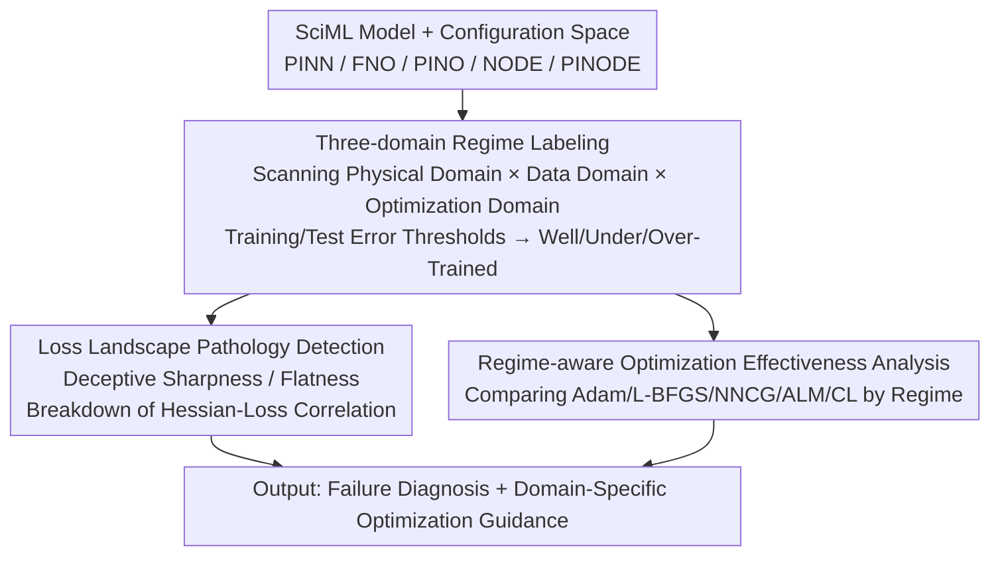

# Unveiling Multi-Regime Patterns in SciML: Diverse Failure Modes and Domain-Specific Optimization

**Conference**: ICML 2026  
**arXiv**: [2605.29153](https://arxiv.org/abs/2605.29153)  
**Code**: https://github.com/leastima/sciml_multi_regime  
**Area**: Scientific Computing / Neural Network Optimization / Loss Landscape Analysis  
**Keywords**: SciML, multi-domain analysis, PINN, failure modes, loss landscape

## TL;DR
Reveals three consistent failure modes in SciML models (PINNs, neural operators, etc.) through a systematic multi-domain diagnostic framework—and analyzes their loss landscape specificities to provide guidance for optimization method selection.

## Background & Motivation

**Limitations of Prior Work**: SciML methods such as PINNs, Neural Operators (FNO), and Neural ODEs encounter optimization difficulties and generalization failures in practical applications, yet they lack a systematic diagnostic framework for failure modes.

**Key Observation**: The loss landscape structure of SciML is more complex than that of CV, characterized by sharp minima, a lack of connectivity, and large Hessian eigenvalues—features that contradict intuitive understandings in CV.

**Key Challenge**: Standard Hessian-loss correlations fail in SciML—low training loss does not correspond to low curvature, and high curvature does not correspond to poor training performance.

**Goal**: Establish a unified multi-domain diagnostic framework to understand the structural roots of SciML failures and provide regime-aware guidance for optimization method selection.

## Method

### Overall Architecture
This is a regime-aware diagnostic framework rather than a new model. Given a SciML model, it first performs a systematic scan along three axes—(1) physical domain (PDE coefficients, equation types); (2) data domain (number of training samples/collocation points); and (3) optimization domain (optimizer choice, constraint handling strategies), jointly recording training loss, test error, and loss landscape geometry. Based on these measurements, training/test error thresholds are used to **automatically extract regime boundaries**, categorizing model behavior into three failure modes. Two actions are then performed on this regime structure: detecting **pathological phenomena** in the loss landscape and comparing various optimizers by regime to provide domain-specific optimization selection guidance.

### Key Designs

**1. Three-domain regime labeling: Automatically categorizing SciML models into three failure modes using training-test errors**

It is difficult to pinpoint "what went wrong" in SciML by looking only at task-level performance. The authors systematically scan along physical (PDE coefficients, equation types), data (number of samples/collocation points), and optimization (optimizers, constraint handling) axes. Each configuration is then automatically assigned to one of three categories using a training threshold $T_{\text{train}}$ and a test threshold $T_{\text{test}}$: Well-Trained (Regime I, low training and test errors), Under-Trained (Regime II, high training and test errors), and Over-Trained (Regime III, low training but high test error). Boundary robustness is verified with $\pm20\%$ threshold perturbations. This yields a task-oblivious view of failure modes, bypassing the limitations of focusing on individual tasks and allowing models with vastly different architectures, such as PINNs, FNOs, and NODEs, to be compared within the same coordinate system.

**2. Loss landscape pathology detection: Capturing counter-intuitive phenomena where Hessian and loss are "mismatched"**

In CV, it is common knowledge that "flat minima generalize well," but the authors found this fails in SciML. Consequently, they track the dynamics of the maximum eigenvalue $\lambda_{\max}$ and training loss simultaneously to identify two pathologies: Deceptive Sharpness (high Hessian eigenvalues corresponding to low training loss) and Deceptive Flatness (low Hessian eigenvalues hiding high training loss). During the Increasing Sharpening phase, these may even move in the same direction. Furthermore, Hessian spectral density estimation reveals that PINNs lack the zero-eigenvalue peak found in CV models like ResNet. This set of detections is critical as it quantitatively reveals the root cause of the breakdown in standard Hessian-loss correlations in SciML—the landscape geometry is inherently different, and applying CV-based flat-minima intuition leads to misjudgment.

**3. Regime-aware optimization effectiveness analysis: Demonstrating that no single optimal optimizer exists and selection must be regime-based**

Following the diagnosis, the framework addresses "how to select an optimizer." The authors systematically compare Adam, L-BFGS, NNCG, ALM, RoPINN, and CL under each regime, generating 2D regime heatmaps (physical parameters × data volume) and calculating relative performance gains for each method. The results are clear: NNCG yields an approximately 50% improvement in test error compared to L-BFGS in Regime I but remains unstable in Regimes II/III; ALM is suitable for constraint-critical problems, while CL is more stable under difficult configurations. The conclusion is that there is no universal optimizer; one must switch in a regime-aware manner—directly transforming the diagnostic framework into an actionable optimizer selection guide.

## Key Experimental Results

### Regime Structure Consistency Validation

| Model | Dataset | Regime I | Regime II | Regime III | Key Phenomenon |
|------|--------|----------|-----------|------------|---------|
| PINN | 1D Convection | $\beta < 25$ | $25 \leq \beta < 50$ | $\beta \geq 50$ (Sparse) | Boundary shifts right as physical parameters increase |
| FNO | 2D Advection-Diffusion | Sufficient Samples | Medium Pressure | Sparse Samples | Smooth transitions rather than PINN's sharp boundaries |
| PINODE | Nonlinear Pendulum | Standard Config | High Dimensional | Low Data | Intermediate characteristics between PINN and FNO |

### Optimization Method Effectiveness Comparison

| Optimization Method | Regime I | Regime II | Regime III | Best Application Scenario |
|----------|----------|-----------|------------|-----------|
| L-BFGS | ✓ | ✓ (Failure Prone) | ✗ | Basic Training |
| ALM | ✓ | ✓✓ (Constraint Hardening) | ✗ | Constraint-critical problems |
| CL (Curriculum Learning) | ✓ | ✓✓ | ✓ | Difficult configurations |
| NNCG | ✓✓ (+50%) | ✗ (Unstable) | ✗ | Regime I Fine-tuning |

## Highlights & Insights
- **Deceptive Sharpness Counter-intuitive Design**: Reveals that high-curvature regions in SciML actually correspond to optimal solutions, contradicting the "flat minima are better" hypothesis in CV.
- **Breakdown of Hessian-Loss Correlation**: Quantitatively proves that SciML landscapes are fundamentally different from CV through spectral density comparisons (PINNs lack zero-eigenvalue peaks while ResNet possesses them).
- **Universal Failure Mode Framework**: Despite architectural differences, the three-domain regime structure consistently emerges across PINNs, FNOs, and NODEs, indicating these failure modes are common across SciML.

## Limitations & Future Work
- Experiments are primarily based on small-scale 1D/2D problems; generalization to large-scale 3D PDEs requires verification.
- The high computational cost of Hessian calculations makes expansion to large-scale models difficult.
- Regime boundary positions vary significantly under different PDE coefficients, making it difficult to provide universal thresholds.
- Future Work: Design adaptive regime detection algorithms to identify the current regime online and automatically switch optimization strategies.

## Related Work & Insights
- **vs Loss Landscape Research (Yang et al.)**: Prior work focuses on landscape connectivity in CV/NLP; this work finds SciML lacks these properties, necessitating specialized diagnostic tools.
- **vs PINN Optimization Research (Krishnapriyan et al.)**: Prior studies provide fragmented analyses of local PINN failure phenomena; this work provides a unified multi-domain perspective and quantitative regime labeling.

## Rating
- Novelty: ⭐⭐⭐⭐ Extending landscape diagnostics from CV to SciML with a systematic multi-dimensional analysis is innovative.
- Experimental Thoroughness: ⭐⭐⭐⭐⭐ Covers 5 SciML models + 4 PDEs + 5 optimization methods.
- Writing Quality: ⭐⭐⭐⭐ Clear logic and rich visualization.
- Value: ⭐⭐⭐⭐ Provides a clear optimizer selection guide and failure diagnostic tool for SciML practitioners.

<!-- RELATED:START -->

## Related Papers

- [\[ICLR 2026\] Supervised Metric Regularization Through Alternating Optimization for Multi-Regime PINNs](../../ICLR2026/physics/supervised_metric_regularization_through_alternating_optimization_for_multi-regi.md)
- [\[ICLR 2026\] MOSIV: Multi-Object System Identification from Videos](../../ICLR2026/physics/mosiv_multi-object_system_identification_from_videos.md)
- [\[ICML 2026\] Hermite-NGP: Gradient-Augmented Hash Encoding for Learning PDEs](hermite-ngp_gradient-augmented_hash_encoding_for_learning_pdes.md)
- [\[AAAI 2026\] PIMRL: Physics-Informed Multi-Scale Recurrent Learning for Burst-Sampled Spatiotemporal Dynamics](../../AAAI2026/physics/pimrl_physics-informed_multi-scale_recurrent_learning_for_burst-sampled_spatiote.md)
- [\[ICML 2026\] Softplus Attention with Re-weighting Boosts Length Extrapolation in Large Language Models](softplus_attention_with_re-weighting_boosts_length_extrapolation_in_large_langua.md)

<!-- RELATED:END -->
