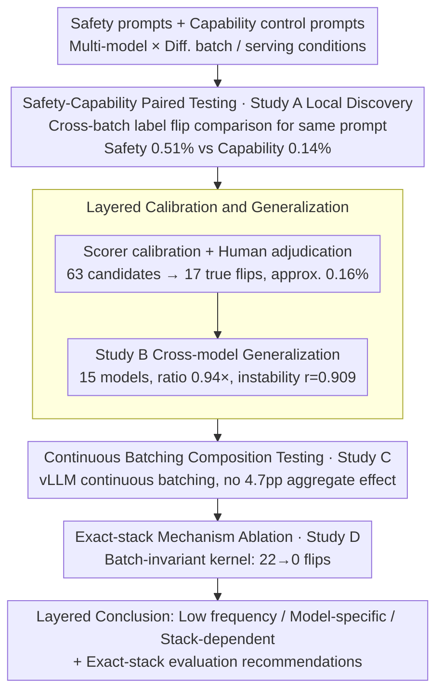

# A Paired Testing Protocol for Batch-Conditioned Refusal Robustness in LLM Serving

**Conference**: ICML2026  
**arXiv**: [2605.27763](https://arxiv.org/abs/2605.27763)  
**Code**: No public code (repository not provided in cache)  
**Area**: LLM Safety / LLM Evaluation / Inference Serving Robustness  
**Keywords**: Refusal robustness, batch inference, vLLM, paired testing, safety evaluation  

## TL;DR
This paper treats the batch condition in LLM serving as a treatment variable for safety evaluation. It proposes a testing protocol consisting of safety-capability paired comparisons, scorer/human adjudication, cross-model expansion, continuous batching composition, and batch-invariant kernel ablation. The study concludes that refusal flips are real but low-frequency, model-specific, and dependent on the specific serving stack.

## Background & Motivation
**Background**: LLM safety evaluations typically fix the inference serving configuration to measure whether a model refuses harmful requests, over-refuses, or maintains capability performance. Conversely, the serving systems community focuses on the impacts of batch size, continuous batching, KV cache, scheduling, and kernels on throughput/latency, rarely incorporating these system variables as conditions for safety evaluation.

**Limitations of Prior Work**: If the same prompt yields different outputs when requested individually, in a synchronous batch, or within a continuous batching scheduler, traditional evaluations are likely to overlook these discrepancies. More critically, output changes do not necessarily equate to safety issues; they might stem from general text instability or happen to cross the refusal/compliance boundary. Therefore, simply reporting that "batching changes output" is insufficient; one must distinguish between safety label changes and general capability label changes.

**Key Challenge**: Batching is a common performance optimization in production serving, yet it alters execution order, numerical paths, co-residence, and kernel behavior. If safety evaluation treats it as a background constant, it implicitly assumes that "refusal behavior under a single request represents behavior under production batch conditions," which is exactly the hypothesis this paper examines.

**Goal**: The authors do not seek to prove that batching is universally dangerous. Instead, they propose a testing protocol that avoids overinterpretation by comparing label changes across different batch conditions under the same prompt and fixed decoding settings. Through capability controls, scorer calibration, cross-model validation, and kernel ablation, the protocol distinguishes genuine low-frequency refusal flips from measurement noise.

**Key Insight**: The paper defines the batch condition as a treatment variable and the unit of evaluation as a conditioned row, i.e., "the paired results of the same prompt under two or more serving conditions." This row-level paired comparison is more sensitive than aggregate refusal rate statistics and is better suited for discovering boundary samples.

**Core Idea**: Shift refusal robustness evaluation from "scoring under a fixed serving configuration" to "paired intervention testing on real serving batch conditions," while reporting low-frequency findings, generalization calibration, and mechanistic ablation in layers.

## Method
The paper does not propose a new model training method but rather a safety evaluation protocol and four layers of evidence. The logic starts with local perturbation studies to discover batch-conditioned refusal flips, moves to a larger collection of models to check signal universality, tests whether multi-tenant co-batching poses extra risks via continuous batching composition, and finally performs mechanism ablation using batch-invariant kernels.

### Overall Architecture
The input consists of a set of safety prompts, capability control prompts, models, and serving conditions. The output is not a single safety score but rather flip rates, directions, calibrated true flip proportions, cross-model heterogeneity, composition effects, and kernel ablation results organized by study hierarchy.

Each of the four studies serves a different role. Study A is the local discovery layer, using three 1B-3B instruction-tuned models to compare safety and capability label changes under synchronous dispatch, neighbor conditions, concurrency quantization, and explicit true batching. Study B expands to 15 models to check if initial safety biases generalize and analyzes whether alignment type and output instability predict fragility. Study C utilizes vLLM FP16 continuous batching to test if co-batched neighbors introduce independent compositional effects. Study D, using the same H100/vLLM 0.19.1 stack, compares standard vLLM with `VLLM_BATCH_INVARIANT=1` for 55 current score-flip candidates.

### Key Designs
**1. Safety-Capability Paired Testing: Distinguishing "Safety Boundary Shifts" from "General Output Jitter"**
Batching changes in output are not necessarily safety issues—they could be general text instability. To avoid misclassifying arbitrary batch-induced changes as safety risks, the protocol pairs every prompt with a control: the safety side uses prompts related to harmful behavior, jailbreaks, truthfulness, bias, and over-refusal, while the capability side uses control tasks like MMLU and ARC-Challenge. For each row, safety and capability label flips are recorded across different batching conditions. The logic is straightforward: if safety and capability labels flip with similar frequency, the phenomenon reflects general output instability; if the safety side is significantly more prone to crossing boundaries, it supports the conclusion of a refusal robustness risk.

**2. Layered Calibration and Generalization: Separating Rare Signals from Scorer Noise and Small Model Stochasticity**
Refusal flips are rare events, and a single positive result is easily overinterpreted. The protocol first reports safety/capability flips under automated scoring in Study A, then performs Unicode normalization, scorer-corrected audits, and human candidate reviews on changed rows to calibrate the operational rate to a more conservative range. Study B then extends the problem to 15 models, reporting the safety/capability ratio, fragility ranges, ANOVA of alignment types, and output instability correlations. This approach preserves the discovery of "genuine boundary samples" while avoiding treating accidental results on small models as universal risks.

**3. Continuous Batching Composition Testing: Isolating Multi-Tenant Co-Batching as an Independent Channel**
Standard batch-size perturbations and real multi-tenant co-batching represent two different threat models. Queued serial service can exhibit batch sensitivity even without true co-batching overlap, whereas the simultaneous residency of different user requests in continuous batching is true co-residence. Study C specifically isolates the latter: on vLLM FP16 continuous batching, it uses five batch-composition conditions, temporal overlap scanning, reverse-direction testing, and static/continuous batching controls to examine if the "presence of other requests" constitutes a safety channel independent of standard batch perturbations. The conclusion is twofold: no aggregate compositional effect was detected at a 4.7 percentage point minimum detectable effect, yet the direction of rare flips leans unsafe (89%-92% per condition, 28/31 combined), and co-batch verification reached only 22.1%. Consequently, the paper interprets this as an underpowered null—"insufficient evidence to guide routing based on this," rather than "composition is always safe."

**4. Exact-stack Mechanism Ablation: Determining if Flips Depend on Specific Serving Kernel Paths**
Deployment risks ultimately depend on the real serving stack. Rather than abstractly debating if "batching is dangerous," it is better to validate on model/kernel/batch settings close to production. Study D uses the same H100 pod, same model, same prompt, same dispatch mode, $temperature = 0$, and $max\_length = 2048$ to run standard vLLM against `VLLM_BATCH_INVARIANT=1` batch-invariant kernels. If the standard path reproduces label flips while the invariant path eliminates them, it proves that the current candidates are indeed sensitive to batch-sensitive execution paths—grounding the "batching affects refusal" narrative in specific kernel paths rather than abstract backend categories.

### Loss & Training
This paper does not involve training loss functions. The evaluation strategy uses fixed prompts, fixed weights, and fixed greedy decoding ($temperature = 0$), varying only the batch size, dispatch synchronization, co-batched composition, or kernel path. Statistical interpretation follows three rules: positive local discoveries are only promoted to visible conclusions if supported by wider expansion or mechanistic checks; directional results must report absolute rates; when studies conflict, the larger sample or more mechanistic study determines the claim boundaries.

## Key Experimental Results

### Main Results
The results of the four studies collectively support a "low-frequency, model-specific, stack-dependent" conclusion rather than "batching is universally unsafe."

| Study | Scope | Key Metrics | Main Conclusion |
|-------|-------|-------------|-----------------|
| Study A: Local Perturbation | 31,410 scored rows, 3 models (1B-3B) | Safety 0.51% vs Capability 0.14%; Enhanced sub: 1.68% vs 0.42%; 17 true flips from 63 candidates; calibrated total approx. 0.16% | Real refusal boundary shifts exist, but the operational rate is very low |
| Study B: Cross-model Expansion | 127,224 records, 15 models | Safety/capability ratio approx. 0.94×; fragility 0.00%-2.39%; alignment ANOVA p=0.942; instability r=0.909 | No universal safety bias; output instability is a better warning signal |
| Study C: Continuous Batching | 14,250 records, 5 composition settings | No aggregate composition effect detected above 4.7pp; 28/31 rare flips lean unsafe; co-batch verification 22.1% | No large-scale composition effect, but directional small samples need monitoring |
| Study D: Kernel Ablation | 55 Study A score-flip candidates, vLLM 0.19.1/H100 | Standard vLLM: 22 label flips, 25 text changes; batch-invariant: 0 label flips, 0 text changes | Current candidate flips depend on non-invariant execution paths in the test stack |

The predictors in Study B are particularly important: alignment type does not explain fragility, whereas output instability is highly correlated with safety fragility.

| Analysis Item | Value | Interpretation |
|---------------|-------|----------------|
| Safety-to-capability ratio | 0.94× | No universally higher flip rate on the safety side across models |
| Fragility range | 0.00%-2.39% | Significant variation between models |
| Alignment type ANOVA | p=0.942, $\eta^2=0.033$ | No observed link between alignment type and fragility at available power |
| Output instability correlation | r=0.909, 95% CI [0.65, 0.97] | Higher output instability under batching correlates with boundary fragility |
| Directional counts | 159 C-to-R vs 81 R-to-C | Direction is not fixed to unsafe; depends on the model set |

### Ablation Study
The most direct mechanism ablation in the paper is the batch-invariant kernel ablation, aiming not to estimate overall risk but to verify if the candidate flips are carried by batch-sensitive execution paths.

| Mode | Rows | OK | Label flips | Text changes | Description |
|------|------|----|-------------|--------------|-------------|
| Standard vLLM | 55 | 55 | 22 | 25 | Reproduces low-frequency flips; flips in candidate set are all in safety-domain rows |
| Batch-invariant | 55 | 55 | 0 | 0 | Flips disappear under the same model, prompt, and H100 stack |

Another critical analysis is the Study A scorer/adjudication calibration, which explains why automated discovery rates cannot be taken as direct production risks.

| Calibration Layer | Result | Meaning |
|-------------------|--------|---------|
| Raw automated discovery | Safety 0.51% vs Capability 0.14% | Signal detected, but may contain scorer artifacts |
| Enhanced reproduction | Safety 1.68% vs Capability 0.42% | Directional bias persists in enriched subset |
| Scorer-corrected audit | 26 unsafe-wise vs 18 safe-wise | Directional bias does not disappear after Unicode/scorer correction |
| Human review (63 cand.) | 17 genuine behavioral flips (~27%) | Most candidates are automated scoring artifacts (e.g., phrasing changes) |
| Calibrated total rate | ~0.16% | True operational rate is significantly lower than the automated signal |

### Key Findings
- Batch-conditioned refusal flip is not a fictitious problem. Study A's true batching layer still shows a 0.80% safety flip rate and has 99.4% agreement with synchronized dispatch, indicating it is not a pure scheduling illusion.
- Initial safety biases do not generalize. Across 15 models in Study B, safety and capability reach near parity, meaning risk cannot be simply extrapolated by alignment type or model family.
- Output instability is the most useful screening variable. The $r=0.909$ correlation suggesting checking output variation under batching before deciding to run dense refusal robustness evaluations.
- Continuous-batch composition showed no large aggregate effect, yet rare flips leaned unsafe and co-batch verification was only 22.1%. The conclusion is "insufficient evidence to guide routing," not "composition is always safe."
- Batch-invariant kernel ablation clarifies the mechanism: at least for the current stack and candidate sets, non-invariant execution paths carry these flips.

## Highlights & Insights
- The paper's greatest strength is its restraint. It does not stop at the headline-grabbing "batching affects refusal" but continues with cross-model studies, composition effects, and kernel ablation to narrow claims to what the data actually supports.
- The paired design of safety prompts and capability controls is a highly reusable evaluation framework. It forces researchers to answer "is this a safety boundary shift or general output variation," avoiding the packaging of system nondeterminism as safety findings.
- The recommendation for exact-stack validation is practical. Users in real deployments care if their current model, batch setting, and kernel path alter refusal behavior, rather than risks in abstract backend categories.
- The work also reminds safety evaluations to adopt the discipline of systems benchmarking: if a serving configuration changes the execution regime, it should be reported as an evaluation condition rather than hidden in background settings.

## Limitations & Future Work
- All studies operate in a sparse-flip regime; directional statistics are susceptible to sample selection and scorer error. While calibrated, larger-scale prospective benchmarks remain necessary.
- Human adjudication involved only one reviewer without inter-rater agreement, making the 0.16% rate more of a conservative correction than a gold-standard population estimate.
- Heterogeneity exists across hardware, models, scoring stacks, and task sets between studies. The paper offers an operational doctrine rather than a single mergeable aggregate effect size.
- The co-batch verification rate of 22.1% in the composition study weakens the negation of actual multi-tenant co-batching effects.
- Kernel ablation is limited to vLLM 0.19.1, H100, and three small models. Larger models, tensor parallelism, other backends, stochastic decoding, and production-grade schedulers require separate validation.

## Related Work & Insights
- **vs. Deterministic Inference**: Existing work shows output differences under fixed prompt/weights/decoding due to batching and kernels; this paper pivots that mechanistic issue toward safety boundaries.
- **vs. Serving Systems**: vLLM and continuous batching research focus on throughput; this paper demands including these variables in the safety envelope.
- **vs. Quantization Safety**: Quantization has been shown to alter safety behavior; this paper emphasizes that batching is also a deployment optimization, though its effects are more infrequent and stack-dependent.
- **vs. Conventional Safety Benchmarks**: Typical benchmarks fix serving configurations; the insight here is that benchmark reports should at least include production batch settings, capability controls, and mechanism sensitivity checks.

## Rating
- Novelty: ⭐⭐⭐⭐☆ Problem definition is original, explicitly integrating batch conditions as safety test variables.
- Experimental Thoroughness: ⭐⭐⭐⭐☆ Four-layer evidence chain is comprehensive, though candidate sparsity and backend coverage remain limited.
- Writing Quality: ⭐⭐⭐⭐☆ Clear claim boundaries and restrained statistical interpretation; as a synthesis paper, some details rely on artifact context.
- Value: ⭐⭐⭐⭐☆ Highly relevant for LLM serving evaluation practice, especially for exact-stack validation before production.

<!-- RELATED:START -->

## Related Papers

- [\[AAAI 2026\] Tool4POI: A Tool-Augmented LLM Framework for Next POI Recommendation](../../AAAI2026/recommender/tool4poi_a_tool-augmented_llm_framework_for_next_poi_recommendation.md)
- [\[ICLR 2026\] Token-Efficient Item Representation via Images for LLM Recommender Systems](../../ICLR2026/recommender/token-efficient_item_representation_via_images_for_llm_recommender_systems.md)
- [\[ICML 2025\] RLTHF: Targeted Human Feedback for LLM Alignment](../../ICML2025/recommender/rlthf_targeted_human_feedback_for_llm_alignment.md)
- [\[AAAI 2026\] Align³GR: Unified Multi-Level Alignment for LLM-based Generative Recommendation](../../AAAI2026/recommender/align3gr_unified_multi-level_alignment_for_llm-based_generat.md)
- [\[ACL 2026\] ReRec: Reasoning-Augmented LLM-based Recommendation Assistant via Reinforcement Fine-tuning](../../ACL2026/recommender/rerec_reasoning-augmented_llm-based_recommendation_assistant_via_reinforcement_f.md)

<!-- RELATED:END -->
