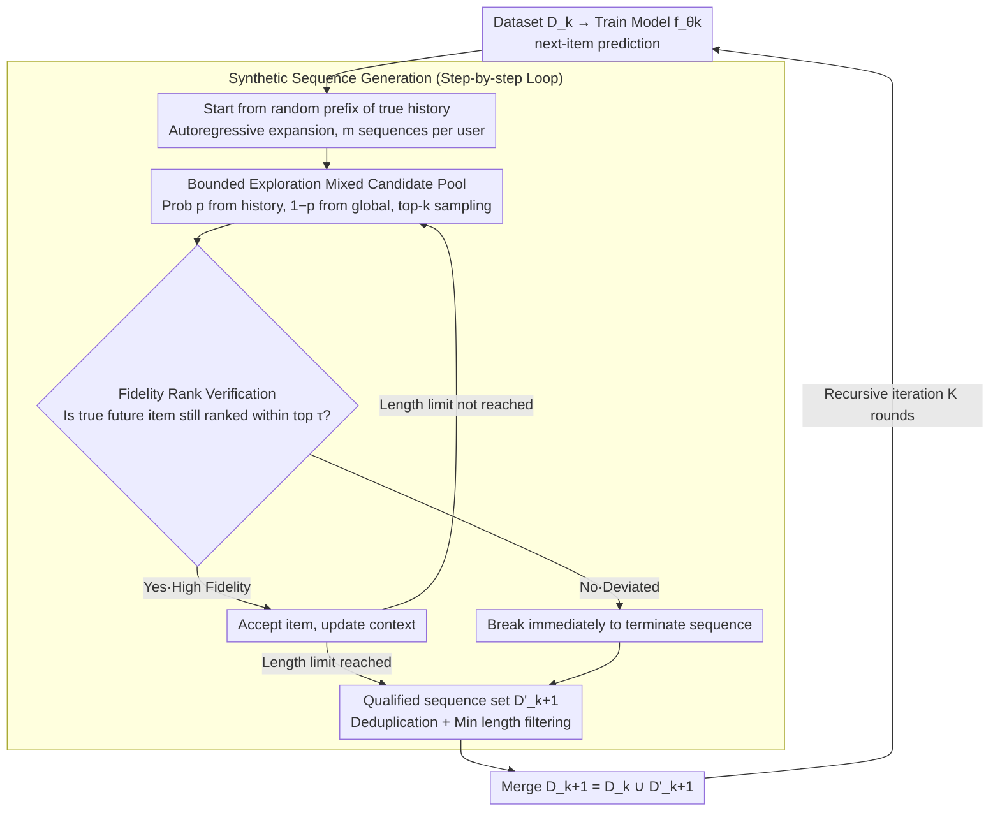

# Can Recommender Systems Teach Themselves? A Recursive Self-Improving Framework with Fidelity Control

**Conference**: ICML 2026  
**arXiv**: [2602.15659](https://arxiv.org/abs/2602.15659)  
**Code**: https://github.com/USTC-StarTeam/RSIR  
**Area**: Recommender Systems / Data Augmentation / Self-training  
**Keywords**: Sequential Recommendation, Self-training, Data Sparsity, Fidelity Control, Implicit Regularization

## TL;DR
RSIR enables sequential recommendation models to generate new synthetic user interaction sequences using their own predictive capabilities, train a new model, and filter out samples deviating from the user preference manifold using a rank-based "fidelity check" to prevent self-consuming model collapse. It consistently improves NDCG/Recall by 4–11% across 4 datasets and 3 mainstream backbones, theoretically proving that this process is equivalent to implicit regularization along the tangent space of the user preference manifold.

## Background & Motivation
**Background**: Sequential recommendation primarily addresses challenges by scaling data and models, but user interaction signals are naturally sparse as any user only interacts with a tiny fraction of the platform catalog. This leads to rugged loss landscapes, convergence to sharp minima, and poor generalization.

**Limitations of Prior Work**: (1) Data augmentation methods (Reordering / Insertion / item masking / cropping) merely perturb existing data without generating new "high-fidelity user trajectories," resulting in limited effectiveness; (2) Data generation methods (DiffuASR, DR4SR) can create new sequences but rely on diffusion models or training auxiliary generators, which is computationally expensive; (3) Utilizing LLMs as teachers for data augmentation outsources the performance bottleneck to "sufficiently large external models," leading to uncontrollable deployment and distribution mismatch.

**Key Challenge**: Closed-loop self-training (generating data to train oneself) has proven effective in LLMs and diffusion models but is highly susceptible to model collapse — where model biases and errors are amplified by the synthetic data, leading to performance breakdown within a few iterations. The key lies in balancing "self-generated data" and "avoiding error accumulation."

**Goal**: (1) Enable recommendation models to bootstrap themselves like STaR / Self-Rewarding LLMs without external teachers or annotations; (2) Design a reliable "fidelity filtering" mechanism to prevent synthetic data from drifting away from the user preference manifold; (3) Theoretically explain why this recursive process does not collapse but instead provides regularization.

**Key Insight**: The authors view "self-improvement" as a form of data-driven implicit regularization — by only accepting perturbations near the tangent space of the true user interest manifold as new data, it is equivalent to imposing a gradient penalty along the manifold direction on the loss landscape, forcing optimization to converge to flatter minima.

**Core Idea**: Use the current model to generate synthetic sequences and use the same model as a "ranking referee" to filter out deviated steps, integrating this combination into a classic SFT loop for multiple recursive iterations.

## Method

### Overall Architecture
In iteration $k$, RSIR consists of 4 steps: (1) Train model $f_{\theta_k}$ on the current dataset $D_k$ (next-item prediction); (2) Use $f_{\theta_k}$ to generate $m$ synthetic sequences $D'_{k+1}$ for each user — starting from random prefixes of true user history and extending autoregressively; (3) Merge to obtain $D_{k+1} = D_k \cup D'_{k+1}$; (4) Train $f_{\theta_{k+1}}$ from scratch (or fine-tune the previous model), recurring for $K$ rounds. The generation core involves two mechanisms: Bounded Exploration (mixed candidate pool) + Fidelity-Based Quality Control (ranking verification). The property that "perturbations only occur along the tangent space of the user manifold" is theoretically explained as implicit regularization, forming the third key design.

### Key Designs

**1. Bounded Exploration: Balancing "Exploiting Known Interests" and "Exploring New Interests"**

Fully free autoregressive generation on large vocabularies causes the generation space to explode and drift, yet only reordering existing items fails to expand new interests. At each generation step, RSIR uses probability $p$ to sample from user history $s_u$ and $1-p$ from the global item set $I$, forming a candidate pool $\mathcal{C}_t\sim p\cdot\mathrm{Sample}(s_u)+(1-p)\cdot\mathrm{Sample}(I)$, where the model performs top-$k$ sampling. The empirical optimal $p$ is approximately 0.5 — pure exploitation ($p=1$) only reorders known items, while pure exploration ($p=0$) easily drifts and is filtered out by quality control; introducing historical bias maintains controllability while providing the ability to "extend known interests."

**2. Fidelity-Based Quality Control: Probing Each Generated Item for Deviation**

This is the lifeline to prevent self-consuming model collapse. Define $S_{tgt}=s_u\setminus S_{ctx}'$ as items in the user's true sequence not yet used. For each generated candidate item, it is immediately checked: if $\exists i_j\in S_{tgt}$ such that $\mathrm{Rank}_{f_{\theta_k}}(i_j\mid S_{ctx}')\leq\tau$ (i.e., true future items still rank within the top $\tau$ under the new context), the item is accepted; otherwise, the sequence is immediately terminated. This ensures the synthetic trajectory remains compatible with the true user interest manifold. The authors further prove that stricter $\tau$ leads to lower "fidelity false negative rate" $\tilde{p}_k$, making the recursive error propagation $\mathcal{E}(\theta_{k+1})\leq(1-\lambda)\mathcal{E}_0+\lambda[(1-\tilde{p}_k)\rho\mathcal{E}(\theta_k)+\tilde{p}_k\mathcal{E}_{\max}]$ satisfy the contraction condition, thereby avoiding collapse.

**3. Manifold Tangential Gradient Penalty: Explaining "Data Expansion in the Right Direction"**

To provide theoretical footing, the authors reinterpret the "filter + generate" loop as implicit regularization: accepted perturbations can only occur along the tangent space of the user preference manifold $\mathcal{M}$. This is equivalent to adding a term $\Omega(\theta)\propto\|\mathcal{P}_\mathcal{M}\nabla_s f_\theta\|^2$ to the original loss, specifically penalizing the gradient magnitude along the manifold direction and forcing the solution to converge to a "flat valley" parallel to the true manifold. This explanation shows why RSIR is not simple data augmentation but "expanded data in the right direction," while noting that the "noise floor" is the ultimate reason for performance saturation.

### Loss & Training
Each round uses standard next-item prediction NLL without changing the loss function; hyperparameter grid: $\tau \in \{1,3,5,10,20,50,100\}$, $m \in \{5,10,20\}$, $p \in \{0,0.2,...,1\}$. Evaluation uses leave-one-out, reporting NDCG/Recall at K=10/20.

## Key Experimental Results

### Main Results
NDCG@10 and Recall@10 results across 4 datasets × 3 backbones (SASRec / CL4SRec / HSTU) compared with 5 data augmentation/generation baselines:

| Backbone | Dataset | Prev. SOTA (Recall@10) | +RSIR (Ours) | Gain |
|----------|--------|----------------------|-------|------|
| SASRec | Beauty | 0.0557 (DR4SR) | **0.0594** | +6.64% |
| SASRec | Sport | 0.0495 (DR4SR) | **0.0512** | +3.43% |
| CL4SRec | Beauty | 0.0590 (DR4SR) | **0.0649** | +10.00% |
| HSTU | Sport | 0.0515 (DR4SR) | **0.0531** | +3.11% |
| HSTU | Yelp | 0.0386 (Insertion) | **0.0411** | +6.48% |

Both RSIR-FT (fine-tuning old weights) and RSIR (training from scratch) consistently outperform all baselines, with the largest improvement of ~10% on CL4SRec.

### Ablation Study
Key ablations on Amazon-Sport + SASRec:

| Configuration | NDCG@10 | Recall@10 | Mechanism |
|------|---------|-----------|------|
| Base SASRec | 0.0271 | 0.0474 | No augmentation |
| RSIR-1 w/o fidelity | 0.0273 | 0.0472 | 1 round, no QC, minimal gain |
| RSIR-1 w/ fidelity | **0.0293** | **0.0512** | 1 round + QC |
| RSIR-2 w/o fidelity | 0.0209 | 0.0384 | Collapses by round 2 |
| RSIR-2 w/ fidelity | 0.0294 | 0.0517 | Continuous improvement |
| RSIR-3 w/o fidelity | 0.0119 | 0.0210 | Catastrophic collapse |
| RSIR-3 w/ fidelity | 0.0298 | 0.0528 | Still rising |

### Key Findings
- **Fidelity filtering is the lifeline**: Removing it leads to total collapse within 3 rounds (Recall drops from 0.0474 to 0.0210), confirming the collapse risk of self-consuming models.
- **Recursive iterations yield "compound interest"**: HSTU shows +8% Recall in the first round on Sport, accumulating to +14% after 3 rounds, though it gradually saturates after 5–8 rounds (consistent with the theoretical noise floor).
- **Weak-to-strong transfer is feasible**: Data generated by a weak teacher improves a strong student by +1.95%, suggesting RSIR benefits from implicit regularization rather than solely the teacher's absolute capability.
- **Data density +342% / Increased information entropy**: Training set density quadruples after 8 rounds, and ApEn (Approximate Entropy) also rises. In contrast, while Insertion adds data, its ApEn decreases, proving RSIR adds "information-rich" content rather than noise.
- **Optimal hyperparameters**: $p \approx 0.5$ and moderate $\tau$ perform best, confirming the exploration/exploitation trade-off.

## Highlights & Insights
- **First work to rigorously transfer "self-improvement" to recommendation systems**, supported by complete theoretical analysis (manifold tangential gradient penalty and recursive error bounds), elevating RecSys data augmentation to a principled level.
- **Clever Fidelity Check Design**: Does not require an external critic; it reuses the same model's rank distribution for self-verification. This "generator-as-referee" symmetric structure is becoming common in LLM self-training but fits RecSys naturally via ranking metrics.
- The "weak-to-strong" transferability echoes recent findings in LLM generalization, suggesting that in industrial scenarios, small models can cheaply generate curriculum data for production models, significantly reducing deployment costs.
- The core philosophy is transferable to: sequential advertising, CTR, conversational recommendation, and any task involving next-token prediction with user behavioral sequences.

## Limitations & Future Work
- **Inevitable Saturation**: The authors acknowledge that benefits diminish as iterations increase due to the noise floor. Dynamically tightening $\tau$ or introducing adaptive filtering are future directions.
- **Coarse Fidelity Check**: Only considers top-$\tau$ ranking, lacking fine-grained detection of "user-intent drift"; it may be less effective for cold-start users or those with singular behaviors.
- Evaluation only covers small-to-medium datasets (Amazon × 3 + Yelp); item sets are relatively small. Billion-scale industrial sets would require ANN acceleration for fidelity checks.
- Lacks direct comparison with LLM-as-teacher augmentation (e.g., LLMRec); convincing readers that self-training truly replaces LLMs requires this comparison.

## Related Work & Insights
- **vs DR4SR / DiffuASR**: Those methods rely on diffusion or training a generator, requiring extra models and expensive training; RSIR reuses the backbone, has zero external models, and outperforms them from the first round.
- **vs STaR / Self-Rewarding LLM**: Shared philosophy of self-evaluation and self-training. RSIR replaces "self-reward" with RecSys-specific "rank consistency" and adds theoretical analysis.
- **vs Insertion / Reordering**: Heuristics cannot add new items; RSIR expands user interest boundaries and avoids noise through fidelity checks.
- **vs RSIDiff / STEP**: Cross-modal studies confirm the universality of self-improvement; this work is the first to ground the paradigm in recommendation.

## Rating
- Novelty: ⭐⭐⭐⭐ Cleanly transfers self-improvement from LLMs/diffusion to sequential recommendation with manifold-based theoretical backing; original compared to standard augmentation.
- Experimental Thoroughness: ⭐⭐⭐⭐ 4 datasets × 3 backbones × 5 baselines; includes multi-round analysis, ablations, weak-to-strong, and runtime analysis. Lacks industrial-scale data.
- Writing Quality: ⭐⭐⭐⭐ Logical flow with clear correspondence between theorems and experiments, though some details are compressed into the appendix.
- Value: ⭐⭐⭐⭐ Tangibly improves recommendation without relying on external LLMs; engineering-friendly implementation (simple break condition).

<!-- RELATED:START -->

## Related Papers

- [\[ICLR 2026\] Token-Efficient Item Representation via Images for LLM Recommender Systems](../../ICLR2026/recommender/token-efficient_item_representation_via_images_for_llm_recommender_systems.md)
- [\[ACL 2025\] CoVE: Compressed Vocabulary Expansion Makes Better LLM-based Recommender Systems](../../ACL2025/recommender/cove_compressed_vocabulary_expansion_makes_better_llm-based_recommender_systems.md)
- [\[AAAI 2026\] RecToM: A Benchmark for Evaluating Machine Theory of Mind in LLM-based Conversational Recommender Systems](../../AAAI2026/recommender/rectom_a_benchmark_for_evaluating_machine_theory_of_mind_in_llm-based_conversati.md)
- [\[AAAI 2026\] Hard vs. Noise: Resolving Hard-Noisy Sample Confusion in Recommender Systems via Large Language Models](../../AAAI2026/recommender/hard_vs_noise_resolving_hard-noisy_sample_confusion_in_recommender_systems_via_l.md)
- [\[ICML 2026\] Incentivized Exploration with Stochastic Covariates: A Two-Stage Mechanism Design for Recommender System](incentivized_exploration_with_stochastic_covariates_a_two-stage_mechanism_design.md)

<!-- RELATED:END -->
