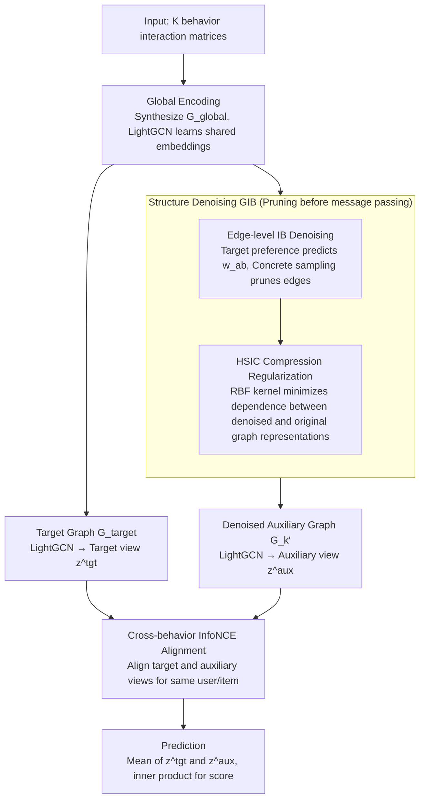

# GCIB: Graph Contrastive Information Bottleneck for Multi-Behavior Recommendation

**Conference**: ICML 2026  
**arXiv**: [2605.25690](https://arxiv.org/abs/2605.25690)  
**Code**: https://github.com/akajinchen/GCIB  
**Area**: Recommender Systems / Information Retrieval  
**Keywords**: Multi-behavior recommendation, Graph Information Bottleneck, Contrastive Learning, HSIC, Denoising

## TL;DR
GCIB employs a dual approach of "Graph Information Bottleneck + Cross-behavior Contrastive Learning." It first prunes edges in auxiliary behavior graphs that are irrelevant to the target task at the structural level (maximizing mutual information with the target behavior and minimizing mutual information with the original auxiliary graph via HSIC surrogates). It then aligns denoised auxiliary representations with sparse target representations using InfoNCE at the feature level, achieving a 7%–40% relative improvement in HR@10 / NDCG@10 across four multi-behavior recommendation benchmarks.

## Background & Motivation

**Background**: Multi-behavior recommendation mitigates data sparsity in single-behavior modeling by introducing auxiliary behaviors (e.g., "click", "add-to-cart", "favorite") into the modeling of target behaviors (e.g., "purchase"). Prevailing approaches utilize GNNs to construct bipartite graphs for each behavior and fuse multi-behavior representations through attention or concatenation.

**Limitations of Prior Work**: The authors conducted a controlled experiment on Tmall (Figure 1). Using the same LightGCN backbone: HR@10 was lowest when using only the auxiliary graph, slightly higher with only the target graph, and highest when mixed, though gains over the single graph were limited. This reveals two persistent issues—auxiliary graphs contain numerous edges irrelevant or even harmful to the target task, and the target behavior itself is too sparse to support robust representation learning.

**Key Challenge**: Existing IB-based recommendation methods perform "denoising" in the representation space by compressing fused embeddings. However, these methods essentially "propagate noise before denoising"—once noise is aggregated into user/item embeddings during message passing, residual noise remains. In other words, **graph cleaning at the structural level must occur before GNN message passing**, not after.

**Goal**: To learn end-to-end (a) a denoised auxiliary graph $\mathcal{G}_k'$ oriented toward the target behavior task and (b) a set of user/item representations that are robust to noise and aligned with the target task, without relying on external noise labels.

**Key Insight**: Transfer the Graph Information Bottleneck principle directly to the edge level—learning a Bernoulli edge mask for the original auxiliary graph $\mathcal{G}_k$ such that the denoised graph $\mathcal{G}_k'$ is simultaneously "sufficient for the target behavior signal $\mathcal{R}$" and "compressed relative to the original $\mathcal{G}_k$," i.e., $\max\ I(\mathcal{R}; \mathcal{G}_k') - \beta I(\mathcal{G}_k'; \mathcal{G}_k)$. Since neither mutual information term has an explicit form, the authors circumvent this using BPR equivalence and HSIC surrogates.

**Core Idea**: Use **edge-level IB** to prune auxiliary graphs and **cross-behavior InfoNCE** to treat denoised auxiliary representations as "semantic replenishment" for target representations, achieving dual denoising at both structural and feature levels.

## Method

### Overall Architecture
The input consists of a set of user-item interaction matrices $\{\mathcal{R}^{(k)}\}$ under $\mathcal{K}$ behaviors. The GCIB pipeline is divided into four components:

1.  **Global Encoding**: All behavior edges are merged into a single heterogeneous bipartite graph $\mathcal{G}_{global}$, using LightGCN to learn shared initial embeddings $\mathbf{E}_{global}$.
2.  **Structure Denoising (GIB)**: Guided by the target behavior representation $\mathbf{E}_{target}$, differentiable retention probabilities $w_{ab}$ are assigned to each auxiliary edge. A denoised graph $\mathcal{G}_k'$ is obtained via Bernoulli sampling. HSIC is then used to minimize the dependence between node representations of $\mathcal{G}_k'$ and the original $\mathcal{G}_k$.
3.  **Feature Alignment (GCL)**: LightGCN is executed on $\mathcal{G}_{target}$ and each $\mathcal{G}_k'$ to derive target views $\mathbf{z}^{tgt}$ and auxiliary views $\mathbf{z}^{aux}$. InfoNCE is used to pull representations of the same user/item across views closer while pushing negative samples apart.
4.  **Prediction**: $\mathbf{z}^{tgt}$ and $\mathbf{z}^{aux}$ are averaged and their inner product computes the recommendation score.

The network is optimized end-to-end using $\mathcal{L} = \mathcal{L}_{BPR} + \beta \mathcal{L}_{IB} + \lambda \mathcal{L}_{CL} + \gamma \|\Theta\|_2$.

### Key Designs

**1. Target-guided edge-level IB denoising: Filtering noisy edges before message passing**

Addressing the limitation that "structural denoising must occur before GNN aggregation," GCIB treats denoising as an edge-dropping problem rather than compressing fused embeddings. The retention of each edge $e_{<u_a,i_b>}$ in auxiliary graph $\mathcal{G}_k$ is determined by probability $w_{ab}=f([\mathbf{e}_a;\mathbf{e}_b])$, where $\mathbf{e}_a,\mathbf{e}_b$ are learned from the target graph and $f$ is a single-layer MLP. This implies that auxiliary edge retention is dictated by target behavior preferences, treating the target preference as the supervision signal $Y$ in IB. To ensure differentiability, Concrete reparameterization $\mathrm{sigmoid}((\log(\delta/(1-\delta))+w_{ab})/t)$ is used. The "sufficiency" term $\max I(\mathcal{R};\mathcal{G}_k')$ is replaced by the BPR loss (equivalent to maximizing target behavior log-likelihood). This ensures embeddings are cleaner at the source of message passing.

**2. HSIC surrogate for "Graph Compression": Replacing mutual information with a differentiable independence regularizer**

The other half of IB is the compression term $\min I(\mathcal{G}_k';\mathcal{G}_k)$, requiring the denoised and original graphs to be statistically independent in node representation space. Since mutual information is difficult to estimate for non-Euclidean graphs, GCIB utilizes HSIC—a kernel-based independence measure in RKHS. For a mini-batch of node representations $\mathbf{E}'^{\mathbf{B}}_k,\mathbf{E}^{\mathbf{B}}_k$, it uses RBF kernels to estimate $\hat{HSIC}(X,Y)=(n-1)^{-2}\mathrm{Tr}(K_X H K_Y H)$. The compression loss is defined as $\mathcal{L}_{IB}=\frac{1}{|\mathcal{K}|}\sum_k \hat{HSIC}(\mathbf{E}'^{\mathbf{B}}_k,\mathbf{E}^{\mathbf{B}}_k)$. HSIC is model-free, differentiable, and does not rely on prior assumptions about the distribution.

**3. Cross-behavior InfoNCE semantic alignment: Replenishing sparse target semantics**

Target behaviors are often too sparse for BPR signals to support robust representations, yet direct fusion with auxiliary embeddings risks noise contamination. GCIB performs denoising followed by soft alignment. LightGCN on $\mathcal{G}_k'$ yields auxiliary views $\mathbf{z}^{aux_k}_u$, which are averaged into $\mathbf{z}^{aux}_u$. Likewise, target views $\mathbf{z}^{tgt}_u$ are obtained from the target graph. InfoNCE $\mathcal{L}^u_{CL}=-\log\frac{\exp(s(\mathbf{z}^{tgt}_u,\mathbf{z}^{aux}_u)/\tau)}{\sum_{u'}\exp(s(\mathbf{z}^{tgt}_u,\mathbf{z}^{aux}_{u'})/\tau)}$ aligns views of the same user while pushing others away. Critically, alignment occurs after denoising, ensuring that "cleaned semantics" are replenished rather than noise.

### Loss & Training
The total loss sums four terms: target BPR loss $\mathcal{L}_{BPR}$ (IB sufficiency), HSIC compression loss $\mathcal{L}_{IB}$ (IB minimality), cross-behavior contrastive loss $\mathcal{L}_{CL}$, and $L_2$ regularization $\gamma\|\Theta\|_2$. Weights $\beta$ and $\lambda$ control the components. All modules are optimized jointly end-to-end.

## Key Experimental Results

### Main Results
The model was tested on four datasets: Tmall (4 behaviors), Taobao (3 behaviors), Yelp (4 behaviors), and ML-10M (3 behaviors) against 13 baselines (including MF-BPR, LightGCN, R-GCN, NMTR, MBGCN, S-MBRec, CRGCN, MB-CGCN, PKEF, BCIPM, NSED, MBLFE) using HR@10/20 and NDCG@10/20 (leave-one-out).

| Dataset | Metric | GCIB | Best baseline | Gain |
|--------|------|------|----------------|---------|
| Tmall | HR@10 / NDCG@10 | 0.1617 / 0.0944 | 0.1502 / 0.0831 (NSED/BCIPM) | +7.66% / +13.60% |
| Taobao | HR@10 / NDCG@10 | 0.1815 / 0.1199 | 0.1577 / 0.1004 (MBLFE/NSED) | +15.09% / +19.42% |
| Yelp | HR@10 / NDCG@10 | 0.0746 / 0.0358 | 0.0531 / 0.0261 (MBLFE) | +40.49% / +37.16% |
| ML-10M | HR@10 / NDCG@10 | 0.0916 / 0.0429 | 0.0810 / 0.0392 (BCIPM) | +13.09% / +9.44% |

Significant gains (up to 40% on Yelp) confirm the effectiveness of GCIB in extremely sparse target behavior scenarios.

### Ablation Study

| Configuration | Tmall HR@10 | Taobao HR@10 | Description |
|------|-------------|--------------|------|
| GCIB (Full) | 0.1617 | 0.1815 | Full model |
| − Global | 0.1101 | 0.1666 | W/o global heterogeneous encoding |
| − IB | 0.1089 | 0.1724 | W/o structure-level GIB denoising |
| − InfoNCE | 0.1523 | 0.1661 | W/o cross-behavior alignment |
| − Both | 0.0356 | 0.0352 | W/o IB and InfoNCE |

### Key Findings
- Removing both IB and InfoNCE causes Tmall HR@10 to crash to 0.0356 (–78%), proving that structural denoising and feature alignment are both essential.
- The largest relative improvement is observed on Yelp, the dataset with the sparsest target behaviors, validating the strategy of "auxiliary denoising + contrastive replenishment."
- Removing global encoding (–Global) causes a sharper drop on Tmall than Taobao, indicating that more complex interaction structures require a better global starting point.

## Highlights & Insights
- **Shifting IB to the edge level** instead of the representation level is a clean insight: unlike prior "pollute then clean" approaches, GCIB "filters before pollution," which is more thorough for information flow.
- **Using BPR for $I(\mathcal{R};\mathcal{G}_k')$ and HSIC for $I(\mathcal{G}_k';\mathcal{G}_k)$** represents a practical engineering solution that sidesteps the difficulty of estimating mutual information for discrete graph structures.
- **Alignment before fusion**: Ensuring contrastive learning aligns denoised semantics rather than noise is a design pattern that could extend to other multi-view/multi-modal recommendation tasks.

## Limitations & Future Work
- Hyperparameters like IB coefficient $\beta$ and contrastive weight $\lambda$ are sensitive to datasets; no automated tuning scheme was provided.
- Bernoulli masks rely on target behavior representations; for cold-start users/items with zero target interactions, this mechanism might fail.
- HSIC estimation depends on mini-batch Monte Carlo sampling; small batches might lead to high variance in independence estimation.
- Future work: Extending IB to temporal multi-behavior recommendation.

## Related Work & Insights
- **vs BCIPM / NSED**: These IB-based methods compress at the representation layer, whereas GCIB compresses at the graph structure layer, explaining its superior performance through earlier intervention.
- **vs CRGCN / MB-CGCN (Cascading)**: Cascading methods assume ordered propagation (e.g., click → purchase). GCIB uses soft alignment via contrastive learning, avoiding rigid assumptions and outperforming CRGCN on Tmall by +93% in HR@10.
- **vs S-MBRec / PKEF (Fusion)**: These rely on attention for fusion without explicit denoising. GCIB decouples "denoising" and "alignment," making the modules more interpretable and effective.

## Rating
- Novelty: ⭐⭐⭐⭐ Moving IB to the edge level with HSIC surrogates is solid, though the GIB + CL combination has precedents in graph classification.
- Experimental Thoroughness: ⭐⭐⭐⭐ Extensive baselines and datasets, but lacks verification on large-scale industrial data.
- Writing Quality: ⭐⭐⭐⭐ Clear motivation and derivation; Figure 1 provides an excellent experimental foundation.
- Value: ⭐⭐⭐⭐ A direct and effective solution for the "noisy auxiliary behavior" problem in industrial recommendation systems.

<!-- RELATED:START -->

## Related Papers

- [\[ICML 2026\] Rethinking Contrastive Learning for Graph Collaborative Filtering: Limitations and a Simple Remedy](rethinking_contrastive_learning_for_graph_collaborative_filtering_limitations_an.md)
- [\[AAAI 2026\] Behavior Tokens Speak Louder: Disentangled Explainable Recommendation with Behavior Vocabulary](../../AAAI2026/recommender/behavior_tokens_speak_louder_disentangled_explainable_recommendation_with_behavi.md)
- [\[NeurIPS 2025\] Semantic Retrieval Augmented Contrastive Learning for Sequential Recommendation](../../NeurIPS2025/recommender/semantic_retrieval_augmented_contrastive_learning_for_sequential_recommendation.md)
- [\[ICLR 2026\] CollectiveKV: Decoupling and Sharing Collaborative Information in Sequential Recommendation](../../ICLR2026/recommender/collectivekv_decoupling_and_sharing_collaborative_information_in_sequential_reco.md)
- [\[ICLR 2026\] C2AL: Cohort-Contrastive Auxiliary Learning for Large-scale Recommendation Systems](../../ICLR2026/recommender/c2al_cohort-contrastive_auxiliary_learning_for_large-scale_recommendation_system.md)

<!-- RELATED:END -->
