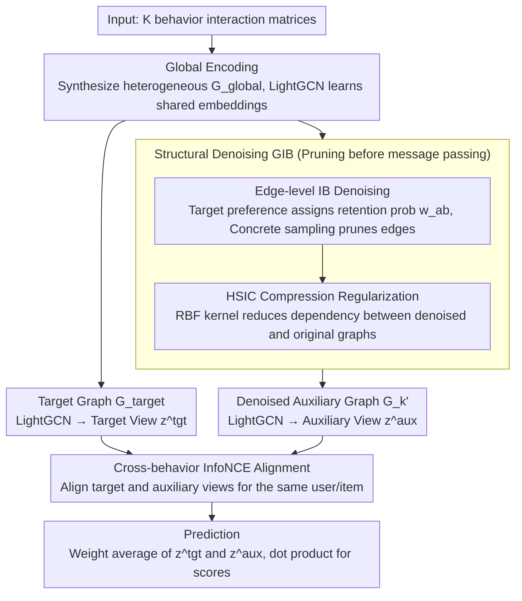

# GCIB: Graph Contrastive Information Bottleneck for Multi-Behavior Recommendation

**Conference**: ICML 2026  
**arXiv**: [2605.25690](https://arxiv.org/abs/2605.25690)  
**Code**: https://github.com/akajinchen/GCIB  
**Area**: Recommendation Systems / Information Retrieval  
**Keywords**: Multi-behavior recommendation, Graph Information Bottleneck, Contrastive Learning, HSIC, Denoising

## TL;DR
GCIB utilizes a dual strategy of "Graph Information Bottleneck + Cross-behavior Contrastive Learning." It first prunes edges in the auxiliary behavior graph that are irrelevant to the target task at the structural level (maximizing mutual information with the target behavior and minimizing mutual information with the original auxiliary graph via HSIC surrogates). Then, it aligns the denoised auxiliary representations with the sparse target representations via InfoNCE at the feature level, pushing HR@10 / NDCG@10 metrics 7%–40% higher than the best baselines across four multi-behavior recommendation benchmarks.

## Background & Motivation

**Background**: Multi-behavior recommendation alleviates data sparsity issues in target behaviors (e.g., purchasing) by introducing auxiliary interactions like "click, add-to-cart, and favorite." Prevailing approaches utilize GNNs to build bipartite graphs for each behavior and fuse multi-behavior representations through attention or concatenation.

**Limitations of Prior Work**: The authors conducted a controlled experiment on Tmall (Figure 1) using a LightGCN backbone. Results showed that using only the auxiliary graph yielded the lowest HR@10, followed by using only the target graph. While mixing all behaviors performed best, the gain over a single graph was limited. This exposes two issues: auxiliary graphs contain many irrelevant or harmful edges, and target behaviors are too sparse to support robust representation learning.

**Key Challenge**: Existing IB-based recommendation methods perform "denoising" in the representation space by compressing fused embeddings. However, this is equivalent to "denoising after noise propagation." Once noise is aggregated into user/item embeddings during message passing, it cannot be completely removed through compression. Therefore, **structural graph cleaning must occur before GNN message passing**, not after.

**Goal**: To end-to-end learn (a) a denoised auxiliary graph $\mathcal{G}_k'$ oriented towards the target task and (b) a set of user/item representations robust to noise and aligned with the target task, without relying on additional labels indicating which edges are noise.

**Key Insight**: The authors apply Graph Information Bottleneck principles directly to the edge level. By learning a Bernoulli mask for the original auxiliary graph $\mathcal{G}_k$, the denoised graph $\mathcal{G}_k'$ is optimized to be "sufficient for the target behavior signal $\mathcal{R}$" and "compressed relative to the original $\mathcal{G}_k$," formulated as $\max\ I(\mathcal{R}; \mathcal{G}_k') - \beta I(\mathcal{G}_k'; \mathcal{G}_k)$. The challenge of having no explicit form for mutual information terms is bypassed using BPR equivalence and HSIC surrogates.

**Core Idea**: Use **edge-level IB** to prune auxiliary graphs and **cross-behavior InfoNCE** to treat denoised auxiliary representations as "semantic supplements" for target representations, achieving dual denoising at both structural and feature levels.

## Method

### Overall Architecture
The input consists of user-item interaction matrices $\{\mathcal{R}^{(k)}\}$ under $\mathcal{K}$ types of behaviors. The GCIB pipeline is divided into four stages:

1.  **Global Encoding**: All behavior edges are combined into a heterogeneous bipartite graph $\mathcal{G}_{global}$, where shared initial embeddings $\mathbf{E}_{global}$ are learned via LightGCN.
2.  **Structural Denoising (GIB)**: Guided by target behavior representations $\mathbf{E}_{target}$, differentiable retention probabilities $w_{ab}$ are assigned to auxiliary edges. A denoised graph $\mathcal{G}_k'$ is obtained via Bernoulli sampling. Simultaneously, HSIC is used to reduce the dependence between node representations of $\mathcal{G}_k'$ and the original $\mathcal{G}_k$.
3.  **Feature Alignment (GCL)**: LightGCN is applied to $\mathcal{G}_{target}$ and each $\mathcal{G}_k'$ to obtain the target view $\mathbf{z}^{tgt}$ and auxiliary view $\mathbf{z}^{aux}$. InfoNCE aligns representations of the same user/item across views while pushing negative samples apart.
4.  **Prediction**: The final recommendation score is computed via the dot product of the averaged representations $\mathbf{z}^{tgt}$ and $\mathbf{z}^{aux}$.

The entire network is optimized jointly using $\mathcal{L} = \mathcal{L}_{BPR} + \beta \mathcal{L}_{IB} + \lambda \mathcal{L}_{CL} + \gamma \|\Theta\|_2$.

### Key Designs

**1. Target-Guided Edge-level IB Denoising: Filtering noise before message passing**

To address the limitation that denoising must occur before GNN aggregation, GCIB defines denoising as an edge-discarding problem rather than compressing fused embeddings. Whether an edge $e_{<u_a,i_b>}$ in auxiliary graph $\mathcal{G}_k$ is retained depends on the probability $w_{ab}=f([\mathbf{e}_a;\mathbf{e}_b])$, where $\mathbf{e}_a,\mathbf{e}_b$ are learned from the target behavior graph and $f$ is a single-layer MLP. This ensures auxiliary edges are filtered based on target preferences, effectively using the target signal as the supervision $Y$ in the IB framework. To keep Bernoulli sampling differentiable, the authors utilize Concrete relaxation $\mathrm{sigmoid}((\log(\delta/(1-\delta))+w_{ab})/t)$. The "sufficiency" term $\max I(\mathcal{R};\mathcal{G}_k')$ is replaced by the BPR loss of the target behavior. This ensures user/item embeddings are cleaned at the source of message passing.

**2. HSIC Surrogate for Graph Compression: Replacing mutual information with differentiable independence regularization**

The compression term $\min I(\mathcal{G}_k';\mathcal{G}_k)$ aims to make denoised and original graphs statistically independent in the node representation space. Estimating mutual information for non-Euclidean graph data is difficult, and variational bounds for discrete graph structures are hard to formulate. GCIB employs the Hilbert-Schmidt Independence Criterion (HSIC), a kernel-based independence measure, as a surrogate. For mini-batches of node representations $\mathbf{E}'^{\mathbf{B}}_k,\mathbf{E}^{\mathbf{B}}_k$, the RBF kernel estimates $\hat{HSIC}(X,Y)=(n-1)^{-2}\mathrm{Tr}(K_X H K_Y H)$. The compression loss is defined as $\mathcal{L}_{IB}=\frac{1}{|\mathcal{K}|}\sum_k \hat{HSIC}(\mathbf{E}'^{\mathbf{B}}_k,\mathbf{E}^{\mathbf{B}}_k)$. HSIC is model-free, differentiable, and does not rely on prior assumptions about distribution forms.

**3. Cross-behavior InfoNCE Semantic Alignment: Supplementing sparse target semantics**

Target behaviors are often too sparse for BPR signals to learn robust representations, yet direct weight fusion can introduce noise. GCIB performs denoising followed by soft alignment. After running LightGCN on the denoised graph $\mathcal{G}_k'$, the auxiliary view $\mathbf{z}^{aux}_u$ is obtained by averaging multiple behavior views. The target view $\mathbf{z}^{tgt}_u$ is derived similarly from the target graph. InfoNCE $\mathcal{L}^u_{CL}=-\log\frac{\exp(s(\mathbf{z}^{tgt}_u,\mathbf{z}^{aux}_u)/\tau)}{\sum_{u'}\exp(s(\mathbf{z}^{tgt}_u,\mathbf{z}^{aux}_{u'})/\tau)}$ pulls the two views of the same user together while pushing others apart. Crucially, alignment happens after denoising, ensuring that supplementary information is semantic rather than noisy.

### Loss & Training
The total loss is a weighted sum of four components: target behavior BPR loss $\mathcal{L}_{BPR}$ (as the sufficiency term), HSIC compression loss $\mathcal{L}_{IB}$ (as the compression term), cross-behavior contrastive loss $\mathcal{L}_{CL}$, and $L_2$ regularization $\gamma\|\Theta\|_2$. The parameters $\beta$ and $\lambda$ control the weights. All modules are optimized end-to-end without a pre-training phase.

## Key Experimental Results

### Main Results
Experiments were conducted on four datasets: Tmall, Taobao, Yelp, and ML-10M. GCIB was compared against 13 baselines (including MF-BPR, LightGCN, R-GCN, NMTR, MBGCN, S-MBRec, CRGCN, MB-CGCN, PKEF, BCIPM, NSED, MBLFE) using HR@10/20 and NDCG@10/20.

| Dataset | Metric | GCIB | Best Baseline | Gain |
| :--- | :--- | :--- | :--- | :--- |
| Tmall | HR@10 / NDCG@10 | 0.1617 / 0.0944 | 0.1502 / 0.0831 (NSED/BCIPM) | +7.66% / +13.60% |
| Taobao | HR@10 / NDCG@10 | 0.1815 / 0.1199 | 0.1577 / 0.1004 (MBLFE/NSED) | +15.09% / +19.42% |
| Yelp | HR@10 / NDCG@10 | 0.0746 / 0.0358 | 0.0531 / 0.0261 (MBLFE) | +40.49% / +37.16% |
| ML-10M | HR@10 / NDCG@10 | 0.0916 / 0.0429 | 0.0810 / 0.0392 (BCIPM) | +13.09% / +9.44% |

The most significant improvements were observed on Yelp, the sparsest dataset, consistent with GCIB's design for sparse target behaviors and noisy auxiliary signals.

### Ablation Study
| Configuration | Tmall HR@10 | Taobao HR@10 | Description |
| :--- | :--- | :--- | :--- |
| GCIB (Full) | 0.1617 | 0.1815 | Full model |
| − Global | 0.1101 | 0.1666 | Remove global heterogeneous encoding |
| − IB | 0.1089 | 0.1724 | Remove structural GIB denoising |
| − InfoNCE | 0.1523 | 0.1661 | Remove cross-behavior alignment |
| − Both | 0.0356 | 0.0352 | Remove both IB and alignment |

### Key Findings
- Removing both IB and InfoNCE causes HR@10 on Tmall to drop by 78%, indicating that structural denoising and feature alignment are indispensable components.
- GCIB shows the largest relative gain (+40% HR@10) on Yelp, confirming its effectiveness in sparse target scenarios.
- The removal of Global encoding impacts Tmall more significantly than Taobao, suggesting that more complex interaction structures require a better global starting point.

## Highlights & Insights
- **Shifting IB to the edge level** rather than the representation level is the core insight. It avoids the "propagate noise then denoise" pitfall by filtering edges before information flows through the GNN.
- **Using BPR for sufficiency and HSIC for compression** provides a practical engineering solution that avoids difficult mutual information estimation for graph structures.
- **Alignment precedes fusion**: By performing GIB before InfoNCE and final fusion, the model ensures that contrastive learning aligns meaningful semantics rather than noise.

## Limitations & Future Work
- Hyperparameters like $\beta$, $\lambda$, and temperature $\tau$ are sensitive to datasets; no automated tuning scheme is provided.
- Edge masks depend on target behavior representations; for cold-start users/items with zero target interactions, this mechanism may fail.
- HSIC estimation relies on mini-batch Monte Carlo sampling, which may suffer from high variance in small batch sizes.
- Future work could include user-aware edge masking or incorporating temporal information into the multi-behavior IB framework.

## Related Work & Insights
- **vs BCIPM / NSED**: These IB methods compress representations, while GCIB compresses the graph structure, intervening earlier in the information flow.
- **vs CRGCN / MB-CGCN**: Cascade-based methods assume a rigid hierarchy (e.g., click → buy). GCIB uses soft alignment via contrastive learning, outperforming CRGCN by 93% on Tmall HR@10.
- **vs S-MBRec / PKEF**: These use attention for fusion without explicit denoising. GCIB's modularized denoising and alignment provide better explainability and performance.

## Rating
- Novelty: ⭐⭐⭐⭐ Moving IB to the edge level and using HSIC surrogates is a solid contribution, though the GIB + CL combination has precedents in other graph domains.
- Experimental Thoroughness: ⭐⭐⭐⭐ Comprehensive testing across four datasets and 13 baselines, though lacking validation on large-scale industrial data.
- Writing Quality: ⭐⭐⭐⭐ Motivations are clearly derived from controlled experiments, and formulas align well with diagrams.
- Value: ⭐⭐⭐⭐ Provides a direct, effective solution for auxiliary behavior denoising in sparse recommendation scenarios.

<!-- RELATED:START -->

## Related Papers

- [\[ICML 2026\] Rethinking Contrastive Learning for Graph Collaborative Filtering: Limitations and a Simple Remedy](rethinking_contrastive_learning_for_graph_collaborative_filtering_limitations_an.md)
- [\[AAAI 2026\] Behavior Tokens Speak Louder: Disentangled Explainable Recommendation with Behavior Vocabulary](../../AAAI2026/recommender/behavior_tokens_speak_louder_disentangled_explainable_recommendation_with_behavi.md)
- [\[NeurIPS 2025\] Semantic Retrieval Augmented Contrastive Learning for Sequential Recommendation](../../NeurIPS2025/recommender/semantic_retrieval_augmented_contrastive_learning_for_sequential_recommendation.md)
- [\[ICLR 2026\] CollectiveKV: Decoupling and Sharing Collaborative Information in Sequential Recommendation](../../ICLR2026/recommender/collectivekv_decoupling_and_sharing_collaborative_information_in_sequential_reco.md)
- [\[ICLR 2026\] C2AL: Cohort-Contrastive Auxiliary Learning for Large-scale Recommendation Systems](../../ICLR2026/recommender/c2al_cohort-contrastive_auxiliary_learning_for_large-scale_recommendation_system.md)

<!-- RELATED:END -->
