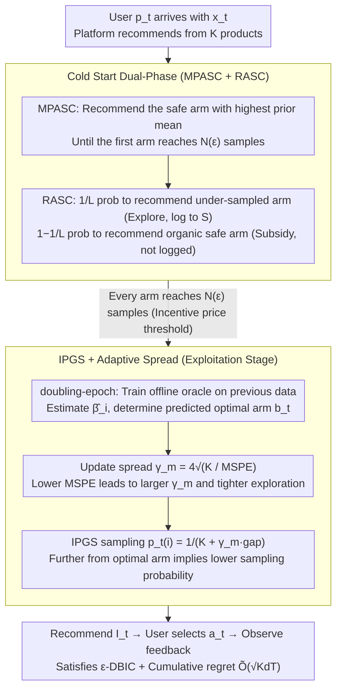

# Incentivized Exploration with Stochastic Covariates: A Two-Stage Mechanism Design for Recommender System

**Conference**: ICML 2026  
**arXiv**: [2406.04374](https://arxiv.org/abs/2406.04374)  
**Code**: To be confirmed  
**Area**: Reinforcement Learning / Contextual Bandits / Mechanism Design  
**Keywords**: Incentive Compatibility, Contextual Bandits, Mechanism Design, Cold Start, Inverse Gap Sampling  

## TL;DR
RCB integrates "exploration-exploitation" and "user incentive compatibility" into a contextual bandit problem under Dynamic Bayesian Incentive Compatibility (DBIC) constraints. It proposes a two-stage algorithm (Cold Start + IPGS), proves $\tilde{O}(\sqrt{KdT})$ regret in stochastic user covariate scenarios, allows for the integration of any offline learning oracle, and quantifies the "incentive price" — showing that the cold start sample size grows as $1/\epsilon^2$ as the $\epsilon$ constraint tightens.

## Background & Motivation
**Background**: Modern recommendation markets consist of three parties: products, users, and the platform. The platform must balance utilizing known preferences (exploitation) with probing cold-start items (exploration). However, self-interested and short-sighted users often reject recommendations that appear suboptimal, leading to data sparsity for long-tail content and failed cold starts. The line of incentivized exploration, pioneered by Kremer et al. 2014 and Mansour et al. 2020, addresses multi-armed bandits (MAB) without context; Sellke & Slivkins (2023) further incorporated linear contexts, but all these works assume a **fixed-design** — where product features are static and do not vary by user.

**Limitations of Prior Work**: In real-world recommendations, user covariates are **stochastically sampled** upon arrival, and the optimal arm varies for each user. Previous black-box reductions (Mansour et al. 2020) often ignore the statistical efficiency gains offered by linear structures, while fixed-design analyses are fundamentally inapplicable. The result is neither the achievement of sublinear regret nor a guarantee of BIC.

**Key Challenge**: There is a structural conflict between the platform's long-term goal (maximizing cumulative reward and collecting data for cold-start products) and the users' immediate self-interest (choosing the arm with the highest current expected reward based on priors). Furthermore, as the incentive compatibility constraint $\epsilon$ tightens, exploration becomes more restricted; less exploration leads to higher long-term regret. The quantitative link between these two quantities has not been clearly established by previous research.

**Goal**: (i) Formalize incentive compatibility in stochastic covariate scenarios as an $\epsilon$-DBIC constraint; (ii) Design an algorithm that simultaneously ensures sublinear regret and DBIC; (iii) Decouple the "incentive cost" from the "learning rate," allowing the algorithm to plug and play any offline regression oracle (not limited to Gaussian/Beta posteriors).

**Key Insight**: The core observation is that the "sufficiently good posterior" required by BIC constraints and "sustainable exploration" can be **temporally decoupled**. A finite-length cold start stage can first push the sample size for each arm to the lower bound required to satisfy DBIC. Subsequently, as long as the offline oracle's MSPE decreases, the IPGS spread parameter can automatically tighten to maintain DBIC in a steady state.

**Core Idea**: Replace the Thompson Sampling route with a two-stage architecture (cold start to collect minimum necessary samples + IPGS stage for dynamic exploration radius calibration). This encapsulates the "incentive price" entirely within the cold start length $N(\epsilon)$, allowing the subsequent learning rate to be completely decoupled from $\epsilon$.

## Method

### Overall Architecture
In each round $t$, a user $p_t$ with features $x_t \in \mathcal{X} \subset \mathbb{R}^d$ arrives. The platform recommends $I_t$ from $K$ products, but the user actually selects $a_t$ (possibly $\neq I_t$). The platform observes noisy feedback only for $a_t$, where $y_t(a_t) = x_t^\top \beta_{a_t} + \eta_{t,a_t}$ and $\eta$ is $\sigma$-subgaussian. $\beta_i$ is sampled from a shared prior $\mathcal{P}_{i,0}$.

The DBIC constraint requires: "Given history $\Gamma_{t-1}$, the expected loss of recommending arm $i$ relative to any alternative $j$ does not exceed $\epsilon$," formalized as $\mathbb{E}[\mu(x_t,i) - \mu(x_t,j) \mid I_t=i, \Gamma_{t-1}] \geq -\epsilon$. RCB (Algorithm 1) consists of two stages:

- **Cold Start Stage**: First, perform MPASC (recommending the "safe arm" with the highest prior mean until at least one arm reaches $N(\epsilon)$ samples), then RASC (exploring under-sampled arms with probability $1/L$ and recommending safe arms as "incentive subsidies" with probability $1-1/L$). Once every arm has accumulated $N(\epsilon)$ samples, move to the second stage.
- **Exploitation Stage**: Use a doubling-epoch schedule $\mathcal{T}_m = \{t \in [2^{m-1}, 2^m)\}$. In each epoch, train an offline oracle using all previous data to estimate $\widehat{\beta}_i$ and recommend arms sampled according to the IPGS formula.

The two stages are linked by the spread parameter $\gamma_m = 4\sqrt{K/\mathcal{E}_{\mathcal{F},\delta}(|\mathcal{T}_{m-1}|)}$, which scales inversely with the oracle's MSPE, automatically tightening the exploration radius over time.

### Key Designs

**1. Cold Start Dual-Phase (MPASC + RASC), with "Organic" Recommendations Excluded from Training**

The cold start must solve the problem of accumulating $N(\epsilon)$ samples for each arm under strict $\epsilon$-DBIC constraints without contaminating the training set for the subsequent oracle. In the MPASC phase, the platform recommends the "safe arm" with the highest prior mean $\arg\max_i \mathbb{E}[\mu(x_t,i)]$ until the first arm saturates ($N_i(t)=N$) and enters set $B_t$. It then shifts to RASC: with a promoted probability $1/L$, it recommends the under-sampled arm with the highest prior mean $\tilde{a}_t=\arg\max_{i\in[K]\setminus B_t}\mathbb{E}[\mu(x_t,i)]$ for exploration and logs the sample into $S_{\tilde{a}_t}$. With $1-1/L$ probability, it performs an organic recommendation $a_t^*=\arg\max_i\mathbb{E}[\mu(x_t,i)\mid S_{B_t}]$—the organic round generates reward as usual but **does not increase $N$ or update $S$**. The ingenuity here is that the high utility of organic rounds "subsidizes" the potential utility loss of exploration rounds, converting $\epsilon$-DBIC into a solvable condition $L\geq 1+\frac{1-\epsilon}{\tau_{\mathcal{P}_0}\rho_{\mathcal{P}_0}+\epsilon}$. Excluding organic samples from the training set prevents the confidence set from tightening excessively due to repeated safe-arm samples, which would trigger premature epoch switching.

**2. IPGS (Inverse-Gap Sampling) + Adaptive Spread: Maintaining DBIC while Decoupling from the Oracle**

After entering the Exploitation stage, the goal is to maintain DBIC without specifying any specific posterior distribution and to decouple the $\tilde{O}(\sqrt{KdT})$ regret rate from the oracle choice. Let the predicted optimal arm of the current epoch oracle be $b_t=\arg\max_i\widehat{\mu}_t(x_t,i)$. IPGS assigns sampling probabilities for $i\neq b_t$ as $p_t(i)=\frac{1}{K+\gamma_m(\widehat{\mu}_t(x_t,b_t)-\widehat{\mu}_t(x_t,i))}$ and $p_t(b_t)=1-\sum_{j\neq b_t}p_t(j)$—the further an arm's predicted score is from the optimal arm, the lower its sampling probability. The spread parameter $\gamma_m=4\sqrt{K/\mathcal{E}_{\mathcal{F},\delta}(|\mathcal{T}_{m-1}|)}$ scales inversely with the oracle's MSPE: as MSPE drops, $\gamma_m$ increases, and the distribution automatically concentrates toward $b_t$. This inverse form $1/(K+\gamma_m\Delta)$ ensures the shape of the recommendation distribution is driven directly by the oracle's learning rate, satisfying DBIC automatically in each epoch. More importantly, it replaces the specific assumptions of Gaussian/Beta posteriors used in Thompson Sampling, allowing any offline regression oracle (e.g., Ridge, Lasso, Kernel, neural networks) to be used.

**3. Closed-Form Characterization of Incentive Price $N(\epsilon)$: Turning "Incentive Cost" into a Designable Knob**

To allow platform operators to quantitatively plan the tradeoff between "incentive budget ↔ cold start duration," the authors provide the exact dependence of cold start sample size on $\epsilon, d, K$. Theorem 1 proves that under Assumptions 1–3, for $\epsilon$-DBIC to be satisfied with probability $\geq\rho_{\mathcal{P}_0}\rho_{\mathcal{P}_*}$, it is required that $N(\epsilon)\geq\frac{(\sigma^2 d+1)K^3}{\phi_0(\tau_{\mathcal{P}_*}+\epsilon)^2}$, corresponding to the exploitation stage starting from epoch $m_0(\epsilon)=\lceil 2+\log_2 N(\epsilon)\rceil$. Here, $\phi_0$ is the minimum eigenvalue of the covariate covariance matrix, characterizing user feature diversity. This transforms the previously "black-box" cost of incentive compatibility into an explicit designable quantity—engineers can use $\epsilon$ as a knob to exchange for the cold start duration. Since the subsequent regret term is decoupled from $\epsilon$, it further demonstrates that "incentive ↔ learning" is well-decoupled in RCB.

### Loss & Training
RCB is not an end-to-end differentiable neural network and thus has no loss function. However, it provides two core theoretical guarantees: (i) **Regret Decomposition** (Theorem 2): $\mathcal{R}(T) \leq T_{\text{cold}}(\epsilon) + \tilde{O}(\sqrt{Kd(T - T_{\text{cold}})})$, which explicitly splits total regret into the "incentive price" (inevitable suboptimality during the cold start period) and the "learning regret" (standard $\sqrt{T}$ rate during the exploitation period). (ii) During the Exploitation period, the spread parameter $\gamma_m$ depends only on the oracle's $\mathcal{E}_{\mathcal{F},\delta}$ and the epoch length, independent of $\epsilon$—which is the formal expression of the "incentive ↔ learning decoupling."

## Key Experimental Results

### Main Results
The authors simulated a clinical decision support task for "personalized Warfarin dosage recommendation" using the PharmGKB dataset (5,528 patients). Continuous dosages were discretized into 3 arms (Low <3mg, Medium 3–7mg, High >7mg, with population proportions of 27%/60%/13%). The "Standard of Care baseline" (doctors always prescribing Medium) was used as the algorithm prior $\mathcal{P}_0$. RCB used a linear regression oracle to estimate dosage correctness probability, aimed at inducing doctors to explore Low/High arms despite their strong Medium prior.

| True Dose | RCB → Low | RCB → Medium | RCB → High | Physical baseline → Medium | Population Proportion |
|---|---|---|---|---|---|
| Low (High risk under-dose) | **50%** | 48% | 2% | 100% (Misdiagnosed) | 27% |
| Medium | 14% | **84%** | 2% | **100%** | 60% |
| High (High risk over-dose) | 2% | 93% | **5%** | 100% (Misdiagnosed) | 13% |

Weighted risk score (+1 for correct / -1 for incorrect): The doctor baseline remained constant at 0.20; RCB achieved **0.291** at $\epsilon = 0.025$ and 0.265 at $\epsilon=0.035$. While maintaining high precision for the Medium group, it significantly recovered accuracy for the Low/High long-tail groups.

### Ablation Study

| Configuration | Key Phenomenon | Explanation |
|---|---|---|
| Tight Budget $\epsilon=0.025$ | Error rate ≈ 0.35 | Matches Lasso Bandit (Bastani & Bayati 2020) performance under full prior variance, while satisfying DBIC and requiring no sparsity prior. |
| Medium Budget $\epsilon=0.035$ | Performance degradation under weak prior | Larger $\Sigma_0$ extends cold start; incentive satisfaction more prone to collapse. |
| Wide Budget $\epsilon=0.045$ | Error rate > 0.40 (all $\Sigma_0$) | Excessive exploration subsidies lead to over-testing of suboptimal arms. |
| Comparison with BIC literature | Table 1 | Kremer 2014 (MAB, no context) / Mansour 2020 (Generic MAB + black-box reduction) / Sellke 2023 (Fixed-design linear bandit) → RCB (Stochastic covariates + two-stage IPGS) fills the "Stochastic Context" gap. |

### Key Findings
- A tight budget $\epsilon=0.025$ actually yielded the best error rate (≈0.35), breaking the intuition that "larger budget is better." A loose budget leads the algorithm to over-subsidize exploration, dragging down accuracy for the majority "Medium" group. This aligns with Theorem 1's analysis $N(\epsilon) \propto (\tau + \epsilon)^{-2}$: relaxing the budget shortens the cold start but makes exploration risk harder to "subsidize" via organic recommendations.
- The Gain in "high-risk/low-proportion" groups (Low 0%→50%, High 0%→5%) was much larger than the slight concession in "low-risk/high-proportion" groups (Medium 100%→84%). This behavior—using information asymmetry to concentrate probing on the long tail—is the design objective of incentivized exploration.
- The "modular learning oracle" was validated: replacing Ridge with Lasso, kernel, or neural networks only affected the $\mathcal{E}_{\mathcal{F},\delta}(n)$ term without violating DBIC. This provides a clear interface for industrial deployment.
- Cold start complexity $O(K^3 d / \epsilon^2)$ scales cubically with $K$, which is challenging for large catalog recommendations. The authors propose four engineering mitigations: arm clustering, progressive exploration, warm starting, and contextual arm elimination.

## Highlights & Insights
- "Encapsulating incentive costs entirely within the cold start length $N(\epsilon)$" is the most clever aspect of RCB. It achieves explicit decoupling of the two dimensions—incentive and learning—which have historically been entangled in BIC literature. The subsequent regret term is clean, leaving only $\sqrt{KdT}$, and the analysis can directly borrow the regression-oracle framework from Foster & Rakhlin 2020.
- The inverse-gap sampling form of IPGS ($1/(K + \gamma_m \Delta)$) is valuable for the RL community. It provides a mechanism where the distribution shape is inversely calibrated by the learning rate without relying on specific posterior forms, serving as a lightweight alternative to Thompson Sampling.
- Excluding "organic recommendations" from the training set avoids self-loop bias (preventing the confidence set for safe arms from tightening excessively due to repeated samples), providing a useful tip for all "subsidy + exploration" style bandit algorithms.
- Using a **real-world high-stakes decision** like Warfarin dosage as a testbed rather than synthetic simulations proves the advantage of RCB in "fairness for high-risk minority groups." This approach of quantifying fairness with risk-weighted scores is worth emulating.

## Limitations & Future Work
- The contextual model assumes a linear reward $\mu(x_t,a) = x_t^\top \beta_a$; sub-exponential style extensions for non-linear rewards are only provided in the appendix and not covered in main experiments.
- The cubic dependence $N(\epsilon) = O(K^3)$ is nearly unbearable when $K$ is large (e.g., catalogs of hundreds or thousands). The authors suggest engineering mitigations in the conclusion but provide no new theoretical guarantees.
- $\epsilon$ is a hyperparameter; the paper does not discuss how to adapt it online. In real platforms, user incentive tolerance is heterogeneous and time-varying, so a fixed $\epsilon$ is a simplification.
- The "myopic user" assumption may not hold in certain scenarios (e.g., long-term subscription products); the steady-state analysis of DBIC may not directly apply to users who quit due to frustration from repeated probing.
- Assumption 4 ("trust evolves," where the minimum eigenvalue of the prior covariance grows linearly with $t$) is a strong behavioral assumption. The authors acknowledge that if this is violated, the algorithm remains robust but the cold start period will be longer.

## Related Work & Insights
- **vs Kremer et al. 2014**: Pioneered BIC for MAB but lacked context. RCB extends it to linear contextual bandits with stochastic covariates while retaining provable DBIC.
- **vs Mansour et al. 2020**: Used generic black-box reductions for general MAB, which is more universal in scale but ignores statistical efficiency from linear structures. RCB explicitly leverages linear rewards to achieve $\tilde{O}(\sqrt{KdT})$ instead of $\tilde{O}(T^{2/3})$.
- **vs Sellke 2023**: Also handles linear contextual bandits but assumes fixed-design (features static to products) + Ridge + phased Thompson Sampling. RCB handles stochastic covariates (features sampled online per user) + any plug-in oracle + IPGS, representing a true dynamic recommendation scenario.
- **vs Lasso Bandit (Bastani & Bayati 2020)**: A classic sparse contextual bandit requiring prior knowledge of the number of non-zero features. Ours matches its error rate (0.35) without requiring sparsity and while additionally satisfying DBIC, showing that incentive constraints do not sacrifice learning efficiency.
- **vs Foster & Rakhlin 2020 (regression-oracle bandit)**: RCB essentially replaces the IGW sampling in Foster–Rakhlin with IPGS and adds DBIC calibration, providing a unified interface for "regression oracle + incentive constraints."

## Rating
- **Novelty**: ⭐⭐⭐⭐ Introducing stochastic covariates to incentivized exploration is a first, and the "two-stage + IPGS" combo is a structural departure from the mainstream Thompson Sampling route.
- **Experimental Thoroughness**: ⭐⭐⭐ Real-world Warfarin data + multiple $\epsilon$ / $\Sigma_0$ sweeps are reasonable, but baselines are somewhat limited (mainly against Lasso Bandit and doctor baselines), lacking direct comparison with other BIC algorithms like Sellke 2023 on the same task.
- **Writing Quality**: ⭐⭐⭐⭐ The positioning in Table 1 is very clear, and the physical interpretations of Theorems 1/2 (discussing cubic $K$, linear $d$, and inverse-quadratic $\epsilon$) are well-articulated.
- **Value**: ⭐⭐⭐⭐ Provides a modular, engineering-friendly benchmark algorithm for the "incentive compatibility + contextual bandit" line of research, with direct reference value for high-stakes recommendation scenarios.

<!-- RELATED:START -->

## Related Papers

- [\[ICML 2026\] Learning Design Skills as Memory Policies for Agentic Photonic Inverse Design](learning_design_skills_as_memory_policies_for_agentic_photonic_inverse_design.md)
- [\[ACL 2026\] MemRec: Collaborative Memory-Augmented Agentic Recommender System](../../ACL2026/recommender/memrec_collaborative_memory-augmented_agentic_recommender_system.md)
- [\[NeurIPS 2025\] Radial Neighborhood Smoothing Recommender System](../../NeurIPS2025/recommender/radial_neighborhood_smoothing_recommender_system.md)
- [\[ICML 2026\] Can Recommender Systems Teach Themselves? A Recursive Self-Improving Framework with Fidelity Control](can_recommender_systems_teach_themselves_a_recursive_self-improving_framework_wi.md)
- [\[ICLR 2026\] Token-Efficient Item Representation via Images for LLM Recommender Systems](../../ICLR2026/recommender/token-efficient_item_representation_via_images_for_llm_recommender_systems.md)

<!-- RELATED:END -->
