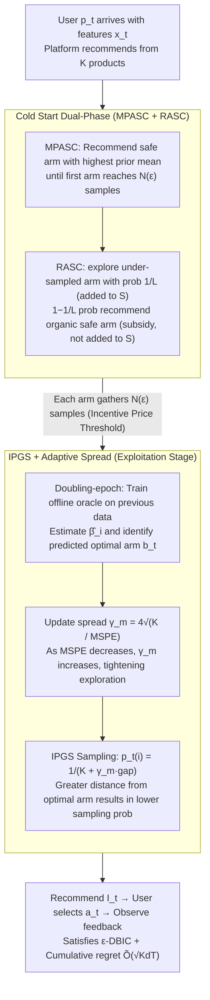

# Incentivized Exploration with Stochastic Covariates: A Two-Stage Mechanism Design for Recommender System

**Conference**: ICML 2026  
**arXiv**: [2406.04374](https://arxiv.org/abs/2406.04374)  
**Code**: TBD  
**Area**: Reinforcement Learning / Contextual Bandits / Mechanism Design  
**Keywords**: Incentivized Compatibility, Contextual Bandit, Mechanism Design, Cold Start, Inverse Probability Gap Sampling (IPGS)

## TL;DR
RCB integrates "exploration-exploitation" and "user incentive compatibility" in recommendation systems into a contextual bandit problem under Dynamic Bayesian Incentive Compatibility (DBIC) constraints. It proposes a two-stage algorithm (Cold Start + IPGS) for stochastic user covariate scenarios, proving $\tilde{O}(\sqrt{KdT})$ regret with support for arbitrary offline learning oracles. It quantifies the "incentive price"—the cold start sample size grows at $1/\epsilon^2$ as the incentive constraint $\epsilon$ tightens.

## Background & Motivation
**Background**: Modern recommendation markets involve three parties: products, users, and platforms. Platforms must balance exploitation of known preferences with exploration of cold-start items. However, self-interested and short-sighted users often reject seemingly sub-optimal recommendations, leading to data sparsity in long-tail content and cold-start failures. The line of incentivized exploration, pioneered by Kremer et al. (2014) and Mansour et al. (2020), deals with non-contextual MAB, while Sellke & Slivkins (2023) introduced linear contexts but assumed a **fixed-design** where product features are static and independent of the user.

**Limitations of Prior Work**: Real-world user covariates arrive via **stochastic sampling**, meaning the optimal arm changes per user. Previous black-box reductions (Mansour et al., 2020) ignore the statistical efficiency gains from linear structures, and fixed-design analysis is inapplicable. Consequently, it is difficult to achieve sublinear regret while maintaining BIC.

**Key Challenge**: A structural conflict exists between the platform's long-term goal (maximizing cumulative rewards and gathering data for cold-start products) and the user's immediate self-interest (choosing the arm with the highest current expected reward based on the prior). Furthermore, the quantitative link between the tightness of the incentive compatibility constraint $\epsilon$ and the resulting exploration limits/long-term regret remains unclear.

**Goal**: (i) Formalize incentive compatibility under stochastic covariates as $\epsilon$-DBIC constraints; (ii) design an algorithm that simultaneously guarantees sublinear regret and DBIC; (iii) decouple "incentive costs" from "learning rates" to enable plug-and-play use of any offline regression oracle (not limited to Gaussian/Beta posteriors).

**Key Insight**: The core observation is that the "sufficiently good posterior" required for BIC and "sustainable exploration" can be **temporally decoupled**. A finite-length cold start phase can bring each arm's sample count to the minimum threshold for DBIC; subsequently, as long as the offline oracle's Mean Squared Prediction Error (MSPE) decreases, the spread parameter of IPGS can automatically tighten to maintain DBIC in a steady state.

**Core Idea**: A two-stage architecture–collecting the minimum necessary samples during cold start followed by dynamic exploration radius calibration via IPGS–replaces the traditional Thompson Sampling approach. This encapsulates the "incentive price" entirely within the cold start length $N(\epsilon)$, completely decoupling subsequent learning rates from $\epsilon$.

## Method

### Overall Architecture
In each round $t$, a user $p_t$ arrives with features $x_t \in \mathcal{X} \subset \mathbb{R}^d$. The platform recommends product $I_t$, but the user actually selects $a_t$ (possibly $\neq I_t$). The platform observes noisy feedback $y_t(a_t) = x_t^\top \beta_{a_t} + \eta_{t,a_t}$ only on $a_t$, where $\eta$ is $\sigma$-subgaussian. $\beta_i$ is sampled from a shared prior $\mathcal{P}_{i,0}$.

The DBIC constraint requires: "Given history $\Gamma_{t-1}$, the expected loss of the recommended arm $i$ relative to any alternative $j$ does not exceed $\epsilon$," formalized as $\mathbb{E}[\mu(x_t,i) - \mu(x_t,j) \mid I_t=i, \Gamma_{t-1}] \geq -\epsilon$. RCB (Algorithm 1) consists of two stages:

- **Cold Start Stage**: First performs MPASC (recommending the "safe arm" with the highest prior mean until at least one arm reaches $N(\epsilon)$ samples), then RASC (explores under-sampled arms with probability $1/L$ and recommends safe arms with $1-1/L$ as an "incentive subsidy"). Once each arm has $N(\epsilon)$ samples, it moves to the second stage.
- **Exploitation Stage**: Uses a doubling-epoch scheduler $\mathcal{T}_m = \{t \in [2^{m-1}, 2^m)\}$. Each epoch uses all data from the previous segment to train an offline oracle for estimating $\widehat{\beta}_i$, and recommends arms via IPGS sampling.

The stages are connected by the spread parameter $\gamma_m = 4\sqrt{K/\mathcal{E}_{\mathcal{F}, \delta}(|\mathcal{T}_{m-1}|)}$, which scales inversely with the oracle's MSPE, automatically tightening the exploration radius over time.

### Key Designs

**1. Cold Start Dual-Phase (MPASC + RASC) and Excluding "Organic" Recommendations from Training**

The cold start must collect $N(\epsilon)$ samples for each arm under strict $\epsilon$-DBIC constraints without polluting the training set for subsequent oracles. During MPASC, the platform recommends the "safe arm" $\arg\max_i \mathbb{E}[\mu(x_t,i)]$ until the first arm saturates ($N_i(t)=N$) and joins set $B_t$. It then shifts to RASC: with promoted probability $1/L$, it recommends the under-sampled arm with the highest prior mean $\tilde{a}_t=\arg\max_{i\in[K]\setminus B_t}\mathbb{E}[\mu(x_t,i)]$ for exploration and adds the sample to $S_{\tilde{a}_t}$. With probability $1-1/L$, it provides an organic recommendation $a_t^*=\arg\max_i\mathbb{E}[\mu(x_t,i)\mid S_{B_t}]$. These organic rounds generate rewards but **do not increment $N$ or update $S$**. The ingenuity lies in using the high utility of organic rounds to "subsidize" potential utility losses in exploration rounds, converting $\epsilon$-DBIC into a solvable condition for $L$: $L\geq 1+\frac{1-\epsilon}{\tau_{\mathcal{P}_0}\rho_{\mathcal{P}_0}+\epsilon}$. Excluding organic samples prevents the confidence set from over-tightening due to repetitive safe arm samples, which would prematurely trigger epoch switches.

**2. IPGS (Inverse Probability Gap Sampling) + Adaptive Spread: Maintaining DBIC while Decoupling Oracles**

In the exploitation stage, the goal is to maintain DBIC without specifying any posterior form while decoupling the $\tilde{O}(\sqrt{KdT})$ regret rate from the choice of oracle. Let $b_t=\arg\max_i\widehat{\mu}_t(x_t,i)$ be the predicted optimal arm. IPGS assigns sampling probabilities for $i\neq b_t$ as $p_t(i)=\frac{1}{K+\gamma_m(\widehat{\mu}_t(x_t,b_t)-\widehat{\mu}_t(x_t,i))}$ and $p_t(b_t)=1-\sum_{j\neq b_t}p_t(j)$. The further an arm's predicted score is from the optimal, the lower its sampling probability. The spread parameter $\gamma_m=4\sqrt{K/\mathcal{E}_{\mathcal{F}, \delta}(|\mathcal{T}_{m-1}|)}$ scales inversely with the MSPE; as MSPE drops, $\gamma_m$ increases, concentrating the distribution on $b_t$. This $1/(K+\gamma_m\Delta)$ inverse form ensures that the recommendation distribution is driven by the oracle's learning rate, satisfying DBIC automatically. Crucially, it replaces the specific Gaussian/Beta posterior assumptions of Thompson Sampling, allowing Ridge, Lasso, kernel methods, or neural networks to be used as plug-and-play offline regression oracles.

**3. Closed-form Characterization of Incentive Price $N(\epsilon)$**

To allow platform operators to quantitatively plan the tradeoff between "incentive budget ↔ cold start period," the authors provide an exact dependence of the cold start sample size on $\epsilon, d,$ and $K$. Theorem 1 proves that under Assumptions 1–3, to satisfy $\epsilon$-DBIC with probability $\geq\rho_{\mathcal{P}_0}\rho_{\mathcal{P}_*}$, one requires $N(\epsilon)\geq\frac{(\sigma^2 d+1)K^3}{\phi_0(\tau_{\mathcal{P}_*}+\epsilon)^2}$, corresponding to the exploitation stage starting from epoch $m_0(\epsilon)=\lceil 2+\log_2 N(\epsilon)\rceil$, where $\phi_0$ is the minimum eigenvalue of the covariate covariance matrix. This transforms the previously "black-box" cost of incentive compatibility into an explicit designable quantity—engineers can use $\epsilon$ as a knob to exchange for the cold start duration, while subsequent regret remains decoupled from $\epsilon$.

### Loss & Training
RCB is not an end-to-end differentiable neural network and has no loss function. Instead, it provides two core theoretical guarantees: (i) **Regret Decomposition** (Theorem 2): $\mathcal{R}(T) \leq T_{\text{cold}}(\epsilon) + \tilde{O}(\sqrt{Kd(T - T_{\text{cold}})})$, explicitly splitting total regret into the "incentive price" (inevitable sub-optimality during cold start) and "learning regret" (standard $\sqrt{T}$ rate during exploitation). (ii) The spread parameter $\gamma_m$ in the exploitation phase depends only on the oracle's $\mathcal{E}_{\mathcal{F}, \delta}$ and epoch length, independent of $\epsilon$—formalizing the "incentive-learning decoupling."

## Key Experimental Results

### Main Results
The authors simulated a clinical decision support system for "personalized Warfarin dosage" using the PharmGKB dataset (5,528 patients). Continuous doses were discretized into 3 arms (Low <3mg, Medium 3–7mg, High >7mg, representing 27%/60%/13% of the population). The Standard of Care (SOC) baseline, where doctors consistently prescribe "Medium," was used alongside the algorithm's prior $\mathcal{P}_0$. RCB used a linear regression oracle to estimate dosage accuracy, aiming to induce doctors to explore Low/High arms despite their strong "Medium" prior.

| True Dosage | RCB → Low | RCB → Medium | RCB → High | SOC Baseline → Medium | Population % |
|---|---|---|---|---|---|
| Low (High risk: under-dose) | **50%** | 48% | 2% | 100% (Misdiagnosed) | 27% |
| Medium | 14% | **84%** | 2% | **100%** | 60% |
| High (High risk: over-dose) | 2% | 93% | **5%** | 100% (Misdiagnosed) | 13% |

Weighted Risk Score (+1 for correct / -1 for incorrect): The doctor baseline is constant at 0.20; RCB achieves **0.291** under $\epsilon = 0.025$ and 0.265 under $\epsilon=0.035$. While maintaining high accuracy for the Medium population, RCB significantly improves accuracy for the Low/High long-tail segments.

### Ablation Study
| Configuration | Key Phenomenon | Explanation |
|---|---|---|
| Tight Budget $\epsilon=0.025$ | Error rate ≈ 0.35 | Matches Lasso Bandit (Bastani & Bayati, 2020) performance without needing sparsity priors, while satisfying DBIC. |
| Moderate Budget $\epsilon=0.035$ | Performance degradation under weak prior | Larger $\Sigma_0$ increases cold start length; incentive satisfaction collapses more easily. |
| Wide Budget $\epsilon=0.045$ | Error rate > 0.40 (all $\Sigma_0$) | Excessive exploration subsidies lead to over-testing sub-optimal arms. |
| Comparison with BIC Literature | Table 1 | Kremer 2014 (MAB), Mansour 2020 (Generic reduction), Sellke 2023 (Fixed-design) → RCB fills the "stochastic context" gap. |

### Key Findings
- A tight budget ($\epsilon=0.025$) yielded the best error rate (≈0.35), breaking the intuition that "larger budgets are better." A loose budget leads the algorithm to over-subsidize exploration, degrading accuracy for the Medium majority. This aligns with Theorem 1 ($N(\epsilon) \propto (\tau + \epsilon)^{-2}$): wider budgets shorten cold start, but make it harder for organic recommendations to "subsidize" exploration risk.
- RCB's improvement in "high-risk/low-proportion" groups (Low 0%→50%, High 0%→5%) outweighs the minor concessions in the "low-risk/high-proportion" group (Medium 100%→84%). This concentration of trial on long-tail instances via information asymmetry is the specific design goal of incentivized exploration.
- The "modular learning oracle" was verified: replacing Ridge with Lasso, kernel, or NNs only affects the $\mathcal{E}_{\mathcal{F}, \delta}(n)$ term without breaking DBIC, providing a direct interface for industrial deployment.
- Cold start complexity $O(K^3 d / \epsilon^2)$ grows cubically with $K$, which is challenging for large catalogs. The authors propose arm clustering, progressive exploration, and warm starting as engineering mitigations.

## Highlights & Insights
- "Encapsulating incentive costs entirely within the cold start length $N(\epsilon)$" is the most clever aspect of RCB. It achieves explicit decoupling of the two dimensions (incentive and learning) that were historically entangled in BIC literature.
- IPGS's inverse gap sampling $1/(K + \gamma_m \Delta)$ is valuable for the RL community—it provides a mechanism where the distribution shape is inversely calibrated by the learning rate without relying on posterior forms, serving as a lightweight alternative to Thompson Sampling.
- "Excluding organic recommendations from the training set" prevents self-loop bias (where safe arms are repeatedly pushed, over-tightening the confidence set on redundant samples).
- Using **real high-risk decisions** like Warfarin dosage instead of synthetic simulations anchors the "weighted risk score" in clinical reality, demonstrating RCB's advantage in fairness for high-risk minority groups.

## Limitations & Future Work
- The context model assumes linear rewards $\mu(x_t,a) = x_t^\top \beta_a$. Non-linear extensions are only briefly addressed in the appendix and not covered in main experiments.
- Cubic dependence of cold start complexity $O(K^3)$ is nearly prohibitive for large catalogs (e.g., thousands of items); engineering mitigations are mentioned but lack new theoretical guarantees.
- $\epsilon$ is a hyperparameter; the paper does not discuss online adaptation. In real platforms, user incentive tolerance is heterogeneous and time-varying.
- The "myopic user" assumption may not hold for long-term subscription products; DBIC analysis might not apply if users drop out due to frustration from repeated exploration.
- Assumption 4 ("trust evolves," where the minimum eigenvalue of the prior covariance grows linearly with $t$) is a strong behavioral assumption. The authors admit that while the algorithm is robust to violations, the cold start period would extend.

## Related Work & Insights
- **vs Kremer et al. 2014**: Established BIC for MAB without context; RCB extends this to linear contextual bandits with stochastic covariates while maintaining provable DBIC.
- **vs Mansour et al. 2020**: Uses generic black-box reduction for general MAB, which is more universal but ignores linear structure efficiency; RCB explicitly uses linear rewards to achieve $\tilde{O}(\sqrt{KdT})$ instead of $\tilde{O}(T^{2/3})$.
- **vs Sellke 2023**: Also handles linear contextual bandits but assumes fixed-design (product-side features) and uses phased Thompson Sampling; RCB handles stochastic covariates (online sampled user features) and arbitrary plug-in oracles, suiting dynamic recommendation scenes.
- **vs Lasso Bandit (Bastani & Bayati 2020)**: Classic sparse contextual bandit requiring known sparsity; RCB matches its error rate without requiring sparsity priors while satisfying DBIC.
- **vs Foster & Rakhlin 2020 (regression-oracle bandit)**: RCB essentially replaces IGW sampling in Foster–Rakhlin with IPGS and overlays DBIC calibration, providing a unified interface for regression oracles and incentive constraints.

## Rating
- Novelty: ⭐⭐⭐⭐ Introducing stochastic covariates to incentivized exploration is a first, and the "two-stage + IPGS" combination is a distinct departure from Thompson Sampling.
- Experimental Thoroughness: ⭐⭐⭐ PharmGKB data with multiple $\epsilon$ / $\Sigma_0$ sweeps is reasonable, but baselines are limited (primarily Lasso Bandit and SOC); direct comparison with Sellke 2023 on the same task is missing.
- Writing Quality: ⭐⭐⭐⭐ Table 1 provides very clear positioning, and the physical interpretations of Theorem 1/2 (cubic $K$, linear $d$, inverse-quadratic $\epsilon$) are well-discussed.
- Value: ⭐⭐⭐⭐ Provides a modular, engineering-friendly, and benchmark algorithm for "incentive compatibility + contextual bandits" with a quantifiable incentive price, relevant for high-stakes recommendation fields.

<!-- RELATED:START -->

## Related Papers

- [\[ICML 2026\] Learning Design Skills as Memory Policies for Agentic Photonic Inverse Design](learning_design_skills_as_memory_policies_for_agentic_photonic_inverse_design.md)
- [\[ACL 2026\] MemRec: Collaborative Memory-Augmented Agentic Recommender System](../../ACL2026/recommender/memrec_collaborative_memory-augmented_agentic_recommender_system.md)
- [\[NeurIPS 2025\] Radial Neighborhood Smoothing Recommender System](../../NeurIPS2025/recommender/radial_neighborhood_smoothing_recommender_system.md)
- [\[ICML 2026\] Can Recommender Systems Teach Themselves? A Recursive Self-Improving Framework with Fidelity Control](can_recommender_systems_teach_themselves_a_recursive_self-improving_framework_wi.md)
- [\[ICLR 2026\] Token-Efficient Item Representation via Images for LLM Recommender Systems](../../ICLR2026/recommender/token-efficient_item_representation_via_images_for_llm_recommender_systems.md)

<!-- RELATED:END -->
