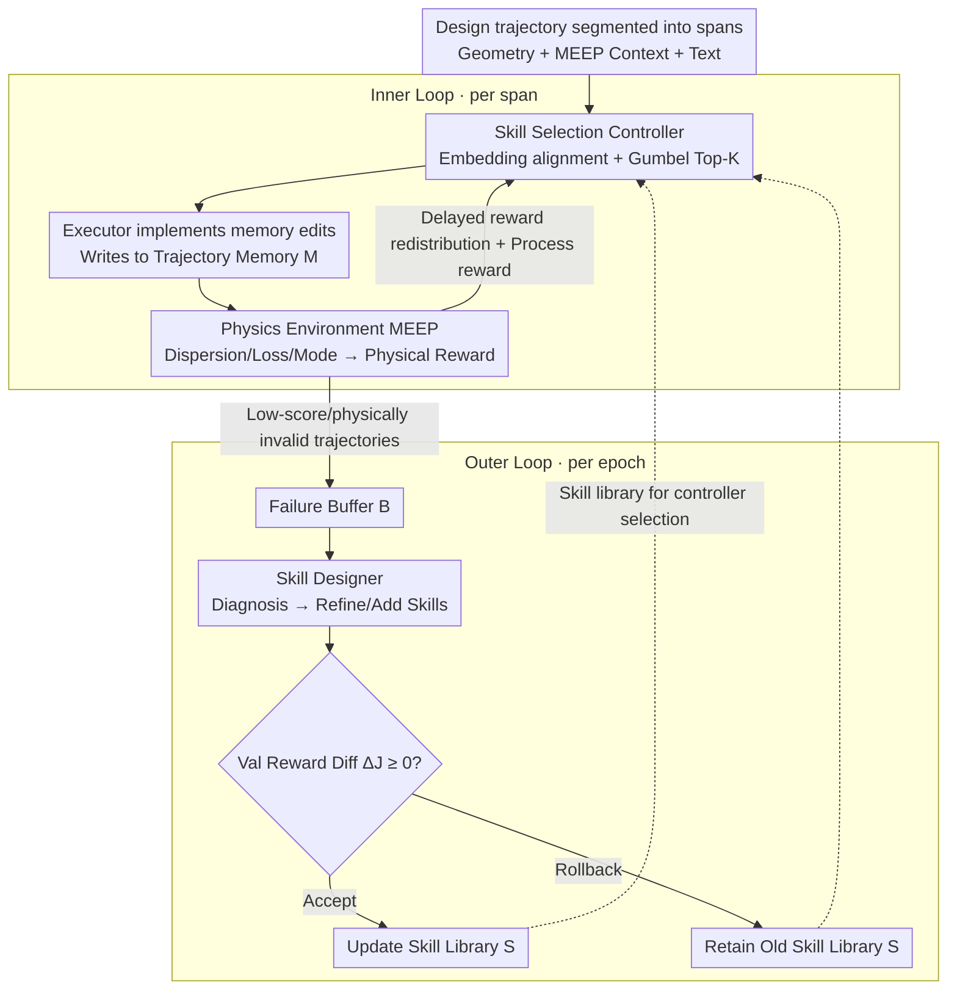

# Learning Design Skills as Memory Policies for Agentic Photonic Inverse Design

**Conference**: ICML 2026  
**arXiv**: [2605.29421](https://arxiv.org/abs/2605.29421)  
**Code**: TBD  
**Area**: LLM Agent / Memory Augmentation / AI for Physics  
**Keywords**: Memory Policy, Skill Library, PPO, Photonic Crystal Fiber (PCF), Simulator-in-the-loop  

## TL;DR
SkillPCF reframes the inverse design of Photonic Crystal Fibers (PCF) as a "memory policy learning" problem. A PPO-trained controller selects Top-K memory operations from an evolvable skill library for each trajectory span, which an executor implements into trajectory memory. Both the controller and the skill library are optimized simultaneously using MEEP electromagnetic simulation rewards, achieving a superior trade-off between design success rate and simulation budget compared to multi-LLM backends and classical optimization baselines.

## Background & Motivation
**Background**: PCF inverse design currently follows two main paths. One is classical numerical optimization (parameter sweeps, finite element/FDTD simulation, Nelder-Mead, etc.), which is simulation-expensive and relies on expert priors. The other is ML acceleration (proxy networks, differentiable optimization), which reduces simulation counts by using one-step regression to predict structure-performance mappings.

**Limitations of Prior Work**: Both paths treat each design task as an independent episode—classical methods do not accumulate cross-task knowledge, while ML methods lack interpretability and iterative refinement capabilities. In practical engineering, designers repeatedly trial-and-error within adjacent parameter ranges. Data regarding "what failed, why it failed, and what succeeded under which constraints" are high-value signals, but current systems neither retain nor reuse these experiences.

**Key Challenge**: The tension between tight simulation budgets (high cost for each FDTD/finite element run) and coupled design objectives (dispersion, confinement loss, and effective refractive index are interdependent) causes methods without memory mechanisms to either over-simulate or converge prematurely to sub-optimal structures in multi-objective scenarios.

**Goal**: To enable a PCF design system with the ability to "remember what is useful, forget what is invalid, and continuously refine memory policies under simulation feedback." This is further decomposed into three sub-problems: (i) selecting appropriate memory operations for each design segment; (ii) backpropagating sparse design success signals to intermediate memory decisions; and (iii) allowing the memory operations themselves to evolve automatically based on failure cases.

**Key Insight**: The authors draw on recent findings from the LLM-Agent community—memory operations (insert / update / delete / skip) can be treated as learnable policies rather than fixed heuristics, while deterministic physical metrics from simulators serve as verifiable rewards. Combining these yields an agent framework with "simulator-in-the-loop + evolvable skill library."

**Core Idea**: Transforming PCF inverse design into a dual-layer closed loop—the inner loop uses PPO to learn a skill-selection controller, while the outer loop uses a designer module to refine/expand the skill library from a failure buffer. This allows the LLM Agent to both consume memory and reshape memory operations across multiple rounds of interaction.

## Method

### Overall Architecture
SkillPCF segments each design trajectory into ordered spans, each consisting of "current geometric decisions + MEEP simulation context + textual descriptions." The system maintains two storage sets: (1) a trajectory-exclusive memory bank $\mathcal{M}$, carrying numerical design evidence for that trace (unit-sensitive parameter-performance pairs, cross-trajectory relationships, etc.); (2) a cross-trajectory shared skill library $\mathcal{S}$, initially containing four PCF-specific memory primitives: InsertTopologyFeature, UpdatePerformanceTrend, DeleteInvalidAssumption, and Skip.

The entire process is a dual-layer closed loop: **Inner loop** (orange line): For each span, the Controller selects Top-K skills → Executor implements memory edits → Physics Environment (MEEP) provides physical rewards; **Outer loop** (blue line): At each epoch $e$, hard cases from low-scoring trajectories are pooled into a failure buffer $\mathcal{B}^{(e)}$. The Skill Designer proposes a new $\hat{\mathcal{S}}^{(e+1)}$, and the acceptance or rollback is decided by the reward difference on a validation set. This separation of "stable inner execution + outer structural evolution" allows the action space to be modified without breaking the policy head.

### Key Designs

**1. Evolvable Skill Selection Head via Embedding Alignment: Decoupling action space growth from policy retraining**

Standard actor heads assume a fixed action space, but the SkillPCF skill library is modified by the outer Designer, making standard classification heads unusable. The authors encode span context $h_t=f_{\mathrm{ctx}}(x_t,M_t)$ and skill descriptions $u_i=f_{\mathrm{skill}}(\text{Description}(s_i))$ into the same representation space using an embedding model. Scoring is performed via $z_{t,i}=h_t^\top u_i$ and $p_\theta(i\mid h_t)=\text{Softmax}(z_t)_i$. Since the dimension of $z_t$ adapts to the skill library size $|\mathcal{S}^{(e)}|$, adding or removing skills does not require retraining the policy head. To handle composite operations (e.g., inserting a task and deleting an invalid assumption simultaneously), Gumbel-Top-K sampling without replacement is used to obtain an ordered set $A_t=(a_{t,1},\ldots,a_{t,K})$, with the policy probability defined as $\pi_\theta(A_t\mid h_t)=\prod_{j=1}^{K}\frac{p_\theta(a_{t,j}\mid h_t)}{1-\sum_{\ell<j}p_\theta(a_{t,\ell}\mid h_t)}$.

**2. Delayed Reward Redistribution + Process Reward: Assigning terminal performance credit to intermediate memory decisions**

In long-horizon design, terminal performance often arrives several steps after intermediate memory operations. Training PPO only on terminal rewards leads to sparse signals for intermediate spans, while pure process rewards risk learning "useful-looking" but ultimately unhelpful trivia. SkillPCF redistributes the episode terminal reward $R_{\mathrm{final}}$ using exponential decay: $\tilde{r}_t=(1-\beta)R_{\mathrm{final}}\frac{\gamma^{T-t}}{\sum_{k=1}^{T}\gamma^{T-k}}+\beta\mathbf{1}[t=T]R_{\mathrm{final}}$, where $\gamma\in(0,1)$ controls decay and $\beta\in[0,1]$ preserves a pure terminal signal. The final step reward is $r_t=r_{\mathrm{proc},t}+\tilde{r}_t$, where $r_{\mathrm{proc},t}$ is a process reward based on memory construction quality and physical consistency checks.

**3. Failure Buffer-based Skill Evolution + Accept/Rollback: Enabling autonomous skill growth without noise contamination**

Allowing the Designer to modify the skill library freely could degrade a well-trained controller. Each outer epoch $e$, SkillPCF collects hard cases from low-performance or physically invalid trajectories into a failure buffer $\mathcal{B}^{(e)}$. Representative samples are selected after clustering by structural regime (hexagonal, PBG, Kagome, etc.) and optical failure type for the Designer. The Designer diagnoses missing or misaligned memory operations and refines the library to produce a candidate $\hat{\mathcal{S}}^{(e+1)}$. Acceptance is determined by the validation reward difference $\Delta J_{\mathrm{val}}=J_{\mathrm{val}}(\theta^{(e+1)},\hat{\mathcal{S}}^{(e+1)})-J_{\mathrm{val}}(\theta^{(e+1)},\mathcal{S}^{(e)})$. If $\Delta J_{\mathrm{val}}\geq 0$, the update is accepted; otherwise, it rolls back to $\mathcal{S}^{(e)}$, with short-term exploration biased toward new skills if accepted.

### Loss & Training
The controller $\theta$ is optimized using the PPO objective $J(\theta; \mathcal{S}^{(e)}) = \mathbb{E}_{\tau \sim \pi_\theta(\cdot \mid \mathcal{S}^{(e)})} [\sum_t r_t]$, with $\mathcal{S}^{(e)}$ fixed within each outer epoch. PPO settings: $\gamma=0.99$, $\lambda=0.95$, clip $0.2$, entropy $0.01$, 4 epochs per update, minibatch 32, gradient clipping 0.5. The Controller is an MLP with a hidden size of 256, trained using AdamW with a learning rate of $1 \times 10^{-4}$. The workflow involves 10 outer evolution epochs, each containing 50 inner interaction epochs, with a batch size of 32. LLM adjudication uses GPT-4o-mini, embeddings use Text-Embedding-3-Small, and the retriever is Contriever ($k=5$). Training was conducted on an A100-40GB. Simulation budget is measured by Calls/q (calls per query).

## Key Experimental Results

### Main Results
The authors constructed the PCFSkill dataset—479 expert interaction trajectories (covering 8 PCF families: solid-core hexagonal, high-birefringence PM, hollow-core PBG, Kagome, anti-resonant ARF, etc.), totaling 2,507 spans (avg. 5.23/trace, ~393K tokens, 75.6% success rate), plus 553 memory-dependent evaluation queries and 596 failure logs.

Comparison of 8 memory-augmented baselines across different LLM backends:

| Backend / Setting | Method | Human ↑ | Judge ↑ | Succ. ↑ | Phys. ↑ | Calls/q ↓ |
|---|---|---|---|---|---|---|
| Llama4-Scout / No Vision | MemoryBank | 7.18 | 6.72 | 30.61 | 45.92 | — |
| Llama4-Scout / No Vision | A-MEM | 6.92 | 6.02 | 36.22 | 38.78 | — |
| Llama4-Scout / No Vision | **SkillPCF** | **8.47** | **8.02** | **60.12** | **68.92** | — |
| MiniMax-M2.5 / Vision | MemoryBank | 7.22 | 6.18 | 46.94 | 56.63 | 1.12 |
| MiniMax-M2.5 / Vision | **SkillPCF** | **9.12** | 6.92 | **82.35** | **68.45** | **1.02** |
| Qwen2.5-72B / Vision | A-MEM | — | 6.00 | 41.33 | 52.04 | 1.10 |
| Qwen2.5-72B / Vision | **SkillPCF** | — | **7.95** | **78.92** | **65.28** | **1.02** |

While classical optimization methods achieve comparable Phys. scores, they require ~100 calls/q (two orders of magnitude higher budget), and Succ. is either 0 (NN Predictor) or relies on brute force (Random Search 92.9%). SkillPCF achieves 60–82% success with only 1.02 calls/q.

### Ablation Study
| Configuration | Key Contribution | Note |
|---|---|---|
| Full SkillPCF | Physics-guided skill + Evolution + Delayed Reward | Full model, Succ. 60–82% |
| Initial 4 skills only | Skill Designer disabled | No new skills for failure cases; tail performance drops |
| Terminal reward only | $\beta=1$ | Missing credit for intermediate memory ops; slow PPO convergence |
| Single action (K=1) | No Top-K | Composite operations split across spans, increasing simulation count |

Analysis of memory operation distribution: INSERT 36% / UPDATE 56% / DELETE 5% / SKIP <1%. This indicates that "correcting existing beliefs" is more frequent than "inserting new facts," validating the central role of the UPDATE skill.

### Key Findings
- Switching backends (Llama4-Scout to MiniMax-M2.5 or Qwen2.5-72B) does not diminish the relative advantage of SkillPCF, suggesting the memory policy is portable and not strictly dependent on a specific LLM style.
- In the "Without Visual Field" setting, SkillPCF outperforms classical ML predictors in Phys. scores (68.92 vs 63.30), suggesting that physical consistency accumulated via memory can partially substitute for visual evidence.
- General memory agents like Mem0 achieve only 3.06% Succ. on PCF tasks, proving that without physics-grounded skill primitives, general LLM-memory frameworks are nearly ineffective.

## Highlights & Insights
- Reinterpreting memory operations as RL actions is not entirely new, but SkillPCF successfully enables "evolvable action spaces" via embedding-aligned selection heads, allowing the Designer to modify the library without retraining.
- Physical simulation provides deterministic, verifiable scalar signals, providing the "reward grounding" that LLM agents often lack. Using expensive simulators as reward sources rather than inner-loop callables is a pragmatic simulator-in-the-loop paradigm.
- The "failure buffer + accept/rollback" mechanism acts as a validation gate for self-evolving agents, preventing the Designer module from degrading converged capabilities.

## Limitations & Future Work
- The dataset (479 trajectories, 553 evaluation queries) is small for LLM-agent training; performance on out-of-distribution PCF families (e.g., new anti-resonant variants) is not reported.
- Reward design depends on expensive MEEP simulations. The total PPO training cost (10 outer × 50 inner epochs) lacks a full ablation, leaving industrial deployment costs uncertain.
- Skill Designer as an LLM call might introduce bias similar to the controller. Implementing self-play or multi-judge settings with different backends for the Designer could be explored.
- The current primitive scale is small; for larger libraries, retrieval-based skill subset selection may be more efficient than Top-K dense softmax.

## Related Work & Insights
- **vs. MemGPT / Reflexion**: These use OS-style hierarchical memory or verbal feedback, but memory operations remain fixed heuristics. SkillPCF makes operations learnable with physical grounding.
- **vs. A-MEM / LangMem / MemoryOS**: General memory agents achieve 25–40% Succ., lacking domain-aware skill primitives and grounded rewards.
- **vs. Classical PCF Inverse Design**: Previous methods treat each design as independent, requiring 100 calls/q. SkillPCF utilizes cross-trajectory experience to achieve similar results at 1.02 calls/q.

## Rating
- Novelty: ⭐⭐⭐⭐ Combining evolvable memory operations with simulator-in-the-loop reward grounding is engineering-wise novel, though individual components (PPO, Gumbel Top-K, self-refine) are established.
- Experimental Thoroughness: ⭐⭐⭐⭐ Strong comparison across three LLM backends and 8 baselines; however, lacks testing on out-of-distribution PCF families.
- Writing Quality: ⭐⭐⭐⭐ Clear architectural diagrams and statistical plots; clean mathematical notation.
- Value: ⭐⭐⭐⭐ Provides a significant template for AI for Physics / Engineering design agents, transferable to other expensive simulation-driven tasks like materials or chip design.

<!-- RELATED:START -->

## Related Papers

- [\[ICML 2026\] Incentivized Exploration with Stochastic Covariates: A Two-Stage Mechanism Design for Recommender System](incentivized_exploration_with_stochastic_covariates_a_two-stage_mechanism_design.md)
- [\[ACL 2026\] MemRec: Collaborative Memory-Augmented Agentic Recommender System](../../ACL2026/recommender/memrec_collaborative_memory-augmented_agentic_recommender_system.md)
- [\[ICML 2026\] RGMem: Renormalization Group-Inspired Memory Evolution for Language Agents](rgmem_renormalization_group-inspired_memory_evolution_for_language_agents.md)
- [\[ICML 2026\] Rethinking Contrastive Learning for Graph Collaborative Filtering: Limitations and a Simple Remedy](rethinking_contrastive_learning_for_graph_collaborative_filtering_limitations_an.md)
- [\[ACL 2026\] HARPO: Hierarchical Agentic Reasoning for User-Aligned Conversational Recommendation](../../ACL2026/recommender/harpo_hierarchical_agentic_reasoning_for_user-aligned_conversational_recommendat.md)

<!-- RELATED:END -->
