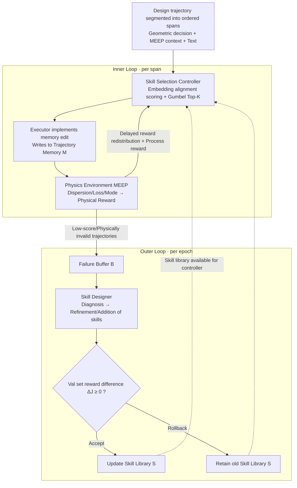

# Learning Design Skills as Memory Policies for Agentic Photonic Inverse Design

**Conference**: ICML 2026  
**arXiv**: [2605.29421](https://arxiv.org/abs/2605.29421)  
**Code**: To be confirmed  
**Area**: LLM Agent / Memory Augmentation / AI for Physics  
**Keywords**: Memory Policy, Skill Library, PPO, Photonic Crystal Fiber (PCF), Simulator-in-the-Loop  

## TL;DR
SkillPCF reformulates the inverse design of Photonic Crystal Fibers (PCF) as a "memory policy learning" problem. A PPO-trained controller selects Top-K memory operations from an evolvable skill library for each trajectory span. An executor implements these in trajectory memory, while MEEP electromagnetic simulation rewards simultaneously optimize both the controller and the skill library. This approach achieves a superior trade-off between design success rate and simulation budget compared to multiple LLM backends and classical optimization baselines.

## Background & Motivation
**Background**: PCF inverse design currently follows two main paths. One is classical numerical optimization (parameter sweeps, Finite Element/FDTD simulations, Nelder-Mead, etc.), which is computationally expensive and relies on expert priors. The other is ML-accelerated methods (surrogate networks, differentiable optimization), which use one-shot regression to predict structure-performance mappings to reduce simulation counts.

**Limitations of Prior Work**: Both paths treat each design task as an independent episode. Classical methods do not accumulate cross-task knowledge, while ML methods lack interpretability and iterative correction capabilities. In practical engineering, designers repeatedly trial-and-error within adjacent parameter ranges. The signals of "what failed, why it failed, and what succeeded under which constraints" are high-value, yet current systems neither retain nor reuse these experiences.

**Key Challenge**: The tension between tight simulation budgets (high cost of FDTD/FEA) and coupled design objectives (dispersion, confinement loss, and effective refractive index are interdependent) causes methods without memory mechanisms to either over-simulate or converge prematurely to sub-optimal structures in multi-objective scenarios.

**Goal**: To equip the PCF design system with the ability to "remember the useful, forget the invalid, and continuously refine memory policies under simulation feedback." This is decomposed into three sub-problems: (i) selecting appropriate memory operations for each design span; (ii) back-propagating sparse design success signals to intermediate memory decisions; and (iii) allowing memory operations themselves to evolve automatically based on failure cases.

**Key Insight**: The authors leverage recent discoveries from the LLM-Agent community—that memory operations (insert/update/delete/skip) can be treated as learnable policies rather than fixed heuristics—while deterministic physical metrics from simulators serve as verifiable rewards. Combining these yields an agent framework with "simulator-in-the-loop + evolvable skill library."

**Core Idea**: The PCF inverse design is transformed into a two-layer closed loop: an inner loop uses PPO to learn a skill-selection controller, and an outer loop uses a designer module to refine or expand the skill library from a failure buffer. This allows the LLM Agent to both consume memory and reshape memory operations across multiple rounds of interaction.

## Method

### Overall Architecture
SkillPCF segments each design trajectory into ordered spans. Each span consists of the "current geometric decision + MEEP simulation context + text description." The system maintains two storage types: (1) a trajectory-specific memory bank $\mathcal{M}$, carrying numerical design evidence for that trace (parameter-performance pairs, cross-trajectory relationships, etc.); (2) a cross-trajectory shared skill library $\mathcal{S}$, initially containing four PCF-specific memory primitives: InsertTopologyFeature, UpdatePerformanceTrend, DeleteInvalidAssumption, and Skip.

The process is a dual-layer closed loop: the **inner loop** (orange line) involves the Controller selecting Top-K skills $\rightarrow$ Executor implementing memory edits in $\mathcal{M}$ $\rightarrow$ Physics Environment running MEEP to provide physical rewards. The **outer loop** (blue line) extracts hard cases from low-scoring trajectories into a failure buffer $\mathcal{B}^{(e)}$ at each epoch $e$, allowing a Skill Designer to propose a new $\hat{\mathcal{S}}^{(e+1)}$, with acceptance or rollback determined by the reward difference on a validation set. This separation of "stable inner execution + outer structural evolution" allows the action space to be modified without breaking the policy head.

### Key Designs

**1. Evolvable Skill Selection Head via Embedding Alignment: Decoupling action space from policy retraining**

Standard actor heads assume a fixed action space, but SkillPCF's skill library is modified by the outer Designer. The authors encode span context $h_t=f_{\mathrm{ctx}}(x_t,M_t)$ and each skill description $u_i=f_{\mathrm{skill}}(\text{Description}(s_i))$ into the same representation space using a shared embedding model. Scores are calculated as $z_{t,i}=h_t^\top u_i$, with $p_\theta(i\mid h_t)=\text{Softmax}(z_t)_i$. Since $z_t$ adapts to the dimension $|\mathcal{S}^{(e)}|$, adding or removing skills does not require retraining the policy head. As a span often requires composite operations (e.g., inserting a parameter fact and deleting an invalid hypothesis), Gumbel-Top-K sampling without replacement is used to obtain an ordered set $A_t=(a_{t,1},\ldots,a_{t,K})$, with policy probability $\pi_\theta(A_t\mid h_t)=\prod_{j=1}^{K}\frac{p_\theta(a_{t,j}\mid h_t)}{1-\sum_{\ell<j}p_\theta(a_{t,\ell}\mid h_t)}$.

**2. Delayed Reward Redistribution + Process Reward: Credit assignment for terminal performance**

In long-horizon design, terminal QA performance occurs many steps after intermediate memory operations. SkillPCF redistributes the terminal reward $R_{\mathrm{final}}$ to each span using exponential decay: $\tilde{r}_t=(1-\beta)R_{\mathrm{final}}\frac{\gamma^{T-t}}{\sum_{k=1}^{T}\gamma^{T-k}}+\beta\mathbf{1}[t=T]R_{\mathrm{final}}$, where $\gamma\in(0,1)$ controls decay and $\beta\in[0,1]$ preserves a pure terminal signal. The final step reward is $r_t=r_{\mathrm{proc},t}+\tilde{r}_t$, where $r_{\mathrm{proc},t}$ is the process reward for memory construction quality and physical consistency checks.

**3. Failure-Buffer-Based Skill Evolution + Acceptance Rollback: Autonomous expansion of the skill library**

SkillPCF collects hard cases from low-performance or physically invalid trajectories into a failure buffer $\mathcal{B}^{(e)}$ per outer epoch $e$. Representative samples, clustered by structural regime (hexagonal, PBG, Kagome, etc.), are sent to the Designer. The Designer diagnoses missing or misaligned memory operations and refines or adds skills to produce a candidate $\hat{\mathcal{S}}^{(e+1)}=\text{Designer}(\mathcal{S}^{(e)},\mathcal{B}^{(e)})$. Acceptance is contingent on the validation reward difference $\Delta J_{\mathrm{val}}=J_{\mathrm{val}}(\theta^{(e+1)},\hat{\mathcal{S}}^{(e+1)})-J_{\mathrm{val}}(\theta^{(e+1)},\mathcal{S}^{(e)})$. If $\Delta J_{\mathrm{val}}\geq 0$, the new library is accepted; otherwise, it rolls back to $\mathcal{S}^{(e)}$.

### Loss & Training
The controller $\theta$ is optimized using PPO: $J(\theta; \mathcal{S}^{(e)}) = \mathbb{E}_{\tau \sim \pi_\theta(\cdot \mid \mathcal{S}^{(e)})} [\sum_t r_t]$, where $\mathcal{S}^{(e)}$ is fixed within each outer epoch. PPO settings: $\gamma=0.99$, $\lambda=0.95$, clip $0.2$, entropy $0.01$. The controller is a 2-layer MLP with hidden size 256, trained using AdamW at a learning rate of $1 \times 10^{-4}$. Training spans 10 outer evolution epochs, with 50 inner interaction epochs each, using a batch size of 32. GPT-4o-mini serves as the LLM judge. Calls/q (simulations per query) is used as the hardware-agnostic budget metric.

## Key Experimental Results

### Main Results
The authors constructed the PCFSkill dataset—479 expert interaction trajectories covering 8 PCF families (solid-core hexagonal, high-birefringence PM, hollow-core PBG, Kagome, anti-resonant ARF, etc.), totaling 2,507 spans. Performance was compared against memory-augmented baselines across different LLM backends:

| Backend / Setting | Method | Human ↑ | Judge ↑ | Succ. ↑ | Phys. ↑ | Calls/q ↓ |
|---|---|---|---|---|---|---|
| Llama4-Scout / No Vision | MemoryBank | 7.18 | 6.72 | 30.61 | 45.92 | — |
| Llama4-Scout / No Vision | A-MEM | 6.92 | 6.02 | 36.22 | 38.78 | — |
| Llama4-Scout / No Vision | **SkillPCF** | **8.47** | **8.02** | **60.12** | **68.92** | — |
| MiniMax-M2.5 / Vision | MemoryBank | 7.22 | 6.18 | 46.94 | 56.63 | 1.12 |
| MiniMax-M2.5 / Vision | **SkillPCF** | **9.12** | 6.92 | **82.35** | **68.45** | **1.02** |
| Qwen2.5-72B / Vision | A-MEM | — | 6.00 | 41.33 | 52.04 | 1.10 |
| Qwen2.5-72B / Vision | **SkillPCF** | — | **7.95** | **78.92** | **65.28** | **1.02** |

Classical optimization methods achieve similar Phys. scores but require ~100 calls/q (two orders of magnitude higher). SkillPCF achieves a 60–82% success rate with only 1.02 calls/q, providing the best trade-off between simulation budget and design quality.

### Ablation Study

| Configuration | Key Contribution | Insight |
|---|---|---|
| Full SkillPCF | Physics-guided skill + Evolution + Delayed reward | Full model, Succ. 60–82% |
| Initial 4 skills only | Skill Designer disabled | No new skills for long-tail designs; performance drops |
| Terminal reward only | $\beta=1$ | Intermediate credit assignment missing; slow PPO convergence |
| Single action (K=1) | No Top-K selection | Composite operations split across spans, increasing simulations |

Memory operation distribution: INSERT 36% / UPDATE 56% / DELETE 5% / SKIP <1%, proving that "refining existing beliefs" is more frequent than "inserting new facts."

### Key Findings
- Success rates improve to 78–82% when switching backends (MiniMax-M2.5, Qwen2.5-72B), indicating that memory policies are transferable and not overly dependent on a specific LLM style.
- In "No Vision" settings, SkillPCF outperforms ML predictors in Phys. scores, suggesting cross-trace physical consistency can partially substitute for visual evidence.
- General memory frameworks like Mem0 achieve only 3.06% success, underscoring that without domain-specific skill primitives and grounded rewards, general LLM-memory logic is insufficient for physics design.

## Highlights & Insights
- Reinterpreting memory operations as RL actions is consolidated by making the action space "evolvable." The embedding-aligned head ensures structural evolution without policy collapse.
- Using expensive simulators as reward sources rather than inner-loop callables allows for grounded physical feedback without exploding the computational budget—a pragmatic "simulator-in-the-loop" paradigm.
- The "failure buffer + acceptance gate" provides a safety mechanism for self-improving agents, preventing a designer module from corrupting converged capabilities.

## Limitations & Future Work
- The dataset size (479 trajectories) is relatively small; performance on out-of-distribution PCF families (e.g., novel anti-resonant variants) remains to be tested.
- PPO training over 10 outer × 50 inner epochs depends on MEEP simulations, which might still be costly for smaller research labs.
- The Skill Designer is itself an LLM call; replacing it with a self-play or multi-judge setup could further reduce potential bias.
- As the skill library grows, a retrieval-based selection mechanism may become more efficient than the current dense softmax.

## Related Work & Insights
- **vs MemGPT / Reflexion**: These use OS-style memory or verbal feedback, but operations remain fixed heuristics. SkillPCF makes operations learnable and physics-grounded.
- **vs A-MEM / LangMem**: General agents fail in PCF tasks due to a lack of domain-aware primitives; "explicit domain skill modeling" is verified as essential.
- **vs Classical PCF Inverse Design**: Previous methods treat designs in isolation. SkillPCF's advantage stems from cross-trajectory experience reuse, reducing the budget from 100 to 1.02 calls/q.

## Rating
- Novelty: ⭐⭐⭐⭐ Combining evolvable action spaces with simulator-in-the-loop rewards is an engineering milestone for agents, though individual components (PPO, Gumbel Top-K) are established.
- Experimental Thoroughness: ⭐⭐⭐⭐ Solid comparisons across backends and baselines; however, lacks extensive OOD testing.
- Writing Quality: ⭐⭐⭐⭐ Clear diagrams and clean mathematical formulation.
- Value: ⭐⭐⭐⭐ High potential for migration to other simulation-driven design tasks like materials science, chip design, or structural mechanics.

<!-- RELATED:START -->

## Related Papers

- [\[ICML 2026\] Incentivized Exploration with Stochastic Covariates: A Two-Stage Mechanism Design for Recommender System](incentivized_exploration_with_stochastic_covariates_a_two-stage_mechanism_design.md)
- [\[ACL 2026\] MemRec: Collaborative Memory-Augmented Agentic Recommender System](../../ACL2026/recommender/memrec_collaborative_memory-augmented_agentic_recommender_system.md)
- [\[ICLR 2026\] Off-Policy Evaluation for Ranking Policies under Deterministic Logging Policies](../../ICLR2026/recommender/off-policy_evaluation_for_ranking_policies_under_deterministic_logging_policies.md)
- [\[ICML 2026\] RGMem: Renormalization Group-Inspired Memory Evolution for Language Agents](rgmem_renormalization_group-inspired_memory_evolution_for_language_agents.md)
- [\[ICML 2026\] Rethinking Contrastive Learning for Graph Collaborative Filtering: Limitations and a Simple Remedy](rethinking_contrastive_learning_for_graph_collaborative_filtering_limitations_an.md)

<!-- RELATED:END -->
