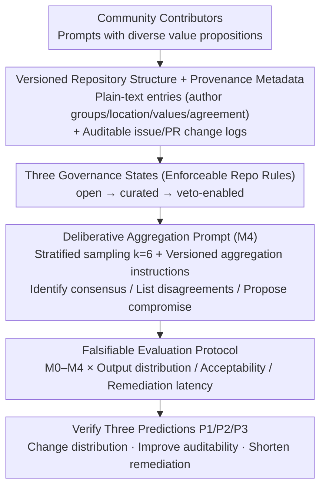

# Prompts for Public-Sector LLMs Should Be Governed as Commons

**Conference**: ICML 2026  
**arXiv**: [2606.00873](https://arxiv.org/abs/2606.00873)  
**Code**: None (position paper + pilot dataset)  
**Area**: AI Governance / Position Paper  
**Keywords**: Prompt governance, Public sector, commons, Urban AI, Pluralistic value aggregation

## TL;DR
This is a position paper: the authors argue that LLM prompts used by the public sector should be versioned, provenanced, auditable, and vetoable like open-source commons. Based on a pilot benchmark using 443 neighborhood prompts from a North American city (augmented to 3,317) across five governance states, it provides three falsifiable predictions—governed prompts change output distributions, improve auditability, and shorten fault-remediation latency.

## Background & Motivation

**Background**: The public sector is utilizing LLMs to draft official documents, summarize records, triage citizen requests, and prepare materials for public engagement. Existing governance tools—such as Model Cards, Datasheets, RLHF/Constitutional AI, and platform policies—do not cover the "actual prompt templates used during local deployment."

**Limitations of Prior Work**: In practical deployments, prompt templates often circulate **informally** among teams, contractors, and vendors without formal policy review. However, prompts themselves encode personas, audiences, and value trade-offs; the same model provided with the same input will yield significantly different outputs if the prompt is changed. Once a prompt becomes a default template, its embedded preferences are often mistaken for "model conclusions" or "policy conclusions."

**Key Challenge**: Accountability is fragmented into three segments: model providers manage weights and system policies, integrators manage prompts and workflows, and public institutions bear the consequences of outputs while **lacking an audit trail**. The prompt layer is the true "configuration layer," yet it lacks any governance primitives.

**Goal**: To treat prompts as a type of **governed artefact**. The authors propose a set of governance primitives (versioning, provenance, licensing, veto, quotas, appeals) implementable via Git-like repositories and use a falsifiable pilot to prove these governance states change observable output distributions and operational metrics.

**Key Insight**: Borrowing from Ostrom’s commons governance theory (mapping boundaries, monitoring, and conflict resolution to repository workflows) and open-source community practices (licenses, PRs, issues, CHANGELOG), "prompts" are transformed into a community-maintained commons.

**Core Idea**: **Prompt Commons** = Versioned prompt template repositories with provenance, licenses, and auditable change logs + three tiers of governance states (open / curated / veto-enabled) + a "deliberative aggregation prompt" that makes conflicts explicit.

## Method

### Overall Architecture
Prompt Commons is not a new model but a set of **governance protocols + repository structure + evaluation protocols**. Each prompt in the repository is a plain-text entry with metadata (author groups, location, value propositions, agreement levels, change logs). Changes follow issue/PR workflows to leave timestamps and justifications. Governance states are enumerable. Deliberative aggregation treats multiple prompts from different stakeholders as "proposals," using a versioned "aggregation prompt" to direct the model to identify consensus, list disagreements, and propose compromises. Evaluation involves a fixed model and parameters to compare five methods M0–M4. The design aims to upgrade "prompts" from disposable inputs to **published artefacts** that can be cited, audited for compliance, and rolled back.

### Key Designs

**1. Versioned repository structure + provenance metadata: Turning prompts into citable, traceable published artefacts**

This is the foundation of the governance framework. Prompt Commons stores each prompt as a versioned **plain-text entry** and mandates provenance fields often missing in deployment: author groups (e.g., elderly, disability advocates, LGBTQ+, minority groups), locations (neighborhoods/corridors), value propositions (accessibility, biodiversity, safety), and agreement levels. All modifications occur via issues/PRs, with justifications and timestamps archived upon merging. Unlike existing prompt libraries that only facilitate sharing, this makes deployment-critical elements—enforceable contribution rules, veto/quarantine/appeals, and metadata—**first-class objects** in the repository. This enables the retrospective tracing of every output to a "specific prompt version + governance state," directly supporting the auditability prediction (P2).

**2. Three governance states + enforceable repository rules: Mapping "who changes, what publishes, and how to stop" to Git rules**

Commons governance often fails when rules are merely documentation; Prompt Commons embeds governance into repository workflows across three states. In the **Open** state, any authenticated user can propose prompts, with maintainers only filtering spam. In the **Curated** state, merges require maintainer review, mandatory provenance fields, and meeting coverage quotas across groups. The **Veto-enabled** state adds formal quarantine; designated organizations can issue "veto records" to temporarily remove a prompt pending review. Each tier corresponds to specific PR templates and CI checks, turning "governance" into an integrated part of the daily development cycle.

**3. Deliberative aggregation prompt: Making "conflict resolution" an auditable artefact rather than a hidden ensemble**

When multiple stakeholders submit prompts with conflicting value propositions, traditional methods either force consensus into a single prompt (majority rule) or use a hidden ensemble (silencing the minority). This framework uses a **versioned and audited "meta-prompt"** that directs the model to explicitly identify consensus, list disagreements, and provide compromises or ranked alternatives. This aligns with social choice theory where "aggregation rules shape outcomes." In the pilot, it is implemented as M4: stratified sampling of $k=6$ prompts balanced by author group + fixed aggregation instructions. Making aggregation rules auditable allows affected groups to verify if minority concerns were preserved.

**4. Falsifiable evaluation protocol (5 methods × 3 categories of metrics): Turning governance efficacy into a rebuttable proposition**

The position paper's arguments are designed to be refutable. The authors fix an instruction-tuned chat LLM (temperature 0, top-$p$ 1, max 256 tokens), $N=50$ contested-choice scenarios regarding street/public space trade-offs, and a 3-way label (Vehicle Priority / Active Transportation & Accessibility Priority / Mixed or Compromise). They compare M0 (single-author prompt), M1 (random sample from open commons), M2 (sampled from curated commons with coverage constraints), M3 (curated + veto), and M4 (deliberative aggregation). Metrics include: output distribution (compromise rate, commitment $D=1-p_{\text{mixed}}$), subjective acceptability (7-point scale from 12 raters), and operational remediation latency (time-to-remediation for 50 synthetic incidents). The authors declare that if governed prompts show no improvement or perform worse across these metrics, their position is falsified.

### Loss & Training
Ours does not involve model training; the governance protocol itself acts as the "training" mechanism—iterating the prompt set through community processes (issue/PR/veto). All numerical values are descriptive statistics and **not optimization objectives**.

## Key Experimental Results

### Main Results
The pilot was conducted on 443 human-written prompts, augmented to 3,317 via deduplication, value-preserving paraphasing, and scenario expansion. Human prompts averaged 22.6 words (median 19), increasing to 31.7 words after augmentation, with vocabulary entropy rising from 7.53 to 8.39 bits. The table below compares the "Compromise Rate" and commitment $D=1-p_{\text{mixed}}$:

| Method | Compromise Rate (%) | $D$ | Description |
|------|-----------|------|------|
| M0 Single-author prompt | 24 | 0.76 | Clear but narrow path |
| M1 Open commons | 48–52 | 0.48–0.52 | Significant increase in compromise |
| M2 Curated commons | 48–52 | 0.48–0.52 | Same as above, balanced coverage |
| M3 Curated + veto | 48–52 | 0.48–0.52 | Same as above, added controlled recall |
| M4 Deliberative aggregation | — | 0.49 | Explicitly identifies disagreements |

### Ablation Study
The authors also provide subjective acceptability and operational latency data:

| Governance State | Mean Acceptability (7-pt) | Gini (Group Dispersion) | Avg. Remediation Latency |
|---------|-------------------------|--------------------|--------------|
| M0 Single-author | $4.35\pm0.86$ | 0.096 | — |
| M2 Curated | $4.92\pm0.44$ | 0.043 | $11.8$ h |
| M3 Curated + veto | $5.48\pm0.66$ | — | $5.6$ h |
| Open (Reference) | — | — | $30.5$ h |

### Key Findings
- Governance states **change the output distribution**: Moving from single-author to commons, the compromise rate jumps from 24% to ~50%, while cross-group acceptability increases and dispersion decreases. This confirms P1.
- Governance processes **shorten remediation latency**: The path from open → curated → veto reduces latency from 30.5 h to 5.6 h (based on synthetic incidents). This confirms P3.
- Compromise rate is not an end in itself—excessive compromise in emergency tasks may be harmful. The authors emphasize that metrics must scale with task modes to avoid turning descriptive statistics into normative targets.

## Highlights & Insights
- Redefining "prompts" from engineering targets (prompt engineering) to a **governance surface** is the primary paradigm shift of this paper. Once established, the vocabulary of social choice, commons theory, and open-source governance becomes applicable.
- The "deliberative aggregation prompt" transforms ensembles from hidden black-box methods into auditable artefacts—a technique applicable to any multi-stakeholder system beyond the public sector.
- Actively proposing three falsifiable predictions (P1/P2/P3) and specifying the conditions for refutation sets a rigorous standard for ML position papers.

## Limitations & Future Work
- The pilot utilized one API model, $N=50$ scenarios, 12 raters, and a recruitment pool from a single city; external validity is limited. The authors acknowledge this as a "minimal reproducible falsifiable testbed," not a universal effect estimate.
- Incident response latency was measured using synthetic arrival logs rather than real institutional reaction times.
- Prompt Commons may be susceptible to "capture" by well-resourced stakeholders; "community legitimacy" may be superficial. The authors use provenance, quotas, and vetoes to mitigate this, but the adversarial dynamics remain unquantified.
- Transparently disclosing prompts expands the attack surface (prompt injection, jailbreak). Tiered access control is suggested as a principle but lacks a detailed implementation.

## Related Work & Insights
- **vs Model Cards / Datasheets (Mitchell 2019; Gebru 2021)**: Those govern "models/datasets"; ours governs "prompt collections at deployment," making them orthogonal and complementary.
- **vs RLHF / Constitutional AI (Christiano 2017; Ouyang 2022; Bai 2022)**: Those lines constrain global model behavior during training; ours constrains the local framework during deployment, accounting for local value trade-offs training cannot exhaust.
- **vs OWASP Top 10 for LLM Applications**: Ours promotes quarantine and rollback as governance primitives, aligning with security engineering incident response workflows.
- **vs Social Choice for AI Alignment (Conitzer 2024; Huang 2025)**: Ours applies social choice to "aggregation prompts" as auditable artefacts, making pluralistic value aggregation operationally feasible.

## Rating
- Novelty: ⭐⭐⭐⭐ Defining prompt governance as a commons is a uniquely clear proposition.
- Experimental Thoroughness: ⭐⭐⭐ The pilot is reproducible but has limited external validity, as noted by the authors.
- Writing Quality: ⭐⭐⭐⭐ The argument-rebuttal-falsification structure is highly rigorous for the ICML position paper track.
- Value: ⭐⭐⭐⭐ Provides governance primitives that can be immediately implemented on GitHub, particularly useful for public sector entities procuring LLMs.

<!-- RELATED:START -->

## Related Papers

- [\[NeurIPS 2025\] NeurIPS Should Lead Scientific Consensus on AI Policy](../../NeurIPS2025/recommender/neurips_should_lead_scientific_consensus_on_ai_policy.md)
- [\[ICLR 2026\] Search Arena: Analyzing Search-Augmented LLMs](../../ICLR2026/recommender/search_arena_analyzing_search-augmented_llms.md)
- [\[ACL 2026\] Personalizing LLMs with Binary Feedback: A Preference-Corrected Optimization Framework](../../ACL2026/recommender/personalizing_llms_with_binary_feedback_a_preference-corrected_optimization_fram.md)
- [\[ACL 2026\] Bridging Language and Items for Retrieval and Recommendation: Benchmarking LLMs as Semantic Encoders](../../ACL2026/recommender/bridging_language_and_items_for_retrieval_and_recommendation_benchmarking_llms_a.md)
- [\[AAAI 2026\] Evaluating LLMs for Police Decision-Making: A Framework Based on Police Action Scenarios](../../AAAI2026/recommender/evaluating_llms_for_police_decision-making_a_framework_based_on_police_action_sc.md)

<!-- RELATED:END -->
