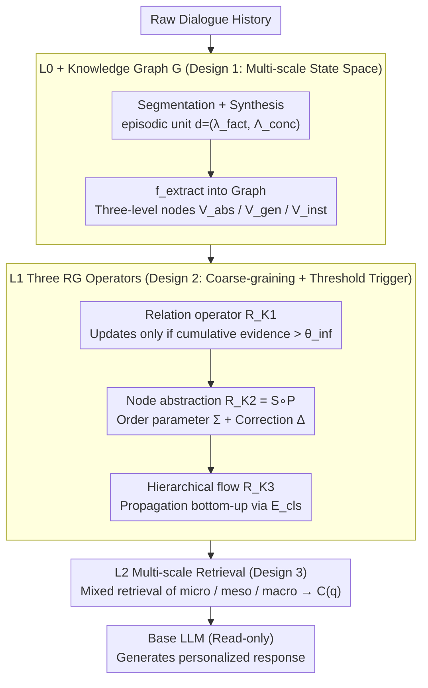

# RGMem: Renormalization Group-Inspired Memory Evolution for Language Agents

**Conference**: ICML 2026  
**arXiv**: [2510.16392](https://arxiv.org/abs/2510.16392)  
**Code**: https://github.com/fenhg297/RGMem (Available)  
**Area**: LLM Agent / Long-term Memory / Personalized Dialogue  
**Keywords**: Renormalization Group, Multi-scale Memory, User Profile Evolution, Threshold Phase Transition, Stability-Plasticity  

## TL;DR
RGMem draws inspiration from the Renormalization Group (RG) in statistical physics to model the long-term dialogue memory of language agents as a multi-scale system ("Event Layer → Relation Layer → Concept Layer"). It employs threshold-triggered non-linear operators to coarse-grain fragmented dialogues into stable user profiles, thereby breaking the "stability vs. plasticity" trade-off.

## Background & Motivation

**Background**: LLM-based dialogue agents are increasingly expected to maintain personalized interactions across sessions. Mainstream approaches either stuff history into the context (limited by window size + lost-in-the-middle) or use RAG/explicit memory (Mem0, LangMem, A-Mem, Memory OS, Zep, etc.) for retrieval augmentation at the fact/paragraph granularity.

**Limitations of Prior Work**: Existing explicit memory systems are almost all "flat"—retrieving from a pool of facts based on lexical overlap and temporal recency, lacking the ability to extract stable traits from fragmented information. Consequently, noise accumulates, diluting long-term traits; implicit memory (Fine-tuning/LoRA/KV-cache) lacks auditability, is difficult to roll back, and cannot share profiles across agents.

**Key Challenge**: Long-term dialogue is inherently **multi-scale**: micro encompasses specific events, meso involves patterns across contexts, and macro represents long-term personality traits. Updating these three at the same granularity inevitably leads to the classic "stability vs. plasticity" dilemma: updating too aggressively overfits to noise and discards existing facts, while updating too conservatively fails to track genuine preference shifts.

**Goal**: (1) Provide a principled "when to perform cross-scale abstraction" mechanism for memory systems; (2) make profile evolution robust to noise yet sensitive to real changes; (3) achieve this without relying on larger context windows or more intensive retrieval.

**Key Insight**: The authors analogize memory to a physical system—RG in statistical physics is a tool for studying how "high-frequency microscopic fluctuations are integrated out, leaving macroscopic invariants." Treating "fast-changing events" as microscopic degrees of freedom and "slow-changing traits" as macroscopic order parameters, the entire dialogue history becomes a system to be coarse-grained.

**Core Idea**: Profile evolution is defined as a sequence of threshold-triggered RG operators—only when accumulated evidence at the micro layer crosses a critical threshold is the change "promoted" to the meso or macro layers. Within each scale, the system separates the "order parameter $\Sigma$ (commonality)" from the "correction term $\Delta$ (tension)," achieving phase-transition-like rather than linear monotonic profile updates.

## Method

### Overall Architecture
RGMem represents the memory state as $\mathcal{M} = \mathcal{D}_{L0} \times \mathcal{G}$, where $\mathcal{D}_{L0}$ is a set of episodic memory units derived from raw dialogue segmentation + synthesis, and $\mathcal{G} = (\mathcal{V}, \mathcal{E})$ is a hierarchical dynamic knowledge graph. The system is physically divided into three layers: **L0** constructs micro evidence (event-level facts + user conclusions); **L1** executes three RG operators for multi-scale evolution (relation inference $\mathcal{R}_{K1}$, node abstraction $\mathcal{R}_{K2}$, and hierarchical flow $\mathcal{R}_{K3}$); **L2** provides a scale-aware retrieval interface. Every new dialogue first extracts episodic units $d = (\lambda_{fact}, \Lambda_{conc})$ at L0, which triggers L1 operators to update the graph; queries are then handled by L2, which mixes multi-scale contexts based on the question granularity to feed the LLM. The system is read-only for the base LLM; all "learning" occurs within the external multi-scale graph and interpretable update rules.

The profile representation at each scale is formalized as an effective theory $\mathcal{T}(\mathcal{M}, s)$, parameterized by descriptors $\{\lambda_i(s)\}$; scales are connected via operators $\mathcal{T}^{(s+1)} = \mathcal{R}(\mathcal{T}^{(s)})$, corresponding to coarse-graining + rescaling. Operators are not explicit optimization targets; instead, the authors' effective Hamiltonian $\mathcal{H}(\mathcal{T}) = \alpha E_{\text{con}}(\mathcal{T}) + \beta E_{\text{fid}}(\mathcal{T}|\mathcal{D}_{L0}) + \gamma E_{\text{com}}(\mathcal{T})$ (consistency + fidelity + compactness) serves as a heuristic guide—global optimization is infeasible in text space, so operator rules are used to "approximately minimize" it.

### Key Designs

**1. Three-layer Multi-scale Memory State Space (L0 + Knowledge Graph $\mathcal{G}$): Separating fast and slow variables at the data structure level**

Flat RAG puts all facts into the same pool; new facts dilute the retrieval weight of old traits—"what was eaten on Tuesday" and "user preference for fitness" are forced to update at the same pace. RGMem decouples them in the data structure: L0 uses $f_{cg}=f_{synth}\circ f_{seg}$ to segment and synthesize episodic units $d=(\lambda_{fact},\Lambda_{conc})$, where $\Lambda_{conc}=\Lambda_{base}\cup\Lambda_{rel}$ separates "direct conclusions" from "high-saliency signals." These are then mapped by $f_{extract}:\mathcal{D}_{L0}\to\mathcal{G}$ to a knowledge graph with three node levels: $\mathcal{V}_{abs}$ (abstract concepts), $\mathcal{V}_{gen}$ (general events), and $\mathcal{V}_{inst}$ (specific events), and edges divided into static classification edges $\mathcal{E}_{cls}$ and dynamic event edges $\mathcal{E}_{evt}$. Explicit stratification means contents at different levels are not at the same granularity, naturally supporting evolution at different rhythms.

**2. Three RG Operators for Coarse-graining + Threshold-triggered Updates: Making "when to abstract" a beam of schedulable rules**

The core of RGMem is using three operators to turn "when to promote new evidence to higher-level abstractions" into interpretable, schedulable operations rather than uniform propagation. The **Relation Operator $\mathcal{R}_{K1}$** accumulates new evidence $D_e^{new}$ for the same relation $e$, updating the relation-level theory $\mathcal{T}_e^{(1,t+1)}\leftarrow\mathcal{T}_e^{(1,t)}+\beta(\mathcal{T}_e^{(1,t)},D_e^{new})$. The non-linear fusion $\beta$, implemented by the LLM, merges old summaries with new evidence and **only triggers when cumulative evidence exceeds a threshold $\theta_{\text{inf}}$**, preventing sparse noise from being abstracted prematurely. The **Node Abstraction Operator $\mathcal{R}_{K2}=\mathbb{S}\circ\mathbb{P}$** collects mixed-scale inputs $\mathcal{I}_v^{new}=\{\mathcal{T}_{e_i}^{(1),new}\}_{e_i\in N(v)}\cup\{d_j^{new}\}_{j\in D(v)}$ for an abstract node $v$: projection-selection $\mathbb{P}$ prioritizes already aggregated relation-level summaries and discards low-density noise $D_v'=\mathbb{P}(\mathcal{I}_v^{new})$; synthesis-rescaling $\mathbb{S}$ simultaneously maintains two quantities—the **Order Parameter** $\Sigma_v^{(2,t+1)}=\text{Agg}_{\text{common}}(D_v',\Sigma_v^{(2,t)})$ capturing dominant stable patterns, and the **Correction Term** $\Delta_v^{(2,t+1)}=\text{Extract}_{\text{salient}}(D_v',\Delta_v^{(2,t)})$ preserving important tension signals that do not fit into $\Sigma$, controlled by threshold $\theta_{\text{sum}}$. The **Hierarchical Flow Operator $\mathcal{R}_{K3}$** propagates updates bottom-up along $\mathcal{E}_{cls}$, where the parent node $v_p$ aggregates child representations $(\Sigma_{v_p}^{(s+1)},\Delta_{v_p}^{(s+1)})=\mathcal{R}_{K3}(\{(\Sigma_{v_{c_i}}^{(s)},\Delta_{v_{c_i}}^{(s)})\}_i)$ using a dirty-flag mechanism for incremental scheduling. This "order parameter + correction" split directly corresponds to "dominant ordered modes + critical fluctuations" in physics, ensuring internal contradictions in user behavior are not forcibly smoothed into a single summary; threshold triggering corresponds to phase transitions, allowing the system to naturally exhibit two states: "ignore small perturbations / reorganize on large perturbations."

**3. Multi-scale Retrieval L2 + Spectral Context Construction: Retrieving memory at the corresponding scale of the query**

Traditional RAG treats context as a single pool, where the "information density vs. context length" ceiling is quickly hit (documented by the non-monotonic curve in Fig. 3). The query interface $f_{\text{retr}}(q,\mathcal{M})$ of RGMem simultaneously accesses three layers: micro (episodic evidence), meso (relation-level summaries), and macro (node-level $\Sigma$ and $\Delta$), combining them into a unified context $C(q)$ based on query intent. Factual questions primarily pull micro units, while long-range reasoning or personality-related questions pull macro units. Retrieving by scale means more information matching the query granularity can be packed into the same token budget, rather than retrieving irrelevant microscopic fluctuations.

### Loss & Training
RGMem does not train any parameters—all operators are LLM-based non-linear update functions + threshold rules. "Training" occurs entirely through the evolution of the graph structure, making it interpretable, rollable, and auditable. Hyperparameters primarily include $\theta_{\text{inf}}$, $\theta_{\text{sum}}$, and the retrieval budget for L2.

## Key Experimental Results

### Main Results
Evaluated on two long-term dialogue memory benchmarks: **LOCOMO** (long-context reasoning + temporal consistency, LLM-as-judge) and **PersonaMem** (128k token setting, dynamic persona evolution).

| Benchmark | Backbone | Method | Key Metric |
|-----------|----------|------|---------|
| PersonaMem (Avg) | GPT-4o-mini | Mem0 | 56.79 |
| PersonaMem (Avg) | GPT-4o-mini | A-Mem | 49.17 |
| PersonaMem (Avg) | GPT-4o-mini | Memory OS | 54.23 |
| PersonaMem (Avg) | GPT-4o-mini | **RGMem** | **63.87 (+7.08)** |
| PersonaMem (Avg) | GPT-4o | Memory OS | 65.03 |
| PersonaMem (Avg) | GPT-4o | **RGMem** | **74.01 (+8.98)** |
| LOCOMO (Avg) | gpt-4o-mini | Zep | 75.14 |
| LOCOMO (Avg) | gpt-4o-mini | **RGMem** | **78.92** |
| LOCOMO (Avg) | gpt-4o | Zep | 79.09 |
| LOCOMO (Avg) | gpt-4o | **RGMem** | **86.17** |
| LOCOMO (Avg) | gpt-4o | Full-Context | 87.52 |

RGMem improves over the second-best baseline by 7.08 / 8.98 points on PersonaMem and approaches Full-Context performance (stuffing everything into the window) on LOCOMO while using a much lower context budget.

### Ablation Study

| Configuration | Key Metric Change | Description |
|------|------------|------|
| Full RGMem | Best (PersonaMem 63.87 / 74.01) | Full three-layer operators |
| Threshold $\theta_{\text{inf}} = 1$ (subcritical) | Significant drop | Every small noise triggers an update, overfitting to transient signals |
| Threshold $\theta_{\text{inf}} = 3$ (critical) | Peak performance | Critical point, balancing stability and plasticity |
| Threshold $\theta_{\text{inf}} > 5$ (supercritical) | Significant drop | Updates suppressed, profile becomes rigid and fails to track real drift |
| Remove any core component | Not compensated by more context | Multi-scale design itself is the source of performance, not context volume |
| Remove $\Delta$ (keep only $\Sigma$) | Drop in multi-hop reasoning / cross-scenario tasks | $\Delta$ preserves critical fluctuations vital for complex scenarios |

### Key Findings
- **Critical Threshold Phenomenon (Phase Transition Characteristic)**: Treating $\theta_{\text{inf}}$ as the control parameter and task performance as the order parameter, the curve shows a non-monotonic peak at $\theta_{\text{inf}} = 3$, which is reproducible across benchmarks—this is the most interesting empirical finding, framing "when to update a profile" as a phase transition.
- **Breaking the Stability–Plasticity Pareto Front**: On the Recall Facts × Latest Preference 2D plot, other baselines form a trade-off curve, while RGMem strictly lies outside the Pareto front—achieving both retention and adaptability.
- **Optimal Scale for Effective Information Density**: On LOCOMO, accuracy increases as retrieval context grows from 3k to ~3.8k tokens, then decreases—coarse-graining "integrates out" irrelevant microscopic fluctuations, outperforming simply stuffing more tokens.
- **Macroscopic Invariance**: Under long-term consistent evidence, higher-level profile representations converge and stabilize, exhibiting attractor-like behavior; this indicates $\Sigma$ truly captures cross-context invariant user traits rather than just the "last N items."

## Highlights & Insights
- **RG as an Engineering Lens, Not Just a Physics Metaphor**: The authors explicitly state they are not doing physical RG but borrowing its design principle for coarse-graining. This "borrowing physical intuition for engineering" is highly transferable—applicable to any system requiring mixed-scale updates (continual learning, KG evolution, multi-agent collaboration).
- **$\Sigma + \Delta$ Representation for "Dominant Mode + Tension"**: Directly maps to order parameters and critical fluctuations in physics. This is more principled than common "summary + exception list" or "profile + memo" approaches, explaining why contradictions are not flattened.
- **Threshold as a Phase Transition Control Parameter**: Reinterpreting hyperparameters as "controlling which dynamic regime the system is in" provides clear physical intuition for tuning, rather than black-box grid searching.
- **Base LLM-Agnostic, External Graph Architecture**: Operates without modifying the base LLM, meaning it can be plugged into any closed/open-source model. Profiles are auditable, rollable, and shareable across agents.

## Limitations & Future Work
- The three operators $\mathcal{R}_{K1}, \mathcal{R}_{K2}, \mathcal{R}_{K3}$ are implemented via LLM calls; LLM inference costs will accumulate with graph size over the long term. The paper does not provide quantified update latency or cost estimates.
- While the "critical threshold $\theta_{\text{inf}}=3$" being consistent across two benchmarks is striking, the sample size is small; its universality across broader tasks or its status as a "pseudo-resonance" for these specific datasets requires further verification.
- The effective Hamiltonian formula is elegant but not explicitly minimized—the "approximate" relationship between it and operator design is qualitative, lacking a quantitative gap bound.
- The $\mathcal{V}_{abs} / \mathcal{V}_{gen} / \mathcal{V}_{inst}$ schema and $\mathcal{E}_{cls}$ classification edges are domain-dependent; migrating to new scenarios (e.g., long-term task planning instead of personalization) requires re-designing the schema.
- Lack of human user studies; persona simulation and LLM-as-judge might overstate the benefits of "profile stability" while underestimating ambiguity, sarcasm, or inconsistency in real human interaction.

## Related Work & Insights
- **vs. Mem0 / A-Mem / Memory OS** (Chhikara et al., 2025; Rasmussen et al., 2025): These are explicit memory systems performing retrieval/summarization at the fact level without "operator-triggered cross-scale abstraction"; RGMem systematically outperforms them by 7–9 points on PersonaMem.
- **vs. LangMem / Zep**: Zep is the strongest hierarchical memory baseline on LOCOMO, but its abstraction rules are relatively linear/fixed-interval; RGMem's non-linear threshold triggering explains its superiority in multi-hop and temporal tasks.
- **vs. GraphRAG / HippoRAG / AriGraph** (Edge et al., 2024; Gutiérrez et al., 2024; Anokhin et al., 2024): These use hierarchical graphs for memory but employ bottom-up uniform propagation; RGMem's contribution is turning "when to propagate" into a phase-transition control.
- **vs. Implicit Memory / KV-cache Adaptation** (Wang et al., 2024; Zhu et al., 2026): Implicit methods capture style well but are not auditable; RGMem uses explicit graphs for rollback/sharing capability, acting as a complement rather than a replacement.

## Rating
- Novelty: ⭐⭐⭐⭐⭐ Re-framing memory evolution as a multi-scale dynamic system using RG, leading to "threshold phase transition" engineering, is rare and theoretical.
- Experimental Thoroughness: ⭐⭐⭐⭐ Two benchmarks + two backbones + threshold sweeps + Pareto analysis; lacks human user study and cost quantification.
- Writing Quality: ⭐⭐⭐⭐ Concepts-to-operators mapping is clear, with theoretical support in the appendix; the effective Hamiltonian section in the main text is slightly metaphysical.
- Value: ⭐⭐⭐⭐⭐ Points toward a "principled multi-scale" path for long-term dialogue agent memory design, directly applicable to industrially deployable agents.

<!-- RELATED:START -->

## Related Papers

- [\[ACL 2026\] From Recall to Forgetting: Benchmarking Long-Term Memory for Personalized Agents](../../ACL2026/recommender/from_recall_to_forgetting_benchmarking_long-term_memory_for_personalized_agents.md)
- [\[ICML 2026\] Learning Design Skills as Memory Policies for Agentic Photonic Inverse Design](learning_design_skills_as_memory_policies_for_agentic_photonic_inverse_design.md)
- [\[ICLR 2026\] In Agents We Trust, but Who Do Agents Trust? Latent Source Preferences Steer LLM Generations](../../ICLR2026/recommender/in_agents_we_trust_but_who_do_agents_trust_latent_source_preferences_steer_llm_g.md)
- [\[ICLR 2026\] GoalRank: Group-Relative Optimization for a Large Ranking Model](../../ICLR2026/recommender/goalrank_group-relative_optimization_for_a_large_ranking_model.md)
- [\[ACL 2026\] MemRec: Collaborative Memory-Augmented Agentic Recommender System](../../ACL2026/recommender/memrec_collaborative_memory-augmented_agentic_recommender_system.md)

<!-- RELATED:END -->
