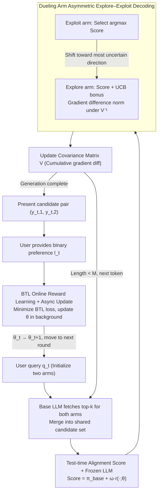

# T-POP: Test-Time Personalization with Online Preference Feedback

**Conference**: ICML 2026  
**arXiv**: [2509.24696](https://arxiv.org/abs/2509.24696)  
**Code**: https://github.com/QuZikun/T-POP (Available)  
**Area**: LLM Alignment / Personalization / Online Learning  
**Keywords**: Test-time Alignment, Dueling Bandits, Online Preference Feedback, Cold-start Personalization, Neural UCB  

## TL;DR
T-POP integrates "test-time alignment" with "neural dueling bandits." Without modifying LLM parameters, it learns a personalized reward function online using pairwise preference feedback per round, effectively addressing the cold-start problem in personalization for new users.

## Background & Motivation

**Background**: Current LLM personalization primarily follows two paths. One involves RLHF/DPO-style fine-tuning, utilizing per-user preference retraining or LoRA adaptation. The other path is training-free, such as RAG-based retrieval of user history or inserting history into prompts. Both approaches assume the availability of "sufficient" existing data for a user.

**Limitations of Prior Work**: The fine-tuning route is too slow and expensive for new users—running RLHF for every user is clearly impractical. While RAG/prompting routes are lightweight, they essentially "read history" and fail for new users without any historical data, representing the classic cold-start problem in personalization.

**Key Challenge**: User preferences are only revealed during interaction, but generation must be adapted during the interaction process to be acceptable; otherwise, users will not stay to provide feedback. In other words, **"preference collection" and "preference utilization" occur simultaneously and cannot be decoupled into a two-stage "collect then deploy" process**.

**Goal**: (1) Enable online adaptation to individual users without fine-tuning the base LLM; (2) drive adaptation using the most economical form of feedback—pairwise preferences; (3) ensure sample efficiency high enough to see gains within dozens of interactions.

**Key Insight**: The authors treat each decoding step as a bandit problem—where the candidate token pool acts as the "arms" and pairwise user preferences serve as the reward signals. To learn rewards online, one must actively generate "informative" pairs to query the user, which aligns precisely with the "explore vs. exploit" trade-off handled by dueling bandits.

**Core Idea**: A small, online-learned neural reward function $r(\cdot;\theta)$ is attached to a frozen LLM. For each query, two candidate responses are generated per token—one for pure exploitation and one with a UCB exploration bonus. A pairwise comparison is presented to the user, and $\theta$ is immediately updated using a BTL loss.

## Method

### Overall Architecture
In round $t$, T-POP receives a query $q_t$ and simultaneously expands two trajectories $y_{t,1}, y_{t,2}$ of maximum length $M$, referred to as the exploitation arm and the exploration arm. At each position $p$, a next token is selected for both sequences: first, top-$k$ candidates are retrieved from the base LLM for each to form a shared candidate set $\mathcal{V}_p$. Then, a scoring function $\text{Score}(v|y_{<p}) = \pi_{\text{base}}(v|y_{<p}) + \omega \cdot r([y_{<p},v];\theta)$ is used to rank candidates. Each sequence picks the highest-scoring token to continue, but the exploration arm adds a gradient-based UCB bonus and incrementally updates the covariance matrix $V$ at each step. After the inner token loop reaches length $M$, the pair $(y_{t,1}, y_{t,2})$ is presented to the user. Upon receiving the binary preference $l_t = \mathbb{1}\{y_{t,1} \succ y_{t,2}\}$, the reward network is updated via BTL loss $\theta_t \to \theta_{t+1}$ for the next round. The base LLM remains frozen throughout; only the small reward NN changes. This can be viewed as a nested loop of "inner token-level decoding + outer round-level feedback":

### Key Designs

**1. Test-time Alignment Scoring + Frozen LLM: Personalization as Logit Post-processing**

To bypass the overhead of RLHF fine-tuning and the cold-start barrier, T-POP keeps all base LLM parameters frozen. Instead, at each token position, a preference reward from the reward network is added to the base LLM next-token probability $\pi_{\text{base}}(v|y_{<p})$, resulting in the score $\text{Score}(v|y_{<p})=\pi_{\text{base}}(v|y_{<p})+\omega\cdot r([y_{<p},v];\theta)$, where $\omega$ controls strength. Personalization is thus reflected in the shift of the decoding trajectory rather than model weight updates. This allows "adaptation" within dozens of rounds per user without pre-collecting historical data and is naturally compatible with closed-source LLMs that only expose logits/top-$k$.

**2. Asymmetric Explore–Exploit Decoding with Dueling Arms: Maximizing Information Gain per Comparison**

If both candidate responses are purely greedy, they will be nearly identical, making it impossible for the user to distinguish them and preventing the BTL model from learning. T-POP sets the exploitation arm to be purely greedy $v_{p,1}=\arg\max_v\text{Score}(v|y_{t,1})$, while the exploration arm adds a UCB term $\omega\cdot\nu\cdot u_t(v)$ to the score. The uncertainty $u_t(v)=\|\nabla r([y_{t,2},v];\theta_t)-\nabla r([y_{t,1},v_{p,1}];\theta_t)\|_{V_{t-1}^{-1}}$ measures the "novelty" of the candidate relative to the current exploit arm in the reward parameter space. $V_{t-1}$ is the second-order matrix of historical gradient differences. This forces the second arm toward the "most uncertain direction" in the reward parameter space, maximizing information gain for $\theta$ with each comparison. Theoretically, the authors leverage neural dueling bandit theory to provide an $\tilde O(d_{\text{eff}}\sqrt{T})$ round-level regret bound, extended to a token-level guarantee of $\tilde O(L\sqrt T)$.

**3. Online Reward Learning with BTL + Asynchronous Updates: Stable Integration of Binary Preferences**

Given only binary "A vs. B" signals, T-POP minimizes the BTL negative log-likelihood with L2 regularization over all historical data $\mathcal{D}_t=\{(y_{s,1},y_{s,2},l_s)\}_{s=1}^t$. The BTL model naturally aligns "choosing A over B" with the sigmoid probability of the reward difference. To prevent training from blocking the user experience, updates are performed in a background thread. The current request continues using the old $\theta_t$, and the system switches to $\theta_{t+1}$ once training completes. This asynchronous approach hides backpropagation overhead, making "real-time deployment" feasible.

### Loss & Training
All trainable parameters reside in the small reward NN. The loss is the BTL negative log-likelihood plus $\lambda\|\theta\|_2^2$. $V_t$ is initialized as $\lambda I$. Key hyperparameters include reward weight $\omega$, exploration coefficient $\nu$, candidate count $k$, max length $M$, and total rounds $T$.

## Key Experimental Results

### Main Results
Evaluated using three base LLMs (Mistral-7B-Instruct-v0.2, Llama-3.1-8B-Instruct, Qwen2-7B-Instruct) across four benchmarks (HelpSteer, TruthfulQA, UltraChat, Personal Preference Eval) and four preference attributes (creative, verbose, concise, uplifting), with ArmoRM-Llama3-8B as the reward judge.

| Base | Attribute (avg) | Base | Pref | BS16 | LA | AMULET | T-POP |
|------|-----------|------|------|------|----|--------|-------|
| Mistral-7B | Concise | 0.43 | 0.45 | 0.48 | 0.52 | 0.51 | **0.60** |
| Mistral-7B | Creative | 0.32 | 0.33 | 0.34 | 0.37 | 0.40 | **0.48** |
| Qwen2-7B | Concise | 0.41 | 0.47 | 0.49 | 0.55 | 0.55 | **0.60** |
| Qwen2-7B | Uplifting | 0.38 | 0.39 | 0.40 | 0.42 | 0.42 | **0.55** |
| Llama-3.1-8B | Verbose | 0.30 | 0.31 | 0.32 | 0.35 | 0.44 | **0.50** |

Aggregated results show T-POP improving by ~28.0% over AMULET on Qwen2-7B, ~19.9% on Mistral-7B, and performing nearly equally on Llama-3.1-8B (0.535 vs 0.5325), with an overall average improvement of ~14.7%.

### Ablation Study

| Configuration | Effect | Description |
|------|------|------|
| Full T-POP (exploit + UCB exploration arm + BTL online update) | Best ArmoRM score + high GPT-4o win rate | Complete proposal |
| Exploit arm only (No UCB exploration) | Extremely slow learning curve, preference fails to converge | Degenerates to "repetitive greedy" with no info gain |
| Fixed reward (No online update of $\theta$) | Equivalent to base + static bias, similar to Pref | Confirms online learning as the source of performance |
| Reduced interaction rounds $T$ | Significant rise within first 20 rounds, nears peak at 40–60 | Demonstrates "few-shot personalization" |

### Key Findings
- **High Sample Efficiency**: Reward scores rise rapidly within the first 20 interactions and converge by rounds 40–60, with a slight dip thereafter due to minor overfitting.
- **UCB Exploration is Critical for Dueling**: Setting the second arm to greedy results in nearly identical responses, preventing the BTL model from learning. Asymmetric explore-exploit is the engine of reward learning effectiveness.
- **AMULET parity on Llama-3.1-8B**: Suggests that when the base LLM is already sensitive to preference attributes, simple linear logit adjustments are effective; T-POP's advantage lies in robustness through "active exploration + online BTL" in difficult scenarios.
- **Asynchronous Updates sustain Performance**: Backgrounding the backward pass while serving with the old $\theta_t$ shows no significant data degradation while reducing perceived latency to nearly zero.

## Highlights & Insights
- **Integrating dueling bandits into the decoding loop, not just response selection**: Unlike best-of-N or rerankers that use pairwise feedback at the sentence level, token-level dueling moves UCB exploration into every step. Combining this with tokenized bandit theory to achieve $\tilde O(L\sqrt T)$ regret is the most elegant contribution.
- **Gradient difference as an uncertainty measure for structured sequences**: Traditional UCB frequency counts are infeasible in token space. T-POP uses the norm of the gradient difference of the reward network in the $V_{t-1}^{-1}$ metric as "epistemic uncertainty," equivalent to exploration rewards in the NTK perspective.
- **Broad Compatibility with closed-source LLMs**: Requires nothing beyond logit/top-$k$ access, meaning a single personalization "plugin" can theoretically be shared across different models and users.

## Limitations & Future Work
- The "user" is simulated by GPT-4o; the alignment between BTL assumptions and actual human taste noise, stereotypes, or drift has not been directly verified.
- Expanding two top-$k$ candidates and calculating gradient-based UCB at each step results in significantly higher per-step latency than standard greedy decoding, which remains a deployment burden for long generations.
- Personalization is only verified at the "attribute level" (e.g., creative/concise). Finer, multi-faceted preferences across tasks (e.g., "rigorous + concise + use emojis") were not analyzed, and UCB stability on multi-dimensional rewards is unknown.
- Preferences may drift, but the reward network accumulates monotonically—the paper does not discuss forgetting mechanisms or sliding windows for long-term use.

## Related Work & Insights
- **vs. AMULET** (Zhang et al., 2025b): Both are test-time alignment frameworks, but AMULET lacks an active exploration mechanism (equivalent to pure exploitation). T-POP's explicit exploration via dueling bandits allows sustained gains over more rounds.
- **vs. Linear Alignment (LA)** (Gao et al., 2024): LA uses simple linear logit adjustments; T-POP uses a neural reward + online BTL, fitting more complex preference structures.
- **vs. RLHF/DPO personalization variants** (Jang et al., 2023; Park et al., 2024): These require per-user weight fine-tuning. T-POP leaves the LLM untouched, making it "plug-and-play" for new users.
- **vs. RAG / prompt-based personalization** (Salemi et al., 2024): These rely on existing user corpora; T-POP generates signals directly through online preference interactions.

## Rating
- Novelty: ⭐⭐⭐⭐ Embedding dueling bandits into token-level decoding is a fresh approach with clear theoretical backing.
- Experimental Thoroughness: ⭐⭐⭐⭐ Three bases x Four benchmarks x Four attributes + learning curves, though lacking a real-world user study.
- Writing Quality: ⭐⭐⭐⭐ Clean algorithm descriptions and formulas; appendix provides comprehensive theory.
- Value: ⭐⭐⭐⭐ Offers a deployment-friendly paradigm for closed-source LLM personalization, more practical than per-user LoRA training for industry.

<!-- RELATED:START -->

## Related Papers

- [\[ICML 2025\] PARM: Multi-Objective Test-Time Alignment via Preference-Aware Autoregressive Reward Model](../../ICML2025/recommender/parm_multi-objective_test-time_alignment_via_preference-aware_autoregressive_rew.md)
- [\[NeurIPS 2025\] MMPB: It's Time for Multi-Modal Personalization](../../NeurIPS2025/recommender/mmpb_its_time_for_multi-modal_personalization.md)
- [\[AAAI 2026\] Preference is More Than Comparisons: Rethinking Dueling Bandits with Augmented Human Feedback](../../AAAI2026/recommender/preference_is_more_than_comparisons_rethinking_dueling_bandits_with_augmented_hu.md)
- [\[ACL 2026\] Personalizing LLMs with Binary Feedback: A Preference-Corrected Optimization Framework](../../ACL2026/recommender/personalizing_llms_with_binary_feedback_a_preference-corrected_optimization_fram.md)
- [\[ACL 2026\] Mirroring Users: Towards Building Preference-aligned User Simulator with User Feedback in Recommendation](../../ACL2026/recommender/mirroring_users_towards_building_preference-aligned_user_simulator_with_user_fee.md)

<!-- RELATED:END -->
