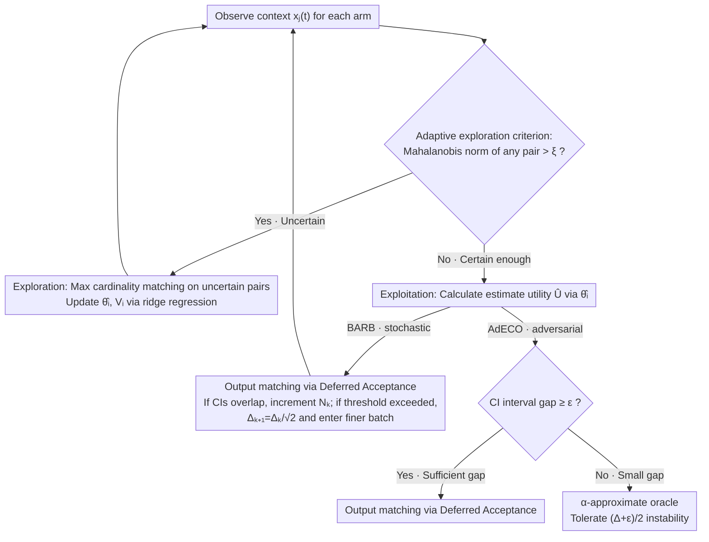

# Adaptive Bandit Algorithms for Contextual Matching Markets

**Conference**: ICML 2026  
**arXiv**: [2605.28290](https://arxiv.org/abs/2605.28290)  
**Code**: None  
**Area**: Reinforcement Learning / Contextual Bandit  
**Keywords**: contextual bandit, matching market, stable matching, regret bound, adaptive exploration  

## TL;DR
This paper studies online matching markets with contexts, treating players' linear preferences for dynamic arm contexts as the bandit learning objective. It proposes BARB for stochastic contexts and AdECO for adversarial contexts, providing adaptive upper bounds for player-optimal stable regret and tight $\tilde O(T^{2/3})$ theoretical results.

## Background & Motivation
**Background**: Two-sided matching markets are used to model school admissions, labor markets, medical residency matching, and platform dispatching. The classic Gale-Shapley algorithm assumes bilateral preferences are known to find a stable matching. Recently, research on bandit learning in matching markets has set preferences on one side as unknown, learning them through repeated matching and feedback.

**Limitations of Prior Work**: Much existing work assumes preference profiles are static or requires priors such as the minimum gap, covariance structure, or the number of environments. However, in real-world platforms, job/task contexts change every round; a worker's utility for a task is determined jointly by fixed preference vectors and dynamic contexts. Small changes in context might only slightly alter one player's utility but completely reshuffle the stable matching benchmark, causing other players' regret to surge.

**Key Challenge**: Learning in matching markets is not about individual reward maximization. Algorithms must simultaneously learn the linear preferences of each player, maintain stable or near-stable matchings, and control individual regret relative to the player-optimal stable matching. Small utility gaps or ties can make the stable benchmark itself fragile, especially under adversarial contexts, where traditional regret may become uncontrollable.

**Goal**: Design adaptive algorithms for both stochastic and adversarial context settings that do not require knowledge of the true gap or covariance structure, and provide regret guarantees for every player.

**Key Insight**: The authors define a probabilistic minimum preference gap $\Delta_{min}$ for the stochastic setting, allowing for occasional small gaps rather than requiring a deterministic lower bound for all rounds. For the adversarial setting, they define $\alpha$-approximate $\Delta$-optimal stable regret, which aligns with the exact stable benchmark when gaps are large and shifts to an approximate stable benchmark when gaps are small.

**Core Idea**: Use the Mahalanobis norm to determine if the current context requires further exploration. This is combined with maximum cardinality matching for information gathering and Gale-Shapley for exploitation, calling an approximation oracle in adversarial small-gap scenarios.

## Method
The basic model consists of $N$ players and $K$ arms, with $N \leq K$. Arm-side preferences for players are fixed, strict, and known; player-side preferences for arms are unknown and vary with context. In each round $t$, each arm $a_j$ presents a context $x_j(t) \in \mathbb{R}^d$, and the true utility for player $p_i$ is $U_{i,j}(t) = \theta_i^\top x_j(t)$. If matched, the platform observes a noisy reward $y_{i,j}(t) = U_{i,j}(t) + \epsilon_{i,j}(t)$.

### Overall Architecture
Given the true utility matrix $U(t)$ and arm-side preferences, a set of stable matchings $S_t$ exists. The paper uses the player-optimal stable matching $\mu_t^*$ as the benchmark and defines regret for each player: $Reg_i(T) = \sum_{t=1}^T U_i^*(t) - \mathbb{E}[\sum_{t=1}^T y_i(t)]$. The objective is not to maximize total reward, but to ensure each player stays close to their utility in the player-optimal stable matching.

In the stochastic setting, arm contexts are sampled independently from a fixed unknown distribution. The authors define the minimum preference gap $\Delta_{min}$ as the largest gap satisfying $P(\delta_{min} \geq \Delta) \geq 1 - \log T / (T\Delta^2)$, balancing exploration costs $O(\log T / \Delta^2)$ and exploitation costs $O(\zeta T)$ from small gaps.

In the adversarial setting, contexts can be chosen arbitrarily or even adaptively. Since an adversary can keep gaps near zero indefinitely, exact stable regret is no longer feasible. The paper uses $\epsilon$-stable matching and an approximation oracle to define tractable approximate regret: comparing against $U_i^*(t)$ when $\delta_{min}(t) > \Delta$, and against $\alpha U_i^\epsilon(t)$ for small gaps.

Both settings share a same **round-by-round decision skeleton**: each round first uses Mahalanobis uncertainty to judge "explore or exploit." Exploration performs maximum cardinality matching on uncertain player-arm pairs to collect samples and updates preference estimates via ridge regression. Exploitation performs matching based on estimated utilities. BARB (stochastic) and AdECO (adversarial) differ only in their exploitation branches: the former uses overlap counts to tighten candidate gaps, while the latter switches to an approximation oracle for small gaps.

### Key Designs
**1. Adaptive Exploration: Determining when to explore via Mahalanobis uncertainty**

This is the common exploration skeleton for BARB and AdECO. The challenge is that without knowing the true $\Delta_{min}$, fixed exploration lengths (e.g., ETC) either over-explore or lack precision, and are sensitive to context covariance degradation. The approach here calculates the Mahalanobis norm $\|x_j(t)\|_{V_i(t)^{-1}}$ for each player-arm pair per round—measuring uncertainty within the player's estimated ellipsoid. If any pair exceeds threshold $\xi$, the utility estimate in that direction is insufficient. The "uncertain pairs" form a bipartite graph for **maximum cardinality matching**, collecting valid samples for as many players as possible in one round, then updating $V_i$ and $\hat\theta_i$ via ridge regression. Otherwise, the round enters exploitation. This works because the standard linear bandit confidence bound guarantees $\|\theta_i - \hat\theta_i\|_{V_i} \leq \eta$, thus $|U - \hat U| \leq \eta \cdot \|x\|_{V_i^{-1}}$; the Mahalanobis norm directly bounds the estimation error, allowing exploration to adapt to any covariance without prior knowledge of difficult directions.

**2. BARB: Batched regret balancing and overlap-driven gap shrinking (stochastic)**

For stochastic contexts, the estimation precision must be gradually pushed to match the level of the true $\Delta_{min}$ without prior knowledge. BARB runs in batches: the $k$-th batch maintains a candidate gap $\Delta_k$ and exploration threshold $\xi_k = \Delta_k/\eta$. In exploitation, it uses estimated utilities for Deferred Acceptance and constructs confidence intervals (CIs). If intervals for the top-$(N+1)$ arms frequently overlap (indicating insufficient precision for ranking), a counter $N_k$ is incremented. Once $N_k$ exceeds threshold $3\log T / (16\Delta_k^2)$, $\Delta_{k+1} = \Delta_k/\sqrt{2}$ is set, and the algorithm enters a finer batch. The key is that it does not know $\Delta_{min}$ beforehand; it uses the signal of "frequent inability to distinguish rankings" to tighten precision—exploration rounds are bounded by the elliptical potential lemma, and overlap rounds by the stopping threshold, balancing to $O(\log^2 T / \Delta_{min}^2)$ player-optimal stable regret.

**3. AdECO: Stable / Approximate stable oracle switching (adversarial)**

For adversarial contexts, an adversary can maintain near-zero gaps indefinitely, making exact player-optimal stable regret uncontrollable. AdECO's exploration follows Design 1, but the exploitation branch differs. After entering exploitation, it checks the CI spacing: if $\geq \epsilon$ (sufficient gap), it calls Gale-Shapley for an exact stable matching; if $< \epsilon$ (small gap), it calls an $\alpha$-approximation oracle, allowing a $(\Delta+\epsilon)/2$ level of instability tolerance. The reasoning is that under small gaps, ties are inherently indistinguishable, so demanding exact stability is futile. Shifting to an approximate benchmark makes the objective solvable, yielding an $\alpha$-approximate $\Delta$-optimal stable regret of $O(Nd\log^2T/(\Delta-\epsilon)^2 + (\Delta+\epsilon)T/2)$. Setting $\Delta = O(T^{-1/3})$ results in a $T^{2/3}$ guarantee.

### Loss & Training
This is a theoretical paper on online learning; it does not use neural network loss. Preference estimation uses ridge regression. For player $i$, updates use only the rounds $G^{(i)}$ where the player participated in exploration: $V_i(t) = \lambda I + \sum_{s < t, s \in G^{(i)}} x_{i_s} x_{i_s}^\top$ and $\hat\theta_i(t) = V_i(t)^{-1} \sum_{s < t, s \in G^{(i)}} x_{i_s} y_{i, i_s}$. Standard linear bandit bounds guarantee $\|\theta_i - \hat\theta_i(t)\|_{V_i(t)} \leq \eta$ with high probability, so $\|x_j(t)\|_{V_i(t)^{-1}}$ directly controls utility estimation error.

Regret analysis relies primarily on the elliptical potential lemma: exploration rounds are bounded by $\sum \|x\|_{V^{-1}}$, while during exploitation, GS produces no player-optimal stable regret if CIs do not overlap. Overlapping rounds are controlled by the batch stopping threshold.

## Key Experimental Results

### Main Results
The primary contribution is the theoretical regret guarantee; numerical experiments verify BARB/AdECO convergence. Main results are summarized below:

| Setting / Algorithm | Regret Metric | Upper / Lower Bound | Key Condition | Meaning |
|:---|:---|:---|:---|:---|
| Stochastic contexts / BARB | player-optimal stable regret | $O(\log^2 T / \Delta_{min}^2)$ | Bounded contexts, sub-Gaussian noise, bounded $\theta_i$ | No prior on gap or covariance needed |
| Stochastic + covariance lower bound | player-optimal stable regret | $O(\log T /(\tilde\lambda^2\Delta_{min}^2))$ | Covariance min eigenvalue $\geq \tilde\lambda$ | Better structure removes one log factor |
| Stochastic asymptotic upper | Individual player regret | $\tilde O(T^{2/3})$ | Small gap CDF is at most linear near 0 | Instance-independent upper bound |
| Stochastic lower bound | At least one player's regret | $\Omega(T^{2/3})$ | Constructed $N=K=3$ instance | Proves $T^{2/3}$ rate is tight |
| Adversarial contexts / AdECO | $\alpha$-approx. $\Delta$-opt stable regret | $O(Nd\log^2T/(\Delta-\epsilon)^2 + (\Delta+\epsilon)T/2)$ | Arbitrary context, given oracle | $O(T^{2/3})$ for $\Delta=O(T^{-1/3})$ |

Numerical experiments set $T=200k$, 20 trials, $N=K=4$, and context dimension $d=3$. In stochastic scenarios with small covariance eigenvalues, BARB's cumulative regret is lower than ETC and Batched-ETC. When the covariance structure is good, BARB is comparable to ETC but remains more robust as it does not rely on prior covariance knowledge.

### Ablation Study
There is no traditional model ablation; focus is on comparing different algorithms and benchmark choices.

| Algorithm / Design | Applicable Scenario | Prior Required | Behavior | Pros/Cons |
|:---|:---|:---|:---|:---|
| ETC | Stochastic contexts | Fixed exploration length | Explore then exploit long-term | Simple, but sensitive to covariance/gap |
| Batched-ETC | Stochastic + pos. def. covariance | Covariance structure assumptions | Batched explore-then-commit | $O(\log T/(\tilde\lambda^2\Delta_{min}^2))$, but stronger assumptions |
| BARB | Stochastic contexts | No $\Delta_{min}$ or covariance prior | Adaptive explore/exploit in batches | Most robust; theoretically one extra log |
| AdECO | Adversarial contexts | $\Delta, \epsilon$ and approx. oracle | GS for large gaps, oracle for small gaps | $O(T^{2/3})$ guarantee under arbitrary context |

### Key Findings
- The probabilistic definition of the minimum preference gap is key. It is more realistic than a "deterministic gap for all rounds" and explains why the instance-independent rate is $T^{2/3}$.
- BARB exploration is triggered by the uncertainty of the context in the current estimate ellipsoid, not by round number. This allows it to adapt to any context covariance without knowing which directions are hard to learn.
- The adversarial setting requires a relaxed benchmark. If an adversary creates small gaps indefinitely, insisting on an exact player-optimal stable benchmark leads to theoretically uncontrollable regret.
- Numerical experiments support theoretical intuition: when covariance is degenerate, fixed exploration designs fail, while BARB's adaptive exploration remains stable.

## Highlights & Insights
- The paper tightly integrates stability constraints of matching markets with the confidence ellipsoids of contextual linear bandits; algorithm design corresponds clearly to regret proofs.
- The definition of $\Delta_{min}$ is derived from the balance between exploration regret and exploitation regret caused by the probability of small gaps.
- AdECO handles small gaps pragmatically: rather than pretending all ties can be distinguished, it switches to an approximate stable benchmark, acknowledging the inherent indistinguishability of the problem.
- Player-level regret is more suited to fairness in matching markets than social regret, as stable matching focuses on whether individuals have justified envy rather than total utility.

## Limitations & Future Work
- The theory and algorithms are primarily for a centralized platform; while a decentralized extension is discussed, full analysis is complex, and communication/strategic behavior in real platforms is not fully addressed.
- AdECO relies on an offline $\alpha$-approximation oracle. Its computational complexity, approximation quality, and feasibility in practice affect deployment.
- Experiments focus on synthetic markets, lacking validation on real-world labor/task platform data. Arm-side preferences in real data may not be fixed or known.
- The linear utility assumption simplifies theory, but real preferences may include non-linearity, interaction terms, and strategic responses. Generalized linear or representation learning versions could be considered.

## Related Work & Insights
- **vs. Static Matching Bandits**: Most existing work learns fixed preference profiles; this paper handles dynamic preferences where contexts change every round.
- **vs. Li et al. 2022 Contextual Matching**: Previous methods required known gaps or covariance structures; BARB eliminates these priors through batched gap shrinking and Mahalanobis exploration.
- **vs. Contextual Combinatorial Bandits**: CCB focuses on total reward for a super arm; this paper focuses on bilateral stable matching and individual player-optimal stable regret.
- **Insight**: In bandit problems with equilibrium/stability benchmarks, defining a learnable and distinguishable regret benchmark is often more important than applying standard bandit regret directly.

## Rating
- Novelty: ⭐⭐⭐⭐ Combines contextual bandit, stable matching, and adaptive gap learning with unique theoretical settings.
- Experimental Thoroughness: ⭐⭐⭐ Primarily a theory paper; numerical experiments verify trends but lack real-world data and extensive ablation.
- Writing Quality: ⭐⭐⭐⭐ Theorems are clearly structured and motives are well-explained, though notation and proof sketches are dense.
- Value: ⭐⭐⭐⭐ Provides clear theoretical value for online platform matching, bandit theory, and stable matching learning.

<!-- RELATED:START -->

## Related Papers

- [\[NeurIPS 2025\] Thompson Sampling for Multi-Objective Linear Contextual Bandit](../../NeurIPS2025/reinforcement_learning/thompson_sampling_for_multi-objective_linear_contextual_bandit.md)
- [\[AAAI 2026\] Provably Efficient Multi-Objective Bandit Algorithms under Preference-Centric Customization](../../AAAI2026/reinforcement_learning/provably_efficient_multi-objective_bandit_algorithms_under_preference-centric_cu.md)
- [\[ICML 2026\] Turning Bias into Bugs: Bandit-Guided Style Manipulation Attacks on LLM Judges](turning_bias_into_bugs_bandit-guided_style_manipulation_attacks_on_llm_judges.md)
- [\[ICML 2026\] MoMa QL: Accelerating Diffusion/Flow Matching Policies for Offline and Offline-to-Online RL via Moment Matching](moment_matching_q-learning.md)
- [\[ICML 2026\] Plug-and-Play Benchmarking of Reinforcement Learning Algorithms for Large-Scale Flow Control](plug-and-play_benchmarking_of_reinforcement_learning_algorithms_for_large-scale_.md)

<!-- RELATED:END -->
