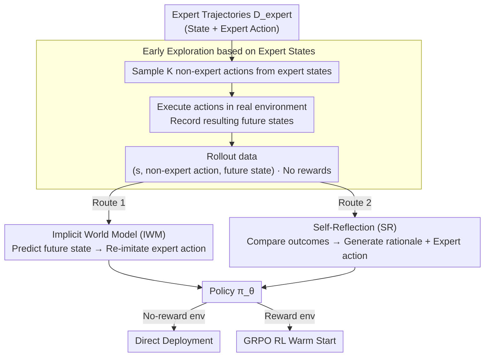

# Agent Learning via Early Experience

**Conference**: ICML2026  
**arXiv**: [2510.08558](https://arxiv.org/abs/2510.08558)  
**Code**: None  
**Area**: Reinforcement Learning / LLM Agent  
**Keywords**: Early Experience, Implicit World Model, Self-Reflection, Imitation Learning, Agent Reinforcement Learning  

## TL;DR
This paper proposes the "early experience" paradigm, which allows language agents to utilize the future states of their own actions to learn environment dynamics and decision-making reflections without external rewards. This approach consistently outperforms pure imitation learning across 8 agent environments and provides a superior initialization for subsequent GRPO reinforcement learning.

## Background & Motivation

**Background**: Current language agent training primarily follows two routes. One involves supervised fine-tuning (SFT) using expert trajectories, treating the agent as a behavior cloner from state to action. The other is reinforcement learning (RL), where agents optimize long-term returns via environment rewards. The former is simple and reward-independent, widely used in web navigation, tool use, and embodied text environments; the latter aligns better with the long-term goal of "learning from experience" but is far less mature in real agent scenarios compared to chess or Atari.

**Limitations of Prior Work**: Pure imitation learning only informs the model of what an expert did in a specific state but fails to convey "what happens if a mistake is made." Once deployed, if the model deviates from the expert trajectory, it enters new states not covered by training data, causing errors to accumulate over long trajectories. RL theoretically solves this, but real-world web, API, and multi-turn tool tasks often lack reliable rewards or suffer from sparse rewards and long trajectories, leading to poor training stability and high costs.

**Key Challenge**: Language agents need to learn from self-interaction, yet many environments currently provide no verifiable rewards. Consequently, there is a need for RL-style experience coverage without dependency on RL reward signals.

**Goal**: The authors aim to answer a pragmatic question: Can an agent transform its own action consequences into supervision signals in the absence of external rewards? If so, can these signals simultaneously improve task performance, out-of-distribution (OOD) generalization, and the upper bound of subsequent RL?

**Key Insight**: The paper observes that even without rewards, the future state obtained after executing an action contains information. For example, web errors, empty tool returns, or changes in page elements inform the agent about the consequences of its current action. By converting these consequences into training objectives, an intermediate training phase can be constructed between expert demonstration and full RL.

**Core Idea**: Utilize non-expert actions proposed by the agent and their corresponding future states to replace external rewards, transforming "what happens after an action" and "why the expert action is better" into two supervised learning tasks.

## Method

### Overall Architecture

The paper formalizes language agent decision-making as an MDP: the state $s$ consists of web content, tool outputs, or textual descriptions; the action $a$ involves clicks, tool calls, or text generation; and the policy $\pi_\theta$ outputs an action distribution based on the state. Traditional imitation learning (IL) uses only expert data $\mathcal{D}_{expert}=\{(s_i,a_i)\}$, optimizing $\mathcal{L}_{IL}=-\sum_i \log \pi_\theta(a_i\mid s_i)$.

Early experience adds a step: for each expert state $s_i$, the current model samples $K$ candidate actions $a_i^j$ different from the expert action and executes them to obtain subsequent future states $s_i^j$. This forms rollout data $\mathcal{D}_{rollout}=\{(s_i,a_i^j,s_i^j)\}$. This data requires no reward labels or action success; the key is that it originates from errors and branches the agent would likely explore.

The authors design two training methods around these future states. The first is the Implicit World Model (IWM): training the same LLM to predict the future state based on "current state + action," allowing policy parameters to internalize environment dynamics. The second is Self-Reflection (SR): comparing the future states of expert actions versus candidate actions to generate explanations of why the expert action was superior, using "explanation + expert action" as the supervision target. Neither is online RL; both convert reward-free interactions into offline token prediction tasks. The resulting policy can be directly deployed or used as a warm start for subsequent GRPO reinforcement learning.

### Key Designs

**1. Early Exploration based on Expert States: Replacing rewards with self-action consequences.** Full rollouts in real agent scenarios are costly and rewards are sparse. Pure random exploration is inefficient. This paper uses states $s_i$ from expert trajectories as anchors: it lets the model sample $K$ actions $a_i^j \ne a_{expert}$ and execute them, recording future states $s_i^j$. This covers local branches where the model is likely to deviate during deployment. Using expert states as anchors ensures exploration starts from meaningful deep states rather than irrelevant branches, exposing local errors to provide raw material for training.

**2. Implicit World Model (IWM): Injecting environment dynamics into policy parameters.** Traditional world models act as independent simulators for planning, requiring extra modules and causing inference overhead. IWM treats each triplet $(s_i, a_i^j, s_i^j)$ as a next-token prediction task: given the current state and action, the target is to predict the resulting textual state, with loss $\mathcal{L}_{IWM}=-\sum \log p_\theta(s_i^j\mid s_i,a_i^j)$. Training occurs in two stages: dynamics modeling followed by IL on expert actions. Since state and action prediction share parameters $\theta$, the policy internalizes environment dynamics (page changes, tool side effects, error messages) without inference overhead, increasing robustness to distribution shift.

**3. Self-Reflection (SR): Summarizing failure consequences into transferable rationales.** Preference learning (like DPO) treats non-expert actions as rejected responses without explaining *why* the feedback was poor. SR leverages the LLM's summarizing capability: for a state, it compares the expert's next state $s_{i+1}$ with an alternative state $s_i^j$ and prompts the model to generate reflection text $c_i^j$. The model is then trained with $\mathcal{L}_{SR}=-\sum \log p_\theta(c_i^j,a_i\mid s_i)$. Since rationales are grounded in real execution differences—"budget exceeded," "missing tool parameters," or "wrong page branch"—they form reusable decision principles more credible than hallucinated rationales.

### Loss & Training

Two recipes under the early experience paradigm are employed. IWM undergoes one round of future state prediction, followed by expert action supervision within the same total update budget as standard IL. SR is mixed with expert data, maintaining the same number of training epochs as IL. All environments use consistent prompt formats and decoding strategies. The authors first determine the optimal training steps for the IL baseline and then fix this budget for IWM and SR to ensure gains do not stem from additional optimization steps.

Models used include Llama-3.2-3B, Qwen-2.5-7B, and Llama-3.1-8B. Environments cover 8 task types including ALFWorld, ScienceWorld, TravelPlanner, BFCLv3, Tau-Bench, SearchQA, WebShop, and WebArena-Lite, involving both constrained action spaces and large structured tool spaces.

## Key Experimental Results

### Main Results

| Representative Env | Model | IL | Ours-IWM | Ours-SR | Main Conclusions |
| :--- | :--- | :--- | :--- | :--- | :--- |
| ALFWorld | Llama-3.2-3B | 78.1 | 83.6 (+5.5) | 85.9 (+7.8) | Both early experience methods improve success in embodied text tasks. |
| ScienceWorld | Llama-3.1-8B | 54.7 | 57.0 (+2.3) | 68.0 (+13.3) | SR is particularly effective for multi-step scientific reasoning. |
| TravelPlanner | Qwen-2.5-7B | 16.7 | 22.2 (+5.5) | 31.7 (+15.0) | Self-reflection significantly improves long-range constraint satisfaction. |
| BFCLv3 | Llama-3.2-3B | 21.3 | 25.3 (+4.0) | 29.3 (+8.0) | SR reduces logical and sequential errors in tool calling. |
| WebShop | Llama-3.1-8B | 47.3 | 58.6 (+11.3) | 58.2 (+10.9) | Future state prediction brings substantial gains in web shopping. |
| WebArena-Lite | Llama-3.1-8B | 4.9 | 8.5 (+3.6) | 8.5 (+3.6) | Improvements visible even on noisy web accessibility trees. |

### Ablation Study

| Analysis Item | Setting | Key Metrics | Explanation |
| :--- | :--- | :--- | :--- |
| OOD Generalization | ALFWorld / BFCLv3 / SearchQA OOD | IWM/SR both > IL, gains of 2-9 pts | Early experience covers states outside expert paths, reducing OOD performance drops. |
| RL Initialization | WebShop / ALFWorld / SearchQA + GRPO | Early-exp checkpoints have higher RL ceilings than IL checkpoints | Learning future states/reflections provides a superior starting point for reward optimization. |
| Human Data Volume | Varying ratios of demos in WebShop/ALFWorld | WebShop exceeds full IL with 1/8 demos; ALFWorld exceeds full IL with 1/2 demos | Action consequences provide information beyond expert data. |
| Branch Factor $K$ | Different sample counts per expert state | IWM improves steadily with $K$; SR peaks around $K=2$ to $4$ | IWM needs more dynamic coverage; SR is limited by context window and contrast quality. |

### Key Findings
- IWM is more suitable for environments with stable state transition rules and predictable future states (e.g., WebShop, ALFWorld), as it helps the model understand "where the action leads."
- SR thrives in scenarios where errors stem from reasoning, constraints, or tool choices (e.g., TravelPlanner, ScienceWorld), summarizing error branches into rationales.
- Early experience is not just an IL replacement but also an RL warm start; using the same GRPO recipe, performance starting from IWM/SR checkpoints consistently exceeds those starting from IL.
- Compared to Long CoT, STaR-style rationale, and DPO, early experience gains its advantage by grounding reflections/predictions in executed future states rather than model imagination or mere preference pairs.

## Highlights & Insights
- The core highlight is the reinterpretation of "no reward" as "still having state feedback." Many agent environments lack success labels, but web changes and tool errors are weak supervision signals for action quality.
- The IWM design is lightweight: it skips training an external simulator or doing planning-time predictions, treating future state prediction as a form of mid-training. This sacrifices explicit planning for engineering feasibility.
- SR is more credible than standard rationale distillation because explanations come from contrasting expert actions with model-proposed actions in the same state.
- The paper clearly positions early experience between IL and RL: in the short term, it reduces dependence on expert data; in the long term, it ensures RL begins with a policy that understands environment dynamics.

## Limitations & Future Work
- The approach still relies on expert trajectories as exploration anchors, meaning it is not entirely "from scratch." Research into initialization without any demonstrations is needed.
- Future states must be textualizable. For high-dimensional visual states or real-time interaction, simple text summaries may lose critical information.
- SR quality depends on the model's own capabilities; if the model cannot distinguish why an alternative action is worse, reflections may consolidate incorrect biases.
- Currently, IWM and SR are primarily offline phases. Future work could explore closed-loop systems with uncertainty estimation, reflection quality discriminators, and interleaved online RL.

## Related Work & Insights
- **vs. Pure Imitation Learning**: IL only learns state-to-action mapping; this work executes alternatives to learn consequences, mitigating distribution shift.
- **vs. Traditional World Models / Model-Based RL**: Instead of a separate dynamics model for planning, IWM merges state prediction into policy parameters as reward-free mid-training.
- **vs. Self-Reflection Prompting**: Previous reflection often happened at inference time using external rewards; this work moves reflection into training data grounded by real state differences.
- **vs. STaR / Rationale Distillation**: Unlike STaR, which synthesizes rationales for correct actions, SR explicitly compares expert and alternative states to reduce hollow explanations.
- **vs. DPO**: DPO uses coarse binary signals; this work shows IWM/SR are more robust and effective on complex tasks like WebShop.

## Rating
- Novelty: ⭐⭐⭐⭐☆ Clear paradigm for "future state as supervision," effectively combining world models and reflection.
- Experimental Thoroughness: ⭐⭐⭐⭐⭐ Comprehensive evidence across 8 environments, 3 model families, OOD tests, and RL integration.
- Writing Quality: ⭐⭐⭐⭐☆ Clear narrative; minor drawback is the heavy reliance on appendices for specific table details.
- Value: ⭐⭐⭐⭐⭐ Highly practical for current LLM Agent training, especially as an intermediate stage between SFT and RL. 

<!-- RELATED:START -->

## Related Papers

- [\[ICLR 2026\] ExGRPO: Learning to Reason from Experience](../../ICLR2026/reinforcement_learning/exgrpo_learning_to_reason_from_experience.md)
- [\[ICLR 2026\] Reliability-Adjusted Prioritized Experience Replay](../../ICLR2026/reinforcement_learning/reliability-adjusted_prioritized_experience_replay.md)
- [\[ICML 2026\] LLM-Guided Communication for Cooperative Multi-Agent Reinforcement Learning](llm-guided_communication_for_cooperative_multi-agent_reinforcement_learning.md)
- [\[ICML 2026\] Vulnerable Agent Identification in Large-Scale Multi-Agent Reinforcement Learning](vulnerable_agent_identification_in_large-scale_multi-agent_reinforcement_learnin.md)
- [\[ICML 2026\] Multi-Agent Reinforcement Learning from Delayed Marketplace Feedback for Objective-Weight Adaptation in Three-Sided Dispatch](multi-agent_reinforcement_learning_from_delayed_marketplace_feedback_for_objecti.md)

<!-- RELATED:END -->
