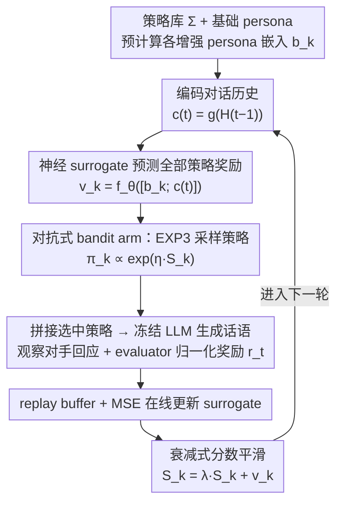

# ALSO: Adversarial Online Strategy Optimization for Social Agents

**Conference**: ICML 2026  
**arXiv**: [2605.15768](https://arxiv.org/abs/2605.15768)  
**Code**: https://github.com/Babylonehy/ALSO  
**Area**: Multi-Agent / Social Intelligence  
**Keywords**: LLM Social Intelligence, Multi-Agent Simulation, Online Strategy Optimization, Adversarial Multi-Armed Bandits, Sotopia  

## TL;DR
ALSO models the dynamic strategy selection in LLM social intelligence simulations as an adversarial online bandit. By using a lightweight neural reward surrogate to generalize sparse feedback from dialogue histories, it improves the overall score on Sotopia-Hard from 3.02 to 3.53, with particularly significant gains in the relationship dimension.

## Background & Motivation
**Background**: LLM social simulations typically define an agent's identity via a persona, including personality, profession, background, and goals. In multi-turn dialogues, models generate actions based on the persona and scenario. Benchmarks like Sotopia have advanced social intelligence from static Q&A to open-ended multi-turn interactions.

**Limitations of Prior Work**: Static personas do not equate to dynamic strategies. An agent can remain "the same person" while needing to switch strategies during negotiations, conflicts, or cooperation. Existing methods either train strategy models offline or use prompt optimizers to find instructions on fixed validation sets. These approaches assume a stable reward distribution, whereas opponents in social interactions co-evolve with the dialogue.

**Key Challenge**: Feedback in social scenarios is both sparse and non-stationary. A strategy effective in early rounds might fail in later rounds as the opponent changes their stance. Standard stochastic bandits or offline prompt optimization struggle to exploit feedback that drifts over time.

**Goal**: The authors aim to enable agents to select appropriate social strategies per dialogue turn based on historical states and continuously update from immediate evaluative feedback, without fine-tuning LLMs or using expensive external LLM optimizers.

**Key Insight**: This paper treats candidate social strategies as bandit arms, dialogue history as context, and normalized rewards from a per-turn LLM evaluator as online feedback. Given that opponents adapt, the authors adopt an adversarial bandit perspective rather than a stationary stochastic one.

**Core Idea**: An EXP3-style randomized policy selection ensures exploration robustness in non-stationary environments, while a neural surrogate predicts rewards across "historical context + strategy semantics" to mitigate the issue of sparse feedback failing to cover all strategies.

## Method
ALSO target is not the model parameters but the strategy instructions inserted after the persona in each turn. It decomposes the originally fixed persona prompt into two layers: the base identity remains constant, while the behavioral strategy is selected by an online learner. This ensures identity continuity while allowing action styles to adapt to the dialogue situation.

### Overall Architecture
In a two-agent social simulation, each agent possesses a base persona, private goals, and a set of candidate strategies $\Sigma=\{\sigma_1,\dots,\sigma_K\}$. At the start of each turn, ALSO encodes the current dialogue history and concatenates each candidate strategy with the base persona to form augmented personas, pre-calculating or reusing their embeddings. A neural value network predicts the current reward for each candidate strategy. A policy sampled from an EXP3-style exponential weight distribution selects a strategy, and the agent generates the next utterance using the "base persona + selected strategy."

Once the environment returns the opponent's response, an LLM evaluator provides turn-level multi-dimensional scores, which ALSO normalizes into a scalar reward. This sample is added to a replay buffer to update the surrogate via MSE, while cumulative scores for each strategy arm are updated using score smoothing with decay. The underlying LLM is fully frozen; online changes occur only in the strategy selector and the lightweight value network.

### Key Designs

**1. Strategy as Adversarial Bandit Arms (Exponential-Weights Selection)**: Rewards in social interactions drift based on opponent reactions and dialogue stages. Treating strategy selection as a stationary stochastic problem (via greedy selection or fixed validation set search) would be compromised by this non-stationarity. ALSO treats each strategy instruction in the space $\Sigma=\{\sigma_1,\dots,\sigma_K\}$ as an arm. Once selected, it is combined with the base persona $b^{(t)}=b^0\oplus\sigma_{k_t}$ and fed to the frozen LLM. Arms are sampled randomly each turn using an exponential weight distribution $\pi_k^{(t)}\propto\exp(\eta S_k^{(t-1)})$ rather than greedily. This EXP3-style randomization is crucial for adversarial settings—greedy strategies are easily exploited by opponents or overfit to transient states, whereas randomization maintains exploration robustness.

**2. History-Aware Neural Surrogate (Feedback Densification)**: A bandit only observes the reward for the selected strategy each turn. Since most of the 12 candidate strategies (and their semantic variations) might not be sampled in a single episode, updating arms based solely on cumulative rewards is inefficient. ALSO uses a frozen embedding model $g(\cdot)$ to encode both the dialogue history $\mathbf{c}^{(t)}=g(\mathcal{H}^{(t-1)})$ and pre-calculated augmented persona embeddings $\mathbf{b}_k$. These are concatenated into features $\mathbf{x}_k^{(t)}=[\mathbf{b}_k;\mathbf{c}^{(t)}]$, and a trainable value network $f_\theta$ predicts current rewards $\hat v_k^{(t)}=f_\theta(\mathbf{x}_k^{(t)})$ for all arms simultaneously. Because semantically similar strategies (e.g., "validate then pivot" and "collaborative negotiation") often perform similarly in the same context, the surrogate generalizes single-strategy feedback to semantically related strategies, providing dense score estimates for the exponential weight distribution. This is the most critical component in the ablation study; removing it drops the Overall score from 3.91 to 3.33.

**3. Decaying Score Smoothing (Tracking Non-Stationary Drifts)**: Classical EXP3 accumulates historical feedback with equal weight, but optimal social strategies often shift with dialogue stages. Excessive memory of early feedback can lead to strategy rigidity. ALSO applies an exponential decay factor $\lambda\in(0,1]$ (set to 0.9 in experiments) to cumulative scores, updated as $S_k^{(t)}=\lambda S_k^{(t-1)}+\hat v_k^{(t)}$. This ensures that recent evidence dominates while old feedback fades. Consequently, arm scores maintain historical experience while responding rapidly to changes in the opponent's stance, balancing between "rigidity from early feedback" and "high variance from recent feedback."

### Loss & Training
Ours does not fine-tune the LLM. The only trained component is the value network, which minimizes the MSE between predicted and evaluator rewards using samples from a replay buffer. The strategy selector is updated online using exponential weights and score smoothing. Experiments default to 12 pre-defined social strategies and a maximum of 20 turns per episode. In bilateral settings, each agent maintains an independent optimizer and updates based solely on its own feedback.

## Key Experimental Results

### Main Results
Main experiments are evaluated on Sotopia-All and the more challenging Sotopia-Hard. Agents utilize DeepSeek-V3.2 for interaction, and the final results are reported by an independent GPT-4o Sotopia-Eval. Ours requires no additional LLM optimizer calls, whereas OPRO and EvoPrompt periodically call optimizers to generate or mutate prompts.

| Benchmark | Method | Goal | Rel. | Know. | Overall |
|-----------|------|------|------|-------|---------|
| Sotopia-All | Vanilla | 8.21 | 2.54 | 5.28 | 3.62 |
| Sotopia-All | INSTINCT | 8.51 | 2.84 | 6.09 | 3.85 |
| Sotopia-All | ALSO | 8.50 | 2.90 | 6.14 | 3.89 |
| Sotopia-Hard | Vanilla | 6.52 | 1.32 | 4.37 | 3.02 |
| Sotopia-Hard | INSTINCT | 6.92 | 2.16 | 5.44 | 3.43 |
| Sotopia-Hard | ALSO | 7.11 | 2.43 | 5.47 | 3.53 |

### Ablation Study
Ablation of components was conducted on Sotopia-Hard by removing or replacing key parts of ALSO.

| Configuration | Goal | Rel. | Know. | Overall | Note |
|------|------|------|-------|---------|------|
| ALSO full | 7.93 | 3.07 | 6.46 | 3.91 | Full model |
| w/o EXP3, use $\varepsilon$-greedy | 7.50 | 2.71 | 5.32 | 3.61 | Randomized adversarial exploration weakened |
| w/o Score Smoothing | 7.57 | 2.25 | 5.39 | 3.57 | Relationship dimension drops most significantly |
| w/o Context Embedding | 7.43 | 2.64 | 4.82 | 3.51 | Unable to select strategies base on dialogue stage |
| w/o Neural Surrogate | 6.89 | 2.00 | 4.93 | 3.33 | Largest degradation in overall and relationship dimensions |

### Key Findings
- The largest Gain for ALSO on Sotopia-Hard comes from Relationship, increasing from 1.32 (Vanilla) to 2.43—a relative improvement of 83.79%. This suggests online strategy switching primarily mitigates conflicts and deadlocks.
- Removing the neural surrogate dropped the Overall score from 3.91 to 3.33, making it the most critical component. This demonstrates that simple bandit counting cannot fully exploit strategy semantics and dialogue history.
- Bilateral optimization outperforms unilateral optimization and is significant for both Qwen-2.5-72B-Instruct and DeepSeek-V3.2. This confirms that mutual adaptation is more consistent with social interaction mechanisms than unilateral strategy injection.
- In cross-scenario generalization experiments, zero-shot transfer improved the Overall score from 3.17 to 3.60 across 7 unseen Sotopia-Hard scenarios, indicating the surrogate learns more than just scenario memory.

## Highlights & Insights
- The paper clearly distinguishes between persona and strategy. Persona defines "who someone is," while strategy defines "how one acts." The key to social intelligence is often not changing identity, but adjusting interaction styles within the same identity.
- The adversarial bandit perspective is more suitable for social simulations than offline prompt optimizers. Rewards in Sotopia are not static scores on a fixed validation set but results of trajectories co-evolved by both parties.
- The lightweight surrogate is a highly cost-effective design. It avoids generating new prompts or modifying LLM parameters while allowing strategy selection to gain contextual generalization from sparse bandit feedback.

## Limitations & Future Work
- The strategy space is restricted to 12 pre-defined categories; its coverage and granularity may limit the performance ceiling. Real-world open social interactions might require automated expansion or hierarchical strategy libraries.
- The per-turn evaluator is itself an LLM; rewards may suffer from bias, scale drift, and self-consistency issues. Although the final judge is separate, online learning is still limited by the quality of the shaping reward.
- The paper primarily validates on two-agent Sotopia scenarios. Whether this applies to multi-party group interactions, long-term memory, and alliance formation has not been fully explored.
- ALSO utilizes adversarial bandits as a design rationale without providing strict regret guarantees. This is understandable in highly non-stationary LLM environments but leaves room for theoretical analysis.

## Related Work & Insights
- **vs Sotopia-RL / SDPO**: These methods improve social behavior through offline training or preference optimization at the cost of data collection and model updates. ALSO does not modify model parameters, making it better for rapid adaptation during deployment.
- **vs OPRO / EvoPrompt**: These treat prompt optimization as a search over static tasks. ALSO treats each turn's strategy selection as an online decision, responding to reward drifts during the dialogue process.
- **vs External planner methods**: Methods like Sotopia-Ω, DAT, and EPO rely on planners learned offline. ALSO adjusts strategies based on feedback directly during interaction, avoiding the need to retrain planners for every new strategy.
- **Insight**: For agent systems, many "capabilities gaps" may not be due to the base model's limitations but a lack of an online adjustable behavioral strategy layer. Decoupling the strategy layer from the persona is a practical direction for building controllable social intelligence agents.

## Rating
- Novelty: ⭐⭐⭐⭐☆ Grounding social strategy optimization in adversarial online bandits is highly relevant, though the core algorithmic components stem from existing online learning concepts.
- Experimental Thoroughness: ⭐⭐⭐⭐☆ Includes main results, ablation, bilateral/unilateral analysis, cross-scenario, and heterogeneous model analysis, though still focused on the Sotopia series.
- Writing Quality: ⭐⭐⭐⭐☆ Problem definitions and algorithm flows are clear; experimental explanations align well with social interaction mechanisms.
- Value: ⭐⭐⭐⭐☆ Highly valuable for online behavior control in multi-agent systems, particularly for applications where fine-tuning is undesired.

<!-- RELATED:START -->

## Related Papers

- [\[ACL 2026\] Breaking the Impasse: Dual-Scale Evolutionary Policy Training for Social Language Agents](../../ACL2026/reinforcement_learning/breaking_the_impasse_dual-scale_evolutionary_policy_training_for_social_language.md)
- [\[CVPR 2026\] Adversarial Agents: Black-Box Evasion Attacks with Reinforcement Learning](../../CVPR2026/reinforcement_learning/adversarial_agents_black-box_evasion_attacks_with_reinforcement_learning.md)
- [\[ACL 2026\] DPEPO: Diverse Parallel Exploration Policy Optimization for LLM-based Agents](../../ACL2026/reinforcement_learning/dpepo_diverse_parallel_exploration_policy_optimization_for_llm-based_agents.md)
- [\[NeurIPS 2025\] Online Optimization for Offline Safe Reinforcement Learning](../../NeurIPS2025/reinforcement_learning/online_optimization_for_offline_safe_reinforcement_learning.md)
- [\[ICML 2026\] Interaction-Breaking Adversarial Learning Framework for Robust Multi-Agent Reinforcement Learning](interaction-breaking_adversarial_learning_framework_for_robust_multi-agent_reinf.md)

<!-- RELATED:END -->
