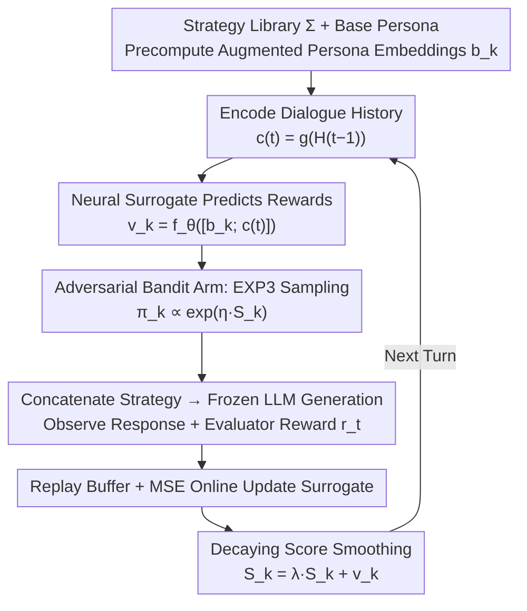

# ALSO: Adversarial Online Strategy Optimization for Social Agents

**Conference**: ICML 2026  
**arXiv**: [2605.15768](https://arxiv.org/abs/2605.15768)  
**Code**: https://github.com/Babylonehy/ALSO  
**Area**: Multi-Agent / Social Intelligence  
**Keywords**: LLM Social Intelligence, Multi-Agent Simulation, Online Strategy Optimization, Adversarial Multi-Armed Bandit, Sotopia  

## TL;DR
ALSO models dynamic strategy selection in LLM social intelligence simulations as an adversarial online bandit. It utilizes a lightweight reward surrogate model to generalize sparse feedback from dialogue history, improving the overall score on Sotopia-Hard from 3.02 to 3.53, with significant gains in the relationship dimension.

## Background & Motivation
**Background**: LLM social simulations typically use personas to describe an agent’s identity, including personality, occupation, background, and goals. In multi-turn dialogues, the model generates actions based on the persona and scenario. Benchmarks like Sotopia have advanced social intelligence from static Q&A to open-ended multi-turn interactions.

**Limitations of Prior Work**: Static personas do not equate to dynamic strategies. An agent can "be the same person" while needing to switch strategies during negotiations, conflicts, or cooperation. Existing methods either train strategy models offline or use prompt optimizers to find instructions on fixed validation sets; these methods assume a stable reward distribution, whereas opponents in social interactions co-evolve with the dialogue.

**Key Challenge**: Feedback in social scenarios is both sparse and non-stationary. A strategy effective in early turns may fail later because the opponent changes their stance. Standard stochastic bandits or offline prompt optimization struggle with such feedback drift over time.

**Goal**: The authors aim to enable agents to select appropriate social strategies based on historical states in each dialogue turn and continuously update from immediate evaluative feedback, without fine-tuning LLMs or calling expensive LLM-based optimizers.

**Key Insight**: The paper treats candidate social strategies as bandit arms, dialogue history as context, and normalized rewards from a per-turn LLM evaluator as online feedback. Given that opponents adapt, the authors adopt an adversarial bandit perspective rather than a stationary stochastic one.

**Core Idea**: An EXP3-style randomized strategy selection is used to ensure exploration robustness in non-stationary environments, while a neural surrogate predicts rewards based on "historical context + strategy semantics" to mitigate the issue of sparse feedback not covering all strategies.

## Method
ALSO targets strategy instructions inserted after the persona rather than model parameters. It decomposes the fixed persona prompt into two layers: the base identity remains unchanged, while behavioral strategies are selected by an online learner. This ensures identity continuity while allowing behavioral flexibility based on the dialogue situation.

### Overall Architecture
In a two-agent social simulation, each agent possesses a base persona, private goals, and a candidate strategy set $\Sigma=\{\sigma_1,\dots,\sigma_K\}$. At the start of each turn, ALSO encodes the current dialogue history and concatenates each candidate strategy with the base persona to form an augmented persona, pre-computing or reusing their embeddings. A neural value network predicts the current reward for each candidate strategy, and an EXP3-style exponential weight distribution samples a strategy. The agent then generates the next utterance using the "base persona + selected strategy."

After the environment returns the opponent's response, an LLM evaluator provides a turn-level multi-dimensional score, which ALSO normalizes into a scalar reward. This sample is added to a replay buffer to update the surrogate via MSE, while the cumulative score of each strategy arm is updated using score smoothing with decay. The underlying LLM remains completely frozen; online changes occur only in the strategy selector and the lightweight value network.

### Key Designs

**1. Strategy as Adversarial Bandit Arm (Exponential-Weights Selection)**: Rewards in social interactions drift with opponent reactions and dialogue phases. Treating strategy selection as a stationary stochastic problem (greedy or fixed-set search) would be counterproductive. ALSO treats each strategy instruction in the space $\Sigma=\{\sigma_1,\dots,\sigma_K\}$ as an arm. Once selected, it is combined with the base persona $b^{(t)}=b^0\oplus\sigma_{k_t}$ and fed into the frozen LLM. Each turn, an arm is randomly sampled according to the exponential weight distribution $\pi_k^{(t)}\propto\exp(\eta S_k^{(t-1)})$ rather than greedily taking the highest score. This EXP3-style randomization is crucial for the adversarial setting—greedy strategies are easily exploited by opponents or overfit to fleeting situations, whereas randomization maintains exploration robustness.

**2. History-Aware Neural Surrogate (Densitizing Sparse Feedback)**: A bandit only observes the reward for the selected strategy each turn. Since most of the 12 candidate strategies (and their paraphrases) might not be sampled in a single episode, accumulating rewards per arm is inefficient. ALSO uses a frozen embedding model $g(\cdot)$ to encode both dialogue history $\mathbf{c}^{(t)}=g(\mathcal{H}^{(t-1)})$ and pre-computed augmented persona embeddings $\mathbf{b}_k$ into features $\mathbf{x}_k^{(t)}=[\mathbf{b}_k;\mathbf{c}^{(t)}]$. A trainable value network $f_\theta$ then predicts current rewards for all arms simultaneously $\hat v_k^{(t)}=f_\theta(\mathbf{x}_k^{(t)})$. Because semantically similar strategies often perform similarly in similar contexts, the surrogate generalizes a single feedback point to semantically neighboring strategies, providing dense score estimates for the exponential weight distribution. This is the most critical component in the ablation study, with Overall scores dropping from 3.91 to 3.33 when removed.

**3. Decaying Score Smoothing (Tracking Non-Stationary Drift)**: Classic EXP3 accumulates historical feedback with equal weight. However, optimal strategies in social dialogues often switch between phases; over-relying on early feedback can lead to strategy rigidity. ALSO applies an exponential decay factor $\lambda\in(0,1]$ (set to 0.9 in experiments) to cumulative scores, updated as $S_k^{(t)}=\lambda S_k^{(t-1)}+\hat v_k^{(t)}$. This ensures that recent evidence dominates while old feedback fades out, allowing arm scores to retain historical experience while responding quickly to changes in the opponent's stance.

### Loss & Training
ALSO does not fine-tune the LLM. Only the value network is trained by minimizing the MSE between predicted rewards and evaluator rewards using samples from the replay buffer. The strategy selector is updated online using exponential weights and score smoothing. Experiments default to 12 pre-defined social strategies with a maximum of 20 turns per episode. In bi-lateral settings, each agent maintains an independent optimizer and updates based solely on its own feedback.

## Key Experimental Results

### Main Results
Evaluation was conducted on Sotopia-All and the more challenging Sotopia-Hard. Agents interacted using DeepSeek-V3.2, and final scores were reported by an independent GPT-4o Sotopia-Eval. ALSO requires no additional LLM optimizer calls, unlike OPRO and EvoPrompt which periodically call optimizers for prompt generation or mutation.

| Benchmark | Method | Goal | Rel. | Know. | Overall |
|-----------|------|------|------|-------|---------|
| Sotopia-All | Vanilla | 8.21 | 2.54 | 5.28 | 3.62 |
| Sotopia-All | INSTINCT | 8.51 | 2.84 | 6.09 | 3.85 |
| Sotopia-All | ALSO | 8.50 | 2.90 | 6.14 | 3.89 |
| Sotopia-Hard | Vanilla | 6.52 | 1.32 | 4.37 | 3.02 |
| Sotopia-Hard | INSTINCT | 6.92 | 2.16 | 5.44 | 3.43 |
| Sotopia-Hard | ALSO | 7.11 | 2.43 | 5.47 | 3.53 |

### Ablation Study
Ablations on Sotopia-Hard removed or replaced key components of ALSO.

| Configuration | Goal | Rel. | Know. | Overall | Description |
|------|------|------|-------|---------|------|
| ALSO full | 7.93 | 3.07 | 6.46 | 3.91 | Full model |
| w/o EXP3 ($\varepsilon$-greedy) | 7.50 | 2.71 | 5.32 | 3.61 | Weakened adversarial exploration |
| w/o Score Smoothing | 7.57 | 2.25 | 5.39 | 3.57 | Most impact on Relationship |
| w/o Context Embedding | 7.43 | 2.64 | 4.82 | 3.51 | Cannot select by dialogue stage |
| w/o Neural Surrogate | 6.89 | 2.00 | 4.93 | 3.33 | Largest degradation overall |

### Key Findings
- The largest gain on Sotopia-Hard comes from the **Relationship** dimension, increasing from 1.32 (Vanilla) to 2.43, an 83.79% relative improvement. This suggesting online strategy switching effectively mitigates conflicts and deadlocks.
- Removing the neural surrogate dropped the Overall score from 3.91 to 3.33, identifying it as the most critical component. Bandit counts alone cannot fully leverage strategy semantics and dialogue history.
- Bi-lateral optimization outperforms unilateral optimization across both Qwen-2.5-72B-Instruct and DeepSeek-V3.2, indicating that mutual adaptation is more consistent with social interaction mechanisms.
- Zero-shot transfer experiments on 7 unseen Sotopia-Hard scenarios improved the Overall score from 3.17 to 3.60, demonstrating that the surrogate learns generalizable patterns rather than just scenario memory.

## Highlights & Insights
- The paper distinguishes between **persona** ("who one is") and **strategy** ("how one acts"). Social intelligence often depends on adjusting interaction methods under the same identity rather than changing identities.
- The adversarial bandit perspective is more suitable for social simulation than offline prompt optimization. Rewards in Sotopia are co-evolved trajectories rather than static scores on a fixed validation set.
- The lightweight surrogate is a highly cost-effective design. It generalizes sparse bandit feedback through context without generating new prompts or modifying LLM parameters.

## Limitations & Future Work
- The strategy space is pre-defined with 12 categories, which may limit the upper bound; open social interaction might require automatic expansion or hierarchical strategy libraries.
- The per-turn evaluator is itself an LLM, potentially introducing bias, scale drift, and consistency issues. While the final judge is separate, online learning is limited by the quality of the shaping rewards.
- The focus is primarily on two-agent Sotopia; applicability to multi-party group interactions, long-term memory, and alliance formation remains to be fully explored.
- The use of adversarial bandits is motivated as a design choice without providing strict regret guarantees, which is understandable in non-stationary LLM environments but leaves room for theoretical analysis.

## Related Work & Insights
- **vs Sotopia-RL / SDPO**: These methods improve social behavior through offline training or preference optimization at the cost of data collection and model updates. ALSO adapts during deployment without changing model parameters.
- **vs OPRO / EvoPrompt**: These treat prompt optimization as a search on static tasks. ALSO treats per-turn strategy selection as an online decision-making process responsive to reward drift.
- **vs External Planner Methods**: Methods like Sotopia-Ω or DAT rely on offline-learned planners. ALSO adjusts strategies based on feedback during interaction, avoiding retraining planners for new strategies.
- **Insight**: Many "deficiencies" in agent systems may not stem from the base model's capabilities but from the lack of an online-adjustable behavioral strategy layer. Decoupling the strategy layer from the persona is a practical direction for building controllable social agents.

## Rating
- **Novelty**: ⭐⭐⭐⭐☆ Framing social strategy optimization specifically as an adversarial online bandit is highly relevant, though the core algorithmic components draw on existing online learning concepts.
- **Experimental Thoroughness**: ⭐⭐⭐⭐☆ Includes main results, ablations, bi-lateral analysis, and cross-scenario/model tests, though limited to the Sotopia ecosystem.
- **Writing Quality**: ⭐⭐⭐⭐☆ Problem definition and algorithm flow are clear; experimental interpretations align with social interaction mechanisms.
- **Value**: ⭐⭐⭐⭐☆ Highly valuable for online behavior control of multi-agent systems, especially for applications where fine-tuning is not feasible.

<!-- RELATED:START -->

## Related Papers

- [\[ACL 2026\] Breaking the Impasse: Dual-Scale Evolutionary Policy Training for Social Language Agents](../../ACL2026/reinforcement_learning/breaking_the_impasse_dual-scale_evolutionary_policy_training_for_social_language.md)
- [\[ACL 2026\] DPEPO: Diverse Parallel Exploration Policy Optimization for LLM-based Agents](../../ACL2026/reinforcement_learning/dpepo_diverse_parallel_exploration_policy_optimization_for_llm-based_agents.md)
- [\[ICML 2026\] Interaction-Breaking Adversarial Learning Framework for Robust Multi-Agent Reinforcement Learning](interaction-breaking_adversarial_learning_framework_for_robust_multi-agent_reinf.md)
- [\[NeurIPS 2025\] Online Optimization for Offline Safe Reinforcement Learning](../../NeurIPS2025/reinforcement_learning/online_optimization_for_offline_safe_reinforcement_learning.md)
- [\[ICML 2026\] Data- and Variance-dependent Regret Bounds for Online Tabular MDPs](data-_and_variance-dependent_regret_bounds_for_online_tabular_mdps.md)

<!-- RELATED:END -->
