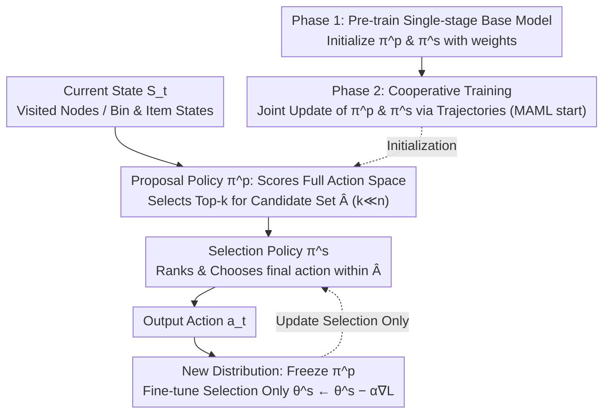

# ASAP: Exploiting the Satisficing Generalization Edge in Neural Combinatorial Optimization

**Conference**: ICML2026  
**arXiv**: [2501.17377](https://arxiv.org/abs/2501.17377)  
**Code**: Undisclosed; the paper states the implementation is included in the supplementary materials  
**Area**: Combinatorial Optimization / Neural Optimization  
**Keywords**: Neural Combinatorial Optimization, Out-of-Distribution Generalization, Online Adaptation, Two-stage Decision Making, Meta-learning  

## TL;DR
ASAP identifies that "identifying a set of promising actions" generalizes across distributions more easily than "directly selecting the single optimal action" in neural combinatorial optimization. It utilizes a two-stage proposal-selection strategy and MAML initialization to make neural solvers for 3D-BPP, TSP, and CVRP more stable and faster to adapt when distributions shift.

## Background & Motivation
**Background**: 3D Bin Packing (3D-BPP), Traveling Salesman Problem (TSP), and Capacitated Vehicle Routing Problem (CVRP) in combinatorial optimization are typical NP-hard problems. Traditional exact solvers provide optimal solutions at a high cost, and hand-crafted heuristics are fast but have limited transferability. Recent neural combinatorial optimization (NCO) models the solving process as sequential decision-making, using DRL policies to construct solutions step-by-step.

**Limitations of Prior Work**: These neural policies typically perform well on training distributions, but once the node distribution, item sizes, problem scales, or business patterns of test instances change, the policies tend to degrade. Real-world logistics and scheduling scenarios often operate within dynamic distributions, making fixed-distribution "direct-action" policies unreliable.

**Key Challenge**: The authors' key observation is that a policy might not stably judge "which single action is best" in OOD scenarios, yet it can still reliably include the optimal action within a top-k candidate set. In other words, coarse-grained satisficing judgment is more transferable than precise ranking; generalization capability and final selection capability should not be handled simultaneously by the same single-stage policy.

**Goal**: This paper aims to decouple candidate generation from final selection, allowing the model to first generate a small, high-quality set of actions and then use another rapidly adjustable policy to select the final action within that set. This retains the speed of neural solvers while ensuring online adaptation occurs only within a smaller action space.

**Key Insight**: The authors first performed an empirical analysis using MCTS to approximate the optimal policy. They found that for 3D-BPP across distributions, the top-k sets of vanilla DRL policies still have a high probability of containing actions selected by MCTS, although the specific top-1 rankings are misaligned. This phenomenon directly supports the structural design of "retaining candidates and re-learning selection."

**Core Idea**: Use a stable proposal policy to retain candidate actions across distributions and a lightweight selection policy for ranking within local distributions, while rapidly fine-tuning only the selection policy on new distributions.

## Method
The core of ASAP is not replacing a specific solver but adding a two-stage decision-making outer shell to existing DRL neural combinatorial optimization policies. It can be applied to PCT for 3D-BPP, or POMO and INViT for TSP/CVRP. Whereas the original policy sampled an action from the full action space in one step, ASAP first generates a candidate set via a proposal policy and then makes the final choice via a selection policy.

### Overall Architecture
Input consists of the current combinatorial optimization state, such as visited nodes, current position, and remaining capacity in TSP/CVRP, or container state, current item, and feasible placement positions in 3D-BPP. The output remains an action, such as the next node to visit or the placement scheme for the current item.

The entire process is divided into three phases. First, the proposal policy scores the full action space based on the current state to obtain a candidate set via top-k selection or sampling. Second, the selection policy receives only this candidate set and samples the final action within it. Third, when deployed to a new distribution, the proposal policy is fixed, and the selection policy undergoes limited online updates using the original DRL baseline loss.

This decoupling exploits what the authors call the Satisficing Generalization Edge: whether the candidate set covers good actions is a relatively stable cross-distribution capability, whereas precise ranking among candidates is a capability more dependent on the test distribution. ASAP thus assigns the former to a frozen proposal and the latter to an adaptable selection.

### Key Designs
**1. Satisficing Generalization Edge and Two-stage Decision: Shifting from "selecting the unique optimum" to "including a set of good actions first"**

The core observation is: under OOD conditions, a policy may not stably judge "which action is best," but it can still include the optimal action in the top-k candidate set—coarse-grained satisficing judgment is more transferable than precise ranking. MCTS experiments confirm this: in cross-distribution 3D-BPP, the top-k set of a standard DRL policy still has a high probability of containing the optimal action, even if the top-1 ranking is incorrect. ASAP splits the decision into two steps: a proposal policy generates a candidate set $\hat A$ of size $k \ll n$, and a selection policy chooses the final action within $\hat A$. Theoretical analysis (Theorem 4.2/4.3) shows that as long as the original policy's probability for the optimal action exceeds a random threshold, the two-stage selection probability out-performs the single-stage one, and proposal inclusion is more robust to probability perturbations. The essence of this split is that generalization and final selection should not be constrained to a single policy; retaining candidates reduces the risk of overall failure caused by top-1 ranking errors.

**2. Proposal / Selection Decoupled Architecture: Separating high-quality candidate coverage and fine-grained discrimination**

Once "coverage" and "ranking" are decoupled, they must be structurally separated. The proposal policy scores the full action space to output the candidate set, while the selection policy models the conditional distribution $\pi^s(a \mid s, \hat A)$—filtering feasible placements in 3D-BPP or selecting next nodes in routing problems. The benefit of decoupling is most apparent during deployment: if all parameters are adapted, the small-sample interaction of a new distribution can easily cause overfitting or destroy existing generalization; by freezing the proposal, online learning only handles the internal ranking of candidates, significantly reducing sample requirements. Ablations show "Tune All" (updating all parameters) performs worse than updating only the selection (73.7 vs 74.2), validating the necessity of freezing the proposal.

**3. Two-stage Training and MAML Initialization: Providing a stable starting point and building "gradient-step improvement" into the initialization**

If both policies start from random initialization, they hinder each other—missing good actions in the early proposal phase cannot be fixed by the selection, and chaotic selection feedback prevents the proposal from learning reliable candidates. ASAP thus utilizes Phase 1 to train a standard single-stage base model and uses its parameters to initialize both policies, followed by Phase 2 cooperative training to provide a stable starting point. Furthermore, the authors treat different input distributions as meta-learning tasks, using MAML to train an initialization that improves with just a few gradient steps when encountering new distributions. Within each meta-iteration, an inner-loop update is performed on a small batch of instances from a specific distribution, followed by a global initialization update. This results in an initialization that is not just strong on training distributions but naturally easy to improve with minimal interaction. However, ablations show MAML is not the only source of gain—the proposal-selection split itself (w/o MAML 73.5) already outperforms MAML-only (72.0), with the best results coming from the combination.

### Loss & Training
ASAP does not reinvent losses for each task; it inherits the DRL training objectives of the baseline models. Whether PCT, POMO, or INViT used specific trajectory return training, ASAP reuses those losses within the proposal-selection structure.

Training consists of pre-training, cooperative tuning, and test-time adaptation. In the pre-training phase, a standard single-stage policy is learned. In the cooperative tuning phase, the proposal generates candidates and the selection produces actions; both are updated together based on trajectory rewards. When encountering a new distribution at test time, only the selection parameters $\theta^s \leftarrow \theta^s - \alpha \nabla L_{adapt}$ are updated, while proposal parameters remain fixed.

The MAML version treats each instance distribution as a task. In each meta-iteration, the model performs an inner-loop update on a small batch of instances from one distribution before updating the global initialization via trajectories collected by the updated policy.

## Key Experimental Results

### Main Results
The paper evaluates on two categories of tasks: online 3D-BPP using space utilization (Uti), and TSP/CVRP using the optimality gap relative to exact or strong heuristic solutions. Models are trained only on small-scale, uniform distributions and evaluated on zero-shot generalization and online adaptation under varying distributions and scales.

| Task / Scenario | Baseline | ASAP Version | Key Results | Note |
|:---|:---|:---|:---|:---|
| 3D-BPP ID-Large Discrete | PCT 70.0% -> 70.2% | PCT+ASAP+MAML 73.5% -> 74.2% | Significantly higher utilization | ASAP improves to 74.2% after online adaptation |
| 3D-BPP ID-Small Discrete | GOPT 84.5% -> 84.7% | PCT+ASAP+MAML 86.5% -> 87.4% | Outperforms strong baseline | The split is effective even on small items |
| 3D-BPP OOD-Small Discrete | PCT approx. 79.5% | PCT+ASAP w/o MAML 81.8% | Gains maintained OOD | Advantage persists in out-of-distribution scenarios |
| Clustered TSP-1000 | POMO 57.25% -> 68.23% | POMO+ASAP w/o MAML 47.88% -> 40.01% | Adaptation shifts from degradation to improvement | Vanilla POMO online updates worsen gap by -10.98 pts |
| Clustered TSP-1000 | INViT-1V 14.30% -> 14.43% | INViT+ASAP w/o MAML 11.01% -> 8.12% | More stable large-scale generalization | ASAP increases adaptation gain to 2.89 pts |
| Implosion CVRP-500 | INViT-1V 13.32% -> 13.33% | INViT+ASAP w/o MAML 12.08% -> 9.51% | Notable selection adaptation effect | Baseline plateaus, whereas ASAP improves 2.57 pts |

### Ablation Study

| Configuration | Key Metrics | Note |
|:---|:---|:---|
| PCT baseline | ID-Large Discrete 70.0% -> 70.2% | Single-stage policy has minimal adaptation gain |
| PCT+MAML | ID-Large Discrete 71.7% -> 72.0% | Meta-learning initialization helps, but isn't the sole source |
| PCT+ASAP w/o MAML | ID-Large Discrete 72.9% -> 73.5% | Proposal-selection split alone outperforms MAML-only |
| PCT+ASAP w/ MAML | ID-Large Discrete 73.5% -> 74.2% | Best effect comes from stacking structure and meta-learning |
| ASAP w/ MAML Tune All | ID-Large Discrete 73.5% -> 73.7% | Full-parameter update is weaker than selection-only, proving proposal freezing is necessary |
| k=1 | OOD-Small Discrete +0.9% | Smallest candidate set resembles single-stage, limiting gains |
| k=3 / k=5 | OOD-Small Discrete +2.2% / +2.3% | Small candidate sets already capture most good actions |
| k=10 | OOD-Small Discrete +1.4% | Larger candidate sets show unstable gains, indicating a need for controlled scale |

### Key Findings
- The most crucial finding is that the proposal set is more cross-distribution stable than the top-1 action. MCTS-approximated optimal actions frequently fall into the top-k candidates of standard policies, even when precise top-1 ranking fails.
- ASAP's gains do not come solely from MAML. While MAML-only improves initialization, the structural gains from proposal-selection candidate filtering and local adaptation are more significant.
- Updating only the selection policy is generally superior to full-parameter updates. Full fine-tuning risks destroying existing generalization capabilities in the proposal, especially with limited online samples.
- Computational overhead is relatively low. In 3D-BPP, ASAP's inference time is only about 0.1 minutes more than PCT; in routing tasks, training for POMO+ASAP on CVRP-50 increased from 6h55m to 7h7m, representing a minor cost.
- There is a "sweet spot" for candidate set size. $k=3$ to $k=5$ are very strong on 3D-BPP OOD-Small; excessively large $k$ values make the selection problem difficult again and weaken the advantage of a reduced action space.

## Highlights & Insights
- The most elegant aspect of this paper is splitting the NCO generalization problem into "coverage capability" and "ranking capability." Many OOD failures occur not because the model is clueless, but because it cannot provide correct local rankings among similar candidates.
- ASAP's adaptation strategy is restrained: freeze proposal, tune selection. This is more aligned with structural assumptions than common test-time fine-tuning and explains why online updates aren't easily led astray.
- The framework is baseline-friendly. It is not designed for a specific architecture but can be integrated into various models like PCT, POMO, and INViT, suggesting "propose-then-select" is a reusable decision paradigm.
- Theory and empirics support each other. Theorem 4.2 provides conditions for two-stage superiority, Theorem 4.3 explains robustness to probability perturbations, and MCTS experiments ground these abstractions in concrete 3D-BPP action distributions.

## Limitations & Future Work
- ASAP depends on the proposal policy not missing truly critical actions. If the distribution shift is extreme, the top-k coverage might drop, leaving the selection policy unable to recover the filtered actions.
- The candidate set size $k$ remains a key hyperparameter. While sensitivity analysis was provided, the optimal $k$ for different problems, scales, and action spaces might require tuning.
- Online adaptation requires interacting with the environment and calculating gradients, which might incur latency or safety costs in certain real-time systems. However, the demonstrated overhead is small.
- Experiments focused on 3D-BPP, TSP, and CVRP constructive problems. Future work could examine applicability to general combinatorial searches like MILP variable selection, scheduling, or graph matching.
- Theoretical analysis used simplifying assumptions for tractability, such as the worst-case scenario for shared base probabilities. There is room for theory that closer mirrors actual cooperative training dynamics.

## Related Work & Insights
- **vs POMO / AM variants**: These methods construct solutions directly in the full action space; ASAP wraps them as candidate generators and selectors. The advantage is not placing all generalization pressure on a single top-1 decision during OOD.
- **vs Generalization Architectures (INViT / LEHD)**: These works improve generalization via encoder/decoder structures; ASAP is a decision-process modification that can be stacked on top of them.
- **vs Meta-learning Adaptation (MAML / Omni-TSP)**: Meta-learning focuses on good initialization; ASAP further specifies which parameters to update online. Results show an "adaptable structure" is more robust than "full-model initialization."
- **vs Learning-to-prune / Predict-and-search**: These typically serve traditional solvers; ASAP integrates pruning-like filtering directly into the neural DRL decision loop.
- **Insight**: In many AI decision tasks, one can train a cross-domain stable candidate generator and leave distribution-specific selection logic to a lightweight adaptation module. This is transferable to recommendation, tool-calling, and agent action selection.

## Rating
- Novelty: ⭐⭐⭐⭐☆ The two-stage proposal-selection isn't a brand-new paradigm, but explaining NCO OOD failure via the satisficing generalization edge is insightful.
- Experimental Thoroughness: ⭐⭐⭐⭐⭐ Covers 3D-BPP, TSP, CVRP, multiple distributions, scales, ablations, sensitivity, and overhead with a complete chain of evidence.
- Writing Quality: ⭐⭐⭐⭐☆ Clear logic, good coordination between theory and experiments, though there are many tables and some symbols are crowded.
- Value: ⭐⭐⭐⭐⭐ Highly valuable for practical NCO deployment, especially in logistics and routing where distributions change and retraining from scratch is unfeasible.

<!-- RELATED:START -->

## Related Papers

- [\[NeurIPS 2025\] Complexity Scaling Laws for Neural Models using Combinatorial Optimization](../../NeurIPS2025/reinforcement_learning/complexity_scaling_laws_for_neural_models_using_combinatorial_optimization.md)
- [\[ICML 2025\] Preference Optimization for Combinatorial Optimization Problems](../../ICML2025/reinforcement_learning/preference_optimization_for_combinatorial_optimization_problems.md)
- [\[ICML 2026\] Learning to Search and Searching to Learn for Generalization in Planning](learning_to_search_and_searching_to_learn_for_generalization_in_planning.md)
- [\[ICML 2026\] Learning to Approximate Uniform Facility Location via Graph Neural Networks](learning_to_approximate_uniform_facility_location_via_graph_neural_networks.md)
- [\[ICML 2026\] Bilevel Optimization over Saddle Points of Zero-Sum Markov Games](bilevel_optimization_over_saddle_points_of_zero-sum_markov_games.md)

<!-- RELATED:END -->
