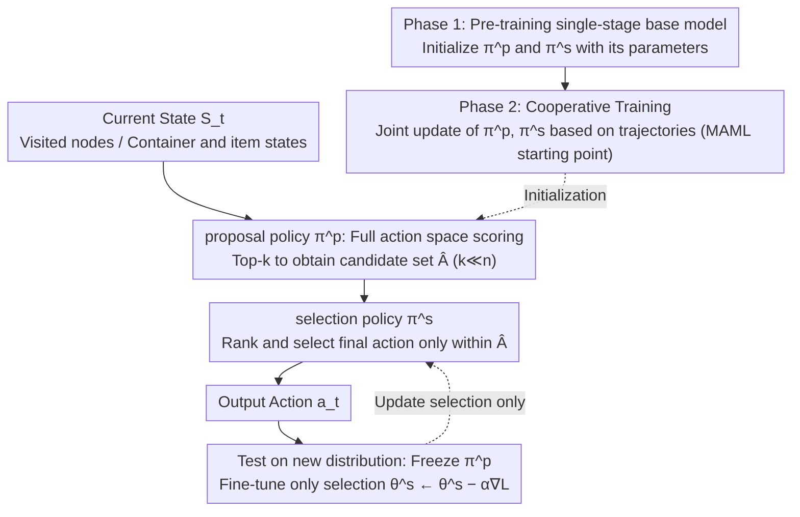

# ASAP: Exploiting the Satisficing Generalization Edge in Neural Combinatorial Optimization

**Conference**: ICML2026  
**arXiv**: [2501.17377](https://arxiv.org/abs/2501.17377)  
**Code**: Not public; the paper states the implementation is included in the supplementary materials  
**Area**: Combinatorial Optimization / Neural Optimization  
**Keywords**: Neural Combinatorial Optimization, Out-of-Distribution Generalization, Online Adaptation, Two-stage Decision Making, Meta-learning  

## TL;DR
ASAP identifies that "identifying a set of promising actions" generalizes across distributions more effectively than "directly selecting the unique optimal action" in neural combinatorial optimization. By utilizing a proposal-selection two-stage strategy and MAML initialization, it enables neural solvers for 3D-BPP, TSP, and CVRP to achieve more stable and faster adaptation under distribution shifts.

## Background & Motivation
**Background**: 3D Bin Packing (3D-BPP), Traveling Salesman Problem (TSP), and Capacitated Vehicle Routing Problem (CVRP) are representative NP-hard problems in combinatorial optimization. Traditional exact solvers provide optimal solutions at high computational costs, while handcrafted heuristics are fast but have limited transferability. Recent neural combinatorial optimization models the solving process as sequential decision-making, using DRL policies to construct solutions step-by-step.

**Limitations of Prior Work**: These neural policies typically perform well on the training distribution, but tend to degrade once test instance node distributions, item sizes, problem scales, or business patterns change. Real-world logistics and scheduling scenarios frequently involve dynamic distributions, making policies trained only on fixed distributions unreliable for direct action selection.

**Key Challenge**: The authors' key observation is that while a policy might not stably determine "which single action is best" in OOD scenarios, it remains capable of placing the optimal action within a top-k candidate set. That is, coarse-grained satisficing judgments are more transferable than precise ranking, and generalization ability should not be burdened by the same single-stage policy responsible for final selection.

**Goal**: This paper aims to decouple candidate generation from final selection, allowing the model to first generate a small, high-quality set of actions, and then use another rapidly adjustable policy to select the final action within that set. This preserves the speed of neural solvers while restricting online adaptation to a much smaller action space.

**Key Insight**: The authors first perform empirical analysis using MCTS to approximate the optimal policy. They find that top-k sets of standard DRL policies still have a high probability of containing the actions selected by MCTS in cross-distribution 3D-BPP, even if the specific top-1 rankings are displaced. This phenomenon directly supports the structural design of "preserving candidates and re-learning selection."

**Core Idea**: Use a stable proposal policy to maintain candidate actions across distributions, and a lightweight selection policy for local ranking within a distribution, fine-tuning only the selection policy rapidly on new distributions.

## Method
The core of ASAP is not to replace a specific solver but to provide a two-stage decision shell for existing DRL neural combinatorial optimization policies. It can be applied to PCT for 3D-BPP, or POMO and INViT for TSP/CVRP. Instead of sampling an action directly from the full action space, the proposal policy first generates a candidate set, and the selection policy then makes the final choice within this set.

### Overall Architecture
The input is the current state of the combinatorial optimization problem, such as visited nodes, current position, and remaining capacity in TSP/CVRP, or container state, current item, and feasible placement positions in 3D-BPP. The output remains an action, such as the next node to visit or the placement plan for the current item.

The entire workflow is divided into three phases. First, the proposal policy scores the full action space based on the current state and selects a top-k or sampled candidate set. Second, the selection policy receives only this candidate set and samples the final action within it. Third, when deployed to a new distribution, the proposal policy is fixed, and the selection policy undergoes a small number of online updates using the original DRL baseline loss.

This partition exploits the proposed Satisficing Generalization Edge: Whether a candidate set covers good actions is a relatively stable cross-distribution capability, whereas the precise ranking among candidates is a capability more dependent on the test distribution. ASAP thus assigns the former to a frozen proposal policy and the latter to an adaptable selection policy.

### Key Designs
**1. Satisficing Generalization Edge and Two-stage Decision Making: Shifting from "selecting the unique optimal" to "including a set of good actions first, then selecting"**

The core observation is that in OOD settings, a policy might not consistently judge "which action is best," but it can still reliably include the optimal action in a top-k candidate set—coarse-grained satisficing judgment is more transferable than precise ranking. MCTS pre-experiments confirm this: in cross-distribution 3D-BPP, top-k sets of standard DRL policies still contain the MCTS-selected action with high probability, despite top-1 ranking errors. ASAP splits decisions into two steps: a proposal policy generates a candidate set $\hat A$ of size $k\ll n$, and a selection policy chooses the final action within $\hat A$. Theoretical analysis (Theorem 4.2/4.3) shows that as long as the original policy's probability for the optimal action is above a random guessing threshold, the two-stage selection probability surpasses the single-stage one, and proposal inclusion is more robust to probability perturbations. This decoupling ensures that generalization and final selection are not handled by the same single-stage policy, reducing the risk of failure caused by top-1 ranking errors.

**2. Proposal / Selection Decoupled Architecture: Assigning high-quality candidate coverage and fine-grained discrimination to two different policies**

After decoupling "coverage" and "ranking" capabilities, they must be architecturally separated. The proposal policy scores the full action space to output a candidate set, while the selection policy models the conditional distribution $\pi^s(a\mid s,\hat A)$—filtering feasible placement actions in 3D-BPP or sequence construction actions in routing. The benefit is most apparent during deployment: if all parameters are adapted, small-sample interactions on new distributions easily cause overfitting and destroy existing generalization; by freezing the proposal, online learning only processes internal ranking of candidates, significantly reducing sample requirements. Ablation results showing that "Tune All" performs worse than tuning only selection (73.7 vs 74.2) validate the necessity of freezing the proposal.

**3. Two-stage Training and MAML Initialization: Providing a stable starting point and embedding "improvement within a few gradient steps" into the initialization**

If both policies start from random initialization, they hinder each other—if the proposal misses good actions, selection cannot compensate; if selection feedback is chaotic, the proposal cannot learn reliable candidates. ASAP thus first trains a standard single-stage base model in Phase 1 to initialize both policies, providing a stable starting point. Furthermore, different input distributions are treated as meta-learning tasks, using MAML to train an initialization that improves after a few gradient steps on a new distribution. In each meta-iteration, the model performs inner-loop updates on small batches of instances from one distribution, then updates the global initialization using trajectories collected by the updated policy. This resulting initialization is not just strong on training distributions but naturally easier to improve via minimal interaction on new distributions. However, ablations show MAML is not the sole source of gain—the proposal-selection split itself (73.5 w/o MAML) already exceeds MAML-only (72.0), with the best results coming from their combination.

### Loss & Training
ASAP does not reinvent losses for each task; instead, it inherits the DRL training objectives of the enhanced baselines. Wherever PCT, POMO, or INViT were originally trained using trajectory rewards, ASAP reuses those losses on the proposal-selection structure.

Training consists of pre-training, cooperative tuning, and test-time adaptation. In the pre-training phase, a standard single-stage policy is learned. In the cooperative tuning phase, the proposal generates candidates and the selection produces actions, with both updated together based on interaction trajectories. When encountering a new distribution at test time, only the selection parameters are updated via $\theta^s \leftarrow \theta^s - \alpha \nabla L_{adapt}$, while proposal parameters remain fixed.

The MAML version treats each instance distribution as a task. In each meta-iteration, the model performs an inner-loop update on instances from one distribution, followed by a trajectory-based update of the global initialization. This ensures the initialization is specifically optimized for rapid improvement in new scenarios.

## Key Experimental Results

### Main Results
The paper evaluates two major task categories: online 3D-BPP using space utilization (Uti), and TSP/CVRP using the optimality gap relative to exact or strong heuristic solutions. Models are trained only on small-scale, uniform distributions, then evaluated for zero-shot generalization and online adaptation under distribution and scale shifts.

| Task / Scenario | Baseline | ASAP Version | Key Result | Notes |
|--------|------|----------|------|------|
| 3D-BPP ID-Large Discrete | PCT 70.0% -> 70.2% | PCT+ASAP+MAML 73.5% -> 74.2% | Significantly higher utilization | ASAP improves to 74.2% after online adaptation |
| 3D-BPP ID-Small Discrete | GOPT 84.5% -> 84.7% | PCT+ASAP+MAML 86.5% -> 87.4% | Surpasses strong baselines | Candidate-selection split is effective even for small items |
| 3D-BPP OOD-Small Discrete | PCT ~79.5% | PCT+ASAP w/o MAML 81.8% | Maintained OOD advantage | ASAP retains superiority in out-of-distribution scenarios |
| Clustered TSP-1000 | POMO 57.25% -> 68.23% | POMO+ASAP w/o MAML 47.88% -> 40.01% | Adaptation direction shift | Standard POMO gap worsens by -10.98 points after online update |
| Clustered TSP-1000 | INViT-1V 14.30% -> 14.43% | INViT+ASAP w/o MAML 11.01% -> 8.12% | More stable large-scale routing | ASAP increases adaptation gain to 2.89 points |
| Implosion CVRP-500 | INViT-1V 13.32% -> 13.33% | INViT+ASAP w/o MAML 12.08% -> 9.51% | Notable selection adaptation | Baseline stagnates, while ASAP improves by 2.57 points |

### Ablation Study
| Configuration | Key Metric | Notes |
|------|---------|------|
| PCT baseline | ID-Large Discrete 70.0% -> 70.2% | Single-stage policy achieves minimal adaptation gain |
| PCT+MAML | ID-Large Discrete 71.7% -> 72.0% | Meta-learning initialization helps, but is not the only source |
| PCT+ASAP w/o MAML | ID-Large Discrete 72.9% -> 73.5% | Proposal-selection split alone outperforms MAML-only |
| PCT+ASAP w/ MAML | ID-Large Discrete 73.5% -> 74.2% | Best performance from combining 2-stage structure and meta-learning |
| ASAP w/ MAML Tune All | ID-Large Discrete 73.5% -> 73.7% | Full-parameter update is weaker than tuning only selection, proving the need to freeze proposal |
| k=1 | OOD-Small Discrete +0.9% | Candidate set too small, resembling single-stage; limited gains |
| k=3 / k=5 | OOD-Small Discrete +2.2% / +2.3% | Small candidate sets capture most good actions |
| k=10 | OOD-Small Discrete +1.4% | Decelerating gains with larger k, indicating the need for controlled candidate size |

### Key Findings
- The most critical finding is that proposal sets are more stable across distributions than top-1 actions. MCTS-approximate optimal actions often fall into the top-k candidates even when the policy's precise ranking has failed.
- The gains of ASAP do not stem solely from MAML. While MAML improves initialization, the proposal-selection split provides greater structural gains through candidate filtering and localized adaptation.
- Updating only the selection policy is generally better than full-parameter updates. Full-parameter fine-tuning can destroy the existing generalization capabilities of the proposal, especially with limited online samples.
- Computational overhead is relatively small. In 3D-BPP, ASAP inference time is only about 0.1 minutes more than PCT; in routing tasks, POMO+ASAP training time increases from 6h55m to 7h7m for CVRP-50, a marginal cost.
- There is a "sweet spot" for candidate set size. $k=3$ to $k=5$ is very strong for 3D-BPP OOD-Small; excessively large $k$ makes the selection problem difficult again and weakens the advantage of narrowing the action space.

## Highlights & Insights
- The most elegant aspect of this paper is decoupling the generalization of neural combinatorial optimization into "coverage capability" and "ranking capability." Many OOD failures occur not because the model is clueless, but because it cannot provide correct local rankings among similar candidates.
- The adaptation strategy of ASAP is restrained: fix the proposal and only tune the selection. This is more consistent with structural assumptions than common full-model test-time fine-tuning and explains why online updates are less likely to mislead the model.
- The framework is baseline-friendly. It is not designed for a specific architecture but can be integrated into different models like PCT, POMO, and INViT, suggesting that "propose then select" is a reusable decision pattern.
- Theory and evidence support each other. Theorem 4.2 provides conditions for the two-stage model to outperform the single-stage one, Theorem 4.3 explains the robustness of proposal inclusion to probability perturbations, and MCTS experiments ground these abstract properties in 3D-BPP action distributions.

## Limitations & Future Work
- ASAP relies on the proposal policy not missing critical actions. If the test distribution changes too drastically and the top-k set coverage drops, even a perfect selection policy cannot recover the filtered actions.
- The candidate set size $k$ remains a sensitive hyperparameter. While the paper provides sensitivity analysis, the optimal $k$ for different problems, scales, and action spaces might require re-tuning.
- Online adaptation requires environment interaction and gradient computation, which might incur latency or safety costs in certain real-time systems. While shown to be small, industrial deployment must consider the cost of failed actions and online data quality.
- The experiments focus on three constructive problem types (3D-BPP, TSP, CVRP). Future research could explore applicability to general combinatorial search, such as MILP variable selection, scheduling, graph matching, or multi-agent pathfinding.
- Theoretical analysis uses simplified assumptions for tractability, such as worst-case scenarios for shared base probabilities. There is room to extend the theory to better reflect actual cooperative training dynamics.

## Related Work & Insights
- **vs POMO / AM Neural Routing Solvers**: These methods construct solutions directly in the full action space; ASAP wraps them as candidate generators and selectors. The advantage is that OOD pressure is not placed entirely on a single top-1 decision.
- **vs INViT / LEHD Generalization Architectures**: These works improve generalization primarily through encoder or decoder structures; ASAP modifies the decision process and can be combined with them.
- **vs MAML / Omni-TSP Meta-learning Methods**: Meta-learning focuses on good initializations, while ASAP further specifies which parameters should be updated online. Results show that "adaptable structures" are more stable than "full-model good initializations."
- **vs Learning-to-prune / Predict-and-search**: These typically serve traditional search or exact solvers; ASAP integrates pruning-like candidate filtering directly into the neural DRL decision loop.
- **Insight**: In many AI decision tasks, one can first train a cross-domain stable candidate generator and leave distribution-specific selection logic to a lightweight adaptation module. This idea is transferable to recommendation, tool use, and agent action selection.

## Rating
- Novelty: ⭐⭐⭐⭐☆ The two-stage proposal-selection is not a brand-new paradigm, but explaining NCO OOD failure via the satisficing generalization edge is insightful.
- Experimental Thoroughness: ⭐⭐⭐⭐⭐ Comprehensive coverage of 3D-BPP, TSP, CVRP, multiple distributions, scales, ablations, sensitivity, and overhead.
- Writing Quality: ⭐⭐⭐⭐☆ Clear narrative with good theory-experiment alignment, though crowded tables and symbols in some sections.
- Value: ⭐⭐⭐⭐⭐ Highly valuable for the practical deployment of neural combinatorial optimization, especially in logistics and routing where distributions shift and full retraining is impossible.

<!-- RELATED:START -->

## Related Papers

- [\[NeurIPS 2025\] Complexity Scaling Laws for Neural Models using Combinatorial Optimization](../../NeurIPS2025/reinforcement_learning/complexity_scaling_laws_for_neural_models_using_combinatorial_optimization.md)
- [\[ICML 2025\] Preference Optimization for Combinatorial Optimization Problems](../../ICML2025/reinforcement_learning/preference_optimization_for_combinatorial_optimization_problems.md)
- [\[ICML 2026\] Learning to Search and Searching to Learn for Generalization in Planning](learning_to_search_and_searching_to_learn_for_generalization_in_planning.md)
- [\[ICML 2026\] Learning to Approximate Uniform Facility Location via Graph Neural Networks](learning_to_approximate_uniform_facility_location_via_graph_neural_networks.md)
- [\[ICML 2026\] Bilevel Optimization over Saddle Points of Zero-Sum Markov Games](bilevel_optimization_over_saddle_points_of_zero-sum_markov_games.md)

<!-- RELATED:END -->
