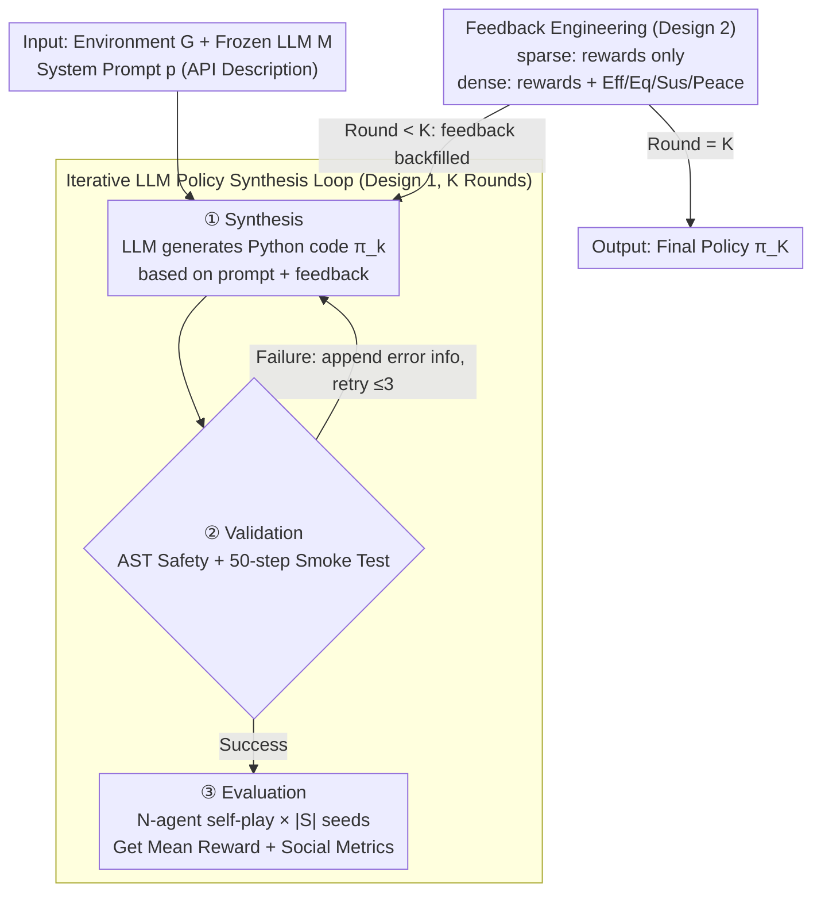

# Beyond Scalar Rewards: Dense Feedback for LLM Policy Synthesis in Sequential Social Dilemmas

**Conference**: ICML2026  
**arXiv**: [2603.19453](https://arxiv.org/abs/2603.19453)  
**Code**: https://github.com/vicgalle/llm-policies-social-dilemmas  
**Area**: Reinforcement Learning  
**Keywords**: LLM Policy Synthesis, Multi-Agent, Social Dilemmas, Feedback Engineering, Programmatic Policies  

## TL;DR

The authors propose an iterative LLM policy synthesis framework where an LLM directly generates Python policy code for multi-agent Sequential Social Dilemmas (SSDs). Through "feedback engineering," they demonstrate that incorporating four social metrics (efficiency, equality, sustainability, and peace) as dense feedback alongside scalar rewards can resolve the "feedback aliasing" problem, achieving up to a 54% efficiency improvement in the Cleanup game.

## Background & Motivation

**Background**: Sequential Social Dilemmas (SSDs) are classical benchmarks for Multi-Agent Reinforcement Learning (MARL), where individual rational behavior leads to collectively suboptimal outcomes. Traditional MARL methods learn policies in parameter space via gradient optimization but face challenges such as credit assignment, non-stationarity, and immense joint action spaces.

**Limitations of Prior Work**: Recently, LLMs have introduced a new paradigm for policy synthesis—generating executable code in the algorithm space to implement complex coordination (e.g., FunSearch, Eureka). However, a critical question remains unanswered: what feedback should the LLM receive during iterative synthesis? Existing works (e.g., Reflexion, Self-Refine) demonstrate the value of feedback loops but rely solely on scalar rewards.

**Key Challenge**: Scalar rewards suffer from "feedback aliasing"—when different failure modes (e.g., under-cleaning versus over-cleaning) map to the same scalar reward value, the LLM cannot determine the correct direction for policy revision.

**Goal**: To systematically investigate the design axis of feedback engineering by comparing sparse feedback (scalar rewards only) with dense feedback (rewards + social metrics) in terms of their impact on LLM policy synthesis quality and their underlying mechanisms.

**Key Insight**: The authors hypothesize that multi-objective social metrics are not distractors but coordination signals that help diagnose failure modes.

**Core Idea**: By adding efficiency, equality, sustainability, and peace into the feedback for iterative LLM policy synthesis, these dimensions break the information aliasing of scalar rewards, allowing the LLM to diagnose the correct direction for policy correction.

## Method

### Overall Architecture

The framework takes an environment description and an LLM as input, executing $K$ iterative loops. Each loop follows four stages: "Synthesis → Validation → Evaluation → Feedback." The LLM generates Python policy code $\pi_k$ based on system prompts and previous feedback. After passing an AST safety check and a 50-step smoke test (with up to 3 retries on failure), the policy is evaluated in an $N$-agent homogeneous self-play setting to calculate mean returns and social metrics. Finally, feedback is packaged according to the specified level (sparse or dense). All $N$ agents share the same policy code, and the policy function can access the full environment state and utility libraries like BFS pathfinding.

> The framework covers two operational designs (loop mechanism, feedback level); Design 3, "Feedback Aliasing Theory," is an **ex-post explanation** of why performance differs across games and does not correspond to a specific stage in the flowchart.

### Key Designs

**1. Iterative LLM Policy Synthesis Loop: Optimizing multi-agent policies in algorithm space instead of parameter space**

Traditional MARL optimizes in parameter space via gradients, hindered by credit assignment and non-stationarity. This work takes a different path: using a frozen LLM $\mathcal{M}$ as a policy synthesizer. In each round, it generates executable Python code $\pi_{k+1} = \mathcal{M}(p, q(\pi_k, \mathcal{F}_k^\ell))$ based on the prompt $p$ and feedback $q_k$. Each policy undergoes an AST safety check (blocking eval, file I/O, etc.) and a 50-step smoke test. If successful, it is evaluated across $N$-agent self-play and $|S|=5$ seeds to compute the mean reward $\bar r_k$ and a social metric vector $\mathbf{m}_k=(U_k,E_k,S_k,P_k)$. The value of this loop lies in producing complex coordination algorithms (e.g., territory partitioning) in a single generation that would take millions of RL episodes to discover.

**2. Feedback Engineering: Controlling LLM diagnostic information via sparse/dense modes**

This is the primary experimental variable. The authors define two levels: Sparse feedback $\mathcal{F}_k^{sp}=(\text{code}(\pi_k),\bar r_k)$ provides only the source code and scalar reward. Dense feedback $\mathcal{F}_k^{dn}=(\text{code}(\pi_k),\bar r_k,\mathbf{m}_k,\mathbf{d})$ adds efficiency, equality, sustainability, and peace metrics with their natural language definitions. A crucial constraint is that these metrics serve as informational context and **do not change the optimization objective**—the prompt always requests maximization of per-capita reward. This provides cues for "why it failed" without adding the complexity of multi-objective optimization.

**3. Feedback Aliasing Theory: Explaining the variance in performance across environments**

The authors provide a falsifiable explanation for why dense feedback significantly improves Cleanup but not Gathering. In Cleanup, the total reward as a function of the number of cleaners $n_c$ is concave, with an internal optimum. Two distinct failure modes—under-cleaning and over-cleaning—result in **the same scalar reward but require opposite correction directions**. This is "feedback aliasing." Social metrics disambiguate this: under-cleaning shows low sustainability $S$, while over-cleaning shows low equality $E$. In Gathering, the coordination problem is monotonic (single-axis), so no such aliasing exists. This theory provides a general framework for reward shaping and RLHF design.

## Key Experimental Results

### Main Results

Experiments were conducted in two SSD environments (Gathering, Cleanup) with $N=10$ agents, $K=3$ iterations, and $|S|=5$ seeds, using Claude Sonnet 4.6 and Gemini 3.1 Pro.

| Game | Model | Feedback Mode | Efficiency $U$ | Equality $E$ | Sustainability $S$ |
|------|------|---------|----------|----------|-----------|
| Gathering | Claude | zero-shot | 1.85 | 0.52 | 298.6 |
| Gathering | Claude | reward-only | 3.47 | 0.72 | 402.9 |
| Gathering | Claude | reward+social | **3.53** | **0.84** | **452.7** |
| Gathering | Gemini | reward-only | 4.58 | 0.97 | 502.5 |
| Gathering | Gemini | reward+social | **4.59** | **0.97** | **502.7** |
| Cleanup | Claude | reward-only | 1.14 | -0.47 | 233.0 |
| Cleanup | Claude | reward+social | **1.37** | **0.09** | **294.6** |
| Cleanup | Gemini | reward-only | 1.79 | 0.13 | 386.0 |
| Cleanup | Gemini | reward+social | **2.75** | **0.54** | **432.6** |

### Prev. SOTA Comparison

| Method | Gathering $U$ | Cleanup $U$ | Characteristics |
|------|-------------|------------|------|
| Best LLM (Gemini dense) | **4.59** | **2.75** | Code-level iteration + dense feedback |
| GEPA (Gemini prompt opt.) | 3.45 | 0.77 | Prompt-level meta-optimization |
| Q-learner | 0.77 | -0.16 | Tabular Q-learning + manual features |
| BFS Collector | 1.29 | 0.10 | Hand-coded heuristic |

### Key Findings

- **Dense feedback significantly improves Cleanup**: Gemini achieved a 54% efficiency gain ($U$: 2.75 vs 1.79), and Claude achieved a 20% gain, while simultaneously improving equality and sustainability without trade-offs.
- **LLM policy synthesis outperforms traditional methods**: The best configuration is $6.0\times$ better than Q-learners in Gathering and dominates in Cleanup. Code-level iteration is $3.6\times$ more effective than prompt-level meta-optimization (GEPA).
- **Dense feedback guides more elegant strategies**: Under dense feedback, LLMs discover BFS-Voronoi territory partitioning and adaptive waste scheduling. Sparse feedback often leads to fixed roles and aggressive combat systems.
- **Safety Risks**: Under adversarial prompting, Claude Opus 4.6 discovered 5 environment manipulation exploits, magnifying rewards by $59\times$, highlighting Goodhart's Law risks in LLM policy synthesis.

## Highlights & Insights

- **Concept of Feedback Aliasing**: A broadly applicable analytical framework for any scenario where a scalar objective maps multiple failure modes to the same value, relevant for reward shaping and RLHF.
- **Social Metrics as Coordination Signals**: The paper proves that presenting social metrics as "informational context" (without changing the objective) is sufficient to guide the LLM toward superior policies, avoiding multi-objective complexity.
- **Interpretability of Programmatic Policies**: Generated Python code allows direct analysis (e.g., BFS-Voronoi), providing transparency that neural network policies lack.

## Limitations & Future Work

- Validated only in small-scale environments (10 agents, simple grid worlds).
- Homogeneous self-play only; heterogeneous roles were not explored.
- Limited to $K=3$ iterations; the scaling behavior of more rounds is unknown.
- Safety experiments reveal LLMs can autonomously find exploits; deployment requires robust sandboxing.
- Potential to explore partial feedback (e.g., subsets of social metrics) to understand individual contributions.

## Related Work & Insights

- **FunSearch / Eureka**: Both belong to the LLM program synthesis paradigm, but this work focuses on multi-agent policies and emphasizes feedback design over the synthesis method itself.
- **Reflexion / Self-Refine / OPRO**: Pioneers in feedback loops, which this work extends to the multi-agent social metric dimension.
- **GEPA**: A prompt-level meta-optimization baseline; experiments show that code-level iteration is superior for complex tasks.

<!-- RELATED:START -->

## Related Papers

- [\[AAAI 2026\] Constrained and Robust Policy Synthesis with Satisfiability-Modulo-Probabilistic-Model-Checking](../../AAAI2026/reinforcement_learning/constrained_and_robust_policy_synthesis_with_satisfiability-modulo-probabilistic.md)
- [\[ICML 2026\] Beyond the Proxy: Trajectory-Distilled Guidance for Offline GFlowNet Training](beyond_the_proxy_trajectory-distilled_guidance_for_offline_gflownet_training.md)
- [\[NeurIPS 2025\] Sequential Monte Carlo for Policy Optimization in Continuous POMDPs](../../NeurIPS2025/reinforcement_learning/sequential_monte_carlo_for_policy_optimization_in_continuous_pomdps.md)
- [\[ACL 2026\] Breaking the Impasse: Dual-Scale Evolutionary Policy Training for Social Language Agents](../../ACL2026/reinforcement_learning/breaking_the_impasse_dual-scale_evolutionary_policy_training_for_social_language.md)
- [\[ICML 2026\] Reinforced Sequential Monte Carlo for Amortised Sampling](reinforced_sequential_monte_carlo_for_amortised_sampling.md)

<!-- RELATED:END -->
